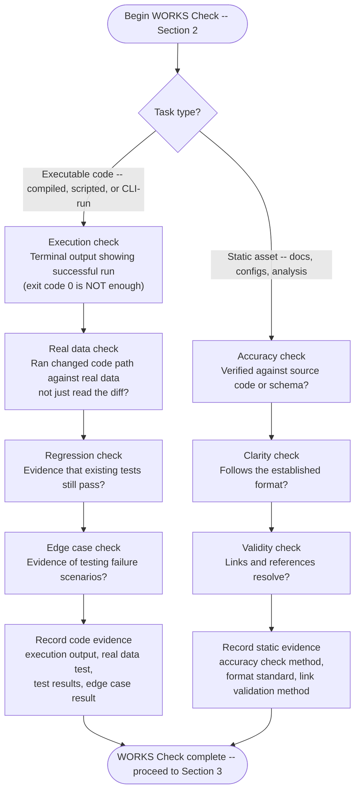
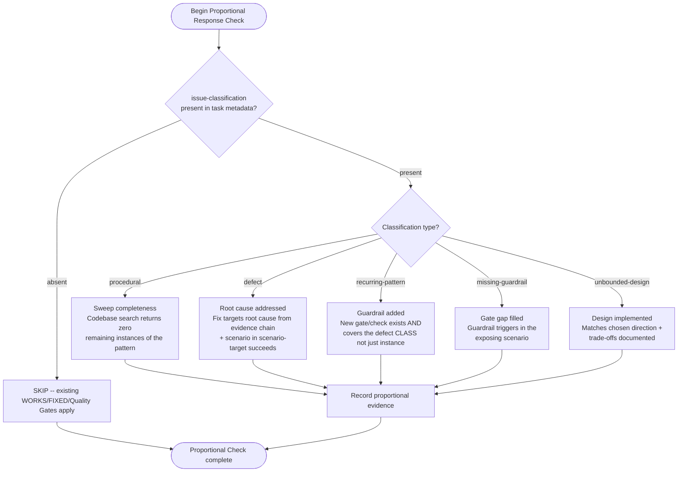

# Verification Protocol

**STOP.** You are NOT done yet. Generate this checklist and provide **EVIDENCE** for every item.

---

## 1. Task Type & Strategy

- [ ] **Type:** FIX / FEATURE / REFACTOR / DOCS / INVESTIGATION
- [ ] **Strategy:** Executable verification vs. Static verification?

---

## 2. The "WORKS" Check

<!-- Converted from prose branch instruction: "Choose A or B based on task type" -->



### A. For Code (Executable)

- [ ] **Execution:** Terminal output showing successful run? (Exit code 0 is NOT enough)
- [ ] **Real data:** Ran the changed code path against real data, not just read the diff?
- [ ] **Regression:** Evidence that existing tests still pass?
- [ ] **Edge Cases:** Evidence of testing failure scenarios?

```text
EVIDENCE:
- Execution output: [paste actual output]
- Real data test: [command run, input used, output observed]
- Test results: [paste test output]
- Edge case tested: [describe scenario and result]
```

### B. For Static Assets (Docs, Configs, Analysis)

- [ ] **Accuracy:** Verified against source code/schema?
- [ ] **Clarity:** Does it follow the established format?
- [ ] **Validity:** Do links/references resolve?

```text
EVIDENCE:
- Accuracy check: [how verified]
- Format compliance: [standard followed]
- Links validated: [method used]
```

---

## 3. The "FIXED" Check

For bug fixes specifically:

- [ ] **Reproduction:** Did I observe the pre-fix state?
- [ ] **Resolution:** Does the original problem NO LONGER occur?

```text
EVIDENCE:
- Pre-fix behavior: [what was observed]
- Post-fix behavior: [what is now observed]
- Regression test added: [yes/no, location]
```

---

## 4. Quality Gates

- [ ] Pre-commit hooks passed?
- [ ] Linting passed? (Necessary, but not sufficient)
- [ ] Type checking passed? (if applicable)

```text
EVIDENCE:
- Pre-commit: [output or "not configured"]
- Linting: [tool and result]
- Type check: [tool and result]
```

---

## 5. Proportional Response Check

If the task has an `issue-classification` field in its metadata, verify the response matched the issue type. If no `issue-classification` is present, mark N/A and proceed.



```text
EVIDENCE:
- Issue Classification: [type or "not classified"]
- Scenario Target: [scenario -> improvement, or "not specified"]
- Proportional Check: [PASS/FAIL/N/A]
- Check detail: [what was verified and result]
```

---

## 6. Agent Delegation Verification

When work was delegated to a sub-agent, the agent's success report is NOT evidence.

- [ ] **VCS diff reviewed:** `git diff` shows the expected changes?
- [ ] **Changes verified:** Read the modified files — content matches intent?
- [ ] **Tests run independently:** Ran the verification command yourself, not trusting the agent's claim?

```text
EVIDENCE:
- Agent report: [what agent claimed]
- VCS diff: [files changed, scope matches expectation]
- Independent verification: [command run, output observed]
```

If no agents were used, mark N/A and proceed.

---

## 7. Honesty Check

- [ ] Did I verify the _full scope_?
- [ ] Am I distinguishing between "should work" and "verified to work"?
- [ ] **Destination check:** Did I read the target state after writing? (Tool output claiming success is not evidence — the state of the destination is.)
- [ ] Can I answer YES to: "I have VALIDATED this output in its intended context"?

### Rationalization Prevention

If any of these thoughts occur, STOP and run the verification command:

| Rationalization | Response |
|----------------|----------|
| "Should work now" | Run the verification command |
| "I'm confident" | Confidence is not evidence |
| "Just this once" | No exceptions |
| "Linter passed so build passes" | Linter does not check compilation |
| "Agent said success" | Verify independently (Section 6) |
| "I'm tired" | Exhaustion is not an excuse |
| "Partial check is enough" | Partial check proves nothing about the whole |
| "Different words so rule doesn't apply" | Spirit over letter |

**Red flags in your own output** — if you catch yourself writing any of these, the gate has not been passed:
- "should", "seems to", "looks correct"
- Expressions of satisfaction before verification ("Done!", "Perfect!")
- About to commit/push/PR without fresh command output in this message

---

## The Golden Rule

**If you cannot demonstrate it working in practice with evidence, it is NOT done.**

| Claim           | Required Evidence                                        |
| --------------- | -------------------------------------------------------- |
| "Code works"    | Terminal output showing execution against real data      |
| "Tests pass"    | Actual test output, not assumption                       |
| "Bug fixed"     | Before/after comparison                                  |
| "Data synced"   | Read the destination after writing — not the tool output |
| "Docs accurate" | Cross-reference with source                              |
| "Config valid"  | Validation command output                                |
| "Root cause fixed" | Evidence chain from grooming + fix addresses root cause claim |
| "Guardrail added"  | New gate/check exists and triggers in exposing scenario       |
| "Agent completed"  | VCS diff reviewed + independent verification command run     |

---

## Quick Reference

```text
VERIFICATION SUMMARY:
Task Type: [FIX/FEATURE/REFACTOR/DOCS/INVESTIGATION]
Works Check: [PASS/FAIL] - Evidence: ___
Fixed Check: [PASS/FAIL/N/A] - Evidence: ___
Proportional Check: [PASS/FAIL/N/A] - Evidence: ___
Quality Gates: [PASS/FAIL] - Evidence: ___
Agent Delegation: [PASS/FAIL/N/A] - Evidence: ___
Honesty Check: [PASS/FAIL]

VERDICT: [COMPLETE / NOT COMPLETE - reason]
```
