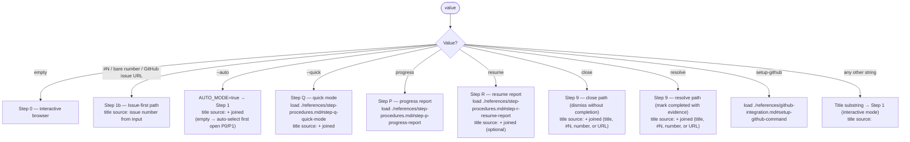
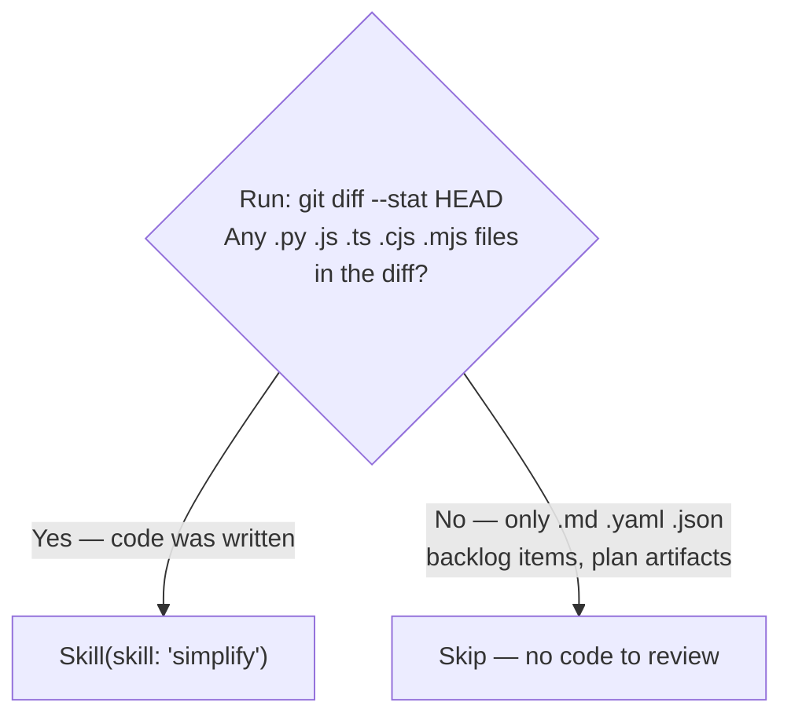

<mode>$0</mode>
<item_ref>$1</item_ref>
<invocation_args>$ARGUMENTS</invocation_args>

# Work Backlog Item

Bridge a backlog item into the SAM planning pipeline via `/dh:add-new-feature` (default). Optional `--language` and `--stack` select Layer 1/2 profiles — see [sdlc-layers](../../docs/sdlc-layers/).

**Phase separation**: Grooming (Step 3) is autonomous research — the agent verifies facts, maps resources, estimates effort, and surfaces blockers. Planning (Step 6) is solution design — architecture, tasks, implementation. The human sets priorities and resolves blockers; the agent handles research and fact-checking autonomously.

**SAM** — Stateless Agent Methodology. See [sam-definition.md](./references/sam-definition.md) for what SAM is and how to embody it. SAM lives in `../stateless-agent-methodology/` (or `bitflight-devops/stateless-agent-methodology` on GitHub).
Primary source of truth is **GitHub Issues** (labels + milestone = canonical status). Local per-item files are a read cache maintained by the MCP server.

When invoked with no arguments, shows an interactive browser. When invoked with `#N` or a title substring, proceeds directly to the planning workflow.

## Arguments

`<mode/>` selects the operating mode; remaining positional args (`<item_ref/>`, `$2`, ...) form the title or parameter:

| `<mode/>` value | Remaining args meaning |
|---|---|
| (empty) | — |
| `#N` / bare number / GitHub issue URL | issue number |
| `--auto` | `<item_ref/>`+ = title (or empty → auto-select first open P0/P1 item) |
| `close` / `resolve` | `<item_ref/>`+ = title, `#N`, number, or URL |
| `setup-github` | — |
| `--quick` | `<item_ref/>`+ = title |
| `progress` / `resume` | `<item_ref/>`+ = title or `#N` (optional for `resume`) |
| (any other) | `<invocation_args/>` treated as title substring |

**Optional flags** (when `<mode/>` is title substring or `--auto`): `--language <lang>` selects language plugin (default: python); `--stack <profile>` selects stack profile (e.g., python-fastapi, python-cli). See [sdlc-layers](../../docs/sdlc-layers/).

```text
/work-backlog-item                                    # interactive browser
/work-backlog-item #42                               # issue-first → planning
/work-backlog-item 42                                # issue-first (bare number) → planning
/work-backlog-item https://github.com/OWNER/REPO/issues/42  # URL → planning
/work-backlog-item Error Recovery                    # direct match → planning
/work-backlog-item --auto                            # autonomous → auto-select first open P0/P1
/work-backlog-item --auto vercel skills npm package  # autonomous → planning
/work-backlog-item close Error Recovery              # dismiss (reason required)
/work-backlog-item close #42                         # dismiss by issue number
/work-backlog-item resolve Error Recovery            # mark completed with evidence
/work-backlog-item resolve #42                       # mark completed by issue number
/work-backlog-item --language python --stack python-fastapi Add auth  # Layer 2 stack profile
```

### --auto mode rules

All interactive `AskUserQuestion` calls are replaced with evidence-derived decisions. Full substitution table: [auto-mode.md](./references/auto-mode.md)

## Workflow

### Routing (evaluated first, before any step)

Dispatch based on `<mode/>` (the first argument word) before executing any step:



**AUTO_MODE** — set when `$0` is `--auto`. All `AskUserQuestion` calls are replaced with evidence-derived decisions. See [auto-mode.md](./references/auto-mode.md) for the substitution table.

## Phase 1: Locate

### Step 0: Interactive Browser (no arguments only)

**Trigger:** `<mode/>` is empty (no arguments passed).

Full procedure (MCP error handling, display format, response handling): [step-procedures.md](./references/step-procedures.md#step-0-interactive-browser)

**Routing:** If `<mode/>` is `close` or `resolve`, extract `<item_ref/>`+ as the title and jump directly to Step 9.

### Step 1b: Issue-First Path (`#N`, bare number, or GitHub URL)

**Trigger:** `<mode/>` matches `#[0-9]+`, is a bare number, or is a GitHub issue URL (`https://github.com/.../issues/N`).

<issue_first_procedure>

Fetch the issue using the `mcp__plugin_dh_backlog__backlog_view` tool (accepts URLs, `#N`, and bare numbers):

Call the `mcp__plugin_dh_backlog__backlog_view` tool with `selector="{<mode/>}"`.

If the tool returns a dict with an `error` key, report and stop.
Parse the returned dict. If `state` is `closed`, run the **Completed Issue Discovery** procedure and stop. Full procedure (git commands, report template, AUTO_MODE behavior): [step-procedures.md](./references/step-procedures.md#step-1b-completed-issue-discovery)

From the JSON response build the working item:

| Field | Source |
|---|---|
| `title` | `title` |
| `description` | `body` (full text) |
| `source` | `"GitHub Issue #N"` |
| `priority` | `priority` field (extracted from `priority:*` label) |
| `status` | `status` field (extracted from `status:*` label — canonical) |
| `milestone` | `milestone` |
| `plan` | `plan` field, or search `body` for `**Plan**:` line |
| `file_path` | `file_path` (local per-item file, if matched) |

The `view` command automatically merges local per-item data with live GitHub issue data. If `file_path` is present, the local file supplements any missing fields (e.g. `research_first`, `suggested_location`). If no local file exists, the GitHub Issue data is sufficient.

Proceed to Step 2.7 (Set In-Progress Label) with the assembled item, then continue to Step 3.

</issue_first_procedure>

### Step 1: Find the Backlog Item

**Bypass:** If `<mode/>` is `#N`, a bare number, or a GitHub issue URL — skip this step entirely and go to Step 1b. Issue-number and URL inputs resolve via `backlog_view` directly; no matching strategy is needed.

Title = `<item_ref/>`+ joined (args after the mode flag `<mode/>`). In interactive mode, title = full `<invocation_args/>`.

**AUTO_MODE with no title (`<item_ref/>` is empty):** apply the "No title given" substitution from the `--auto mode rules` table — scan P0 then P1 sections for the first open item, log and use its title. Skip items with `status: done` or `status: resolved` in their entry (these are filtered out by `backlog_list` already).

Before executing Step 1: load `./references/step-procedures.md`.

Record the priority section (P0, P1, P2, Ideas) the item belongs to.

### Step 2: Extract Item Fields

From the matched item's entry in the `mcp__plugin_dh_backlog__backlog_list` returned dict, extract `title`, `plan`, `section` (priority), `issue`, and `groomed`. For detailed fields not in the list response (`description`, `source`, `added`, `research_first`, `suggested_location`), call `mcp__plugin_dh_backlog__backlog_view(selector="{title}", summary=false)` to fetch the full item from the backend.

- `title` — the `title` field from list JSON (required)
- `plan` — the `plan` field from list JSON (optional)
- `description` — from `backlog_view` response `description` field (required)
- `source` — from `backlog_view` response `source` field (optional)
- `added` — from `backlog_view` response `added` field (optional)
- `research_first` — from `backlog_view` response body, `**Research first**:` line (optional)
- `suggested_location` — from `backlog_view` response body, `**Suggested location**:` line (optional)

If the item already has a `**Plan**:` field, extract the plan address from the YAML filename (e.g., `plan/P1079-machine-readable-inter-item-dependencies.yaml` → `P1079`). Report:

```text
This item already has a plan (P{NNN}). Use /dh:implement-feature P{NNN} to execute it.
```

Then stop.

After extracting fields, proceed to Step 2.3 (Already Implemented Check) before continuing.

## Phase 2: Validate

### Step 2.3: Already Implemented Check

Before planning, verify the feature/fix hasn't already been implemented (stale open issue). Full procedure (git commands, resolve calls, AUTO_MODE behavior): [step-procedures.md](./references/step-procedures.md#step-23-already-implemented-check)

### Step 2.5: GitHub Issue Sync

After Step 2, check for `**Issue**: #N` in the matched item. Full procedure (MCP tool calls, yes/no branching, issue creation): [github-integration.md](./references/github-integration.md#step-25-github-issue-sync)

**Note:** On the Issue-first path (Step 1b), the `backlog_view` response already contains issue state — carry it forward without re-fetching.

### Step 2.5a: Create GitHub Issue

Full procedure: [github-integration.md](./references/github-integration.md#step-25a-create-github-issue)

### Step 2.7: Set In-Progress Label

Full procedure: [github-integration.md](./references/github-integration.md#step-27-set-in-progress-label)

**Two-part step:** (a) Always run `mcp__plugin_dh_backlog__backlog_update` with `status="in-progress"` for the current item. (b) Run `milestone start` only on explicit user intent to start the whole milestone — it bulk-transitions all open milestone issues, not just the current one.

## Phase 3: Prepare

### Step 3: Auto-Groom (if needed)

<groom_check>

1. **Check if item is groomed**: Check the `groomed` field in the JSON output. If `true`, call `mcp__plugin_dh_backlog__backlog_view(selector="{title}", summary=false)` — the response `sections` dict contains all groomed content (Reproducibility, Priority, Impact, Files, Dependencies, etc.). Use that content.
2. Search conversation context for a recent `groom-backlog-item` output matching this item.

If no groomed content exists:

```text
Skill(skill: "groom-backlog-item", args: "{item title}")
```

The groom skill writes groomed content via the backlog MCP server. After grooming completes, call `backlog_view` again to retrieve the groomed sections.
</groom_check>

### Phase 3, Step 2: RT-ICA Gate

1. Read the `## RT-ICA` section from the `backlog_view` response (the `sections` dict contains an `RT-ICA` key with the section content).
2. **Freshness check**: if the RT-ICA date in that section predates the item description's last-modified date, treat the section as absent.
3. **Present and fresh** → use the APPROVED/BLOCKED decision from the cached result. Carry DERIVABLE items forward as "Assumptions to confirm" in the feature request.
4. **Absent or stale** → `Skill(skill: "dh:rt-ica")`
5. **BLOCKED** → stop. Do not proceed to Phase 4 until all MISSING conditions are resolved.

## Phase 4: Plan

### Step 5: Compose Feature Request

Build the feature request string for `add-new-feature`. If `--stack` was specified, append a "Stack profile" line. If `--language` is not `python`, invoke the corresponding language plugin (e.g., `/typescript-development:add-new-feature`).

**Impact Radius requirement**: Before composing, read the `## Impact Radius` section from the groomed item file (populated by `groom-backlog-item` Step 3.5). Include it in the feature request so the planner creates tasks for every affected component.

**Ecosystem Completeness Constraint**: The plan produced by `add-new-feature` MUST include tasks for every item listed in the Impact Radius, or explicitly document why an item is excluded. A feature is not complete when the core code works — it is complete when:

- Every upstream producer of the changed interface is updated or verified compatible
- Every downstream consumer is migrated to use the new interface
- Every document listed as "will become stale" is updated
- The old interface is deprecated or removed (if this item replaces something)
- CI/config files listed in Impact Radius are updated and validated

If the groomed item has no `## Impact Radius` section, trigger `groom-backlog-item` for that item before continuing (Step 3 already handles this for ungroomed items — this handles the case where grooming ran before Step 3.5 existed). Do not skip to Step 6 with a missing impact radius — the planner will produce an incomplete plan.

Template: [step-procedures.md](./references/step-procedures.md#step-5-feature-request-template)

### Step 6: Invoke SAM Planning

```text
Skill(skill: "add-new-feature", args: "{composed feature request}")
```

This runs the full SAM workflow: discovery, codebase analysis, architecture spec, task decomposition, validation, context manifest.

### Step 7: Update Backlog with Plan Reference

After `add-new-feature` completes, identify the task file it created (plan files live under `~/.dh/projects/{project-slug}/plan/`, resolved via `dh_paths.plan_dir()`):

```python
from dh_paths import plan_dir
Glob(pattern=str(plan_dir() / "P*-{slug}*"))
```

Where `{slug}` is the item title lowercased with spaces replaced by hyphens.

Call the `mcp__plugin_dh_backlog__backlog_update` tool to add the Plan:

| Parameter | Value |
|-----------|-------|
| `selector` | `"{title}"` |
| `plan` | `"plan/P{NNN}-{slug}.yaml"` (state-relative path) |

If the item has `**Issue**: #N`, record it in the plan file header comment. Do NOT include `Fixes #N`, `Closes #N`, or `Resolves #N` in task-level commit messages — issue closure is handled exclusively by `/complete-implementation` in its final commit step.

### Step 8: Simplify

Run the simplify skill only when source code was modified during this session. Planning-only sessions (plan artifacts, backlog items, documentation) do not need code review.



### Phase 4, Step 4: Post-Planning Output

- **Interactive mode**: load `./references/step-procedures.md#step-8-5` for the report template.
- **AUTO_MODE**: load `./references/step-procedures.md#step-8-5a` for the continuation procedure.

## Phase 5: Close/Resolve

### Step 9: Close or Resolve (ADR-9)

**Trigger:** `<mode/>` is `close` or `resolve`.

- `close` = dismiss without completion. Requires `reason` (duplicate, out_of_scope, superseded, wontfix, blocked). Optional `reference` and `comment`. Calls `mcp__plugin_dh_backlog__backlog_close`.
- `resolve` = mark DONE with evidence trail. Requires `summary`. Optional `plan`, `method`, `notes`, `follow_ups`, `findings`. Verifies checklist + acceptance criteria before resolving. For items with a `**Plan**:` field, also checks that the `status:verified` GitHub label is present (Step 9b.5). Calls `mcp__plugin_dh_backlog__backlog_resolve`.
- `resolve --force` = bypass the `status:verified` gate (Step 9b.5) and the open-PR gate (Step 9e) with a warning. Use when label automation failed or when forcing a local-cache resolve while a PR is still open.

Full step-by-step procedure (9a–9f): [close-resolve-procedure.md](./references/close-resolve-procedure.md)

## Reference Index

### GitHub Integration

`~/.dh/projects/{slug}/backlog/` per-item files are the local cache. GitHub Issues are the source of truth. See [github-integration.md](./references/github-integration.md) for step-by-step commands and example sessions. Note: `Fixes #N` trailers are restricted to the `/complete-implementation` final commit step only.

### setup-github Command

**Trigger:** `<mode/>` is `setup-github`. Full setup procedure and expected output: [github-integration.md](./references/github-integration.md#setup-github-command)

### Error Handling

See [error-handling.md](./references/error-handling.md) for all error conditions and handling instructions.

### Example Sessions

See [example-sessions.md](./references/example-sessions.md) for complete examples. GitHub-specific sessions (issue creation, setup-github): [github-integration.md](./references/github-integration.md)

### Validation Plan

See [validation-plan.md](./references/validation-plan.md) for V1–V6 verification commands and the full integration test sequence.
