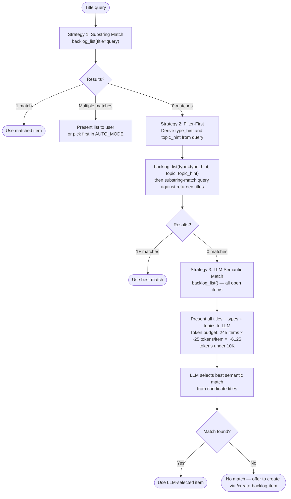

<mode>$0</mode>
<item_ref>$1</item_ref>
<invocation_args>$ARGUMENTS</invocation_args>

# Work Backlog Item

Bridge a backlog item into the SAM planning pipeline via `/add-new-feature` (default). Optional `--language` and `--stack` select Layer 1/2 profiles — see [.claude/docs/sdlc-layers/](../../../../.claude/docs/sdlc-layers/).

**Phase separation**: Grooming (Step 3) is autonomous research — the agent verifies facts, maps resources, estimates effort, and surfaces blockers. Planning (Step 6) is solution design — architecture, tasks, implementation. The human sets priorities and resolves blockers; the agent handles research and fact-checking autonomously.

**SAM** — Stateless Agent Methodology. See [sam-definition.md](./references/sam-definition.md) for what SAM is and how to embody it. SAM lives in `../stateless-agent-methodology/` (or `bitflight-devops/stateless-agent-methodology` on GitHub).
Primary source of truth is **GitHub Issues** (labels + milestone = canonical status); `.claude/backlog/` per-item files are the local cache and are kept in sync.

When invoked with no arguments, shows an interactive browser. When invoked with `#N` or a title substring, proceeds directly to the planning workflow.

## Arguments

`<mode/>` selects the operating mode; remaining positional args (`<item_ref/>`, `$2`, ...) form the title or parameter:

| `<mode/>` value | Remaining args | Mode |
|---|---|---|
| (empty) | — | Interactive browser |
| `#N` | — | Issue-first: load item from GitHub Issue #N |
| bare number (e.g. `249`) | — | Issue-first: load item from GitHub Issue #249 |
| GitHub issue URL | — | Issue-first: extract issue number from URL |
| `--auto` | `<item_ref/>`+ = title (or empty → auto-select first open P0/P1 item) | Autonomous — no `AskUserQuestion` calls |
| `close` | `<item_ref/>`+ = title, `#N`, number, or URL | Dismiss without completion (reason required). ADR-9 |
| `resolve` | `<item_ref/>`+ = title, `#N`, number, or URL | Mark DONE — completed with evidence (summary required). ADR-9 |
| `setup-github` | — | Initialize labels, project, first milestone |
| `--quick` | `<item_ref/>`+ = title | Skip grooming, RT-ICA, and SAM — quick one-file fix. Step Q |
| `progress` | — | Backlog health and active milestone progress report. Step P |
| `resume` | `<item_ref/>`+ = title or `#N` (optional) | Resume status for an in-progress plan. Step R |
| (any other) | — | `<invocation_args/>` treated as title substring → planning |

**Optional flags** (when `<mode/>` is title substring or `--auto`): `--language <lang>` selects language plugin (default: python); `--stack <profile>` selects stack profile (e.g., python-fastapi, python-cli). See [.claude/docs/sdlc-layers/](../../../../.claude/docs/sdlc-layers/).

```text
/work-backlog-item                                    # interactive browser
/work-backlog-item #42                               # issue-first → planning
/work-backlog-item 42                                # issue-first (bare number) → planning
/work-backlog-item https://github.com/OWNER/REPO/issues/42  # URL → planning
/work-backlog-item Error Recovery                    # direct match → planning
/work-backlog-item --auto                            # autonomous → auto-select first open P0/P1
/work-backlog-item --auto vercel skills npm package  # autonomous → planning
/work-backlog-item close Error Recovery              # dismiss (reason required)
/work-backlog-item close #42                         # dismiss by issue number
/work-backlog-item resolve Error Recovery            # mark completed with evidence
/work-backlog-item resolve #42                       # mark completed by issue number
/work-backlog-item --language python --stack python-fastapi Add auth  # Layer 2 stack profile
```

### --auto mode rules

All interactive `AskUserQuestion` calls are replaced with evidence-derived decisions. Full substitution table: [auto-mode.md](./references/auto-mode.md)

## Workflow

### Routing (evaluated first, before any step)

Dispatch based on `<mode/>` (the first argument word) before executing any step:

| `<mode/>` value | Title source | Route |
|---|---|---|
| (empty) | — | Step 0 — interactive browser |
| `#N` (starts with `#`) | issue number | Step 1b — Issue-first path |
| bare number (e.g. `249`) | issue number | Step 1b — Issue-first path |
| GitHub issue URL | issue number from URL | Step 1b — Issue-first path |
| `--auto` | `<item_ref/>`+ joined (empty → auto-select first open P0/P1) | AUTO_MODE=true → Step 1 |
| `--quick` | `<item_ref/>`+ joined | Step Q — [step-procedures.md](./references/step-procedures.md#step-q-quick-mode) |
| `progress` | — | Step P — [step-procedures.md](./references/step-procedures.md#step-p-progress-report) |
| `resume` | `<item_ref/>`+ joined (optional title or `#N`) | Step R — [step-procedures.md](./references/step-procedures.md#step-r-resume-report) |
| `close` | `<item_ref/>`+ joined (title, `#N`, number, or URL) | Step 9 (close path — dismiss without completion) |
| `resolve` | `<item_ref/>`+ joined (title, `#N`, number, or URL) | Step 9 (resolve path — mark completed with evidence) |
| `setup-github` | — | [github-integration.md](./references/github-integration.md#setup-github-command) |
| (any other) | `<invocation_args/>` | Title substring → Step 1 (interactive mode) |

**AUTO_MODE** — set when `$0` is `--auto`. All `AskUserQuestion` calls are replaced with evidence-derived decisions. See [auto-mode.md](./references/auto-mode.md) for the substitution table.

### Step 0: Interactive Browser (no arguments only)

**Trigger:** `<mode/>` is empty (no arguments passed).

Full procedure (MCP error handling, display format, response handling): [step-procedures.md](./references/step-procedures.md#step-0-interactive-browser)

**Routing:** If `<mode/>` is `close` or `resolve`, extract `<item_ref/>`+ as the title and jump directly to Step 9.

### Step 1b: Issue-First Path (`#N`, bare number, or GitHub URL)

**Trigger:** `<mode/>` matches `#[0-9]+`, is a bare number, or is a GitHub issue URL (`https://github.com/.../issues/N`).

<issue_first_procedure>

Fetch the issue using the `mcp__plugin_dh_backlog__backlog_view` tool (accepts URLs, `#N`, and bare numbers):

Call the `mcp__plugin_dh_backlog__backlog_view` tool with `selector="{<mode/>}"`.

If the tool returns a dict with an `error` key, report and stop.
Parse the returned dict. If `state` is `closed`, run the **Completed Issue Discovery** procedure and stop. Full procedure (git commands, report template, AUTO_MODE behavior): [step-procedures.md](./references/step-procedures.md#step-1b-completed-issue-discovery)

From the JSON response build the working item:

| Field | Source |
|---|---|
| `title` | `title` |
| `description` | `body` (full text) |
| `source` | `"GitHub Issue #N"` |
| `priority` | `priority` field (extracted from `priority:*` label) |
| `status` | `status` field (extracted from `status:*` label — canonical) |
| `milestone` | `milestone` |
| `plan` | `plan` field, or search `body` for `**Plan**:` line |
| `file_path` | `file_path` (local per-item file, if matched) |

The `view` command automatically merges local per-item data with live GitHub issue data. If `file_path` is present, the local file supplements any missing fields (e.g. `research_first`, `suggested_location`). If no local file exists, the GitHub Issue data is sufficient.

Proceed to Step 2.7 (Set In-Progress Label) with the assembled item, then continue to Step 3.

</issue_first_procedure>

### Step 1: Find the Backlog Item

**Bypass:** If `<mode/>` is `#N`, a bare number, or a GitHub issue URL — skip this step entirely and go to Step 1b. Issue-number and URL inputs resolve via `backlog_view` directly; no matching strategy is needed.

Title = `<item_ref/>`+ joined (args after the mode flag `<mode/>`). In interactive mode, title = full `<invocation_args/>`.

**AUTO_MODE with no title (`<item_ref/>` is empty):** apply the "No title given" substitution from the `--auto mode rules` table — scan P0 then P1 sections for the first open item, log and use its title. Skip items with `status: done` or `status: resolved` in their entry (these are filtered out by `backlog_list` already).

Apply the following 3-strategy fallback chain. Move to the next strategy only when the current strategy returns zero matches.



#### Strategy 2 — Type and Topic Derivation

Derive filter hints from the query before calling `backlog_list`:

- `type_hint`: scan query words for keyword groups (case-insensitive):
  - `bug`, `fix`, `broken`, `error` → `Bug`
  - `feature`, `add`, `new`, `implement` → `Feature`
  - `refactor`, `clean`, `restructure` → `Refactor`
  - no match → `None` (omit `type` parameter)
- `topic_hint`: longest non-stop-word from the query, converted to kebab-case slug. If none can be derived, omit the `topic` parameter.

Call `backlog_list(type=type_hint, topic=topic_hint)` (omit any `None` parameters). Then perform a case-insensitive substring match of the original query against the `title` field of each returned entry. Items whose titles contain the query substring are candidates.

#### Strategy 3 — LLM Semantic Match

Call `backlog_list()` with no filters to load all open items. The response includes `title`, `type`, and `topic` per item. Read the full list in the current context and select the item whose title, type, and topic best match the intent of the query. The token cost is bounded: **245 items × ~25 tokens/item ≈ 6,125 tokens (under 10K budget)**. If two or more candidates are plausible, read their per-item files via `backlog_view` before choosing.

#### Zero-match handling after all 3 strategies

- **Interactive mode:** report "No backlog item found matching: {title}" and offer to create one via `/create-backlog-item`.
- **AUTO_MODE:** log `[AUTO] No item found — invoking create-backlog-item --auto {title}`, invoke `Skill(skill: "create-backlog-item", args: "--auto {title}")`, then re-run Step 1.

Record the priority section (P0, P1, P2, Ideas) the item belongs to.

### Step 2: Extract Item Fields

From the matched item's entry in the `mcp__plugin_dh_backlog__backlog_list` returned dict, extract `title`, `plan`, `section` (priority), `issue`, `groomed`, and `file_path`. For detailed fields not in the dict (`description`, `source`, `added`, `research_first`, `suggested_location`), read the per-item file at `file_path`.

- `title` — the `title` field from JSON (required)
- `source` — not in JSON; read from per-item file frontmatter `metadata.source` if needed (optional)
- `added` — not in JSON; read from per-item file frontmatter `metadata.added` if needed (optional)
- `description` — not in JSON; read from per-item file frontmatter `description` (required)
- `research_first` — not in JSON; read from per-item file body `**Research first**:` line (optional)
- `suggested_location` — not in JSON; read from per-item file body `**Suggested location**:` line (optional)
- `plan` — the `plan` field from JSON (optional)

If the item already has a `**Plan**:` field, report:

```text
This item already has a plan at {path}. Use /implement-feature {path} to execute it.
```

Then stop.

After extracting fields, proceed to Step 2.3 (Already Implemented Check) before continuing.

### Step 2.3: Already Implemented Check

Before planning, verify the feature/fix hasn't already been implemented (stale open issue). Full procedure (git commands, resolve calls, AUTO_MODE behavior): [step-procedures.md](./references/step-procedures.md#step-23-already-implemented-check)

### Step 3: Auto-Groom (if needed)

<groom_check>

1. **Check if item is groomed**: Check the `groomed` field in the JSON output. If `true`, read the per-item file at `file_path` for the groomed content under `## Groomed`. Use that content.
2. Search conversation context for a recent `groom-backlog-item` output matching this item.

If no groomed content exists in the item file:

```text
Skill(skill: "groom-backlog-item", args: "{item title}")
```

The groom skill writes groomed content into the per-item file. Capture the groomed output (Reproducibility, Resources, Dependencies, Blockers, etc.) for use in the feature request.
</groom_check>

### Step 4: RT-ICA Checkpoint

<rtica_gate>

Before composing the feature request, verify the groomed content (from item file or groom-backlog-item output) contains an RT-ICA summary. If absent, perform RT-ICA now:

1. **Goal statement** — What completing this item achieves.
2. **Reverse prerequisites** — Conditions required for success (enumerate each).
3. **Availability check** — For each condition: AVAILABLE / DERIVABLE / MISSING.
4. **Decision** — APPROVED or BLOCKED.

#### Categorization Rule

RT-ICA assesses INFORMATION completeness — "do we know enough to plan?"

- **AVAILABLE** — information exists and is verified
- **DERIVABLE** — information can be obtained from the codebase using tools
- **MISSING** — information we lack that cannot be obtained with tools and requires a human decision

MISSING means "we lack information that prevents planning." Implementation deliverables are NOT MISSING conditions. A condition like "sam create command exists" is a deliverable — it belongs in acceptance criteria. The RT-ICA question is "do we know what sam create needs to do?" — and if yes, it is AVAILABLE.

#### Self-Resolution Pass (run before marking anything MISSING)

ARL principle: resolve autonomously first, then batch the remainder to the human.

For each DERIVABLE or unknown condition, attempt to resolve using tools (Grep, Read, WebSearch, Bash). Every resolution must cite the tool result. Training data answers are banned for project-specific questions — they produce hallucinations.

```text
Resolution pass:
1. For each condition not yet AVAILABLE:
   a. Attempt tool-based resolution (file read, grep, web fetch, command output)
   b. Tool result found → AVAILABLE (cite the tool result)
   c. Only training data available → condition stays on question stack
   d. No answer found → condition stays on question stack, note what was tried
2. Conditions resolved → proceed to APPROVED if none remain
3. Conditions unresolved → proceed to BLOCKED batch presentation
```

**Training data asymmetry:**

- Generating questions from training data: welcomed — "what are common trade-offs for X?" is a valid question to put on the stack
- Answering project-specific questions from training data: banned — answers must come from tool results or the human

#### If BLOCKED (unresolved conditions remain after self-resolution pass)

Batch all remaining questions into a single presentation. For each question: include what was tried, what options were found from tool results, and trade-offs derived from those results.

```text
RT-ICA: BLOCKED

The following inputs are needed before SAM planning can proceed.
I searched for each but could not resolve them autonomously.

[Category]:
- Question: {what is unknown}
  Tried: {tools used, what they returned}
  Options found: {a) option with trade-off | b) option with trade-off | c) open-ended}

[Category]:
- Question: {what is unknown}
  Tried: {tools used, what they returned}
  Options found: {a) ... | b) ... | open-ended}

Answer what you can — skip what you don't know. I will continue with whatever arrives.
SAM planning will not be invoked with unresolved gaps.
```

After receiving answers: re-check whether remaining conditions can now be derived from the new information. If any remain unresolved, present another batch. Continue until all conditions are AVAILABLE or DERIVABLE.

Do not invoke Step 5 until BLOCKED is resolved.

#### If APPROVED

Proceed to Step 5. Carry DERIVABLE items forward as "Assumptions to confirm" in the RT-ICA section of the feature request.

</rtica_gate>

### Step 5: Compose Feature Request

Build the feature request string for `add-new-feature`. If `--stack` was specified, append a "Stack profile" line. If `--language` is not `python`, invoke the corresponding language plugin (e.g., `/typescript-development:add-new-feature`).

**Impact Radius requirement**: Before composing, read the `## Impact Radius` section from the groomed item file (populated by `groom-backlog-item` Step 3.5). Include it in the feature request so the planner creates tasks for every affected component.

**Ecosystem Completeness Constraint**: The plan produced by `add-new-feature` MUST include tasks for every item listed in the Impact Radius, or explicitly document why an item is excluded. A feature is not complete when the core code works — it is complete when:

- Every upstream producer of the changed interface is updated or verified compatible
- Every downstream consumer is migrated to use the new interface
- Every document listed as "will become stale" is updated
- The old interface is deprecated or removed (if this item replaces something)
- CI/config files listed in Impact Radius are updated and validated

If the groomed item has no `## Impact Radius` section, trigger `groom-backlog-item` for that item before continuing (Step 3 already handles this for ungroomed items — this handles the case where grooming ran before Step 3.5 existed). Do not skip to Step 6 with a missing impact radius — the planner will produce an incomplete plan.

Template: [step-procedures.md](./references/step-procedures.md#step-5-feature-request-template)

### Step 6: Invoke SAM Planning

```text
Skill(skill: "add-new-feature", args: "{composed feature request}")
```

This runs the full SAM workflow: discovery, codebase analysis, architecture spec, task decomposition, validation, context manifest.

### Step 7: Update Backlog with Plan Reference

After `add-new-feature` completes, identify the task file it created:

```text
Glob(pattern="plan/tasks-*-{slug}*")
```

Where `{slug}` is the item title lowercased with spaces replaced by hyphens.

Call the `mcp__plugin_dh_backlog__backlog_update` tool to add the Plan:

| Parameter | Value |
|-----------|-------|
| `selector` | `"{title}"` |
| `plan` | `"plan/tasks-{N}-{slug}.md"` |

If the item has `**Issue**: #N`, record it in the plan file header comment. Do NOT include `Fixes #N`, `Closes #N`, or `Resolves #N` in task-level commit messages — issue closure is handled exclusively by `/complete-implementation` in its final commit step.

### Step 8: Simplify

Run the simplify skill to review files changed during this session for reuse, quality, and efficiency:

```text
Skill(skill: "simplify")
```

This reviews any files modified during this session and fixes issues found.

### Step 8.5: Report Next Steps

```text
Backlog item "{title}" is now planned.

- Plan file: plan/tasks-{N}-{slug}.md (or plan/tasks-{N}-{slug}/ directory)
- To execute:      /implement-feature {slug}
- To check status: /implementation-manager status . {slug}
- To close when done: /work-backlog-item close {slug}
```

**Do NOT close the GitHub Issue directly.** Do NOT include `Fixes #N`, `Closes #N`, or `Resolves #N` in task-level commit messages or PR bodies — issue closure is handled exclusively by `/complete-implementation` in its final commit step. Only use `/work-backlog-item resolve` for post-merge verification and local bookkeeping. Use `/work-backlog-item close` only for dismissals (duplicate, out_of_scope, etc.). Never call `mcp__plugin_dh_backlog__backlog_resolve` before the PR has merged.

### Step 9: Close or Resolve (ADR-9)

**Trigger:** `<mode/>` is `close` or `resolve`.

- `close` = dismiss without completion. Requires `reason` (duplicate, out_of_scope, superseded, wontfix, blocked). Optional `reference` and `comment`. Calls `mcp__plugin_dh_backlog__backlog_close`.
- `resolve` = mark DONE with evidence trail. Requires `summary`. Optional `plan`, `method`, `notes`, `follow_ups`, `findings`. Verifies checklist + acceptance criteria before resolving. For items with a `**Plan**:` field, also checks that the `status:verified` GitHub label is present (Step 9b.5). Calls `mcp__plugin_dh_backlog__backlog_resolve`.
- `resolve --force` = bypass the `status:verified` gate (Step 9b.5) and the open-PR gate (Step 9e) with a warning. Use when label automation failed or when forcing a local-cache resolve while a PR is still open.

Full step-by-step procedure (9a–9f): [close-resolve-procedure.md](./references/close-resolve-procedure.md)

## GitHub Integration

`.claude/backlog/` per-item files are the local cache. GitHub Issues are the source of truth. See [github-integration.md](./references/github-integration.md) for step-by-step commands and example sessions. Note: `Fixes #N` trailers are restricted to the `/complete-implementation` final commit step only.

### Step 2.5: GitHub Issue Sync

After Step 2, check for `**Issue**: #N` in the matched item. Full procedure (gh commands, yes/no branching, issue creation): [github-integration.md](./references/github-integration.md#step-25-github-issue-sync)

**Note:** On the Issue-first path (Step 1b), the `backlog_view` response already contains issue state — carry it forward without re-fetching.

### Step 2.5a: Create GitHub Issue

Full procedure: [github-integration.md](./references/github-integration.md#step-25a-create-github-issue)

### Step 2.7: Set In-Progress Label

Full procedure: [github-integration.md](./references/github-integration.md#step-27-set-in-progress-label)

**Two-part step:** (a) Always run `mcp__plugin_dh_backlog__backlog_update` with `status="in-progress"` for the current item. (b) Run `milestone start` only on explicit user intent to start the whole milestone — it bulk-transitions all open milestone issues, not just the current one.

### setup-github Command

**Trigger:** `<mode/>` is `setup-github`. Full setup procedure and expected output: [github-integration.md](./references/github-integration.md#setup-github-command)

## Error Handling

See [error-handling.md](./references/error-handling.md) for all error conditions and handling instructions.

## Example Sessions

See [example-sessions.md](./references/example-sessions.md) for complete examples. GitHub-specific sessions (issue creation, setup-github): [github-integration.md](./references/github-integration.md)

---

## Validation Plan

See [validation-plan.md](./references/validation-plan.md) for V1–V6 verification commands and the full integration test sequence.
