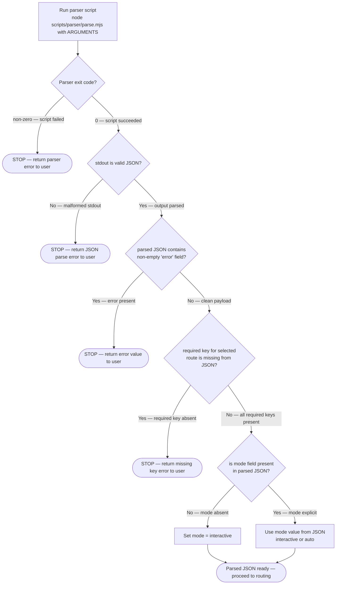
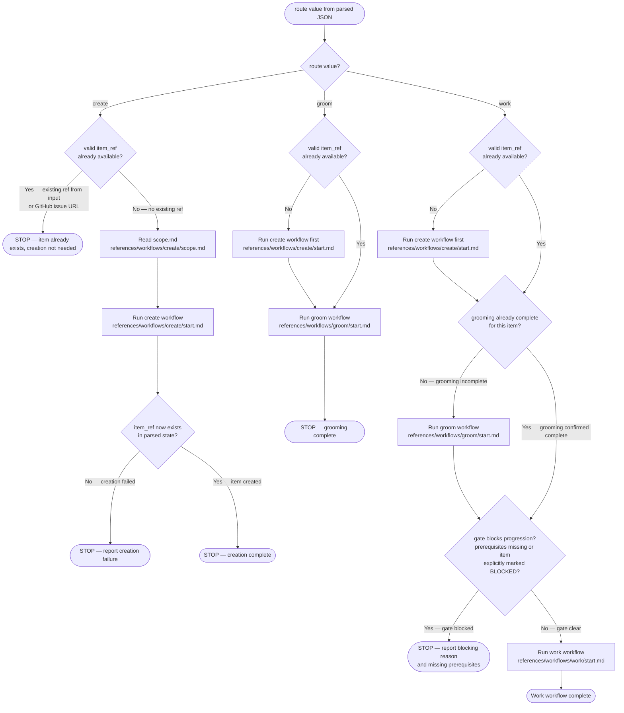

<input>
!`node "${CLAUDE_SKILL_DIR}/scripts/parser/parse.mjs" "$ARGUMENTS"`
</input>

Execute the command in <input/> and parse its stdout as JSON. Treat that JSON as the normalized user input for this workflow.

For every placeholder in the form <key/>, substitute the value of that key from the parsed JSON.

> [!IMPORTANT]
> When provided a process map or Mermaid diagram, treat it as the authoritative procedure. Execute steps in the exact order shown, including branches, decision points, and stop conditions.
> A Mermaid process diagram is an executable instruction set. Follow it exactly as written: respect sequence, conditions, loops, parallel paths, and terminal states. Do not improvise, reorder, or skip steps. If any node is ambiguous or missing required detail, pause and ask a clarifying question before continuing.
> When interacting with a user, report before acting the interpreted path you will follow from the diagram, then execute.

The following diagram is the authoritative procedure for input parsing and error gate. Execute steps in the exact order shown, including branches, decision points, and stop conditions.



Input contract — keys available after parsing:

- `mode`: optional; allowed values are `auto` or `interactive` (default when absent: `interactive`)
- `route`: required; allowed values are `create`, `groom`, or `work`
- `user_text`: optional free text supplied by the user
- `item_ref`: optional backlog reference such as `#887`

In `auto` mode, do not call `AskUserQuestion`. Log each would-be interactive decision as `[AUTO] {decision} - {evidence}`.

Backlog item detection from `user_text`:

- Free text describing work to be done → new inbound backlog item
- Issue reference matching `/#\d+/` or a GitHub issue URL → existing backlog item
- Both reference and descriptive text present → reference is existing item identifier; remaining text is additional context

The following diagram is the authoritative procedure for pipeline stage execution. Execute steps in the exact order shown, including branches, decision points, and stop conditions.



# Work Backlog Item

Bridge a backlog item into the SAM planning pipeline via `/dh:add-new-feature` (default). Optional `--language` and `--stack` select Layer 1/2 profiles — see [sdlc-layers](../../docs/sdlc-layers/).

See the [Backlog Lifecycle reference](../../docs/backlog-lifecycle.md) for the complete state machine, handoff protocol, and data architecture.

**Phase separation**: Grooming (Step 3.1) is autonomous research — the agent verifies facts, maps resources, estimates effort, and surfaces blockers. Planning (Step 4.2) is solution design — architecture, tasks, implementation. The human sets priorities and resolves blockers; the agent handles research and fact-checking autonomously.

**SAM** — Stateless Agent Methodology. See [sam-definition.md](./references/workflows/work/sam-definition.md) for what SAM is and how to embody it. SAM lives in `../stateless-agent-methodology/` (or `bitflight-devops/stateless-agent-methodology` on GitHub).
Primary source of truth is **GitHub Issues** (labels + milestone = canonical status). Agents interact with backlog items exclusively through MCP tools (`backlog_view`, `backlog_update`, `backlog_list`, etc.).

When invoked with no arguments, shows an interactive browser. When invoked with `#N` or a title substring, proceeds directly to the planning workflow.

## Arguments

**Agent Preflight:** Run `node plugins/development-harness/skills/work-backlog-item/scripts/parser/parse.mjs "<invocation_args/>"` to receive a structured JSON payload with the exact `mode`, `route`, `flags`, `item_ref`, and `user_text` to follow, rather than manually parsing the rules below. Pipeline, output shape, and extension steps: [parser-guide.md](./scripts/parser/parser-guide.md).

Parser `route` is `none` only when argv is empty (no flags, no positionals, no freetext suffix): follow **Step 1.1 — Interactive Browser** below. It is not the same as `mode: "interactive"` (which only means `--auto` was not passed).

`<mode/>` selects the operating mode; remaining positional args form `<item_ref/>` (title or parameter):

| `<mode/>` value | Remaining args meaning |
|---|---|
| (empty) | — |
| `#N` / bare number / GitHub issue URL | issue number |
| `--auto` | `<item_ref/>`+ = title (or empty → auto-select first open P0/P1 item) |
| `close` / `resolve` | `<item_ref/>`+ = title, `#N`, number, or URL |
| `setup-github` | — |
| `--quick` | `<item_ref/>`+ = title |
| `progress` / `resume` | `<item_ref/>`+ = title or `#N` (optional for `resume`) |
| (any other) | `<invocation_args/>` treated as title substring |

**Optional flags** (when `<mode/>` is title substring or `--auto`): `--language <lang>` selects language plugin (default: python); `--stack <profile>` selects stack profile (e.g., python-fastapi, python-cli). See [sdlc-layers](../../docs/sdlc-layers/).

```text
/work-backlog-item                                    # interactive browser
/work-backlog-item #42                               # issue-first → planning
/work-backlog-item 42                                # issue-first (bare number) → planning
/work-backlog-item https://github.com/{OWNER}/{REPO}/issues/42  # URL → planning
/work-backlog-item Error Recovery                    # direct match → planning
/work-backlog-item --auto                            # autonomous → auto-select first open P0/P1
/work-backlog-item --auto vercel skills npm package  # autonomous → planning
/work-backlog-item close Error Recovery              # dismiss by title
/work-backlog-item close #42                         # dismiss by issue number
/work-backlog-item resolve Error Recovery            # mark completed by title
/work-backlog-item resolve #42                       # mark completed by issue number
/work-backlog-item --language python --stack python-fastapi Add auth  # Layer 2 stack profile
```

### --auto mode rules

All interactive `AskUserQuestion` calls are replaced with evidence-derived decisions. Load [auto-mode.md](./references/workflows/work/auto-mode.md) for the full substitution table.

## Workflow

### Routing (evaluated first, before any step)

The following diagram is the authoritative procedure for mode routing. Execute steps in the exact order shown, including branches, decision points, and stop conditions.

```mermaid
flowchart TD
    %% Routing runs after input parsing completes. Dispatch on first argument word before any pipeline stage.
    Start(["mode value from parsed JSON"]) --> Q1{"mode value?"}
    Q1 -->|"empty or absent"| S0["Load references/workflows/work/interactive-browser.md<br>Step 1.1 — interactive browser"]
    S0 --> S0End(["STOP — interactive browser handles session"])

    Q1 -->|"hash-N or bare number or GitHub issue URL"| S1b["Step 1.2 — issue-first path<br>title source: issue number extracted from input"]
    S1b --> PipelineIssue(["Continue to pipeline execution with item_ref set"])

    Q1 -->|"--auto"| AutoSet["mode is auto<br>title source: item_ref joined<br>if empty: auto-select first open P0/P1 item"]
    AutoSet --> PipelineAuto(["Continue to pipeline execution with mode = auto"])

    Q1 -->|"--quick"| SQ["Load references/workflows/quick/start.md<br>title source: item_ref joined"]
    SQ --> SQEnd(["STOP — quick workflow handles session"])

    Q1 -->|"progress"| SP["Load references/workflows/progress/start.md<br>title source: item_ref joined (optional)"]
    SP --> SPEnd(["STOP — progress report handles session"])

    Q1 -->|"resume"| SR["Load references/workflows/resume/start.md<br>title source: item_ref joined (optional)"]
    SR --> SREnd(["STOP — resume workflow handles session"])

    Q1 -->|"close"| S9c["Load references/workflows/close/start.md<br>title source: item_ref joined"]
    S9c --> S9cEnd(["STOP — close workflow handles session"])

    Q1 -->|"resolve"| S9r["Load references/workflows/close/start.md<br>title source: item_ref joined"]
    S9r --> S9rEnd(["STOP — resolve workflow handles session"])

    Q1 -->|"setup-github"| SGH["Load references/workflows/setup-github/start.md"]
    SGH --> SGHEnd(["STOP — setup-github workflow handles session"])

    Q1 -->|"any other string — title substring"| S1["Step 1.3 — interactive mode<br>title source: full invocation args as substring"]
    S1 --> PipelineTitle(["Continue to pipeline execution with title substring"])
```



**When <mode/> is `auto`**: all `AskUserQuestion` calls are replaced with evidence-derived decisions. Load [auto-mode.md](./references/workflows/work/auto-mode.md) for the substitution table. BLOCKED states (RT-ICA MISSING conditions, feasibility gate BLOCKED) require human resolution regardless of mode.
