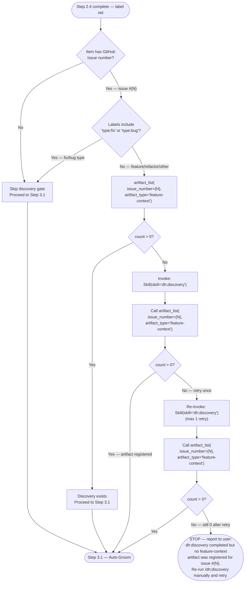
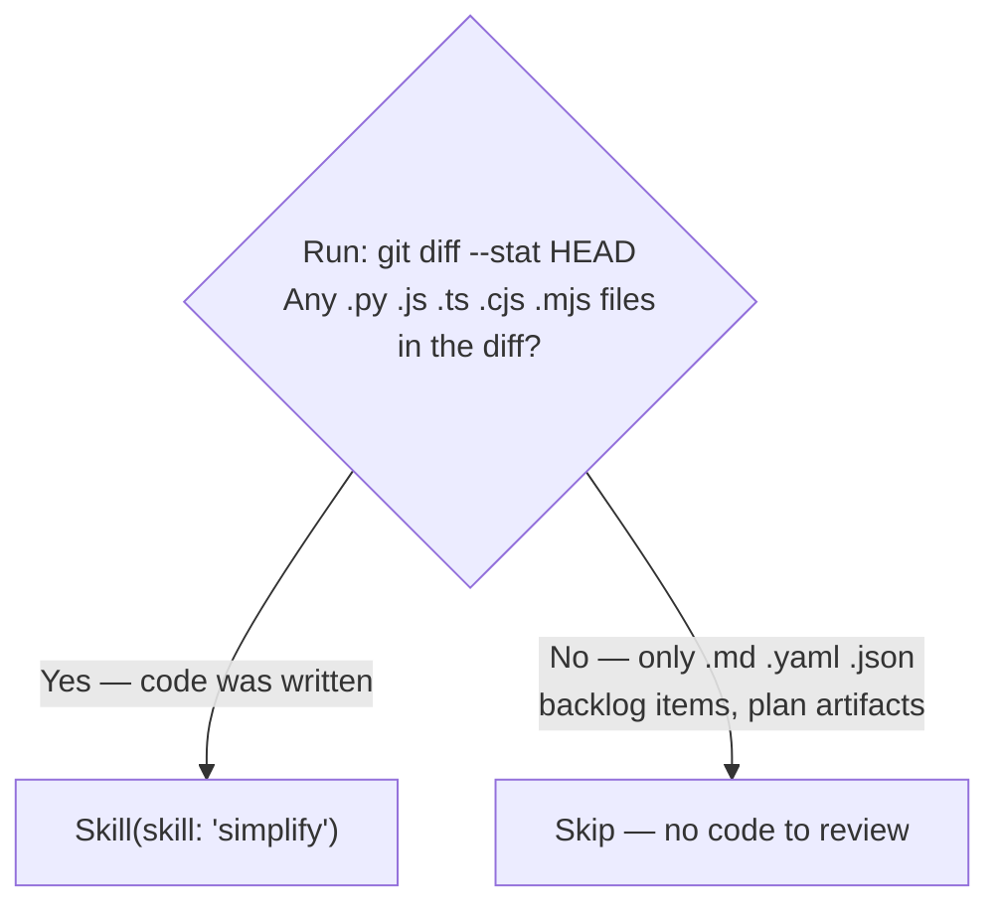

<mode>$0</mode>
<item_ref>$1</item_ref>
<invocation_args>$ARGUMENTS</invocation_args>

# Work Backlog Item

Bridge a backlog item into the SAM planning pipeline via `/dh:add-new-feature` (default). Optional `--language` and `--stack` select Layer 1/2 profiles — see [sdlc-layers](../../docs/sdlc-layers/).

See the [Backlog Lifecycle reference](../../docs/backlog-lifecycle.md) for the complete state machine, handoff protocol, and data architecture.

**Phase separation**: Grooming (Step 3.1) is autonomous research — the agent verifies facts, maps resources, estimates effort, and surfaces blockers. Planning (Step 4.2) is solution design — architecture, tasks, implementation. The human sets priorities and resolves blockers; the agent handles research and fact-checking autonomously.

**SAM** — Stateless Agent Methodology. See [sam-definition.md](./references/sam-definition.md) for what SAM is and how to embody it. SAM lives in `../stateless-agent-methodology/` (or `bitflight-devops/stateless-agent-methodology` on GitHub).
Primary source of truth is **GitHub Issues** (labels + milestone = canonical status). Local per-item files are a read cache maintained by the MCP server.

When invoked with no arguments, shows an interactive browser. When invoked with `#N` or a title substring, proceeds directly to the planning workflow.

## Arguments

`<mode/>` selects the operating mode; remaining positional args (`<item_ref/>`, `$2`, ...) form the title or parameter:

| `<mode/>` value | Remaining args meaning |
|---|---|
| (empty) | — |
| `#N` / bare number / GitHub issue URL | issue number |
| `--auto` | `<item_ref/>`+ = title (or empty → auto-select first open P0/P1 item) |
| `close` / `resolve` | `<item_ref/>`+ = title, `#N`, number, or URL |
| `setup-github` | — |
| `--quick` | `<item_ref/>`+ = title |
| `progress` / `resume` | `<item_ref/>`+ = title or `#N` (optional for `resume`) |
| (any other) | `<invocation_args/>` treated as title substring |

**Optional flags** (when `<mode/>` is title substring or `--auto`): `--language <lang>` selects language plugin (default: python); `--stack <profile>` selects stack profile (e.g., python-fastapi, python-cli). See [sdlc-layers](../../docs/sdlc-layers/).

```text
/work-backlog-item                                    # interactive browser
/work-backlog-item #42                               # issue-first → planning
/work-backlog-item 42                                # issue-first (bare number) → planning
/work-backlog-item https://github.com/OWNER/REPO/issues/42  # URL → planning
/work-backlog-item Error Recovery                    # direct match → planning
/work-backlog-item --auto                            # autonomous → auto-select first open P0/P1
/work-backlog-item --auto vercel skills npm package  # autonomous → planning
/work-backlog-item close Error Recovery              # dismiss (reason required)
/work-backlog-item close #42                         # dismiss by issue number
/work-backlog-item resolve Error Recovery            # mark completed with evidence
/work-backlog-item resolve #42                       # mark completed by issue number
/work-backlog-item --language python --stack python-fastapi Add auth  # Layer 2 stack profile
```

### --auto mode rules

All interactive `AskUserQuestion` calls are replaced with evidence-derived decisions. Load [auto-mode.md](./references/auto-mode.md) for the full substitution table.

## Workflow

### Routing (evaluated first, before any step)

Dispatch based on `<mode/>` (the first argument word) before executing any step:


**AUTO_MODE** — set when `$0` is `--auto`. All `AskUserQuestion` calls are replaced with evidence-derived decisions. See [auto-mode.md](./references/auto-mode.md) for the substitution table. BLOCKED states (RT-ICA MISSING conditions, feasibility gate BLOCKED) require human resolution regardless of mode.

## Phase 1: Locate

### Step 1.1: Interactive Browser (no arguments only)

**Trigger:** `<mode/>` is empty (no arguments passed).

Load [step-procedures.md](./references/step-procedures.md#step-1-1-interactive-browser) for MCP error handling, display format, and response handling.

### Step 1.2: Issue-First Path (`#N`, bare number, or GitHub URL)

**Trigger:** `<mode/>` matches `#[0-9]+`, is a bare number, or is a GitHub issue URL (`https://github.com/.../issues/N`).

Load [step-procedures.md](./references/step-procedures.md#step-1-2-issue-first-path) for field mapping, completed-issue discovery, and AUTO_MODE behavior.

### Step 1.3: Find the Backlog Item

**Bypass:** If `<mode/>` is `#N`, a bare number, or a GitHub issue URL — skip this step entirely and go to Step 1.2. Issue-number and URL inputs resolve via `backlog_view` directly; no matching strategy is needed.

Title = `<item_ref/>`+ joined (args after the mode flag `<mode/>`). In interactive mode, title = full `<invocation_args/>`.

**AUTO_MODE with no title (`<item_ref/>` is empty):** apply the "No title given" substitution from the `--auto mode rules` table — scan P0 then P1 sections for the first open item, log and use its title. Skip items with `status: done` or `status: resolved` in their entry (these are filtered out by `backlog_list` already).

Before executing Step 1.3: Load [step-procedures.md](./references/step-procedures.md).

Record the priority section (P0, P1, P2, Ideas) the item belongs to.

### Step 1.4: Extract Item Fields

From the matched item's entry in the `mcp__plugin_dh_backlog__backlog_list` returned dict, extract `title`, `plan`, `section` (priority), `issue`, and `groomed`. For detailed fields not in the list response (`description`, `source`, `added`, `research_first`, `suggested_location`), call `mcp__plugin_dh_backlog__backlog_view(selector="{title}", summary=false)` to fetch the full item from the backend.

- `title` — the `title` field from list JSON (required)
- `plan` — the `plan` field from list JSON (optional)
- `description` — from `backlog_view` response `description` field (required)
- `source` — from `backlog_view` response `source` field (optional)
- `added` — from `backlog_view` response `added` field (optional)
- `research_first` — from `backlog_view` response body, `**Research first**:` line (optional)
- `suggested_location` — from `backlog_view` response body, `**Suggested location**:` line (optional)

If the item already has a `**Plan**:` field, extract the plan address from the YAML filename (e.g., `plan/P1079-machine-readable-inter-item-dependencies.yaml` → `P1079`). Invoke immediately:

```text
Skill(skill: "dh:implement-feature", args: "P{NNN}")
```

After extracting fields, proceed to Step 2.1 (Already Implemented Check) before continuing.

## Phase 2: Validate

### Step 2.1: Already Implemented Check

Before planning, verify the feature/fix hasn't already been implemented (stale open issue). Load [step-procedures.md](./references/step-procedures.md#step-2-1-already-implemented-check) for git commands, resolve calls, and AUTO_MODE behavior.

### Step 2.2: GitHub Issue Sync

After Step 1.4, check for `**Issue**: #N` in the matched item. Load [github-integration.md](./references/github-integration.md#step-2-2-github-issue-sync) for MCP tool calls, yes/no branching, and issue creation.

**Note:** On the Issue-first path (Step 1.2), the `backlog_view` response already contains issue state — carry it forward without re-fetching.

### Step 2.3: Create GitHub Issue

Load [github-integration.md](./references/github-integration.md#step-2-3-create-github-issue).

### Step 2.4: Set In-Progress Label

Load [github-integration.md](./references/github-integration.md#step-2-4-set-in-progress-label).

**Two-part step:** (a) Always run `mcp__plugin_dh_backlog__backlog_update` with `status="in-progress"` for the current item. (b) Run `milestone start` only on explicit user intent to start the whole milestone — it bulk-transitions all open milestone issues, not just the current one.

### Step 2.5: Discovery Gate

Before grooming or planning, check whether a structured discovery artifact exists.



The discovery skill runs its full interactive confirmation loop (WHO/WHAT/WHEN/WHY gathering)
and registers the result as a `feature-context` artifact. The exit signal is a non-zero count
from `artifact_list(issue_number={N}, artifact_type='feature-context')`. After confirmation,
Step 3.1 (Auto-Groom) will detect the artifact and pass it to the grooming swarm.

## Phase 3: Prepare

### Step 3.1: Auto-Groom (if needed)

**Trigger:** item not yet groomed (no `groomed: true` in `backlog_list` output).

Load [step-procedures.md](./references/step-procedures.md#step-3-1-groom-check) for groomed-content retrieval, groom skill invocation, and continuation.

### Step 3.2: RT-ICA Gate

**Trigger:** RT-ICA result absent, stale (>7 days), or item updated since last run.

Load [step-procedures.md](./references/step-procedures.md#step-3-2-rt-ica-gate) for staleness policy, freshness flowchart, and BLOCKED handling.

### Step 3.3: RT-ICA Date Stamp

After `dh:rt-ica` completes (or the existing result is confirmed fresh), write a parseable `Date:` header to the RT-ICA section before storing the result:

```text
RT-ICA Final: {item title}
Date: {YYYY-MM-DD}
Goal: {same as snapshot}
```

The `Date:` header is required for the freshness check in Step 3.2. If the RT-ICA result was retrieved from cache and already contains a `Date:` header, skip this step.

### Step 3.4: Feasibility Gate

**Trigger:** RT-ICA returned APPROVED (Step 3.2) and RT-ICA Date Stamp written (Step 3.3).

Load [feasibility-gate.md](./references/feasibility-gate.md) and evaluate all 4 criteria (technical feasibility, effort proportionality, blast radius, prior attempt check).

**BLOCKED at feasibility gate stops the workflow** — do not proceed to Phase 4. Report the BLOCKED output contract from the reference file and stop.

**PASS** → proceed to Step 4.1 (Compose Feature Request) with the feasibility assessment appended to the feature request.

## Phase 4: Plan

### Step 4.1: Compose Feature Request

**Trigger:** RT-ICA APPROVED (Step 3.2) and feasibility PASS (Step 3.4).

Load [step-procedures.md](./references/step-procedures.md#step-4-1-feature-request-template) for Impact Radius extraction, Ecosystem Completeness Constraint, template, and language/stack flags.

### Step 4.2: Invoke SAM Planning

```text
Skill(skill: "add-new-feature", args: "{composed feature request}")
```

This runs the full SAM workflow: discovery, codebase analysis, architecture spec, task decomposition, validation, context manifest.

### Step 4.3: Update Backlog with Plan Reference

After `add-new-feature` completes, identify the task plan it created by calling `mcp__plugin_dh_sam__sam_list(search="{slug}")` where `{slug}` is the item title lowercased with spaces replaced by hyphens. The SAM MCP server manages plan storage — do not search the filesystem directly.

If `sam_list` returns an empty list, call `sam_list()` with no search argument and scan the
most-recently-updated plan for a title matching the item slug. If still not found, log a
warning and skip the `backlog_update` — do not block Step 4.4.

Call the `mcp__plugin_dh_backlog__backlog_update` tool to add the Plan:

| Parameter | Value |
|-----------|-------|
| `selector` | `"{title}"` |
| `plan` | `"plan/P{NNN}-{slug}.yaml"` (state-relative path) |

If the item has `**Issue**: #N`, record it in the plan file header comment. Do NOT include `Fixes #N`, `Closes #N`, or `Resolves #N` in task-level commit messages — issue closure is handled exclusively by `/complete-implementation` in its final commit step.

### Step 4.4: Simplify

Run the simplify skill only when source code was modified during this session. Planning-only sessions (plan artifacts, backlog items, documentation) do not need code review.



### Step 4.5: Post-Planning Output

- **Interactive mode**: Load [step-procedures.md](./references/step-procedures.md#step-4-5-post-planning-output) for the report template.
- **AUTO_MODE**: Load [step-procedures.md](./references/step-procedures.md#step-4-5a-auto-mode-continuation) for the continuation procedure.

## Phase 5: Close/Resolve

### Step 5.1: Close or Resolve (ADR-9)

**Trigger:** `<mode/>` is `close` or `resolve`.

- `close` = dismiss without completion. Requires `reason` (duplicate, out_of_scope, superseded, wontfix, blocked). Optional `reference` and `comment`. Calls `mcp__plugin_dh_backlog__backlog_close`.
- `resolve` = mark DONE with evidence trail. Requires `summary`. Optional `plan`, `method`, `notes`, `follow_ups`, `findings`. Verifies checklist + acceptance criteria before resolving. For items with a `**Plan**:` field, also checks that the `status:verified` GitHub label is present (Step 5.4). Calls `mcp__plugin_dh_backlog__backlog_resolve`.
- `resolve --force` = bypass the `status:verified` gate (Step 5.4) and the open-PR gate (Step 5.7) with a warning. Use when label automation failed or when forcing a local-cache resolve while a PR is still open.

Load [close-resolve-procedure.md](./references/close-resolve-procedure.md) for steps 5.2–5.7.

## Reference Index

### GitHub Integration

GitHub Issues are the source of truth. The backlog MCP server manages local caching — skills interact via MCP tools only. See [github-integration.md](./references/github-integration.md) for step-by-step commands and example sessions. Note: `Fixes #N` trailers are restricted to the `/complete-implementation` final commit step only.

### setup-github Command

**Trigger:** `<mode/>` is `setup-github`. Load [github-integration.md](./references/github-integration.md#setup-github-command) for the full setup procedure and expected output.

### Error Handling

See [error-handling.md](./references/error-handling.md) for all error conditions and handling instructions.

### Example Sessions

See [example-sessions.md](./references/example-sessions.md) for complete examples. GitHub-specific sessions (issue creation, setup-github): [github-integration.md](./references/github-integration.md)

### Validation Plan

See [validation-plan.md](./references/validation-plan.md) for V1–V6 verification commands and the full integration test sequence.
