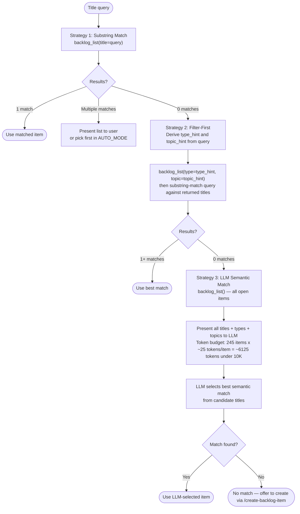
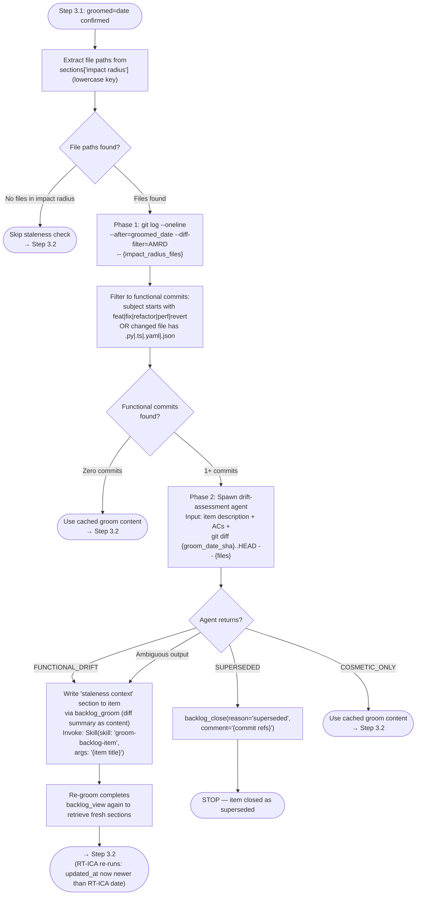
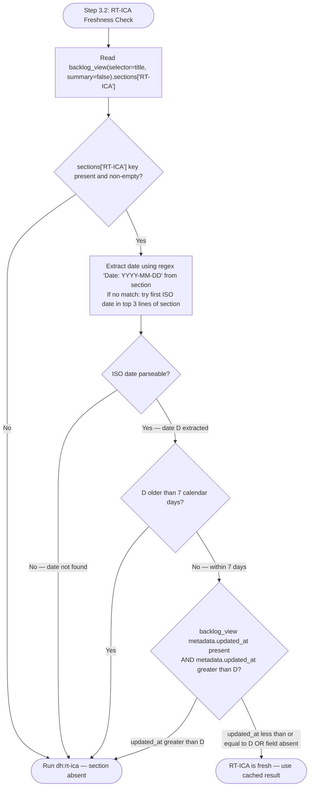

# Step Procedures Reference

Detailed procedure content for Steps 1.1, 1.2, 1.3, 2.1, 4.1, 4.5, 4.5a, Q, P, and R.

---

## Step 1: Find the Backlog Item — 3-Strategy Fallback Chain

**Bypass:** If `<mode/>` is `#N`, a bare number, or a GitHub issue URL — skip this step and go
to Step 1b. Those inputs resolve via `backlog_view` directly; no matching strategy is needed.

Apply the following 3-strategy fallback chain. Move to the next strategy only when the current
strategy returns zero matches.



### Strategy 1 — Substring Match

Call `backlog_list(title=query)`. The `title` parameter performs a case-insensitive substring
match server-side. If exactly one item is returned, use it. If multiple items are returned,
present a numbered list and ask the user to choose (in AUTO_MODE, pick the first). If zero
items are returned, proceed to Strategy 2.

### Strategy 2 — Filter-First

Derive filter hints from the query before calling `backlog_list`:

**`type_hint`**: scan query words for keyword groups (case-insensitive):

- `bug`, `fix`, `broken`, `error` → `Bug`
- `feature`, `add`, `new`, `implement` → `Feature`
- `refactor`, `clean`, `restructure` → `Refactor`
- no match → `None` (omit `type` parameter)

**`topic_hint`**: longest non-stop-word from the query, converted to kebab-case slug. If none
can be derived, omit the `topic` parameter.

Call `backlog_list(type=type_hint, topic=topic_hint)` (omit any `None` parameters). Then
perform a case-insensitive substring match of the original query against the `title` field of
each returned entry. Items whose titles contain the query substring are candidates.

The `type` and `topic` filters compose with AND logic. Items missing the filtered metadata field
are excluded when that filter is active.

### Strategy 3 — LLM Semantic Match

Call `backlog_list()` with no filters to load all open items. Each returned item includes
`title`, `type`, and `topic` fields. Read the full list in the current context and select the
item whose title, type, and topic best match the intent of the query. The token cost is bounded:
**245 items × ~25 tokens/item ≈ 6,125 tokens (under 10K budget)**. If two or more candidates
are plausible, read their per-item files via `backlog_view` before choosing.

**Tiebreaker rule** — applied in order when two or more candidates remain equally plausible after reading `backlog_view`:

1. **Priority**: select the candidate in the highest priority section — P0 > P1 > P2 > Ideas.
2. **Age**: if still tied, select the candidate with the earliest `added` date (oldest item first).
3. **Title overlap**: if `added` is absent or identical, select the candidate whose `title` has the highest character-level overlap with the query string (count characters shared in sequence order).
4. **List order**: if all three tiebreakers are equal, select the first candidate in the order returned by `backlog_list` and log: `[STRATEGY3-TIE] Selected {title} — all tiebreakers equal, using list order.`

In **AUTO_MODE**, apply the tiebreaker silently and log: `[AUTO] Strategy 3 tiebreaker applied — rule {N}: selected {title}.`

### Zero-match handling after all 3 strategies

- **Interactive mode:** report "No backlog item found matching: {title}" and offer to create one
  via `/create-backlog-item`.
- **AUTO_MODE:** log `[AUTO] No item found — invoking create-backlog-item --auto {title}`,
  invoke `Skill(skill: "create-backlog-item", args: "--auto {title}")`, then re-run Step 1.

---

<a id="step-1-2-issue-first-path"></a>

## Step 1.2: Issue-First Path

**Trigger:** `<mode/>` matches `#[0-9]+`, is a bare number, or is a GitHub issue URL (`https://github.com/.../issues/N`).

Fetch the issue using the `mcp__plugin_dh_backlog__backlog_view` tool (accepts URLs, `#N`, and bare numbers):

Call the `mcp__plugin_dh_backlog__backlog_view` tool with `selector="{<mode/>}"`.

If the tool returns a dict with an `error` key, report and stop.
Parse the returned dict. If `state` is `closed`, run the **Completed Issue Discovery** procedure and stop. Full procedure: [#step-1-2-completed-issue-discovery](#step-1-2-completed-issue-discovery)

From the JSON response build the working item:

| Field | Source |
|---|---|
| `title` | `title` |
| `description` | `body` (full text) |
| `source` | `"GitHub Issue #N"` |
| `priority` | `priority` field (extracted from `priority:*` label) |
| `status` | `status` field (extracted from `status:*` label — canonical) |
| `milestone` | `milestone` |
| `plan` | `plan` field, or search `body` for `**Plan**:` line |

The `backlog_view` MCP tool merges local cache with live GitHub issue data. All fields needed for subsequent steps are available in the response — do not read local files directly.

Note: The issue-first path skips Steps 2.1–2.3 because the item is resolved via GitHub Issue
number — it already has an issue (skips 2.2–2.3) and the `backlog_view` response includes
closed-state detection (substitutes 2.1). Proceed directly to Step 2.4.

---

<a id="step-1-2-completed-issue-discovery"></a>

## Step 1.2: Completed Issue Discovery

When an issue is found to be already closed (`state: closed`), gather evidence before closing the local backlog item:

1. **Search for commits referencing the issue**:

   ```bash
   git log --oneline --all -20 --grep="#N"
   ```

2. **Search for merged PRs via git history**:

   ```bash
   git log --oneline --all -20 --grep="Fixes #N\|Closes #N"
   ```

3. **Report findings**:

   If commits or PRs are found:

   ```text
   Issue #{N} is already closed.

   Evidence of completion:
   - PR #{pr}: {title} (merged {date})
     URL: {url}
   - Commit {sha}: {message}

   Closing local backlog item with evidence.
   ```

   Call the `mcp__plugin_dh_backlog__backlog_resolve` tool with `selector="{title}"` and
   `summary="Completed via PR #{pr} / commit {sha}"`.

   If no commits or PRs reference the issue:

   ```text
   Issue #{N} is already closed but no commits or PRs reference it.
   The issue may have been closed manually or via external process.

   Options:
   - close: Close the local backlog item (with manual reason)
   - resolve: Mark as no longer applicable
   - reopen: If the work was not actually done, reopen the issue
   ```

   Use `AskUserQuestion` to ask which action to take. In AUTO_MODE, log
   `[AUTO] STOP — Issue #N closed, no commit/PR evidence found` and stop.

---

<a id="step-2-1-already-implemented-check"></a>

## Step 2.1: Already Implemented Check

Before planning work, verify the described feature/fix hasn't already been implemented:

1. **Search for commits and merged PRs matching the item's topic** (use keywords from the title):

   ```bash
   git log --oneline --all -30 --grep="{keyword from title}"
   git log --oneline --all -30 --merges --grep="{keyword from title}"
   ```

2. **Spot-check the codebase** — read the file(s) at the suggested location and verify whether the described behavior already exists.

If evidence shows the work is already done:

- Call the `mcp__plugin_dh_backlog__backlog_resolve` tool with `selector="{title}"` and
  `summary="Already implemented via PR #{pr} / commit {sha}"`.
- Report to the user and stop — no planning needed.

In AUTO_MODE: log `[AUTO] Work already implemented — closing #{N} with evidence: {sha/PR}` and stop.

If no evidence, proceed to Step 2.2 (GitHub Issue Sync).

---

<a id="step-1-1-interactive-browser"></a>

## Step 1.1: Interactive Browser

For MCP tool errors encountered at any step, load `./error-handling.md` for error
classification and handling instructions.

1. Call the `mcp__plugin_dh_backlog__backlog_list` tool.

   Parse the returned dict. Each entry in `items` has `section`, `title`, `issue`, `plan`, `status`, `milestone`, `file_path` (index format), `groomed` (true if item has groomed content).

2. **Groomed** = item has `groomed: true` in `backlog_list` output. For full groomed content, call `backlog_view(selector="{title or #N}", summary=false)` — the response `sections` dict contains groomed field values (e.g., `response["sections"]["Acceptance Criteria"]`). If groomed sections are present, use them.

3. Present a numbered list. Use these status indicators in user-visible output only:

   <eg>
   Backlog Items:

   P0
     1. ✅ SAM: Error Recovery / Rollback Procedures       [#12  status:in-progress  v1.0]
     2. 🔍 SAM: Regex False Positive Suppression           [#14  status:needs-grooming  v1.0]

   P1
     3. 📋 SAM: Validate Task File Schema                  [no issue]
     4. 📋 SAM: Implement Feature Dry-Run Mode             [no issue]

   P2
     5. 🔍 SAM: Context Window Budget Tracking             [#18  status:needs-grooming  —]

   Ideas
     6. 📋 SAM: Multi-Repo Support                         [no issue]

   Status: ✅ = planned/in-progress  🔍 = groomed/needs-grooming  📋 = not yet groomed

   Options:
     [number]   — Select item to work on
     G [number] — Groom a specific item
     G all      — Groom all ungroomed items
     D [number] — Show full details for an item
</eg>

4. Use `AskUserQuestion` to ask: "Which item would you like to work on next?"

5. Handle the response:
   - `[number]` — use that item's title as the working title and proceed to Step 1
   - `G [number]` — invoke `Skill(skill="groom-backlog-item", args="{item title}")` then re-display the list
   - `G all` — invoke `Skill(skill="groom-backlog-item", args="all")` then re-display the list
   - `D [number]` — display the full item description, research_first field, and groomed content (if present in the item file under `## Groomed`), then re-display the list
   - `C [number]` — proceed to Step 5.1 (close path) with that item's title
   - `R [number]` — proceed to Step 5.1 (resolve path) with that item's title

---

<a id="step-4-1-feature-request-template"></a>

## Step 4.1: Feature Request Template

Build this string for `add-new-feature`:

<eg>
## Backlog Item: {title}

**Source**: {source}
**Priority**: {priority section — P0/P1/P2/Ideas}
**Added**: {added date}

### Description

{description text}

### Research Questions

{research_first text, or "None" if absent}

### Suggested Location

{suggested_location text, or "To be determined during architecture phase" if absent}

### RT-ICA Assessment

**Decision**: APPROVED
**Goal**: {goal statement}
**Verified conditions**: {list of AVAILABLE items}
**Assumptions to confirm**: {list of DERIVABLE items, or "None"}

### Grooming Context

{full context manifest from Step 3, if available}

### Impact Radius

{full content of the ## Impact Radius section from the groomed item file}

**Planner constraint**: Create tasks for every item listed above, or document the exclusion reason inline. The plan is incomplete if any row in the Impact Radius is unaddressed.

**Ecosystem Completeness Checklist** (must all be checked before the plan can be marked complete):
- [ ] Every upstream producer updated or verified compatible
- [ ] Every downstream consumer migrated to new interface
- [ ] Every stale document updated
- [ ] Old interface deprecated or removed (if replacing)
- [ ] CI/config files updated and validated

### Stack Profile (optional)

{stack profile name if --stack specified, e.g., python-fastapi}
</eg>

If `--stack` was specified, append a "Stack profile" line. If `--language` was specified and is not `python`, invoke the corresponding language plugin (e.g., `/typescript-development:add-new-feature` for `typescript`).

---

<a id="step-3-1-groom-check"></a>

## Step 3.1: Auto-Groom Check

### Ungroomed items

If the `groomed` field in the `backlog_list` output is absent or empty (item not yet groomed):

```text
Skill(skill: "groom-backlog-item", args: "{item title}")
```

The groom skill writes groomed content via the backlog MCP server. After grooming completes — including any BLOCKED/resolution cycles during the RT-ICA assessment — call `backlog_view` again to retrieve the groomed sections and proceed immediately to Step 3.2. Do not stop or wait for re-invocation.

### Groomed items — staleness check

If `groomed` contains a date string (`YYYY-MM-DD`), do NOT consume cached groom content immediately.
Run the two-phase staleness check before proceeding.

**Note**: This taxonomy (FUNCTIONAL_DRIFT / SUPERSEDED / COSMETIC_ONLY) applies only to Step 3.1.
The Step 2.5 drift-check taxonomy (Scope change / Partial fix / New callers / File moved / No impact)
is a separate check at a different stage and is not unified with this one.

#### Extract Impact Radius files

Call `mcp__plugin_dh_backlog__backlog_view(selector="{title}", summary=false)`.
Extract file paths from `response["sections"]["impact radius"]` (key is lowercase).
Use a regex to find all path-like tokens (e.g., `\S+\.\w+` patterns or lines beginning with a path segment).

If the `impact radius` section is absent or contains no file paths:
skip Phase 1 and Phase 2 — proceed directly to Step 3.2 with cached groom content.

Record the extracted paths as `{impact_radius_files}` (space-separated list for git CLI).
Record the `groomed` date string as `{groomed_date}` (format `YYYY-MM-DD`).

#### Phase 1 — Drift detection

Run:

```bash
git log --oneline --after="{groomed_date}" --diff-filter=AMRD -- {impact_radius_files}
```

Filter the output to **functional commits** only. A commit is functional if either condition is true:

- Its subject line begins with one of: `feat`, `fix`, `refactor`, `perf`, `revert` (conventional commit type prefix before `:`)
- OR any of the changed files has extension `.py`, `.ts`, `.yaml`, or `.json`

If zero qualifying commits remain after filtering → skip Phase 2.
Log: `[STALENESS] Phase 1: 0 functional commits since {groomed_date} — using cached groom content.`
Proceed directly to Step 3.2.

If one or more qualifying commits exist → proceed to Phase 2.



#### Phase 2 — Drift assessment

Find the SHA for the groom date:

```bash
git rev-list -1 --before="{groomed_date} 23:59:59" HEAD
```

Record as `{groom_date_sha}`. If the command returns empty (no commits before that date), fall back
to `--after={groomed_date}` date-based filtering only in the diff command below.

Spawn an agent with the following inputs:

- The item's full description (from `backlog_view` `description` field)
- The item's acceptance criteria (from `sections['acceptance criteria']`)
- The output of: `git diff {groom_date_sha}..HEAD -- {impact_radius_files}`

The agent must return **exactly one** of these tokens:

| Token | Meaning |
|---|---|
| `FUNCTIONAL_DRIFT` | The diff changes feasibility, approach, architecture, or goals of the item |
| `SUPERSEDED` | The diff implements what the item describes — the work is already done |
| `COSMETIC_ONLY` | The diff does not affect the item's goals — cached content remains valid |

If the agent returns ambiguous or unrecognised output: treat as `FUNCTIONAL_DRIFT` (conservative).

**In AUTO_MODE**: the agent spawned for Phase 2 must derive its classification from the diff content
without AskUserQuestion. Log: `[AUTO] STALENESS Phase 2: {TOKEN} — {one-line reason from diff}`.

#### Phase 2 actions by token

**FUNCTIONAL_DRIFT:**

1. Write the diff summary as the `staleness context` section via MCP:

   ```text
   mcp__plugin_dh_backlog__backlog_groom(
     selector="{title}",
     section="staleness context",
     content="Staleness detected {today}: functional commits since {groomed_date}.\n\n{diff summary — key changed interfaces, renamed functions, added/removed files}\n\nCommits:\n{list of qualifying commit one-liners}"
   )
   ```

2. Invoke re-groom:

   ```text
   Skill(skill: "groom-backlog-item", args: "{item title}")
   ```

3. After re-groom completes, call `backlog_view` again to retrieve fresh sections.
4. Proceed to Step 3.2. RT-ICA will re-run automatically because `updated_at` is now
   newer than the RT-ICA section date.

**SUPERSEDED:**

```text
mcp__plugin_dh_backlog__backlog_close(
  selector="{title}",
  reason="superseded",
  comment="Goal already implemented by commits since groom date: {commit sha list}"
)
```

Stop. Do not proceed to Step 3.2 or any planning steps.

**COSMETIC_ONLY:**

Log: `[STALENESS] Phase 2: COSMETIC_ONLY — cached groom content valid.`
Proceed to Step 3.2 with cached sections unchanged.

---

<a id="step-3-2-rt-ica-gate"></a>

## Step 3.2: RT-ICA Gate

### RT-ICA Staleness Policy

An RT-ICA result is stale and must be re-run if either condition is true: (a) the `Date:` header in the RT-ICA section is older than 7 calendar days, or (b) the item's `metadata.updated_at` field is newer than the RT-ICA section date. A stale RT-ICA result is treated as absent — `dh:rt-ica` is re-run before proceeding to Step 3.4. The 7-day threshold applies regardless of whether the item description has changed, because codebase context may have changed even if the item text has not.



When the flowchart routes to "Run dh:rt-ica":

```text
Skill(skill: "dh:rt-ica")
```

Log re-run reason: `RT-ICA re-run: {staleness reason — date older than 7 days / updated_at
newer than RT-ICA date}` to the item's RT-ICA section as a prefix before the new result.

- **Present and fresh** — use the APPROVED/BLOCKED decision from the cached result. Carry DERIVABLE items forward as "Assumptions to confirm" in the feature request.
- **BLOCKED** — stop. Do not proceed to Step 3.4 until all MISSING conditions are resolved.

---

## Step Q: Quick Mode

**Trigger:** `$0` is `--quick`. Skips grooming, RT-ICA, and SAM planning. For one-file fixes, broken links, and typo patches where full pipeline overhead is disproportionate.

1. Extract title from `$1`+ joined. Build slug: title lowercased, spaces → hyphens.

2. Find the item via `backlog_view(selector="{title or #N}", summary=false)`. If not found (response contains `error` key), create a minimal item with `backlog_add(title="{title}")`. If found, extract description and acceptance criteria from `response["sections"]`.

3. Extract the item's description and acceptance criteria if available.

4. Create the quick plan using the SAM MCP tool:

   ```text
   mcp__plugin_dh_sam__sam_create(
     slug="quick-{slug}",
     goal="{goal from description or acceptance_criteria}",
     tasks_yaml="tasks:\n  - task: T1\n    title: \"{description}\"\n    status: not-started\n    agent: task-worker\n    dependencies: []\n    priority: 1\n    complexity: low\n    accuracy-risk: low\n    skills: []\n    reason: \"Quick fix task\"\n    handoff: \"Done when acceptance criteria met\""
   )
   ```

   `sam_create` handles path resolution internally — do not resolve or pass a file path.

5. Call the `mcp__plugin_dh_backlog__backlog_update` tool with `selector="{title}"` and `plan="quick-{slug}"` to record the plan slug.

6. Report the path returned by `sam_create`:

   <eg>
   Quick plan created: {path returned by sam_create}
   Steps: {N} tasks

   To execute: /implement-feature quick-{slug}
   To close:   /work-backlog-item close {title}
   </eg>

---

## Step P: Progress Report

**Trigger:** `$0` is `progress`.

1. Call `backlog_list()` to retrieve all open items. Count items by priority (P0, P1, P2, Ideas) and status from the returned `items` list. Each entry has `priority`, `status`, `title`, `issue`, `milestone`, and `groomed` fields.

2. Query GitHub for the active milestone:

   ```text
   # OWNER/REPO is discovered dynamically via discover_repo() from backlog_core.models
   # Use MCP: backlog_get_soonest_milestone()
   ```

   Extract: milestone number, title, open_issues, closed_issues.

3. For items in the active milestone, identify the highest-priority groomed item with no `**Plan**:` field — that is the recommended next action.

4. Display:

   <eg>
   Backlog Health — {YYYY-MM-DD}

   Active Milestone: #{N} {title}
     Closed:      {closed_issues} items
     Open:        {open_issues} items
     Progress:    [{####......}] {pct}%

   Overall Backlog:
     P0:    {n} items ({m} in milestone)
     P1:    {n} items ({m} in milestone, {k} groomed but unassigned)
     P2:    {n} items
     Ideas: {n} items

   Next recommended action:
     /work-backlog-item {title}  — {title} (P{x}, groomed, in active milestone)
   </eg>

   If no active milestone exists, omit the milestone section and show only Overall Backlog counts.

   If the backlog directory is empty, note: `(no backlog items found)`

---

## Step R: Resume Report

**Trigger:** `$0` is `resume`.

1. Extract title from `$1`+ joined. If `$1` starts with `#`, fetch title from GitHub Issue (same logic as Step 1b).

2. Call `backlog_view(selector="{title or #N}", summary=false)`. Extract the `plan` field from the response. If absent or empty:

   <eg>
   No plan file recorded for "{title}".
   Run /work-backlog-item {title} to create a plan first.
   </eg>

   Then stop.

3. Read the plan via `mcp__plugin_dh_sam__sam_read` using the plan ID extracted from the item's
   `plan` field. Do not read the YAML file directly. Parse the task list from the response:
   - `total_tasks` — count of all task entries
   - `checked_tasks` — count of tasks with `status: complete`
   - `last_checked` — title of the last task with `status: complete`
   - `first_unchecked` — title of the first task with `status: not-started` or `status: in-progress`

4. Compute `completion_pct = checked_tasks * 100 / total_tasks` (integer).

5. Report:

   <eg>
   Resume: {title}
   Plan:   {plan file path}

   Progress: {checked_tasks}/{total_tasks} tasks ({completion_pct}%)

   Last completed:  {last_checked task text}
   Next to do:      {first_unchecked task text}

   To continue: /implement-feature {slug}
   To close:    /work-backlog-item close {title}
   </eg>

   If `checked_tasks == 0`, report "No tasks completed yet."
   If `checked_tasks == total_tasks`, report "All tasks complete — run /work-backlog-item close {title}."

---

<a id="step-4-5a-auto-mode-continuation"></a>

## Step 4.5a: AUTO_MODE Continuation

**Trigger:** AUTO_MODE is set (invoked with `--auto`).

Skip Step 8.5 reporting. Instead, continue directly to implementation:

1. Invoke implementation:

   ```text
   Skill(skill: "implement-feature", args: "{task_file_path}")
   ```

2. When all tasks complete, invoke quality gates:

   ```text
   Skill(skill: "complete-implementation", args: "{task_file_path}")
   ```

3. After completion, proceed to Step 5.1 resolve path to mark the item done.

Do not stop for user input at any point.

---

<a id="step-4-5-post-planning-output"></a>

## Step 4.5: Post-Planning Output

**Trigger:** AUTO_MODE is NOT set (interactive mode only).

```text
Backlog item "{title}" is now planned.

- Plan: accessible via `sam_read(plan="{slug}")` MCP tool
- To execute:      /implement-feature {slug}
- To check status: /implementation-manager status . {slug}
- To close when done: /work-backlog-item close {title}
```

**Do NOT close the GitHub Issue directly.** Do NOT include `Fixes #N`, `Closes #N`, or `Resolves #N` in task-level commit messages or PR bodies — issue closure is handled exclusively by `/complete-implementation` in its final commit step. Only use `/work-backlog-item resolve` for post-merge verification and local bookkeeping. Use `/work-backlog-item close` only for dismissals (duplicate, out_of_scope, etc.). Never call `mcp__plugin_dh_backlog__backlog_resolve` before the PR has merged.
