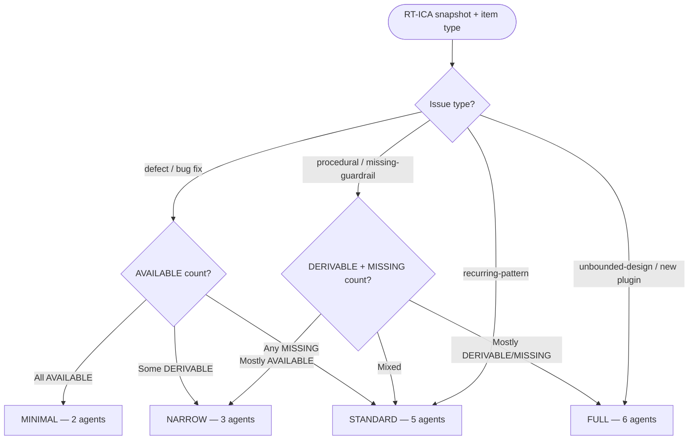

# Groom: Analyze

Pre-swarm analysis: discovery gate, RT-ICA baseline, and scope sizing.
Runs after `intake.md` completes with PROCEED.

## Discovery Gate

**Skip this gate entirely if any of these are true:**

- Item has no `issue_number` (no backend issue linked)
- Item labels include `type:fix` or `type:bug`

**Procedure** (feature/refactor/other with <item_ref/>):

1. Check for existing discovery artifact:

```text
mcp__plugin_dh_backlog__artifact_list(item_id={issue_number}, artifact_type='feature-context')
```

2. If `count > 0`: load the artifact and pass it to swarm agents as prior context.

```text
mcp__plugin_dh_backlog__artifact_read(item_id={issue_number}, artifact_type='feature-context')
```

→ **CONTINUE** to RT-ICA snapshot.

3. If `count == 0`: check whether the item already has rich groomed sections.

```text
mcp__plugin_dh_backlog__backlog_view(selector='{item_ref}', summary=false)
```

Inspect `response["sections"]`. If **all three** of the following are non-empty:
- `acceptance criteria`
- `expected behavior`
- `desired structure` (or `scope` as equivalent)

→ **Synthesize** a feature-context artifact directly from those sections instead of invoking discovery:

```text
mcp__plugin_dh_backlog__artifact_register(
    item_id={issue_number},
    artifact_type='feature-context',
    path='plan/feature-context-{slug}.md',
    agent='discovery',
    content='# ARTIFACT:DISCOVERY\n\n## Feature\n{item title}\n\n## Problem Statement\n{item description}\n\n## Goals\n{acceptance criteria section content}\n\n## Expected Behavior\n{expected behavior section content}\n\n## Desired Structure\n{desired structure / scope section content}\n\n## Open Questions\n- None (synthesized from groomed backlog item)'
)
```

→ Load the just-registered artifact via `artifact_read`, **CONTINUE** to RT-ICA snapshot.
Discovery is pure overhead for well-groomed items — skip it when these sections exist.

4. If `count == 0` and rich groomed sections are absent: invoke discovery skill.

```text
Skill(skill='dh:discovery', args='{item_ref}')
```

5. Verify artifact was registered:

```text
mcp__plugin_dh_backlog__artifact_list(item_id={issue_number}, artifact_type='feature-context')
```

- `count > 0` → load artifact via `artifact_read`, **CONTINUE**.
- `count == 0` → retry ONCE:

```text
Skill(skill='dh:discovery', args='{item_ref}')
mcp__plugin_dh_backlog__artifact_list(item_id={issue_number}, artifact_type='feature-context')
```

- `count > 0` after retry → load artifact, **CONTINUE**.
- `count == 0` after retry → **STOP**:

```text
STOP — dh:discovery completed but no feature-context artifact was registered
for issue {item_ref}. Re-run /dh:discovery manually and retry.
```

**When <mode/> is `auto`**: After discovery returns (or artifact is synthesized), do NOT yield to
the user. Verify artifact immediately and proceed without presenting a summary or requesting
confirmation.

## RT-ICA Initial Snapshot

Run a quick RT-ICA pass using only information from the extract step. This is a baseline
for scope sizing — not the final assessment.

**Categorization rule** (apply before listing any condition):

RT-ICA assesses INFORMATION completeness — "do we know enough to plan?" Only list conditions
that represent information gaps or verifiable facts about the environment. Implementation
deliverables (things to build) belong in acceptance criteria, not RT-ICA conditions.

| Status | Meaning |
|---|---|
| AVAILABLE | Information exists and is verified from the item or codebase |
| DERIVABLE | Information can be obtained with tools (Grep, Read, WebSearch, Bash) |
| MISSING | Information we lack that cannot be derived — requires human decision |

Example: "sam create command exists" is a deliverable → acceptance criteria. "Do we know what sam create needs to do?" is an information question → RT-ICA condition.

**Format** (the `Date:` header is required — downstream freshness checks parse it):

```text
RT-ICA Snapshot: {item title}
Date: {YYYY-MM-DD}
Goal: {one sentence}
Conditions:
1. {condition} | Status: {AVAILABLE|DERIVABLE|MISSING}
...
AVAILABLE count: {N}
DERIVABLE count: {N}
MISSING count: {N}
```

**Write**:

```text
mcp__plugin_dh_backlog__backlog_groom(selector='{item_ref}', section='RT-ICA', content='{snapshot}')
```

## Scope Sizing

The orchestrator determines swarm size from the RT-ICA snapshot and issue type. This is an
orchestrator decision — not a delegation.



| Scope | Agents | Impact Radius depth |
|---|---|---|
| MINIMAL | fact-checker, groomer | File + direct callers |
| NARROW | impact-analyst, fact-checker, groomer | Known files + one expansion level |
| STANDARD | impact-analyst, fact-checker, rtica-assessor, alignment-analyst, groomer | Full expansion from known starting points |
| FULL | all 6 (+ classifier) | Deep expansion, issue classification, full RCA |

**Escalation**: If any agent discovers scope beyond current sizing (e.g., impact-analyst in
NARROW finds 15+ affected systems), escalate to the next level by spawning additional agents.

## Outputs

On success, pass to `swarm.md`:
- All extracted fields from `intake.md`
- RT-ICA snapshot (written to item via MCP)
- Scope sizing decision (MINIMAL / NARROW / STANDARD / FULL)
- Discovery artifact content (if loaded)

On STOP (discovery gate failure): report and stop.
