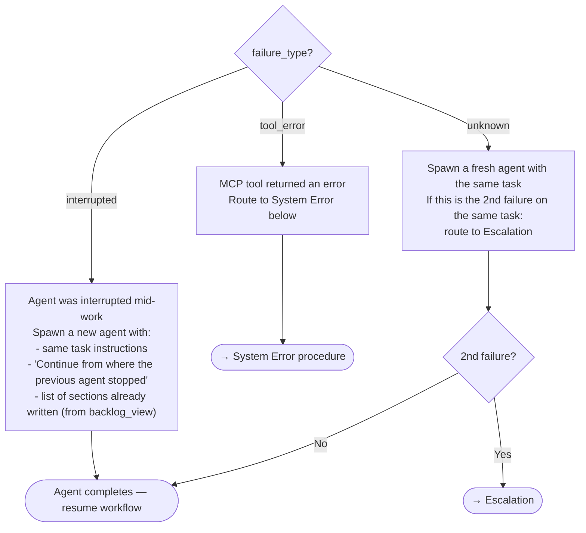

# Groom: Error Handling

Centralized error procedure for the groom workflow. Any stage that encounters an error routes here.

## Error Categories

### 1. Agent Failure

An agent (swarm teammate, groomer, discovery, drift-assessment) did not produce expected output. Causes: token exhaustion, network timeout, session terminated, tool call error.

**Procedure:**

1. Identify the failed agent and the step it was executing.
2. Read the agent's last output (if any) to determine what completed and what did not.
3. Spawn a diagnostic agent to review the failed agent's session:

   ```text
   Agent(subagent_type="dh:task-worker", prompt="
     Review the session transcript for the failed agent.
     Identify:
     - Last successful tool call or output
     - First error, timeout, or missing output
     - Whether the agent was interrupted (token limit, network) or hit a tool error
     Report: last_success, first_failure, failure_type (interrupted | tool_error | unknown)
   ")
   ```

4. Based on the diagnostic:



### 2. Workflow Block

A gate returned BLOCKED or a validation failed after maximum retries. The workflow cannot proceed without external input.

**Procedure:**

1. Set item status to blocked:

   ```text
   mcp__plugin_dh_backlog__backlog_update(selector='<item_ref/>', status='blocked')
   ```

2. Report to the user with full context:

   ```text
   Grooming blocked at {stage} for <item_ref/>: {reason}

   Details:
   - Stage: {stage file name}
   - Condition: {what is blocked and why}
   - Attempted: {what was tried — tool calls, retries, agent spawns}
   - Required: {what input or action would unblock}
   ```

3. Offer diagnostic:

   ```text
   Would you like me to run a diagnostic agent to review the session
   and identify the root cause?
   ```

4. If user accepts: spawn diagnostic agent (same as Agent Failure step 3).
5. If user declines: proceed to [finally.md](./finally.md).

### 3. System Error

An MCP tool returned an error dict, a required tool is unavailable, or the backlog backend is unreachable.

**Procedure:**

1. Report the exact error to the user:

   ```text
   System error during grooming of <item_ref/>:

   Tool: {tool name}
   Action: {what was being attempted}
   Error: {exact error text from the response}
   ```

2. Determine if the error is transient or persistent:
   - **Transient** (network timeout, rate limit): retry once after a brief pause.
   - **Persistent** (invalid selector, missing permissions, tool not available): do not retry.

3. If persistent: create a backlog item for the system issue:

   ```text
   Invoke /dh:work-backlog-item create with description:
   "System error encountered during grooming of <item_ref/>:
   Tool {tool name} returned: {error text}.
   Context: {stage}, {what was being attempted}."
   ```

4. Report the created backlog item to the user and proceed to [finally.md](./finally.md).

## Escalation

When an agent fails twice on the same task, or a system error persists after retry:

1. Report to user:

   ```text
   Escalation: repeated failure during grooming of <item_ref/>

   Stage: {stage}
   Failure count: {N}
   Last error: {description}

   This requires manual investigation. The item has been marked blocked.
   ```

2. Set item status to blocked (if not already).
3. Create a backlog item describing the failure (if not already created by System Error).
4. Proceed to [finally.md](./finally.md).
