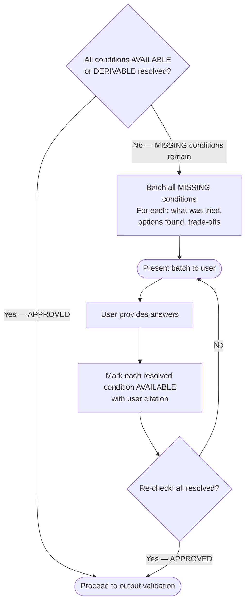
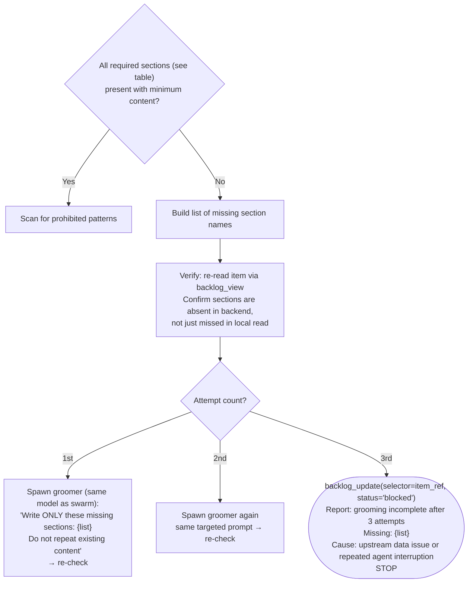

# Groom: Finalize

Post-swarm gates and final write. Runs after `swarm.md` completes.

## RT-ICA Final Pass

Runs after the grooming swarm completes. The orchestrator (not a subagent) executes this.

1. Read all sections now written to the item via MCP:

```text
mcp__plugin_dh_backlog__backlog_view(selector='{item_ref}', summary=false)
```

Extract: Impact Radius, Fact-Check, Issue Classification, groomed subsections.

2. Re-assess every condition from the initial RT-ICA snapshot:
   - Compare snapshot status to current status per condition.
   - Apply categorization rule: deliverables are not conditions (filter out any that leaked in).
   - When fact-checker broadcast REFUTED: mark condition MISSING.
   - When impact-analyst discovered new scope: add new conditions.

3. Self-resolution pass — for each MISSING or DERIVABLE condition:
   - Attempt tool-based resolution: Grep, Read, WebSearch, Bash.
   - Every resolution must cite the tool result.
   - Training data answers are not valid resolutions.
   - If resolved: mark AVAILABLE with tool citation.

4. Build RT-ICA Final report:

```text
RT-ICA Final: {item title}
Date: {YYYY-MM-DD}
Goal: {same as snapshot}
Conditions:
1. {condition} | Snapshot: {status} → Final: {status} | Citation: {tool result}
...
Changes from snapshot:
- {condition X}: DERIVABLE → AVAILABLE (resolved by fact-checker — cite: {tool result})
- {condition Y}: AVAILABLE → MISSING (refuted by fact-checker)
- {condition Z}: (new) MISSING (discovered by impact-analyst)
Decision: {APPROVED|BLOCKED}
```

5. Write final RT-ICA to item (replaces the initial snapshot). Store the report content as
   `{rt_ica_final_content}` — it will be included in the batch write at the end of this workflow
   to ensure atomic persistence with `mark_groomed=True`:

```text
mcp__plugin_dh_backlog__backlog_groom(selector='{item_ref}', section='RT-ICA', content='{final report}')
```

   Retain `{rt_ica_final_content}` in scope for the Write Groomed Content step.

6. Final decision:



**BLOCKED batch format**:

```text
RT-ICA: BLOCKED

The following inputs could not be resolved autonomously.

[Category]:
- Question: {what is unknown}
  Tried: {tools used, what they returned}
  Options found: {a) option with trade-off | b) option with trade-off | c) open-ended}

Answer what you can — skip what you don't know.
Grooming will not proceed to output validation with unresolved gaps.
```

**When <mode/> is `auto`**: BLOCKED conditions with exactly one viable
option are auto-resolved with `[AUTO] Resolved {condition} — {option} — {evidence}`. Conditions
with multiple options or no options remain BLOCKED and halt the workflow.

## Output Validation Gate

Runs when RT-ICA Final Decision is APPROVED, before the final write with `mark_groomed=True`.

1. Read current item sections:

```text
mcp__plugin_dh_backlog__backlog_view(selector='{item_ref}', summary=false)
```

2. Check all required sections are present with minimum content (defined in the table below):

| Section | Minimum content |
|---|---|
| `RT-ICA` | Contains `Decision: APPROVED` or `Decision: BLOCKED` and `Date: YYYY-MM-DD` |
| `Impact Radius` | At least one entry under `Systems Inventory` |
| `Fact-Check` | At least one claim with `verdict:` field |
| `Acceptance Criteria` | Non-empty — at least one criterion listed |
| `Reproducibility` | Non-empty — "N/A for feature items" is acceptable but must be present |
| `Issue Classification` | Contains `Type:` field with valid type value |
| `Priority` | Contains `Effort:` field |
| `Design Intent Alignment` | Contains `Alignment assessment:` field with ALIGNED/DIVERGENT/NOT_APPLICABLE |

Optional sections (not validated for presence): `Root-Cause Analysis`, `Impact`, `Benefits`,
`Expected Behavior`, `Files`, `Resources`, `Dependencies`, `Scope`, `Decision`.

3. If sections are missing — retry with same model, refined prompt:

The failure mode here is an interrupted agent (token exhaustion, network timeout, session
terminated), not a model capability gap. All models call MCP tools with the same fields.
Escalating to a more capable model does not address interrupted writes.



4. Scope boundary check — scan groomer-produced sections for implementation-prescriptive
   language. Apply these prohibited patterns to all sections except `Issue Classification`
   and `Root-Cause Analysis`:

```text
use \w+ framework
implement \w+ using
architecture:
the solution (should|will|must) (use|implement|call)
```

Scope violations do NOT block the write. Log violations as notes:

```text
mcp__plugin_dh_backlog__backlog_groom(selector='{item_ref}', section='Grooming Notes',
  content='Scope violation: {pattern} in {section}')
```

5. When validation passes (all required sections present, scope check logged) → proceed to write.

## Write Groomed Content

Final step — write groomed content via MCP and mark the item as groomed.

**Preferred: batch write with atomic status transition**

When all groomer subsections are ready (end of swarm), write them in a single call using the
`sections` parameter combined with `mark_groomed=True`. This writes all content and advances
status atomically via the active backend.

**RT-ICA MUST be included in this batch write.** The `{rt_ica_final_content}` produced during
the RT-ICA Final Pass above must be passed here — this guarantees the RT-ICA section is always
present after grooming and the rt-ica-gate can find it fresh without re-running:

```text
mcp__plugin_dh_backlog__backlog_groom(
    selector='{item_ref}',
    sections={
        "RT-ICA": "{rt_ica_final_content}",
        "Reproducibility": "{reproducibility section text}",
        "Priority": "{priority section text}",
        "Acceptance Criteria": "{acceptance criteria text}",
        "Files": "{files section text}",
        "Resources": "{resources section text}",
        "Dependencies": "{dependencies section text}",
        "Effort": "{effort section text}"
    },
    mark_groomed=True
)
```

After the batch write, verify the RT-ICA section was persisted:

```text
mcp__plugin_dh_backlog__backlog_view(selector='{item_ref}', summary=false)
```

Check `response["sections"]["RT-ICA"]` is non-empty and contains `Date: YYYY-MM-DD` and
`Decision: APPROVED`. If absent or malformed, write it again individually before proceeding:

```text
mcp__plugin_dh_backlog__backlog_groom(selector='{item_ref}', section='RT-ICA', content='{rt_ica_final_content}')
```

**`mark_groomed=True`** performs these transitions via the active backend:

- Advances the item's status from `needs-grooming` to `groomed`
- Safe to call multiple times — idempotent if already in `groomed` status

**Check the result for `mark_groomed_skipped`**: After the batch write, verify the response dict does not contain `mark_groomed_skipped: true`. This field is set when the post-write item re-lookup returns `None` (the selector no longer resolves after content is written). When `mark_groomed_skipped` is present, the status advance did NOT happen — re-run `backlog_groom(selector='{item_ref}', mark_groomed=True)` once to retry the status transition:

```text
# Verify status advanced — if mark_groomed_skipped is present, retry once
if response.get("mark_groomed_skipped"):
    mcp__plugin_dh_backlog__backlog_groom(selector='{item_ref}', mark_groomed=True)
```

**Alternative: incremental section updates**

When sections become available during the swarm (not at the end), write each immediately:

```text
mcp__plugin_dh_backlog__backlog_groom(selector='{item_ref}', section='Fact-Check', content='{fact-check}')
mcp__plugin_dh_backlog__backlog_groom(selector='{item_ref}', section='RT-ICA', content='{rt-ica}')
# ... each section as it completes ...
```

**Before** calling `mark_groomed=True`, verify the RT-ICA section is present. If missing, write
it with the final report from the RT-ICA Final Pass step above:

```text
mcp__plugin_dh_backlog__backlog_groom(selector='{item_ref}', section='RT-ICA', content='{rt_ica_final_content}', replace_section=True)
```

Then call the final status transition:

```text
mcp__plugin_dh_backlog__backlog_groom(selector='{item_ref}', mark_groomed=True)
```

**Handoff**: After grooming completes, the item is ready for SAM planning. The caller
(`work-backlog-item`) routes to the planning phase based on user request or <mode/>.

## Terminal States

| State | Condition | Action |
|---|---|---|
| Groomed | Output validation passed, `mark_groomed=True` called | Report completion to caller |
| Blocked (RT-ICA) | MISSING conditions unresolved after user batch | `backlog_update(selector='{item_ref}', status='blocked')`, report, stop |
| Blocked (validation) | 4 retry attempts failed to produce required sections | `backlog_update(selector='{item_ref}', status='blocked')`, report, stop |
| Skipped | Pre-groom check returned SKIP | Report reason, next item |
| Drift | Already groomed today | Route to [groom-drift.md](./groom-drift.md), report, stop |
