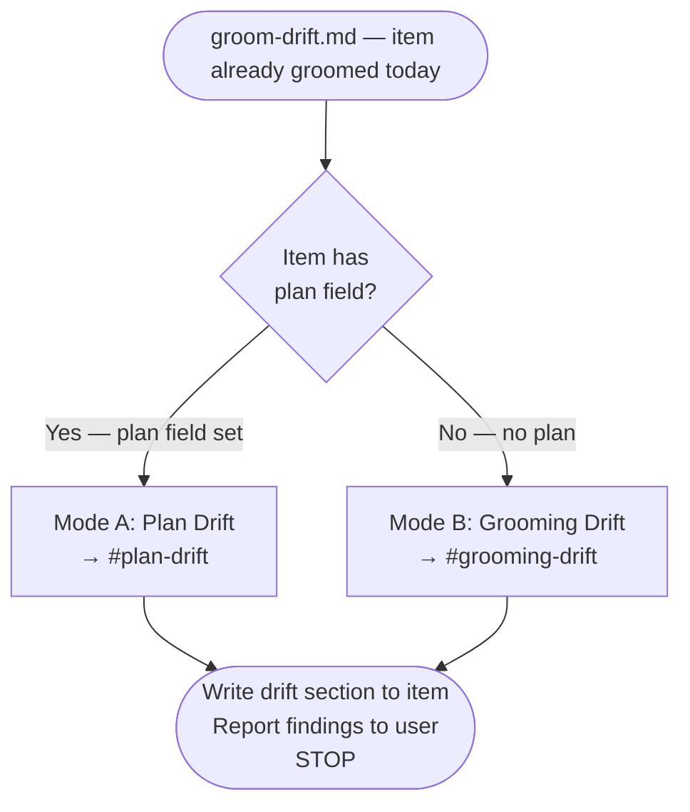

# Workflow: Groom Drift Check

Sub-workflow of [start.md](./start.md). Triggered when an item is already groomed today
(Check E in validation). Two modes based on whether a plan file exists.

**Purpose**: Detect codebase changes since grooming/planning that may invalidate cached content.
This is an informational check — it reports findings and stops. It does NOT trigger re-grooming.

## Inputs

| Input | Source | Required |
|---|---|---|
| `item_title` | Parent workflow | Yes |
| `plan` | Item's plan field (from `backlog_list`) | Determines mode |
| `groomed_date` | Item's groomed field (`YYYY-MM-DD`) | Yes |

## Routing



---

<a id="plan-drift"></a>

## Mode A: Plan Drift

**Precondition**: `plan` field is set and points to an existing plan.

Spawn a haiku agent (`subagent_type="dh:task-worker"`, model=haiku):

1. Read the plan via `mcp__plugin_dh_sam__sam_read(plan='{plan_address}')`.
2. Extract all file paths from the plan (task descriptions, files-to-modify, context manifest).
3. Get the plan's last commit date: `git log -1 --format=%aI -- {plan_path}`.
4. For each file, find commits since that date: `git log --oneline --since={date} -- {file}`.
5. For each commit, get diff summary: `git show --stat {sha} -- {file}`.
6. Classify each commit's impact on the plan:
   - **Scope change** — file does more or less than plan assumed
   - **Partial fix** — issue partially resolved by another commit
   - **New callers** — new dependents not in plan
   - **File moved/renamed** — path changed
   - **No impact** — unrelated to plan's goals
7. Write findings:

```text
mcp__plugin_dh_backlog__backlog_groom(selector='{title}', section='Plan Drift', content='{findings}')
```

**`{findings}` content format**:

```text
Drift since {date}: {N} commits, {M} affecting plan/grooming scope

- {sha} {subject} — {classification}
  Files: {changed files relevant to item}
- {sha} {subject} — {classification}
  Files: {changed files relevant to item}

Summary: {one sentence — what changed and whether it invalidates the plan/grooming}
```

Classifications: `Scope change`, `Partial fix`, `New callers`, `File moved`, `No impact`.

---

<a id="grooming-drift"></a>

## Mode B: Grooming Drift

**Precondition**: Item is groomed but has no plan file.

Spawn a haiku agent (`subagent_type="dh:task-worker"`, model=haiku):

1. Call `mcp__plugin_dh_backlog__backlog_view(selector='{title}', summary=false)`.
2. Extract file paths from groomed sections:
   - `sections["Impact Radius"]` — file paths under Code, Documentation, Configuration/CI
   - `sections["Files"]` — explicit file paths
   - `sections["Output / Evidence"]` — cited file paths
3. Use `groomed_date` from input.
4. For each file, find commits since groomed date: `git log --oneline --since={groomed_date} -- {file}`.
5. Classify each commit (same categories as Mode A).
6. Write findings:

```text
mcp__plugin_dh_backlog__backlog_groom(selector='{title}', section='Grooming Drift', content='{findings}')
```

**`{findings}` content format**:

```text
Drift since {date}: {N} commits, {M} affecting plan/grooming scope

- {sha} {subject} — {classification}
  Files: {changed files relevant to item}
- {sha} {subject} — {classification}
  Files: {changed files relevant to item}

Summary: {one sentence — what changed and whether it invalidates the plan/grooming}
```

Classifications: `Scope change`, `Partial fix`, `New callers`, `File moved`, `No impact`.

---

## Terminal State

Both modes end with: report findings to user, stop. Do not proceed to extract, swarm, or
any other grooming step. The drift check is informational only.

If the caller (work-backlog-item) needs to act on drift, it uses its own staleness taxonomy
(FUNCTIONAL_DRIFT / SUPERSEDED / COSMETIC_ONLY) — that is a separate check in work.md,
not in this workflow.
