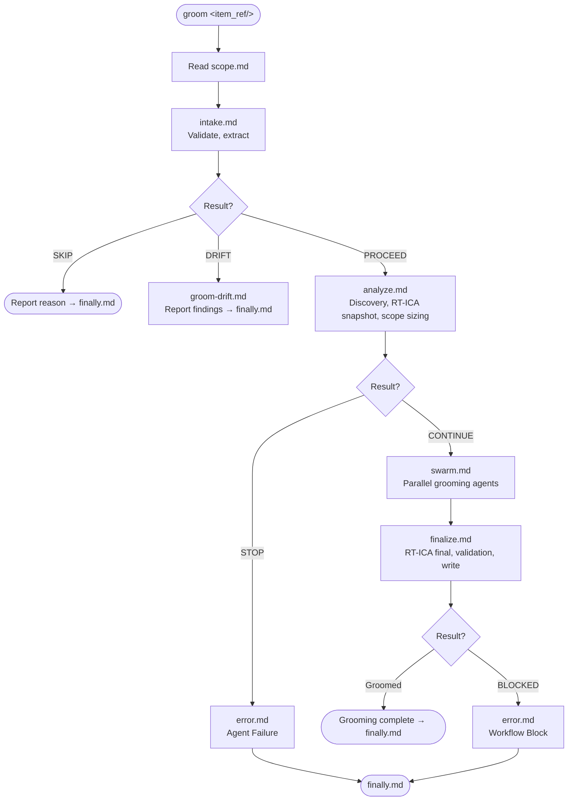

# Workflow: Groom Backlog Item

Invoked when <route/> is `groom`.

## Main Flow

The following diagram is the authoritative procedure for groom execution. Execute steps in the exact order shown, including branches, decision points, and stop conditions.

## Process Documents

| Stage | File | Purpose |
|---|---|---|
| Scope | [scope.md](./scope.md) | Scope boundary — what grooming answers and does not produce |
| Intake | [intake.md](./intake.md) | Validate <item_ref/> eligibility, extract item details |
| Analyze | [analyze.md](./analyze.md) | Discovery gate, RT-ICA baseline, scope sizing |
| Swarm | [swarm.md](./swarm.md) | Parallel grooming agents, output formats, contracts |
| Finalize | [finalize.md](./finalize.md) | RT-ICA final pass, output validation gate, write with `mark_groomed` |
| Drift | [groom-drift.md](./groom-drift.md) | Sub-workflow when item is already groomed today |
| Error | [error.md](./error.md) | Agent failure, workflow block, system error handling |
| Finally | [finally.md](./finally.md) | Sync state, report terminal outcome, return control |

## Checklist

Track progress using your task list. Check off each step as it completes.

1. [ ] Read `scope.md` — align all actions with the grooming scope boundary
2. [ ] **Intake** (`intake.md`) — validate <item_ref/>, run pre-groom checks, extract item details
   - If SKIP: report reason, stop (or next item if batch)
   - If DRIFT: route to `groom-drift.md`, report findings, stop
   - If PROCEED: continue
3. [ ] **Analyze** (`analyze.md`) — run discovery gate, build RT-ICA snapshot, determine scope sizing
   - If STOP (discovery gate failure): report and stop
   - If CONTINUE: carry scope sizing decision forward
4. [ ] **Swarm** (`swarm.md`) — spawn parallel grooming agents at the determined scope size
   - impact-analyst → Impact Radius section
   - fact-checker → Fact-Check section
   - rtica-assessor → RT-ICA section (blocked by impact-analyst + fact-checker)
   - classifier → Issue Classification + Root-Cause Analysis sections
   - groomer → all groomed subsections (blocked by rtica-assessor + classifier)
   - Wait for all agents to complete before proceeding
5. [ ] **Finalize** (`finalize.md`) — run post-swarm gates and write
   - RT-ICA final pass: re-assess conditions, self-resolve DERIVABLE/MISSING, write final report
     - If BLOCKED: present MISSING conditions to user, wait for answers, re-check
     - If APPROVED: continue
   - Output validation gate: verify 8 required sections present with minimum content
     - If missing: retry same model with targeted prompt (up to 3 attempts, then blocked)
     - If pass: continue
   - Write groomed content via `backlog_groom(selector='{item_ref}', sections={...}, mark_groomed=True)`
6. [ ] **Finally** (`finally.md`) — sync state, report terminal outcome, return control

## Error Routing

When any step encounters an error, agent failure, or workflow block: route to [error.md](./error.md).

| Condition | Error category |
|---|---|
| MCP tool returns error dict | System Error |
| Agent fails to produce expected output | Agent Failure |
| Discovery gate STOP (artifact not registered) | Agent Failure |
| RT-ICA BLOCKED (unresolvable MISSING conditions) | Workflow Block |
| Output validation fails after 3 attempts | Agent Failure |
| SKIP (pre-groom check) | Not an error — report reason via [finally.md](./finally.md) |
| DRIFT (already groomed today) | Not an error — route to [groom-drift.md](./groom-drift.md) then [finally.md](./finally.md) |

Every exit path — success, block, skip, drift, or error — ends at [finally.md](./finally.md).

## Inputs

| Input | Source | Required |
|---|---|---|
| <item_ref/> | Backlog item to groom — `#N` format | Yes |
| <mode/> | `auto` or `interactive` (default: `interactive`) | No |
| <user_text/> | Additional context from the user, if any | No |

## Identifier Convention

<item_ref/> is the canonical backlog item identifier across all stages:
- Format: `#N` string (e.g., `"#1632"`)
- Used in: all MCP tool `selector` parameters
- Integer extraction: `issue_number = int(item_ref.lstrip('#'))` — for tools requiring `issue_number` (int)
