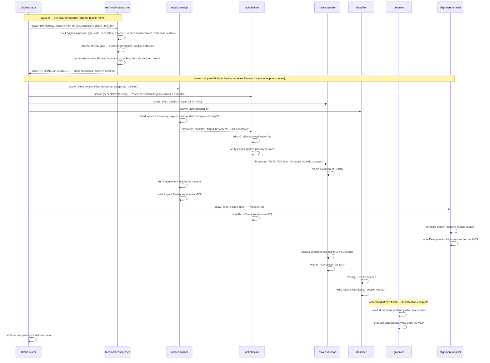
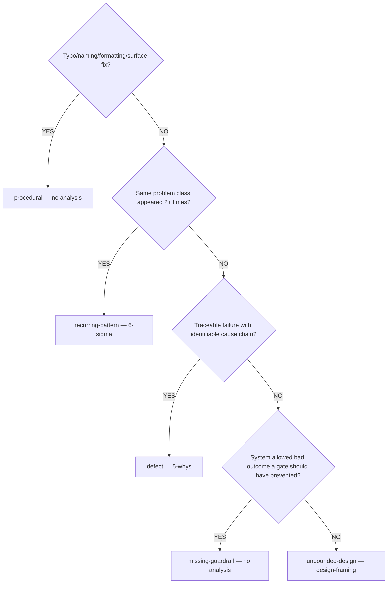

# Groom: Swarm

Parallel grooming agents sized by scope sizing from `analyze.md`.
Each agent writes to a different `section` via MCP `backlog_groom` — no clobbering.
Agents broadcast findings to the team so others react.

## Teammates

1. **impact-analyst** — Build affected systems inventory (Phase 1), run 5-question impact
   checklist per system (Phase 2). Write to `section="Impact Radius"`. Broadcast scope-expanding
   findings to the team.

2. **fact-checker** — Verify item claims against primary sources. Training data recall is NOT
   evidence. Valid evidence: WebFetch, WebSearch, command output, source code, MCP tool output.
   Write to `section="Fact-Check"`. Broadcast REFUTED claims (become MISSING in RT-ICA).

3. **rtica-assessor** — Assess information completeness using impact-analyst and fact-checker
   output. Write to `section="RT-ICA"`. When fact-checker broadcasts REFUTED, mark condition
   MISSING. When impact-analyst broadcasts new scope, add conditions.

4. **classifier** — Classify issue type and run root-cause analysis if `defect` or
   `recurring-pattern`. Write to `section="Issue Classification"` and
   `section="Root-Cause Analysis"`.

5. **groomer** — Produce subsections: Reproducibility, Priority, Impact, Benefits, Expected
   Behavior, Acceptance Criteria, Files, Resources, Dependencies, Effort. Runs AFTER all
   other teammates complete. Write each via `section="{name}"`.

6. **alignment-analyst** — Compare existing implementation against item design intent.
   Depends on impact-analyst (uses affected systems list). Write to section="Design Intent Alignment".
   Broadcast ALIGNMENT_DIVERGENCE or ALIGNMENT_CLEAN findings to team.

## Dependencies

```text
impact-analyst    → (none)
fact-checker      → (none)
classifier        → (none)
rtica-assessor    → blocked by impact-analyst + fact-checker
groomer           → blocked by rtica-assessor + classifier
alignment-analyst → blocked by impact-analyst
```

## Team mode (preferred)

```text
TeamCreate(team_name: "groom-{item-slug}")
```

Teammates broadcast findings; others react. Sequence:



## No-team fallback

#### Wave 0 (pre-swarm research — runs before spawning any teammate)

Invoke the `technical-researcher` agent with the item's technology and concern.

**Pass:**
- `technology`: the primary library, protocol, or internal module the item targets (e.g., `"FastMCP 3.2.4"`, `"backlog_core server.py"`, `"work-backlog-item groom SKILL.md flow"`)
- `concern`: the item's research question, derived from its RT-ICA DERIVABLE/MISSING conditions or description
- `depth`: `overview` for procedural/fix items, `standard` for features and refactors, `deep` for `unbounded-design` items
- `item_ref`: the item's `#N` reference — the agent writes the Research section directly to the backlog item

When `technical-researcher` completes, the item's Research section is populated. Read it as prior context before spawning Wave 1 teammates.

**If `technical-researcher` returns `STATUS: BLOCKED`** (all four angles returned only gaps): proceed to Wave 1 without research prior context — do not halt the groom.

**Skip Wave 0 when:**
- Item type is `type:bug` or `type:fix` — fact-checker covers the primary research need
- Item has no identifiable technology, library, or internal module to research
- Item description is a pure administrative or labelling task with no research questions

#### Wave 1 (parallel)

- impact-analyst → `section="Impact Radius"`
- fact-checker → `section="Fact-Check"` — pass Wave 0 Research section as prior context if available
- classifier → `section="Issue Classification"`, `section="Root-Cause Analysis"`

After Wave 1: read Impact Radius and Fact-Check. If scope expanded, spawn second fact-checker.

#### Wave 2 (depends on Wave 1)

- rtica-assessor → `section="RT-ICA"`
- alignment-analyst → `section="Design Intent Alignment"`

If RT-ICA BLOCKED, stop and present MISSING conditions. Do not proceed to Wave 3.

#### Wave 3 (depends on Wave 2)

- groomer → all groomed subsections

## Impact Radius — what the impact-analyst produces

#### Phase 1: Build Affected Systems Inventory

Start from known files (Files section, Output/Evidence section, suggested_location). Expand:

- Files that import from or call into known systems
- Documentation describing current behavior
- Agent/skill files that instruct AI to use these systems
- Configuration files referencing these modules
- CI workflows testing these modules
- Test files exercising these systems

Exclude: plan artifacts, `docs/plans/`, `.claude/archive/`, test fixtures.

#### Phase 2: Impact Checklist (per system)

For each system, answer:

1. Will this file break when the item ships?
2. Will this file become stale?
3. Does this file need a code change?
4. Does this file need a content update?
5. Is there a test covering this file's interaction with the changed interface?

#### Output format — 6 named categories

```markdown
## Impact Radius

### Code — Producers (write the changed interface)
- `{path}::{function}` — {what it produces, what change needed}

### Code — Consumers (read the changed interface)
- `{path}::{function}` — {what it consumes, what migration needed}

### Code — Other References
- `{path}` — {import/constant/type reference, what change needed}

### Documentation (will become stale)
- `{path}` — {what section becomes inaccurate}

### Configuration / CI
- `{path}` — {what change needed}

### Agent Instructions (instruct AI to use current interface)
- `{path}` — {what instruction needs updating}

### Systems Inventory
{full list with roles and connections}

### Ecosystem Completeness Checklist
- [ ] Every code producer updated or verified compatible
- [ ] Every code consumer migrated to new interface
- [ ] Every stale document updated
- [ ] Every agent instruction updated
- [ ] Old interface deprecated or removed (if replacing)
- [ ] CI/config files updated and validated
```

If a category has no affected files, write `None identified.` — do not omit the category.

## Fact-Checker output contract

Each claim must contain:

```text
verdict: VERIFIED | REFUTED | INCONCLUSIVE
claim: {exact claim from item}
evidence: {tool result citation}
source: {URL or file path with line numbers}
```

Validation rules:

- `verdict` absent → reject claim, log error, do not write
- `evidence` absent → mark INCONCLUSIVE, write with note
- RT-ICA mapping: REFUTED → MISSING, INCONCLUSIVE → DERIVABLE

## Issue Classification



Write classification:

```text
mcp__plugin_dh_backlog__backlog_groom(selector='{item_ref}', section='Issue Classification',
  content='**Type**: {type}\n**Rationale**: {explanation}\n**Analysis Method**: {method}\n**Scenario Target**: {scenario} -> {improvement}')
```

#### Root-Cause Analysis — only for `defect` or `recurring-pattern`

- `defect`: invoke `Skill(skill='find-cause', args='{description}')`, write evidence chain
  to `section="Root-Cause Analysis"`.
- `recurring-pattern`: search `backlog_list(status='resolved')` for keyword matches, count
  frequency, write measurement + analysis + improvement to `section="Root-Cause Analysis"`.

## Groomer prompt

The groomer agent receives all prior teammate output and produces groomed subsections.

#### Scope boundary

Problem space and outcomes only. Do NOT include implementation steps, architecture decisions, code design, or proposed solutions. Acceptance criteria must be observable checks — not implementation steps.

#### Description / AC separation

Description is the problem statement. Acceptance Criteria are verifiable success conditions. Do not restate description inside ACs.

Groomer agent: `subagent_type="dh:backlog-item-groomer"`, model=sonnet.

Input to groomer: item title, description, source, priority, plan address, RT-ICA assessment,
Fact-Check verdicts, Issue Classification, Root-Cause Analysis (or "N/A"), Impact Radius,
Research section (from Wave 0 technical-researcher, if available — pass verbatim as prior context),
and any discovery context.

Orchestrator: before dispatching the groomer, verify your prompt names all required subsections: Reproducibility, Priority, Impact, Benefits, Expected Behavior, Acceptance Criteria, Files, Resources, Dependencies, Effort. A prompt that omits a subsection produces a missing section that cannot be recovered by retry alone.

## Outputs

On completion, all teammate sections are written to the item via MCP.
Pass to `finalize.md` for post-swarm gates and final write.
