# Feasibility Gate Reference

**Location in workflow**: Phase 3, Step 3.4 — runs immediately after the RT-ICA gate (Steps 3.2 and 3.3),
before Step 4.1 (Compose Feature Request).

**Purpose**: Determine whether the item should proceed to SAM planning. RT-ICA answers "do we have enough
information?" — the feasibility gate answers "should we do this and can it be done?"

---

## Gate Logic

Evaluate all 4 criteria in order. A single BLOCKED terminal stops the workflow.

```mermaid
flowchart TD
    RTICAPass(["RT-ICA: APPROVED — proceed to feasibility gate"]) --> Load["Load feasibility-gate.md and evaluate all 4 criteria"]

    Load --> C1{"Criterion 1 — Technical feasibility<br>Does suggested_location exist in codebase?<br>Glob(suggested_location) returns results?<br>Do referenced APIs resolve via Grep?"}
    C1 -->|"Paths resolve"| C2
    C1 -->|"suggested_location missing AND no alternative identifiable"| FBlock1(["BLOCKED: technical path unclear<br>Required: add suggested_location to item or re-groom"])

    C2{"Criterion 2 — Effort proportionality<br>Does backlog_view.sections['Priority'] contain Effort field?<br>Is effort proportionate to item's priority tier?"}
    C2 -->|"Effort present AND proportionate"| C3
    C2 -->|"Effort field absent"| EffortWarn["WARN: effort not estimated — proceed with warning logged"]
    C2 -->|"Effort=FULL for P2 or Ideas item"| FBlock2(["BLOCKED: effort/priority mismatch<br>P2/Ideas with FULL effort requires human confirmation"])
    EffortWarn --> C3

    C3(["Criterion 3 — Blast radius check"]) --> PatternCheck
    PatternCheck{"Any Impact Radius row<br>contains pattern: field?"}
    PatternCheck -->|"No pattern: fields present"| ManualCount["Use manual row count<br>(backward-compatible path)"]
    PatternCheck -->|"Yes — pattern: field found"| RunRg["Run: rg -l '<pattern>' | wc -l<br>Capture as live_count"]
    RunRg --> Compare{"live_count > 1.5 * manual_count?"}
    Compare -->|"Yes — count diverged"| FBlock3b(["Emit STALE_GROOM warning<br>Require re-grooming before proceeding"])
    Compare -->|"No — counts within threshold"| UseLive["Use live_count as blast radius value"]
    UseLive --> C3Decision
    ManualCount --> C3Decision{"Blast radius total?"}
    C3Decision -->|"0 to 10 systems"| C4
    C3Decision -->|"11 to 20 systems"| RiskWarn["WARN: high blast radius — proceed with warning logged"]
    C3Decision -->|"Over 20 systems"| FBlock3(["BLOCKED: blast radius exceeds safe threshold<br>Over 20 affected systems requires human confirmation"])
    RiskWarn --> C4

    C4{"Criterion 4 — Prior attempt check<br>Does item body contain 'tried', 'previous attempt', or 'failed'?<br>Does Impact Radius list exactly 1 file total AND Effort lists 4 or more tasks?"}
    C4 -->|"No prior failure refs, scope appropriate"| PASS(["FEASIBILITY: PASS<br>Proceed to Step 4.1 — Compose Feature Request"])
    C4 -->|"Prior failure reference found"| AltWarn["WARN: prior attempt referenced — include in feature request"]
    C4 -->|"Impact Radius = 1 file total AND task count >= 4"| AltBlock(["BLOCKED: potential over-engineering<br>1-file scope with 4+ tasks — offer --quick path"])
    AltWarn --> PASS
```



**Criterion 4 — observable thresholds:**

- Count rows under all Impact Radius sections (Code, Docs, Config, Agent Instructions) to get the total affected-file count.
- Count task entries in the item's Effort section (lines starting with `- [ ]` or `- [x]`) to get the estimated task count.
- BLOCKED condition: `impact_radius_file_count == 1 AND estimated_task_count >= 4`. Both conditions must be true simultaneously.
- If the Effort section is absent, treat task count as 0 — the BLOCKED condition cannot be met, proceed.
- If the Impact Radius section is absent, treat file count as 0 — the BLOCKED condition cannot be met, proceed.

---

## PASS Output Contract

When all 4 criteria pass (or result in WARN), append the following to the feature request at Step 4.1:

```text
### Feasibility Assessment

**Technical path**: VERIFIED — suggested_location resolves, Impact Radius systems accessible
**Effort tier**: {effort from grooming OR "Not estimated — proceed with caution"}
**Blast radius**: {N} systems affected
**Prior attempts**: {None OR description of prior attempt from item body}
**Warnings**: {list of WARN conditions OR "None"}
**Live count**: {live_count: N (from rg) alongside manual_count: M | "Not applicable — no pattern: fields"}
```

All 6 fields are required. Do not omit fields with empty values — use `"None"`, `"Not estimated"`, or
`"Not applicable — no pattern: fields"` as appropriate. The **Live count** field must be populated when
any Impact Radius row has a `pattern:` field; use `"Not applicable — no pattern: fields"` when no
patterns are present.

---

## STALE_GROOM Output Contract

When `live_count > 1.5 * manual_count` (Criterion 3 pattern path), do NOT proceed. Report the
following and stop:

```text
STALE_GROOM: Impact Radius count stale
  manual_count: {M} (from Impact Radius section, groomed {date})
  live_count: {N} (from rg -l '{pattern}' | wc -l)
  ratio: {ratio:.1f}x (threshold: 1.5x)

Required action: Re-groom this item to refresh the Impact Radius count before proceeding.
Run: /dh:groom-backlog-item {item title}
```

All four fields (`manual_count`, `live_count`, `ratio`, `Required action`) are required. Do not
omit any field or substitute prose explanations.

---

## BLOCKED Output Contract

When the feasibility gate blocks, do NOT proceed to Phase 4. Report the following and stop:

```text
FEASIBILITY GATE: BLOCKED

Criterion: {which criterion failed}
Observable check: {exact check that failed — file path, count, field value}
Required action: {what must happen before retrying}

To retry: re-groom the item (adds missing fields), then re-run /work-backlog-item {title}
```

Do not substitute prose explanations for the structured fields. Each field must be populated with an
observable fact, not an inference.
