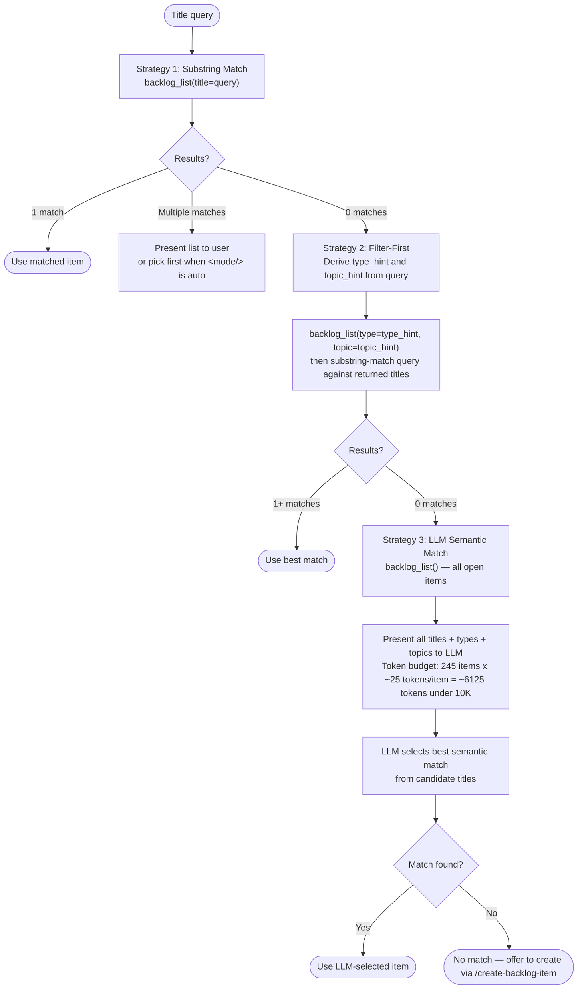

# Find the Backlog Item — 3-Strategy Fallback Chain

**Bypass:** If <mode/> is `#N`, a bare number, or a GitHub issue URL — skip this step and go
to [issue-first.md](./issue-first.md). Those inputs resolve via `backlog_view` directly; no matching strategy is needed.

Apply the following 3-strategy fallback chain. Move to the next strategy only when the current
strategy returns zero matches.

## Strategy 1 — Substring Match

Call `backlog_list(title=query)`. The `title` parameter performs a case-insensitive substring
match server-side. If exactly one item is returned, use it. If multiple items are returned,
present a numbered list and ask the user to choose (when <mode/> is `auto`, pick the first). If zero
items are returned, proceed to Strategy 2.

## Strategy 2 — Filter-First

Derive filter hints from the query before calling `backlog_list`:

**`type_hint`**: scan query words for keyword groups (case-insensitive):

- `bug`, `fix`, `broken`, `error` → `Bug`
- `feature`, `add`, `new`, `implement` → `Feature`
- `refactor`, `clean`, `restructure` → `Refactor`
- no match → `None` (omit `type` parameter)

**`topic_hint`**: longest non-stop-word from the query, converted to kebab-case slug. If none
can be derived, omit the `topic` parameter.

Call `backlog_list(type=type_hint, topic=topic_hint)` (omit any `None` parameters). Then
perform a case-insensitive substring match of the original query against the `title` field of
each returned entry. Items whose titles contain the query substring are candidates.

The `type` and `topic` filters compose with AND logic. Items missing the filtered metadata field
are excluded when that filter is active.

## Strategy 3 — LLM Semantic Match

Call `backlog_list()` with no filters to load all open items. Each returned item includes
`title`, `type`, and `topic` fields. Read the full list in the current context and select the
item whose title, type, and topic best match the intent of the query. The token cost is bounded:
**245 items × ~25 tokens/item ≈ 6,125 tokens (under 10K budget)**. If two or more candidates
are plausible, read their per-item files via `backlog_view` before choosing.

**Tiebreaker rule** — applied in order when two or more candidates remain equally plausible after reading `backlog_view`:

1. **Priority**: select the candidate in the highest priority section — P0 > P1 > P2 > Ideas.
2. **Age**: if still tied, select the candidate with the earliest `added` date (oldest item first).
3. **Title overlap**: if `added` is absent or identical, select the candidate whose `title` has the highest character-level overlap with the query string (count characters shared in sequence order).
4. **List order**: if all three tiebreakers are equal, select the first candidate in the order returned by `backlog_list` and log: `[STRATEGY3-TIE] Selected {title} — all tiebreakers equal, using list order.`

When <mode/> is `auto`, apply the tiebreaker silently and log: `[AUTO] Strategy 3 tiebreaker applied — rule {N}: selected {title}.`

## Zero-match handling after all 3 strategies

- **Interactive mode:** report "No backlog item found matching: {title}" and offer to create one
  via `/create-backlog-item`.
- **When <mode/> is `auto`:** log `[AUTO] No item found — invoking create-backlog-item --auto {title}`,
  invoke `Skill(skill: "create-backlog-item", args: "--auto {title}")`, then re-run this step.
