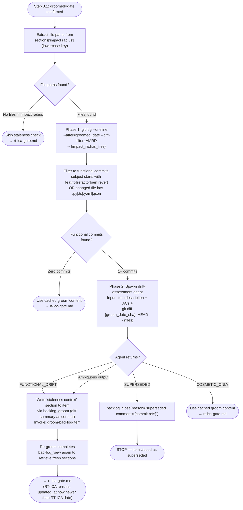

# Auto-Groom Check (Step 3.1)

## Ungroomed items

If the `groomed` field in the `backlog_list` output is absent or empty (item not yet groomed):

```text
Skill(skill: "groom-backlog-item", args: "{item title}")
```

The groom skill writes groomed content via the backlog MCP server. After grooming completes — including any BLOCKED/resolution cycles during the RT-ICA assessment — call `backlog_view` again to retrieve the groomed sections and proceed immediately to [rt-ica-gate.md](./rt-ica-gate.md). Do not stop or wait for re-invocation.

## Groomed items — staleness check

If `groomed` contains a date string (`YYYY-MM-DD`), do NOT consume cached groom content immediately.
Run the two-phase staleness check before proceeding.

**Note**: This taxonomy (FUNCTIONAL_DRIFT / SUPERSEDED / COSMETIC_ONLY) applies only to this step.
The Step 2.5 drift-check taxonomy (Scope change / Partial fix / New callers / File moved / No impact)
is a separate check at a different stage and is not unified with this one.

### Extract Impact Radius files

Call `mcp__plugin_dh_backlog__backlog_view(selector="{title}", summary=false)`.
Extract file paths from `response["sections"]["impact radius"]` (key is lowercase).
Use a regex to find all path-like tokens (e.g., `\S+\.\w+` patterns or lines beginning with a path segment).

If the `impact radius` section is absent or contains no file paths:
skip Phase 1 and Phase 2 — proceed directly to [rt-ica-gate.md](./rt-ica-gate.md) with cached groom content.

Record the extracted paths as `{impact_radius_files}` (space-separated list for git CLI).
Record the `groomed` date string as `{groomed_date}` (format `YYYY-MM-DD`).

### Phase 1 — Drift detection

Run:

```bash
git log --oneline --after="{groomed_date}" --diff-filter=AMRD -- {impact_radius_files}
```

Filter the output to **functional commits** only. A commit is functional if either condition is true:

- Its subject line begins with one of: `feat`, `fix`, `refactor`, `perf`, `revert` (conventional commit type prefix before `:`)
- OR any of the changed files has extension `.py`, `.ts`, `.yaml`, or `.json`

If zero qualifying commits remain after filtering → skip Phase 2.
Log: `[STALENESS] Phase 1: 0 functional commits since {groomed_date} — using cached groom content.`
Proceed directly to [rt-ica-gate.md](./rt-ica-gate.md).

If one or more qualifying commits exist → proceed to Phase 2.



### Phase 2 — Drift assessment

Find the SHA for the groom date:

```bash
git rev-list -1 --before="{groomed_date} 23:59:59" HEAD
```

Record as `{groom_date_sha}`. If the command returns empty (no commits before that date), fall back
to `--after={groomed_date}` date-based filtering only in the diff command below.

Spawn an agent with the following inputs:

- The item's full description (from `backlog_view` `description` field)
- The item's acceptance criteria (from `sections['acceptance criteria']`)
- The output of: `git diff {groom_date_sha}..HEAD -- {impact_radius_files}`

The agent must return **exactly one** of these tokens:

| Token | Meaning |
|---|---|
| `FUNCTIONAL_DRIFT` | The diff changes feasibility, approach, architecture, or goals of the item |
| `SUPERSEDED` | The diff implements what the item describes — the work is already done |
| `COSMETIC_ONLY` | The diff does not affect the item's goals — cached content remains valid |

If the agent returns ambiguous or unrecognised output: treat as `FUNCTIONAL_DRIFT` (conservative).

**When <mode/> is `auto`**: the agent spawned for Phase 2 must derive its classification from the diff content
without AskUserQuestion. Log: `[AUTO] STALENESS Phase 2: {TOKEN} — {one-line reason from diff}`.

### Phase 2 actions by token

**FUNCTIONAL_DRIFT:**

1. Write the diff summary as the `staleness context` section via MCP:

   ```text
   mcp__plugin_dh_backlog__backlog_groom(
     selector="{title}",
     section="staleness context",
     content="Staleness detected {today}: functional commits since {groomed_date}.\n\n{diff summary — key changed interfaces, renamed functions, added/removed files}\n\nCommits:\n{list of qualifying commit one-liners}"
   )
   ```

2. Invoke re-groom:

   ```text
   Skill(skill: "groom-backlog-item", args: "{item title}")
   ```

3. After re-groom completes, call `backlog_view` again to retrieve fresh sections.
4. Proceed to [rt-ica-gate.md](./rt-ica-gate.md). RT-ICA will re-run automatically because `updated_at` is now
   newer than the RT-ICA section date.

**SUPERSEDED:**

```text
mcp__plugin_dh_backlog__backlog_close(
  selector="{title}",
  reason="superseded",
  comment="Goal already implemented by commits since groom date: {commit sha list}"
)
```

Stop. Do not proceed to RT-ICA or any planning steps.

**COSMETIC_ONLY:**

Log: `[STALENESS] Phase 2: COSMETIC_ONLY — cached groom content valid.`
Proceed to [rt-ica-gate.md](./rt-ica-gate.md) with cached sections unchanged.
