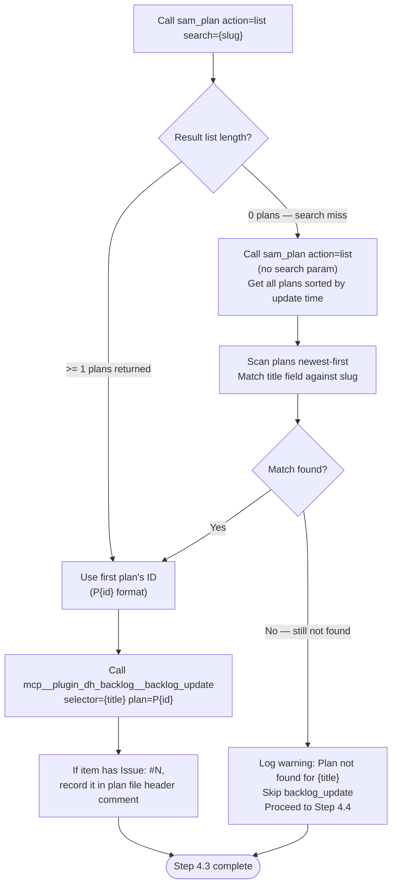
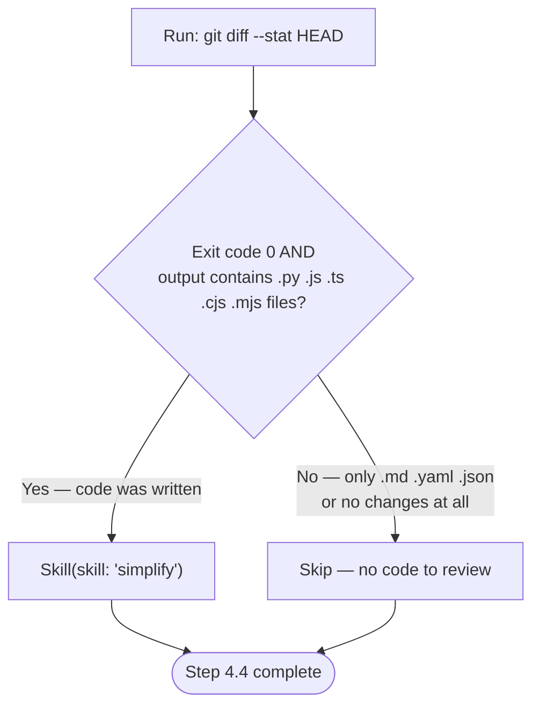
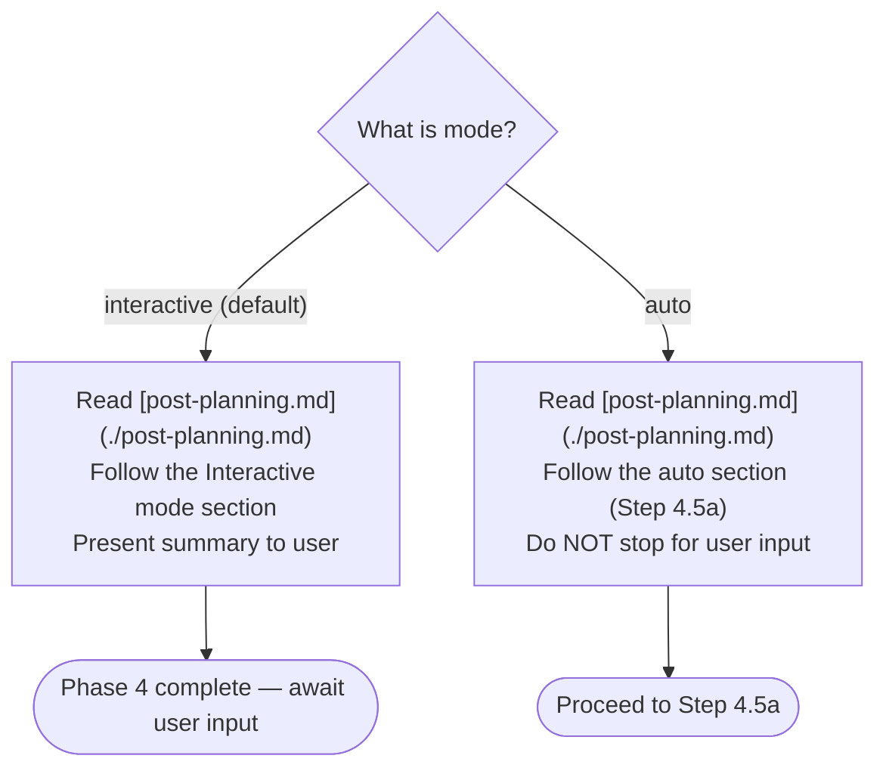

# Work: Plan (Phase 4)

**Outcome:** Feature request composed, SAM task plan created and registered, backlog item linked to plan, code reviewed — plan artifact ready for implementation dispatch.

**Actor:** Orchestrator (the agent executing `/dh:work-backlog-item`)

## Step 4.1: Compose Feature Request

**Trigger:** RT-ICA APPROVED (Step 3.2) and feasibility PASS (Step 3.4).

**Action:** Read [feature-request.md](./feature-request.md) to extract the feature request template, Impact Radius section from Step 2 grooming output, Ecosystem Completeness Constraint, and language/stack detection flags. Assemble these into a complete feature request string.

**Success:** Feature request string contains all required sections from template, Impact Radius data populated, language/stack flags set.

**On failure:** If Impact Radius section is missing from grooming output, report BLOCKED — cannot proceed without affected systems inventory.

## Step 4.2: Invoke SAM Planning

**Action:** Invoke the SAM planning skill with the composed feature request:

```text
Skill(skill: "dh:add-new-feature", args: "{composed feature request}")
```

This runs the full SAM workflow: discovery, codebase analysis, architecture spec, task decomposition, validation, context manifest.

**Success:** Skill returns without error. A new SAM task plan file exists in the SAM MCP server's plan storage.

**On failure:** If skill returns error or throws exception, report BLOCKED with the error message — cannot proceed without a valid plan.

## Step 4.3: Update Backlog with Plan Reference

**Action:** Link the created SAM plan to the backlog item using this search-and-link protocol:

### 4.3.1: Search for Plan

Compute slug: lowercase item title, replace spaces with hyphens.

```python
slug = item_title.lower().replace(" ", "-")
```

Call `mcp__plugin_dh_sam__sam_plan(config={"action": "list", "search": "{slug}"})`.

**Branch:**



**Success:** `backlog_update` returns success, plan field set to `P{id}`.

**Partial success:** Plan not found after full search — warning logged, Step 4.4 proceeds.

**On failure:** If `backlog_update` returns error, report BLOCKED with error message — plan link is mandatory for dispatch.

### 4.3.2: Record Issue Number

If the backlog item body contains `**Issue**: #N`, write a comment in the plan file header:

```yaml
# Issue: #N
```

**Constraint:** Do NOT include `Fixes #N`, `Closes #N`, or `Resolves #N` in task-level commit messages. Issue closure is handled exclusively by `/dh:complete-implementation` in its final commit step.

## Step 4.4: Simplify

**Action:** Run code review skill only when source code was modified during this session. Planning-only sessions (plan artifacts, backlog items, documentation) do not need code review.



**Success (code path):** `simplify` skill completes without error. Any identified issues are fixed and committed.

**Success (skip path):** No source code changes detected — review not applicable.

**On failure:** If `simplify` identifies issues and user rejects the fixes, report BLOCKED — code quality gate not passed.

## Step 4.5: Post-Planning Output

**Action:** Present planning results to user or continue to implementation based on mode.



**Success (interactive mode):** Summary presented to user. Phase 4 complete.

**Success (auto mode):** Control passes to Step 4.5a (auto-continue to implementation).

**On failure:** If post-planning output generation fails, report error but do not block — plan artifact exists and is usable.
