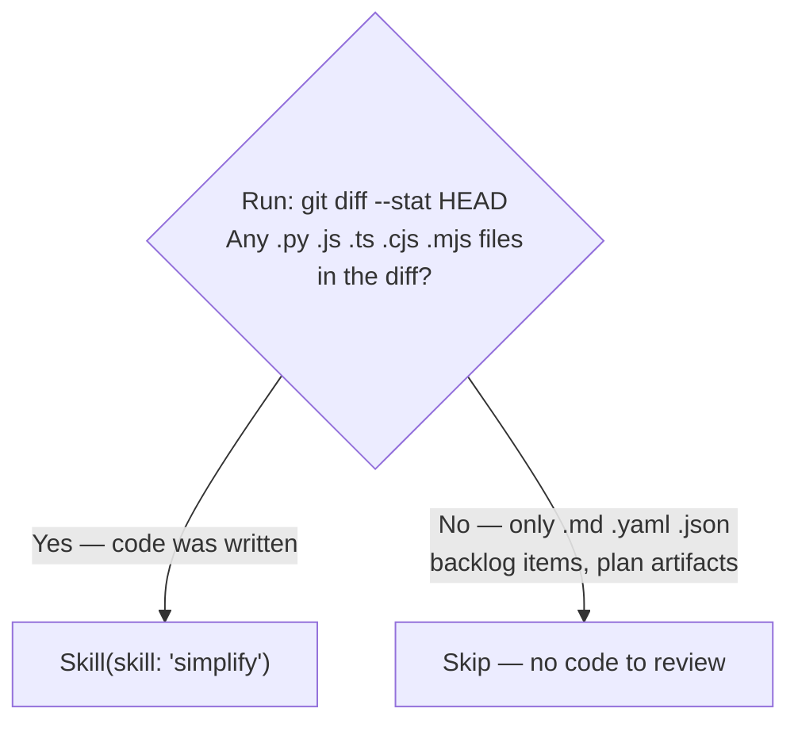

# Work: Plan (Phase 4)

Compose the feature request, invoke SAM planning, update backlog.

## Step 4.1: Compose Feature Request

**Trigger:** RT-ICA APPROVED (Step 3.2) and feasibility PASS (Step 3.4).

Load [feature-request.md](./feature-request.md) for Impact Radius extraction, Ecosystem Completeness Constraint, template, and language/stack flags.

## Step 4.2: Invoke SAM Planning

```text
Skill(skill: "add-new-feature", args: "{composed feature request}")
```

This runs the full SAM workflow: discovery, codebase analysis, architecture spec, task decomposition, validation, context manifest.

## Step 4.3: Update Backlog with Plan Reference

After `add-new-feature` completes, identify the task plan it created by calling `mcp__plugin_dh_sam__sam_plan(config={"action": "list", "search": "{slug}"})` where `{slug}` is the item title lowercased with spaces replaced by hyphens. The SAM MCP server manages plan storage — do not search the filesystem directly.

If `sam_plan(action='list')` returns an empty list, call `sam_plan(config={"action": "list"})` with no search argument and scan the
most-recently-updated plan for a title matching the item slug. If still not found, log a
warning and skip the `backlog_update` — do not block Step 4.4.

Call the `mcp__plugin_dh_backlog__backlog_update` tool to add the Plan:

| Parameter | Value |
|-----------|-------|
| `selector` | `"{title}"` |
| `plan` | `"P{NNN}"` (plan address — backend signal, not a file path) |

If the item has `**Issue**: #N`, record it in the plan file header comment. Do NOT include `Fixes #N`, `Closes #N`, or `Resolves #N` in task-level commit messages — issue closure is handled exclusively by `/complete-implementation` in its final commit step.

## Step 4.4: Simplify

Run the simplify skill only when source code was modified during this session. Planning-only sessions (plan artifacts, backlog items, documentation) do not need code review.



## Step 4.5: Post-Planning Output

- **Interactive mode**: Load [post-planning.md](./post-planning.md) for the report template.
- **When <mode/> is `auto`**: Load [post-planning.md](./post-planning.md) for the continuation procedure.
