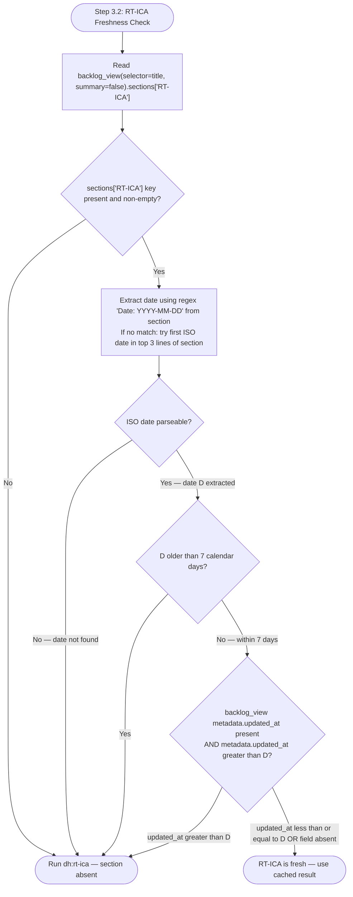

# RT-ICA Gate (Step 3.2)

## RT-ICA Staleness Policy

An RT-ICA result is stale and must be re-run if either condition is true: (a) the `Date:` header in the RT-ICA section is older than 7 calendar days, or (b) the item's `metadata.updated_at` field is newer than the RT-ICA section date. A stale RT-ICA result is treated as absent — `dh:rt-ica` is re-run before proceeding to [feasibility-gate.md](./feasibility-gate.md). The 7-day threshold applies regardless of whether the item description has changed, because codebase context may have changed even if the item text has not.



When the flowchart routes to "Run dh:rt-ica":

```text
Skill(skill: "dh:rt-ica")
```

Log re-run reason: `RT-ICA re-run: {staleness reason — date older than 7 days / updated_at
newer than RT-ICA date}` to the item's RT-ICA section as a prefix before the new result.

- **Present and fresh** — use the APPROVED/BLOCKED decision from the cached result. Carry DERIVABLE items forward as "Assumptions to confirm" in the feature request.
- **BLOCKED** — stop. Do not proceed to [feasibility-gate.md](./feasibility-gate.md) until all MISSING conditions are resolved.
