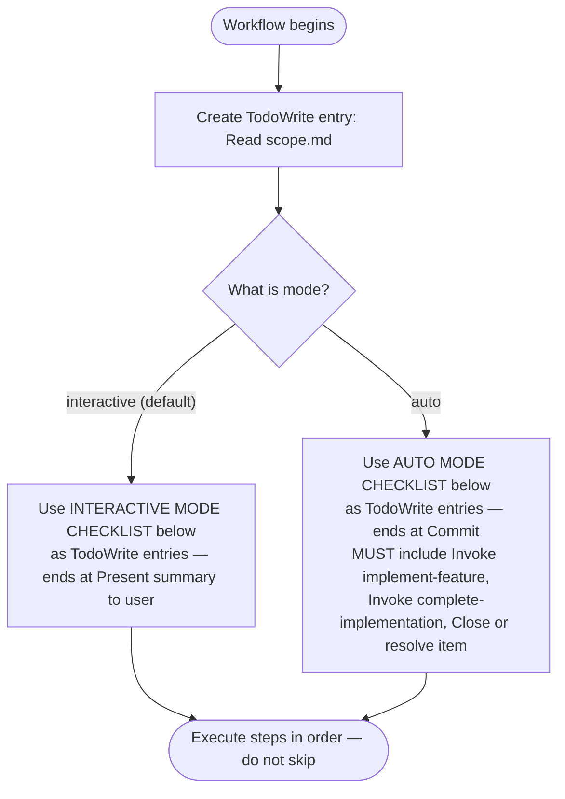

# Workflow: Work Backlog Item

Read [scope.md](./scope.md) before proceeding. All work actions operate within that scope boundary.

## Checklist

**At workflow start, create a TodoWrite checklist using the NUMBERED CHECKLIST for your mode (below the routing diagram) before executing any step. Use the numbered checklist items as the TodoWrite entries — not the Mermaid step names, which are summaries only.**

The numbered checklist to use depends on `<mode/>`:



**Interactive mode checklist** — steps to add to TodoWrite when `<mode/>` is `interactive`:

1. [ ] Read [scope.md](./scope.md) — align all actions with the work scope boundary
2. [ ] **Locate** ([locate.md](./locate.md)) — find and extract the backlog item's fields
   - Step 2.1: Interactive browser (no arguments only)
   - Step 2.2: Issue-first path (`#N`, bare number, or URL)
   - Step 2.3: Find by title substring
   - Step 2.4: Extract item fields
   - If item already has a Plan field: invoke `Skill(skill: "dh:implement-feature", args: "{plan_address}")` and stop
3. [ ] **Validate** ([validate.md](./validate.md)) — verify item state and sync with GitHub
   - Step 3.1: Already-implemented check
   - Step 3.2–3.4: GitHub issue sync, creation, in-progress label
   - Step 3.5: Discovery gate (feature/refactor items only)
   - If discovery gate STOP: report and stop
4. [ ] **Prepare** ([prepare.md](./prepare.md)) — groom if needed, RT-ICA gate, feasibility gate
   - Step 4.1: Auto-groom (if needed)
   - Step 4.2: RT-ICA gate — if BLOCKED, stop and present MISSING conditions
   - Step 4.3: RT-ICA date stamp
   - Step 4.4: Feasibility gate — if BLOCKED, stop
5. [ ] **Plan** ([plan.md](./plan.md)) — compose feature request and invoke SAM planning
   - Step 5.1: Compose feature request
   - Step 5.2: Invoke SAM planning via `Skill(skill: "dh:add-new-feature", args: "{feature_request}")`
   - Step 5.3: Update backlog with plan reference
   - Step 5.4: Simplify (code changes only)
   - Step 5.5: Load [post-planning.md](./post-planning.md) for the interactive summary template
6. [ ] **Present summary to user** — output the planning summary report from post-planning.md
7. [ ] **Commit** — if running in a worktree, commit all changes before closing (`git add -A && git commit -m "<type>(<scope>): <description>"`)

**Auto mode checklist** — steps to add to TodoWrite when `<mode/>` is `auto`:

1. [ ] Read [scope.md](./scope.md) — align all actions with the work scope boundary
2. [ ] **Locate** ([locate.md](./locate.md)) — find and extract the backlog item's fields (same sub-steps as interactive)
3. [ ] **Validate** ([validate.md](./validate.md)) — verify item state and sync with GitHub (same sub-steps as interactive)
4. [ ] **Prepare** ([prepare.md](./prepare.md)) — groom if needed, RT-ICA gate, feasibility gate (same sub-steps as interactive)
5. [ ] **Plan** ([plan.md](./plan.md)) — compose feature request and invoke SAM planning (Steps 5.1–5.4; Step 5.5 runs the auto-mode branch: continue to step 6 without stopping)
6. [ ] **Invoke implement-feature** — `Skill(skill: "dh:implement-feature", args: "{plan_address}")` — do not stop for user input
7. [ ] **Invoke complete-implementation** — `Skill(skill: "dh:complete-implementation", args: "{plan_address}")` — do not stop for user input
8. [ ] **Verify issue resolved** — `/dh:complete-implementation` calls `backlog_resolve` as its terminal step. Verify the issue is now closed. If it remains open (e.g., `complete-implementation` was interrupted), use `/work-backlog-item resolve` as fallback (see [post-planning.md](./post-planning.md)).
9. [ ] **Commit** — if running in a worktree, commit all changes before closing (`git add -A && git commit -m "docs(workflow): update work backlog item instructions"`)

## Error Routing

| Condition | Action |
|---|---|
| No item found matching input | Report "No backlog item found matching: {input}", stop |
| Item already implemented (Step 3.1) | Resolve via `backlog_resolve`, stop |
| Discovery gate STOP (Step 3.5) | Report failure, stop |
| RT-ICA BLOCKED (Step 4.2) | `backlog_update(selector='<item_ref/>', status='blocked')`, present MISSING conditions, stop |
| Feasibility gate BLOCKED (Step 4.4) | Report BLOCKED output, stop |

### STOP Notification Protocol

When any step terminates with STOP or BLOCKED:

1. Report the stop reason to the user with the step name, <item_ref/>, and specific failure details
2. Ask:

```text
Work stopped at {step} for <item_ref/>: {reason}

Would you like me to run a diagnostic agent to check the agent session logs
and identify the last error state?
```

3. If user accepts: spawn a diagnostic subagent to review the session transcript
4. If user declines: stop

## Inputs

| Input | Source | Required |
|---|---|---|
| <item_ref/> | Backlog item — `#N` format, bare number, URL, or title substring | Depends on <mode/> |
| <mode/> | `auto` or `interactive` (default: `interactive`) | No |
| <user_text/> | Additional context from the user, if any | No |

## Identifier Convention

<item_ref/> is the canonical backlog item identifier across all stages:

- Format: `#N` string (e.g., `"#1632"`)
- Used in: all MCP tool `selector` parameters
- Integer extraction: `issue_number = int(item_ref.lstrip('#'))` — for tools requiring `issue_number` (int)
