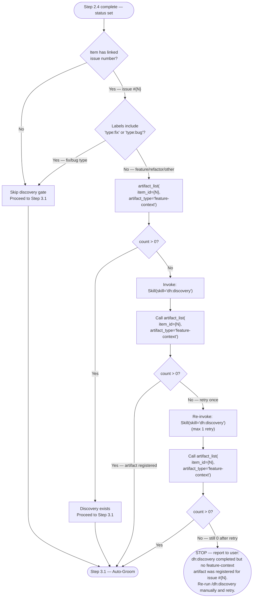

# Work: Validate (Phase 2)

Verify item state, sync issue link, and run discovery gate.

## Step 2.1: Already Implemented Check

Before planning, verify the feature/fix hasn't already been implemented (stale open item). Load [already-implemented.md](./already-implemented.md) for git commands, resolve calls, and behavior when <mode/> is `auto`.

## Step 2.2: Issue Link Check

After Step 1.4, check for `**Issue**: #N` in the matched item. Load [github-sync.md](./github-sync.md) for MCP tool calls, yes/no branching, and issue creation.

**Note:** On the Issue-first path (Step 1.2), the `backlog_view` response already contains issue state — carry it forward without re-fetching.

## Step 2.3: Create Linked Issue

Load [github-sync.md](./github-sync.md#step-23-create-linked-issue).

## Step 2.4: Set In-Progress

Load [github-sync.md](./github-sync.md#step-24-set-in-progress).

**Two-part step:** (a) Always run `mcp__plugin_dh_backlog__backlog_update` with `status="in-progress"` for the current item. (b) Run `milestone start` only on explicit user intent to start the whole milestone — it bulk-transitions all open milestone issues, not just the current one.

## Step 2.5: Discovery Gate

Before grooming or planning, check whether a structured discovery artifact exists.

The discovery skill gathers WHO/WHAT/WHEN/WHY requirements and registers the result as a
`feature-context` artifact. The exit signal is a non-zero count from
`artifact_list(item_id={N}, artifact_type='feature-context')`.

**When <mode/> is `auto`**: After `dh:discovery` returns, do NOT yield to the user. Immediately
call `artifact_list` to verify the artifact was registered, then proceed to Step 3.1 without
presenting a summary or asking for confirmation. The `dh:discovery` skill skips its user
confirmation gate when <mode/> is `auto` — no additional acknowledgment is needed.

**Interactive mode**: `dh:discovery` presents the ARTIFACT:DISCOVERY summary and requests user
confirmation before completing. After user confirmation, Step 3.1 (Auto-Groom) will detect the
artifact and pass it to the grooming swarm.
