# /work-milestone

Execute a groomed milestone. Reads the dispatch plan produced by `/groom-milestone`, creates an integration branch, spawns parallel kage-bunshin sessions (independent `claude -p` processes) per wave — each in its own worktree with full orchestrator capabilities (Agent tool, TeamCreate, all MCP servers). Sequentially merges their branches and lands the integration branch to main when all waves complete.

## Entry Conditions

- Milestone number provided as argument
- Dispatch plan exists: `plan/milestone-{N}-dispatch.yaml`
- All items in dispatch plan are groomed (`groomed: true`)
- Backlog MCP and SAM MCP responding
- Clean git state on main (if dirty, run `plugins/development-harness/scripts/prepare_clean_worktree.sh {integration-branch}` and accept/reject the stash prompt)

Run `/groom-milestone {N}` first if the dispatch plan is missing or stale.

## Main Workflow

```mermaid
flowchart TD
    Start(["Input: milestone number N"]) --> LoadPlan["Step 1: Load Dispatch Plan<br>Read plan/milestone-{N}-dispatch.yaml<br>Output: waves, conflict groups, quality gates"]

    LoadPlan --> Validate{"Step 2: Validate Plan<br>File exists?<br>All items still open?<br>Observable: file + backlog_list_issues(milestone=N)"}

    Validate -->|"Plan missing"| Block1(["BLOCKED — run /groom-milestone {N}"])
    Validate -->|"Items changed since groom"| Regroom["Re-run /groom-milestone {N}"]
    Validate -->|"Plan valid"| CreateBranch
    Regroom --> LoadPlan

    CreateBranch["Step 3: Create Integration Branch<br>github_branches create (GitHub backend only)<br>Fallback (beads backend): git checkout -b milestone/{N}-{slug} origin/main<br>Branch: milestone/{N}-{slug} — when backend=beads, N is the beads ID (e.g. bd-a3f8)<br>Switch to integration branch locally.<br>Run prepare_clean_worktree.sh before any worktree add."]

    CreateBranch --> FetchItems["Step 3b: Fetch All Items Once<br>Call backlog_view once per issue in the dispatch plan.<br>Store results in context keyed by issue number.<br>DO NOT call backlog_view again for any issue<br>already fetched this session."]

    FetchItems --> WaveLoop["Step 4: Wave Dispatch Loop<br>Read next wave from dispatch plan"]

    WaveLoop --> WaveItems{"Wave has items?"}
    WaveItems -->|"No waves remain"| Land

    WaveItems -->|"Yes"| CreateWorktrees["Step 5a: Create Worktrees<br>For each item in wave:<br>git worktree add worktrees/{slug}<br>from integration branch"]

    CreateWorktrees --> WriteLocks["Step 5b: Write Lock Files<br>For each worktree:<br>Write .claude/kage-bunshin.lock<br>(prevents recursive spawning)"]

    WriteLocks --> SpawnSessions["Step 5c: Spawn Kage-Bunshin Sessions<br>For each worktree: cd into it, then:<br>claude -p --model {model} [--effort {level}]<br>--permission-mode auto --output-format json<br>'Load /dh:work-backlog-item #{issue}'<br>Each session is a FULL orchestrator —<br>has Agent tool, TeamCreate, all MCP.<br>All sessions launch as background processes."]

    SpawnSessions --> WaitReturn["Step 6: Wait for All Sessions<br>Poll PIDs for exit.<br>Read result JSON from each<br>/tmp/kb-work-{issue}.json"]

    WaitReturn --> CheckResults{"Step 6a: Any sessions failed?"}
    CheckResults -->|"All succeeded"| ParseResults
    CheckResults -->|"Some failed"| InvestigateFail{"Fixable?"}
    InvestigateFail -->|"Yes"| FixRetry["Fix and re-spawn<br>failed item only"]
    FixRetry --> WaitReturn
    InvestigateFail -->|"No"| SkipFailed["Skip failed item<br>Log to output"]
    SkipFailed --> ParseResults

    ParseResults["Step 6b: Parse Completion Reports<br>Extract STATUS, BRANCH, FILES_CHANGED,<br>COMMITS, NOTES from each result JSON."]

    ParseResults --> MergeLoop["Step 6b: Merge Worktree Branches<br>Sequential merge into integration branch.<br>One at a time, in return order."]

    MergeLoop --> MergeResult{"Any merge conflicts?"}
    MergeResult -->|"All clean"| WaveComplete
    MergeResult -->|"Trivial/Medium conflict"| Resolve["Auto-resolve or spawn<br>conflict-resolution agent"]
    Resolve --> ResolveGates{"Resolution gates pass?"}
    ResolveGates -->|"Yes"| WaveComplete
    ResolveGates -->|"No"| EscalateConflict["Create backlog item<br>for conflict resolution.<br>Add to milestone."]

    MergeResult -->|"Heavy conflict (3+ files)"| EscalateConflict

    WaveComplete["Step 6c: Wave Complete<br>All branches merged.<br>Delete worktree branches."]

    WaveComplete --> DiscoveryRelay["Step 6d: Discovery Relay<br>Build relay document from agent outputs.<br>Include FILES_CHANGED, COMMITS, NOTES<br>in next wave agent prompts."]

    DiscoveryRelay --> PartialCheck{"Any agents returned PARTIAL?"}
    PartialCheck -->|"Yes"| HandlePartial["Create backlog items for<br>blocked tasks. Add to milestone."]
    PartialCheck -->|"No"| NextWaveCheck

    HandlePartial --> NextWaveCheck{"More waves?"}
    NextWaveCheck -->|"Yes"| WaveLoop
    NextWaveCheck -->|"No"| Land

    Land["Step 8: Land Integration Branch<br>Run full quality gate suite<br>pre_merge + post_merge"]

    Land --> FinalResult{"Gates pass?"}
    FinalResult -->|"Fail"| FinalFix["Spawn fix agent in worktree<br>on integration branch."]
    FinalFix --> Land

    FinalResult -->|"Pass"| MergeMain["Step 9: Merge to Main<br>git switch main<br>git merge --no-ff milestone/{N}-{slug}<br>git push origin main"]

    MergeMain --> Complete["Step 10: Complete Milestone<br>/complete-milestone {N}.<br>Delete integration branch.<br>Print pending auto-stash reminder(s)."]

    Complete --> Done(["Exit: milestone complete"])
```



## Step 3a: Prepare Clean Worktree Source State

Before Step 5 creates any worktree, run:

```bash
PREP="plugins/development-harness/scripts/prepare_clean_worktree.sh"
"$PREP" "${INTEGRATION_BRANCH}"
```

Behavior:

- If `git status --porcelain` is clean, continue silently.
- If dirty, prompt exactly: `Stash uncommitted changes? [y/N]`.
- On `y`, stash with message `dh-auto-stash: pre-run {integration-branch}` and record the stash ref in `~/.dh/projects/{slug}/context/auto-stashes.json` keyed by integration branch name.
- On `N` (or Enter), halt the run with a clear instruction to stash or commit manually before re-invoking `/work-milestone`.

## Step 3b: Fetch All Items Once (Before Any Wave)

Before entering the wave dispatch loop, call `backlog_view` **once per issue** listed across all waves in the dispatch plan. Store each result in context keyed by issue number.

**Fetch-once rule**: Do NOT call `backlog_view` for the same issue more than once per session. Use the already-fetched data for all subsequent references — wave loop iterations, discovery relay construction, result reporting. If an item's state genuinely changes (e.g., after a `backlog_update` call), replace the cached value with a single new `backlog_view` call for that issue only.

Pass the fetched data (title, AC, description) into spawned session prompts directly rather than having each spawned session re-fetch — see Step 5c prompt construction.

## Dispatch Step (Step 5 Detail)

All items in a wave are independent by construction (guaranteed non-overlapping by the conflict group analysis in the dispatch plan). Each item gets its own worktree and its own kage-bunshin session — an independent `claude -p` process with full orchestrator capabilities.

### Why Kage-Bunshin Instead of TeamCreate

Teammates and subagents do NOT have the Agent tool. The `/work-backlog-item` flow is an orchestration skill that needs to spawn sub-agents (feature-researcher, codebase-analyzer, python-cli-architect, etc.). A teammate running `/work-backlog-item` is BLOCKED at the first agent delegation step.

A kage-bunshin session is an independent `claude` CLI process — a full orchestrator that inherits all MCP servers, skills, plugins, and agents from the project directory. It CAN use Agent tool and TeamCreate internally.

### Worktree + Session Setup Per Item

Use the kage-bunshin spawn script — it handles worktree creation, `.venv`/`node_modules` symlinking, lock file writing, and process launch:

```bash
SPAWN="plugins/development-harness/skills/kage-bunshin/scripts/spawn.py"
MODEL="${MODEL:-sonnet}"
PIDS=()
SPAWN_INFO=()

for ISSUE in "${WAVE_ISSUES[@]}"; do
  OUTPUT=$($SPAWN --worktree \
    --branch "${INTEGRATION_BRANCH}" \
    --name "work-item-${ISSUE}" \
    --model "${MODEL}" \
    "Load /dh:work-backlog-item #${ISSUE}. Execute the full work flow. \
     You are in a worktree on integration branch ${INTEGRATION_BRANCH}. \
     Use MCP tools for plan artifact discovery — plan/ files are in the root worktree. \
     Prior wave context: ${DISCOVERY_RELAY}")
  PIDS+=($(echo "$OUTPUT" | python3 -c "import sys,json; print(json.load(sys.stdin)['pid'])"))
  SPAWN_INFO+=("$OUTPUT")
done
```

### What the Spawned Session Gets

**Via the prompt:**

- Issue number (from dispatch plan wave item)
- Integration branch name (from dispatch plan)
- Discovery relay content from prior waves (orchestrator-accumulated, empty for wave 1)
- Instruction to use MCP for artifact discovery

**Via capability inheritance (automatic):**

- All MCP servers (backlog, SAM, artifact registry)
- All skills (including `/dh:work-backlog-item` which it loads and executes)
- All agent types (it CAN and WILL spawn sub-agents as needed)
- Full tool access (Agent, TeamCreate, Read, Write, Edit, Bash, etc.)

**Via self-discovery (the session does this itself):**

- Groomed description and acceptance criteria — via `backlog_view(selector="#{issue}")`
- Plan artifacts — via `artifact_list(issue_number={issue})` then `artifact_read(...)`
- SAM task plan — via `sam_plan` if a plan exists
- Skills to load — from `skills` field in SAM task metadata

### Monitoring and Result Collection

```bash
# Wait for all sessions in the wave to exit
for i in "${!PIDS[@]}"; do
  wait "${PIDS[$i]}"
  EXIT_CODE=$?
  INFO="${SPAWN_INFO[$i]}"
  RESULT_FILE=$(echo "$INFO" | python3 -c "import sys,json; print(json.load(sys.stdin)['result_file'])")

  if [ $EXIT_CODE -eq 0 ] && [ -s "$RESULT_FILE" ]; then
    echo "$(python3 -c "import sys,json; d=json.load(sys.stdin); print(d.get('result','')[:200])" < "$RESULT_FILE")"
  else
    ERROR_FILE=$(echo "$INFO" | python3 -c "import sys,json; print(json.load(sys.stdin)['error_file'])")
    echo "FAILED (exit ${EXIT_CODE}): $(tail -5 "$ERROR_FILE")"
  fi
done
```

### Model Selection

The `--model` flag on the kage-bunshin controls the spawned session's orchestrator model only. Sub-agents spawned inside that session use their own model per their agent frontmatter definition.

Recommended: `--model sonnet` for spawned sessions (configurable via `dispatch_spawn` `model` parameter). Haiku viability as orchestrator is an open experiment. Use `--effort` to tune reasoning depth independently of model selection.

## Step 10 Reminder: Pending Auto-Stashes

After milestone completion, check `~/.dh/projects/{slug}/context/auto-stashes.json`. If there is a stash ref for the integration branch, print:

```text
Auto-stash ref {ref} pending; run 'git stash pop {ref}' to restore.
```

## Agent Result Handling


## Discovery Relay Between Waves

After all wave agents return, the orchestrator builds a relay document from their completion reports. This is injected as `discovery_relay_content` in the next wave's agent prompts.

```text
## Prior Wave Results

### Wave 1 Results

#### Item: #{issue1} — {title1}
- Status: COMPLETE
- Files changed: {file_list}
- Key commits:
  - {hash}: {message}
- Design notes: {notes_if_any}

#### Item: #{issue2} — {title2}
- Status: COMPLETE
- Files changed: {file_list}
- Key commits:
  - {hash}: {message}
```

Items in the same wave are guaranteed non-overlapping by the dispatch plan's conflict group analysis. The relay provides cross-wave awareness for items with `depends_on` relationships or shared conflict groups.

For milestones with 5+ waves, cap the relay at the most recent 3 waves.

## Merge Conflict Classification

| Conflict scope | Classification | Action |
|---|---|---|
| 0 files | Clean | Merge immediately |
| 1-2 files — whitespace or adjacent additions | Trivial | Auto-resolve, run gates |
| 1-2 files — same function edited differently | Medium | Spawn conflict-resolution agent |
| 1-2 files — file restructured by both worktrees | Heavy | Create backlog item for conflict resolution |
| 3+ files | Heavy | Abort merge, create backlog item |

Conflict resolution agent receives both branches' diffs and resolves in-place on the integration branch. No PRs are created for worktree branches — they are local-only, never pushed to origin.

## Tools Used

| Tool | Purpose |
|---|---|
| `read_dispatch_plan` | Read `plan/milestone-{N}-dispatch.yaml` |
| `dispatch_wave_start` | Register wave + items in dispatch state DB before spawning (Step 5) |
| `dispatch_spawn` | Background MCP task that launches parallel kage-bunshin sessions for a wave (Step 5c) |
| `dispatch_wave_status` | Poll wave progress and detect stale PIDs (Step 6) |
| `dispatch_item_status` | Called by spawned sessions to record completion or failure |
| `git worktree add` | Create isolated worktree per wave item |
| `claude -p` (kage-bunshin) | Spawn independent orchestrator session per item — has Agent tool, TeamCreate, all MCP |
| `backlog_view` | Read item description, AC, design decisions (used by spawned sessions) |
| `artifact_list` | Discover plan artifacts registered for an issue (used by spawned sessions) |
| `artifact_read` | Read plan artifact content from root worktree via MCP (used by spawned sessions) |
| `sam_plan` | Read SAM task plan for an item (used by spawned sessions) |
| `sam_plan` | Check whether item has a SAM plan (used by spawned sessions) |
| `github_branches create` | Create integration branch (**GitHub backend only** — use `git checkout -b` when `backend=beads`) |
| `github_branches merge` | Merge worktree branch into integration branch (**GitHub backend only** — use `git merge` when `backend=beads`) |
| `github_branches delete` | Delete integration branch after landing (**GitHub backend only** — use `git branch -d` when `backend=beads`) |
| `run_quality_gates` | Execute gate commands from dispatch plan |
| `backlog_list_issues(milestone=N)` | Validate plan against current item state |

## Error Conditions

- **Dispatch plan missing**: BLOCKED — direct to `/groom-milestone {N}`
- **Items changed since groom**: re-run `/groom-milestone {N}` to regenerate plan
- **Backlog MCP unavailable**: PROCESS ERROR — report with exact error text
- **SAM MCP unavailable**: PROCESS ERROR — report with exact error text
- **Integration branch already exists**: check for stale branch (no commits in 7+ days) — offer to delete and recreate, or resume
- **Kage-bunshin session exited non-zero**: read error log, investigate if fixable, re-spawn if yes, skip item if no
- **Kage-bunshin result contains PARTIAL status**: create backlog items for blocked tasks, add to milestone, continue with other items
- **All quality gates fail on integration branch**: escalate to user before landing
- **Main diverged during milestone work**: rebase integration branch onto main before landing

## References

- [Worktree Worker Protocol](./references/worktree-worker-protocol.md) — full worker lifecycle: setup, direct task execution, quality gates, completion report format, blocker handling, skill loading
- [Merge Queue Protocol](./references/merge-queue-protocol.md) — merge slot lifecycle, conflict classification, conflict-resolution agent, quality gate commands
