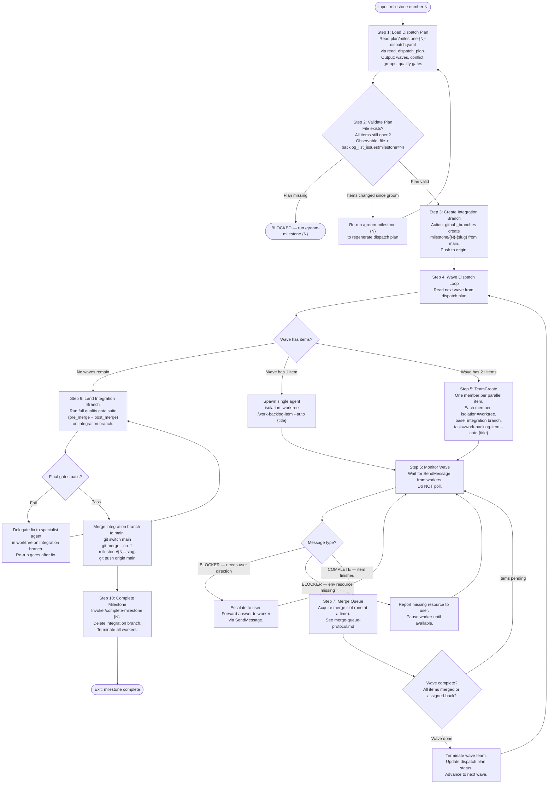
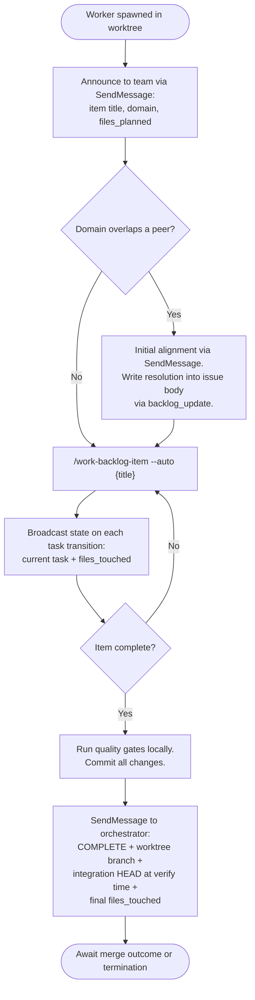
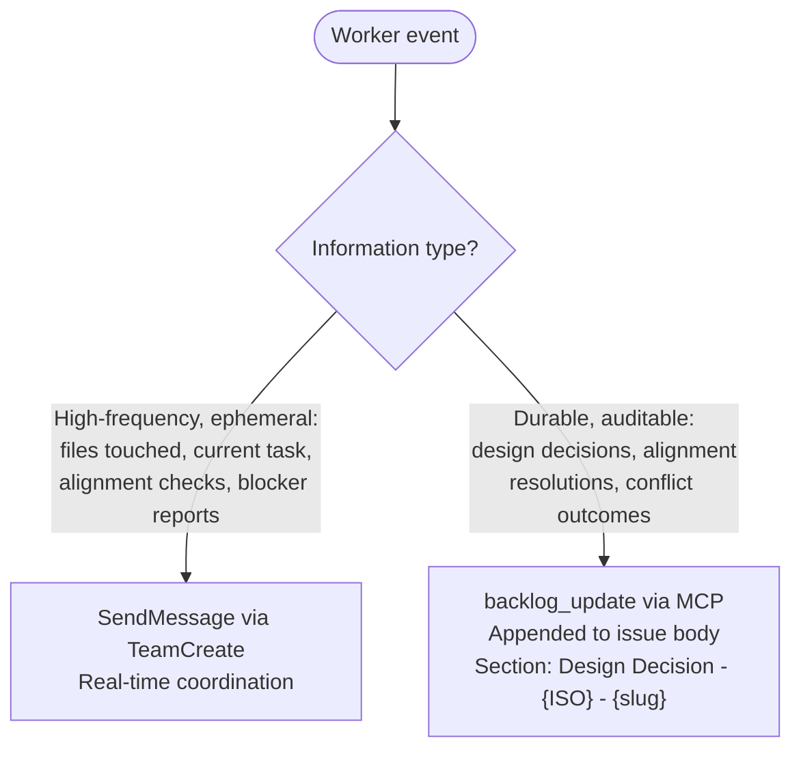
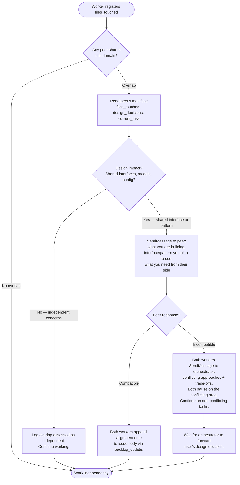

# /work-milestone

Execute a groomed milestone. Reads the dispatch plan produced by `/groom-milestone`, creates an integration branch, dispatches parallel workers per wave, serializes merges through a single merge slot, and lands the integration branch to main when all waves complete.

## Entry Conditions

- Milestone number provided as argument
- Dispatch plan exists: `plan/milestone-{N}-dispatch.yaml`
- All items in dispatch plan are groomed (`groomed: true`)
- Backlog MCP and sam CLI responding
- Clean git state on main

Run `/groom-milestone {N}` first if the dispatch plan is missing or stale.

## Main Workflow

## Team Member Protocol

Each worker runs in an isolated worktree on the integration branch. Full protocol: [team-member-protocol.md](./references/team-member-protocol.md).

Summary of member responsibilities:

## Inter-Worker Awareness

Workers share two types of information through different channels:

### Design Alignment Protocol

When two workers share a domain (same plugin directory or overlapping file paths), they coordinate before proceeding:

## Merge Queue

One merge proceeds at a time. The orchestrator holds the merge slot. Conflict classification and assign_back details: [merge-queue-protocol.md](./references/merge-queue-protocol.md).

Conflict severity at a glance:

| Conflict scope | Classification | Action |
|---|---|---|
| 0 files | Clean | Merge immediately |
| 1-2 files — whitespace or adjacent additions | Trivial | Auto-resolve, run gates |
| 1-2 files — same function edited differently | Medium | Auto-resolve attempt, run gates |
| 1-2 files — file refactored by both worktrees | Heavy | assign_back, create PR + resolution task |
| 3+ files | Heavy | assign_back, create PR + resolution task |

## Tools Used

| Tool | Purpose |
|---|---|
| `read_dispatch_plan` | Read `plan/milestone-{N}-dispatch.yaml` |
| `TeamCreate` | Spawn parallel workers per wave |
| `SendMessage` | Worker state broadcasts and blocker reports |
| `github_branches create` | Create integration branch |
| `github_branches merge` | Merge worktree branch into integration branch |
| `github_branches delete` | Delete integration branch after landing |
| `run_quality_gates` | Execute gate commands from dispatch plan |
| `backlog_list_issues(milestone=N)` | Validate plan against current item state |
| `backlog_update(selector, section, content)` | Persist design decisions to issue body |
| `backlog_view` | Read item state and design decisions |

## Error Conditions

- **Dispatch plan missing**: BLOCKED — direct to `/groom-milestone {N}`
- **Items changed since groom**: re-run `/groom-milestone {N}` to regenerate plan
- **Backlog MCP unavailable**: PROCESS ERROR — report with exact error text
- **sam CLI unavailable**: PROCESS ERROR — report with exact error text
- **Integration branch already exists**: check for stale branch (no commits in 7+ days) — offer to delete and recreate, or resume
- **Worker no heartbeat**: report crashed worker to user; identify last known task from context file
- **All quality gates fail on integration branch**: escalate to user before landing
- **Main diverged during milestone work**: rebase integration branch onto main before landing

## References

- [Team Member Protocol](./references/team-member-protocol.md) — full M1-M12 worker lifecycle, state broadcast fields, blocker types
- [Merge Queue Protocol](./references/merge-queue-protocol.md) — merge slot lifecycle, conflict classification, assign_back procedure, gate commands
