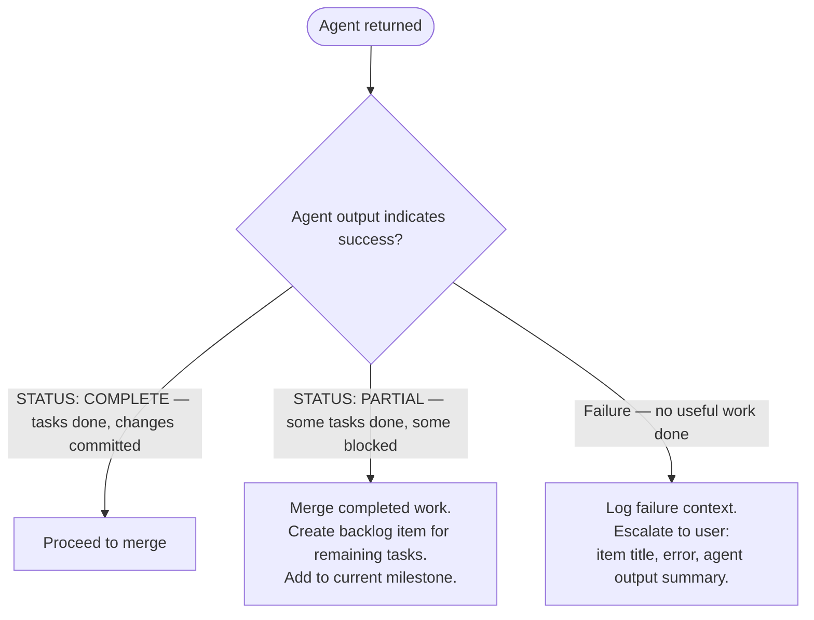

# /work-milestone

Execute a groomed milestone. Reads the dispatch plan produced by `/groom-milestone`, creates an integration branch, dispatches parallel worktree agents per wave, sequentially merges their branches, and lands the integration branch to main when all waves complete.

## Entry Conditions

- Milestone number provided as argument
- Dispatch plan exists: `plan/milestone-{N}-dispatch.yaml`
- All items in dispatch plan are groomed (`groomed: true`)
- Backlog MCP and SAM MCP responding
- Clean git state on main

Run `/groom-milestone {N}` first if the dispatch plan is missing or stale.

## Main Workflow

```mermaid
flowchart TD
    Start(["Input: milestone number N"]) --> LoadPlan["Step 1: Load Dispatch Plan<br>Read plan/milestone-{N}-dispatch.yaml<br>Output: waves, conflict groups, quality gates"]

    LoadPlan --> Validate{"Step 2: Validate Plan<br>File exists?<br>All items still open?<br>Observable: file + backlog_list_issues(milestone=N)"}

    Validate -->|"Plan missing"| Block1(["BLOCKED — run /groom-milestone {N}"])
    Validate -->|"Items changed since groom"| Regroom["Re-run /groom-milestone {N}"]
    Validate -->|"Plan valid"| CreateBranch
    Regroom --> LoadPlan

    CreateBranch["Step 3: Create Integration Branch<br>github_branches create<br>milestone/{N}-{slug} from main.<br>Switch to integration branch locally."]

    CreateBranch --> WaveLoop["Step 4: Wave Dispatch Loop<br>Read next wave from dispatch plan"]

    WaveLoop --> WaveItems{"Wave has items?"}
    WaveItems -->|"No waves remain"| Land

    WaveItems -->|"Yes"| PreDecompose["Step 5: Pre-Decompose Wave Items<br>For each item in wave:<br>- backlog_view for groomed description + AC<br>- sam_read for task plan (if exists)<br>- Aggregate skills from task metadata<br>- Build agent prompt from template"]

    PreDecompose --> SpawnAgents["Step 6: Spawn Worktree Agents<br>For each item: Agent(isolation: worktree)<br>with assembled prompt.<br>All items in wave launch in parallel."]

    SpawnAgents --> WaitReturn["Step 7: Wait for All Agents<br>Agent calls are synchronous.<br>Collect structured completion reports<br>from each agent output."]

    WaitReturn --> ParseResults["Step 7a: Parse Completion Reports<br>Extract STATUS, BRANCH, FILES_CHANGED,<br>COMMITS, NOTES from each agent."]

    ParseResults --> MergeLoop["Step 7b: Merge Worktree Branches<br>Sequential merge into integration branch.<br>One at a time, in return order."]

    MergeLoop --> MergeResult{"Any merge conflicts?"}
    MergeResult -->|"All clean"| WaveComplete
    MergeResult -->|"Trivial/Medium conflict"| Resolve["Auto-resolve or spawn<br>conflict-resolution agent"]
    Resolve --> ResolveGates{"Resolution gates pass?"}
    ResolveGates -->|"Yes"| WaveComplete
    ResolveGates -->|"No"| EscalateConflict["Create backlog item<br>for conflict resolution.<br>Add to milestone."]

    MergeResult -->|"Heavy conflict (3+ files)"| EscalateConflict

    WaveComplete["Step 7c: Wave Complete<br>All branches merged.<br>Delete worktree branches."]

    WaveComplete --> DiscoveryRelay["Step 7d: Discovery Relay<br>Build relay document from agent outputs.<br>Include FILES_CHANGED, COMMITS, NOTES<br>in next wave agent prompts."]

    DiscoveryRelay --> PartialCheck{"Any agents returned PARTIAL?"}
    PartialCheck -->|"Yes"| HandlePartial["Create backlog items for<br>blocked tasks. Add to milestone."]
    PartialCheck -->|"No"| NextWaveCheck

    HandlePartial --> NextWaveCheck{"More waves?"}
    NextWaveCheck -->|"Yes"| WaveLoop
    NextWaveCheck -->|"No"| Land

    Land["Step 8: Land Integration Branch<br>Run full quality gate suite<br>pre_merge + post_merge"]

    Land --> FinalResult{"Gates pass?"}
    FinalResult -->|"Fail"| FinalFix["Spawn fix agent in worktree<br>on integration branch."]
    FinalFix --> Land

    FinalResult -->|"Pass"| MergeMain["Step 9: Merge to Main<br>git switch main<br>git merge --no-ff milestone/{N}-{slug}<br>git push origin main"]

    MergeMain --> Complete["Step 10: Complete Milestone<br>/complete-milestone {N}.<br>Delete integration branch."]

    Complete --> Done(["Exit: milestone complete"])
```



## Pre-Decomposition (Step 5 Detail)

Before spawning agents for a wave, prepare context for each item:

1. **Read SAM task plan** — `sam_read(plan="P{N}")` if item has a plan. Extract task list with acceptance criteria.
2. **Read backlog item** — `backlog_view(selector="#{issue}")`. Extract groomed description and acceptance criteria.
3. **Aggregate skills** — Collect unique skill names from `skills` field across all tasks in the plan.
4. **Build agent prompt** — Assemble from the worktree agent prompt template below.

If no SAM plan exists, include groomed description and acceptance criteria only. The agent works from AC directly without task decomposition.

## Worktree Agent Prompt Template

Each worktree agent receives a prompt assembled by the orchestrator. The agent has no Agent tool — it cannot delegate to subagents. All work is executed directly.

```text
## Your Task

You are executing backlog item #{issue}: "{title}" inside an isolated git worktree
on the integration branch `{integration_branch}`.

You have NO Agent tool — you cannot delegate to subagents. Execute all work directly.
Commit your changes frequently using conventional commits: `type(scope): description`.

## Item Description

{groomed_description}

## Acceptance Criteria

{acceptance_criteria}

## Task Plan

{task_list_from_sam_plan_or_inline}

Execute each task sequentially. For each task:
1. Read the task's acceptance criteria
2. Implement the required changes
3. Run the task's verification commands (if any)
4. Commit the changes

## Skills to Load

{for each skill_name in skills_list}
Load the following skill before starting work:
- Skill(skill="{skill_name}")
{end for}

## Architecture Reference

{architect_spec_path — agent reads this file directly}

## Quality Gates

Before signaling completion, run these commands and fix any failures:
{for each command in pre_merge_gates}
- `{command}`
{end for}

## Prior Wave Context

{discovery_relay_content — empty for wave 1}

## Completion Protocol

When all tasks are complete and quality gates pass:
1. Ensure all changes are committed
2. Output a structured completion report:

   STATUS: COMPLETE
   BRANCH: {your worktree branch name}
   TASKS_COMPLETED: {count}
   FILES_CHANGED: {list of files}
   COMMITS: {list of commit hashes and messages}
   NOTES: {any design decisions or deviations}

If you encounter a blocker you cannot resolve:
1. Complete as many tasks as possible
2. Commit all completed work
3. Output:

   STATUS: PARTIAL
   BRANCH: {your worktree branch name}
   TASKS_COMPLETED: {count of completed}
   TASKS_BLOCKED: {count and IDs of blocked tasks}
   BLOCKER: {description of what blocked progress}
   FILES_CHANGED: {list of files}
   COMMITS: {list of commit hashes and messages}
```

### Template Variables

| Variable | Source | How Orchestrator Obtains It |
|---|---|---|
| `issue` | Dispatch plan wave item | `wave.items[i].issue` |
| `title` | Dispatch plan wave item | `wave.items[i].title` |
| `integration_branch` | Dispatch plan | `milestone.integration_branch` |
| `groomed_description` | Backlog MCP | `backlog_view(selector="#{issue}")` description section |
| `acceptance_criteria` | Backlog MCP | `backlog_view(selector="#{issue}")` AC section |
| `task_list_from_sam_plan` | SAM MCP | `sam_read(plan="P{N}")` tasks with acceptance criteria |
| `skills_list` | SAM task metadata | Aggregated from `skills` field across all tasks |
| `architect_spec_path` | SAM plan or backlog item | Path to `plan/architect-{slug}.md` |
| `pre_merge_gates` | Dispatch plan | `quality_gates.pre_merge` commands |
| `discovery_relay_content` | Orchestrator state | Collected from prior wave agent outputs |

## Agent Result Handling



## Discovery Relay Between Waves

After all wave agents return, the orchestrator builds a relay document from their completion reports. This is injected as `discovery_relay_content` in the next wave's agent prompts.

```text
## Prior Wave Results

### Wave 1 Results

#### Item: #{issue1} — {title1}
- Status: COMPLETE
- Files changed: {file_list}
- Key commits:
  - {hash}: {message}
- Design notes: {notes_if_any}

#### Item: #{issue2} — {title2}
- Status: COMPLETE
- Files changed: {file_list}
- Key commits:
  - {hash}: {message}
```

Items in the same wave are guaranteed non-overlapping by the dispatch plan's conflict group analysis. The relay provides cross-wave awareness for items with `depends_on` relationships or shared conflict groups.

For milestones with 5+ waves, cap the relay at the most recent 3 waves.

## Merge Conflict Classification

| Conflict scope | Classification | Action |
|---|---|---|
| 0 files | Clean | Merge immediately |
| 1-2 files — whitespace or adjacent additions | Trivial | Auto-resolve, run gates |
| 1-2 files — same function edited differently | Medium | Spawn conflict-resolution agent |
| 1-2 files — file restructured by both worktrees | Heavy | Create backlog item for conflict resolution |
| 3+ files | Heavy | Abort merge, create backlog item |

Conflict resolution agent receives both branches' diffs and resolves in-place on the integration branch. No PRs are created for worktree branches — they are local-only, never pushed to origin.

## Tools Used

| Tool | Purpose |
|---|---|
| `read_dispatch_plan` | Read `plan/milestone-{N}-dispatch.yaml` |
| `Agent(isolation: "worktree")` | Spawn parallel workers per wave |
| `backlog_view` | Read item description, AC, design decisions |
| `sam_read` | Read SAM task plan for an item |
| `sam_status` / `sam_list` | Check whether item has a SAM plan |
| `github_branches create` | Create integration branch |
| `github_branches merge` | Merge worktree branch into integration branch |
| `github_branches delete` | Delete integration branch after landing |
| `run_quality_gates` | Execute gate commands from dispatch plan |
| `backlog_list_issues(milestone=N)` | Validate plan against current item state |

## Error Conditions

- **Dispatch plan missing**: BLOCKED — direct to `/groom-milestone {N}`
- **Items changed since groom**: re-run `/groom-milestone {N}` to regenerate plan
- **Backlog MCP unavailable**: PROCESS ERROR — report with exact error text
- **SAM MCP unavailable**: PROCESS ERROR — report with exact error text
- **Integration branch already exists**: check for stale branch (no commits in 7+ days) — offer to delete and recreate, or resume
- **Agent returned PARTIAL status**: create backlog items for blocked tasks, add to milestone, continue with other agents
- **All quality gates fail on integration branch**: escalate to user before landing
- **Main diverged during milestone work**: rebase integration branch onto main before landing

## References

- [Worktree Worker Protocol](./references/worktree-worker-protocol.md) — full worker lifecycle: setup, direct task execution, quality gates, completion report format, blocker handling, skill loading
- [Merge Queue Protocol](./references/merge-queue-protocol.md) — merge slot lifecycle, conflict classification, conflict-resolution agent, quality gate commands
