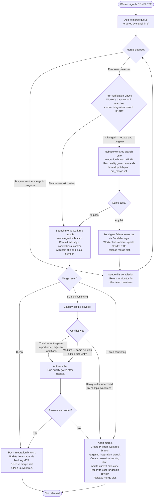
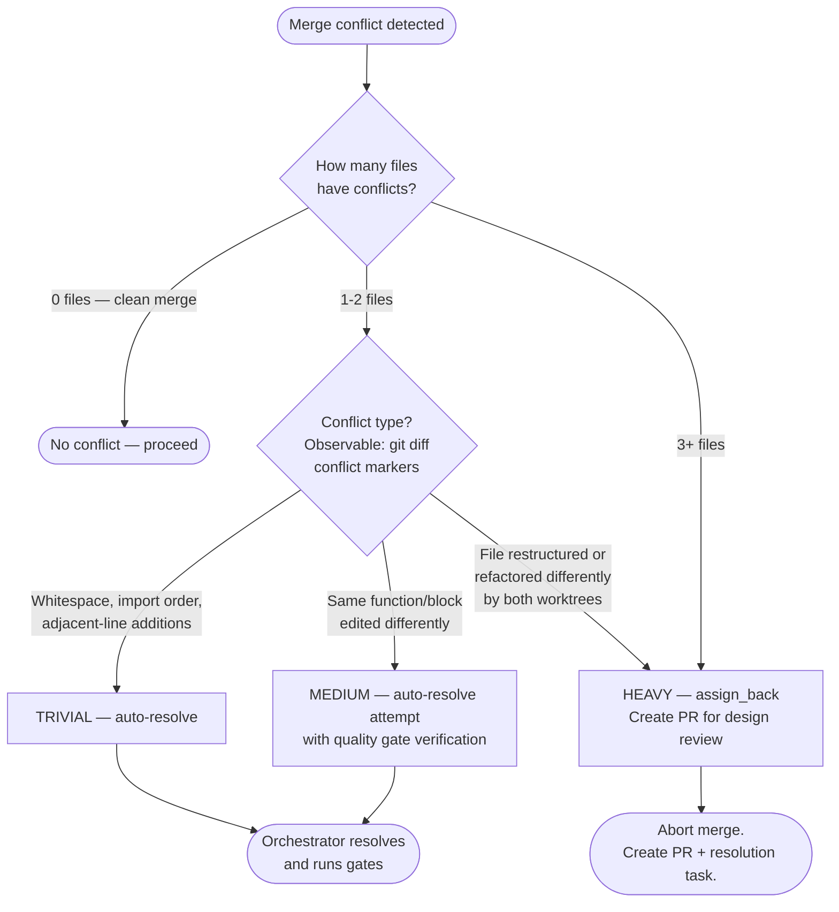

# Merge Queue Protocol

The orchestrator owns the merge slot. Only one merge proceeds at a time. Workers signal COMPLETE and wait for the merge outcome.

## Merge Slot Lifecycle



## Conflict Severity Classification



## Assign Back Details

When a heavy conflict triggers assign_back:

1. Abort the in-progress merge: `git merge --abort`
2. Push the worktree branch to origin (if not already pushed)
3. Create a PR from the worktree branch targeting the integration branch
4. Create a backlog item for the conflict resolution task:
   - Title: `Resolve merge conflict: {item A title} vs {item B title}`
   - Body: PR link, conflicting files list, both workers' approaches
   - Label: `conflict-resolution`
   - Assign to current milestone
5. SendMessage to both workers with the resolution task issue number
6. Report to user: PR link, resolution task link, conflict file list
7. Release merge slot

The resolution task is dispatched in the next wave like any other item. The team member implementing it has access to both original PRs and can make a design decision or implement a merge manually.

## Quality Gate Commands

Gate commands are defined in the dispatch plan under `quality_gates`:

```yaml
quality_gates:
  pre_merge:
    - "uv run prek run --all-files"
    - "uv run ruff check ."
  post_merge:
    - "uv run pytest tests/ -x"
```

`pre_merge` gates run before each individual item merge. `post_merge` gates run once on the full integration branch before landing to main.

A gate failure on an individual merge returns the failure output to the worker via SendMessage. The worker fixes the issue and re-signals COMPLETE.

A `post_merge` failure on the integration branch triggers a specialist agent delegation in a worktree on the integration branch. The orchestrator does not attempt self-repair.

## Integration Branch Landing

After all waves complete:

1. Run full `pre_merge` + `post_merge` gate suite on integration branch
2. If any gate fails: delegate fix to specialist agent, re-run gates
3. If all gates pass:

```bash
git switch main
git merge --no-ff milestone/{N}-{slug}
git push origin main
```

4. Delete integration branch: `git push origin --delete milestone/{N}-{slug}`
5. Invoke `/complete-milestone {N}`
