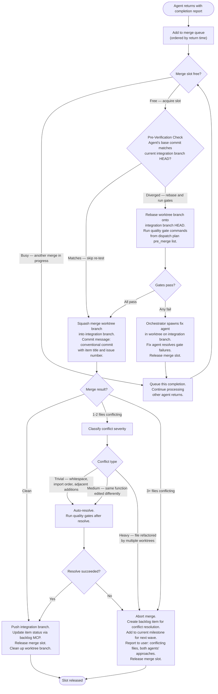
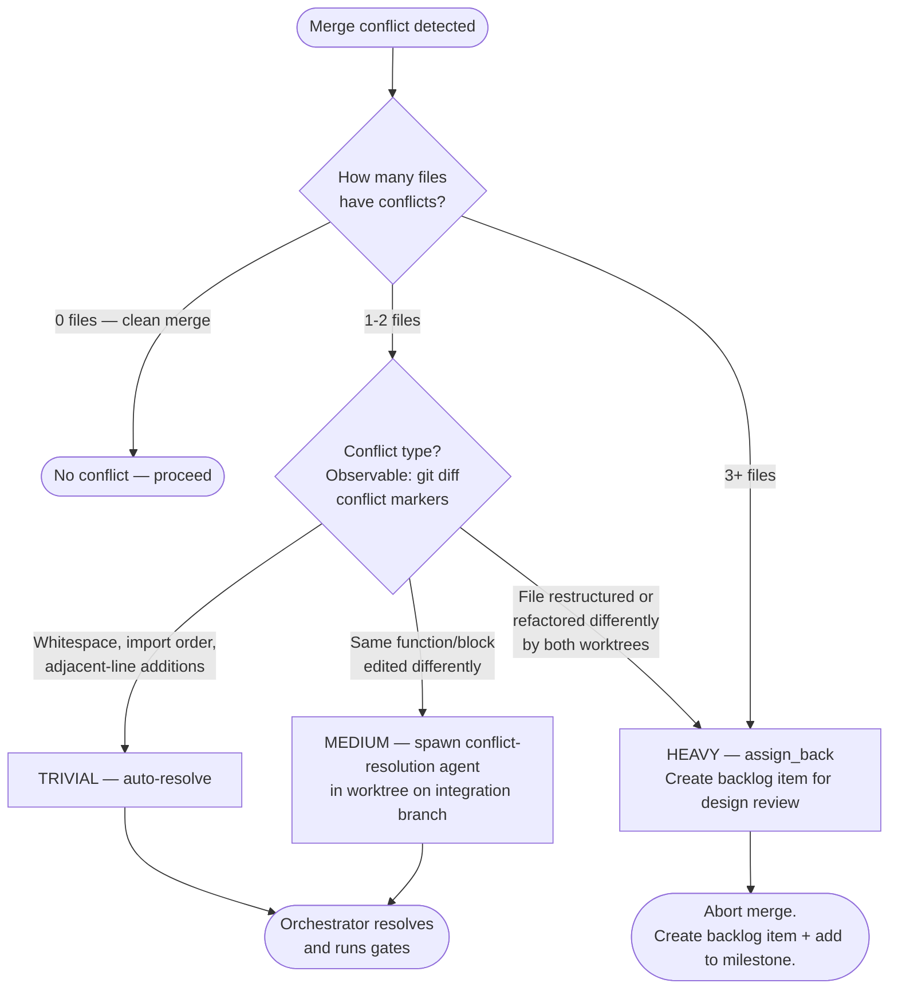

# Merge Queue Protocol

> **Signaling model**: Completion signaling is via Agent call return. Agents are synchronous
> from the orchestrator's perspective — the Agent tool call blocks until the agent finishes.
> The orchestrator merges worktree branches sequentially after all wave agents return.
> Workers do not exist between waves — each wave spawns fresh worktree agents that terminate on completion.

The orchestrator owns the merge slot. Only one merge proceeds at a time. Agents return when complete; the orchestrator processes returns sequentially.

## Merge Slot Lifecycle



## Conflict Severity Classification



## Assign Back Details

When a heavy conflict triggers assign_back:

1. Abort the in-progress merge: `git merge --abort`
2. Do NOT push the worktree branch — branches are local-only, never pushed to origin
3. Create a backlog item for the conflict resolution task:
   - Title: `Resolve merge conflict: {item A title} vs {item B title}`
   - Body: conflicting files list, both agents' approaches (from their completion reports), worktree branch names for reference
   - Label: `conflict-resolution`
   - Assign to current milestone
4. Report to user: conflict resolution backlog item link, conflict file list
5. Release merge slot

The resolution backlog item is added to the current milestone and dispatched in the next wave like any other item. The orchestrator assigns it a worktree agent with the conflicting diffs embedded in the prompt. The agent can make a design decision and implement a clean merge.

> **Key difference from prior design**: No PR is created (branches are local-only). No mid-flight agent notification is possible — agents have already terminated before merging begins. Conflict resolution becomes a new backlog item dispatched in the next wave.

## Quality Gate Commands

Gate commands are defined in the dispatch plan under `quality_gates`:

```yaml
quality_gates:
  pre_merge:
    - "uv run prek run --all-files"
    - "uv run ruff check ."
  post_merge:
    - "uv run pytest tests/ -x"
```

`pre_merge` gates run before each individual item merge. `post_merge` gates run once on the full integration branch before landing to main.

A gate failure on an individual merge causes the orchestrator to spawn a fix agent in a worktree on the integration branch. The fix agent resolves the failures and the merge retries.

A `post_merge` failure on the integration branch triggers a specialist agent delegation in a worktree on the integration branch. The orchestrator does not attempt self-repair.

## Integration Branch Landing

After all waves complete:

1. Run full `pre_merge` + `post_merge` gate suite on integration branch
2. If any gate fails: delegate fix to specialist agent in worktree on integration branch, re-run gates
3. If all gates pass:

```bash
git switch main
git merge --no-ff milestone/{N}-{slug}
git push origin main
```

4. Delete integration branch: `git push origin --delete milestone/{N}-{slug}`
5. Invoke `/complete-milestone {N}`
