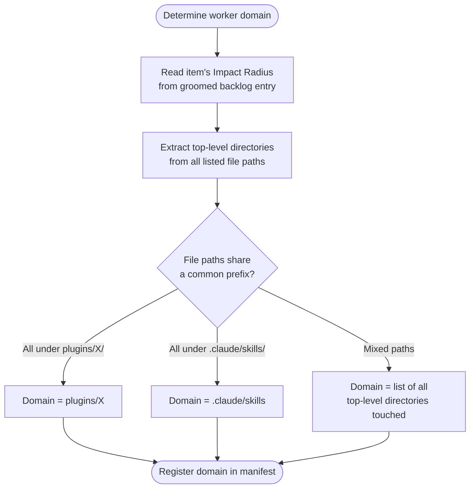

# Team Member Protocol

Each team member is spawned by the milestone orchestrator in an isolated worktree branched from the integration branch. This protocol governs the full lifecycle from setup through completion signaling.

## Full Protocol (Steps M1-M12)

```mermaid
flowchart TD
    Start(["Team member spawned<br>in worktree on integration branch"]) --> M1["M1: Setup<br>Verify worktree is on integration branch.<br>Enable constant commits."]

    M1 --> M2["M2: Announce to Team<br>Read architect spec for files_planned.<br>SendMessage to team with:<br>item title, domain (plugin/directory),<br>files_planned.<br>Listen for peer announcements."]

    M2 --> M3{"M3: Domain Overlap?<br>Any peer announced same domain<br>or overlapping file paths?"}

    M3 -->|"No overlap"| M4
    M3 -->|"Overlap detected"| M3a["M3a: Initial Alignment<br>SendMessage to overlapping peer:<br>- What item you are working on<br>- What files you plan to touch<br>- What interfaces/patterns you expect<br>Request: share their approach.<br>Record alignment or escalate.<br>Write resolution into issue body<br>via backlog_update."]

    M3a --> M4["M4: Execute Work<br>/work-backlog-item --auto {title}<br>Runs: groom (skip if done) →<br>RT-ICA → plan → implement → complete"]

    M4 --> M4a["M4a: State Broadcasts (continuous)<br>On task transition: SendMessage with<br>current task + accumulated files_touched.<br>On structural design choice: SendMessage<br>to team AND backlog_update to persist."]

    M4a --> M4b{"M4b: Peer Overlap Alert?<br>Did a peer broadcast reveal<br>new file overlap with this worker?"}

    M4b -->|"New overlap detected"| M4c["M4c: Runtime Alignment<br>SendMessage to peer with current state<br>and design decisions.<br>Follow Design Alignment Protocol.<br>Write resolution into issue body<br>via backlog_update."]
    M4c --> M5

    M4b -->|"No new overlap"| M5

    M5{"M5: Blocker Hit?<br>RT-ICA returns BLOCKED,<br>env resource missing, or<br>cannot validate end-to-end?"}

    M5 -->|"No blocker"| M8
    M5 -->|"Blocker hit"| M6["M6: Report Blocker<br>SendMessage to orchestrator with:<br>blocker type, context,<br>what is needed to unblock"]

    M6 --> M7["M7: Wait for Resolution<br>Wait for SendMessage from orchestrator<br>with answer or resource confirmation"]
    M7 --> M4

    M8{"M8: Item Complete?<br>/complete-implementation finished,<br>all tasks COMPLETE?"}

    M8 -->|"Not yet"| M4
    M8 -->|"Complete"| M9["M9: Pre-Verify<br>Record current integration branch HEAD.<br>Run quality gates locally in worktree.<br>Commit all changes."]

    M9 --> M10["M10: Signal Completion<br>SendMessage to orchestrator:<br>COMPLETE + worktree branch name +<br>integration branch HEAD at verify time +<br>final files_touched list"]

    M10 --> M11{"M11: Await Merge Outcome<br>Did orchestrator SendMessage<br>gate failure or assign_back?"}

    M11 -->|"Gate failure — fix and re-signal"| M4
    M11 -->|"Assign back — conflict resolution task created"| M12
    M11 -->|"Merge accepted"| Done(["Await termination by orchestrator"])

    M12["M12: Assign Back Acknowledged<br>Confirm resolution task received<br>backlog issue number via SendMessage.<br>Terminate cleanly."]
    M12 --> Done
```



## Constant Commits Protocol

Each team member commits frequently within its worktree:

- After each SAM task completes (via existing SubagentStop hook)
- After each file write/edit operation (via existing PostToolUse hook)
- Before signaling COMPLETE to orchestrator
- Commit messages follow conventional commits: `type(scope): description`

## State Broadcast Fields

SendMessage payload on each task transition:

```text
{
  "event": "task_transition",
  "item_title": "<backlog item title>",
  "domain": "<plugin directory or .claude/skills>",
  "current_task": "<task ID and name>",
  "files_touched": ["path/to/file1", "path/to/file2"]
}
```

SendMessage payload on structural design choice:

```text
{
  "event": "design_decision",
  "item_title": "<backlog item title>",
  "decision": "<what was decided>",
  "rationale": "<why>",
  "affects_peers": ["<domain or file paths that peers should check>"]
}
```

## Design Decision Persistence

Append design decisions to the issue body via `backlog_update`. Do not read before writing — each call appends a uniquely-named section.

Section naming: `Design Decision - {ISO datetime} - {slug}`

```text
backlog_update(
  selector="#42",
  section="Design Decision - 2026-03-20T14:32:00Z - jwt-validation",
  content="Using pydantic for token schema validation. Aligned with issue #45 — both use pydantic models for shared data types."
)
```

## Domain Detection

Domain is derived from the item's Impact Radius and the worker's files_touched/files_planned:



Two workers share a domain when:

- Their `domain` fields match exactly, OR
- Any path in one worker's `files_touched` or `files_planned` shares a common directory prefix (depth 2+) with the other worker's paths

## Blocker Types

| Blocker type | Message field | Orchestrator action |
|---|---|---|
| `rt_ica_blocked` | Missing info required for RT-ICA | Escalate to user; forward answer |
| `env_resource_missing` | Token, key, or credential unavailable | Report to user; pause worker |
| `validation_blocked` | Cannot validate end-to-end | Report to user; worker continues on other tasks |
| `design_conflict` | Two workers have incompatible approaches | Present trade-offs to user; broadcast decision |
