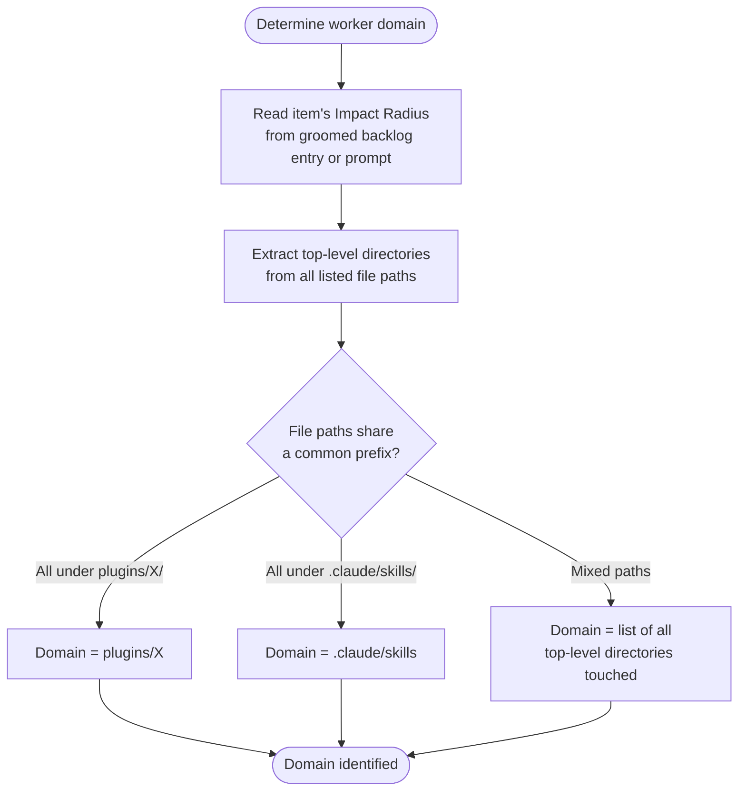

# Worktree Worker Protocol

Each worktree worker is spawned by the milestone orchestrator as an isolated `Agent(isolation: "worktree")` subagent branched from the integration branch. This protocol governs the full lifecycle from setup through completion reporting.

**Critical constraint**: Worktree workers have NO Agent tool. All work is executed directly — no delegation to subagents or the SAM pipeline. Workers self-discover task lists, acceptance criteria, and skills via MCP tools after spawning.

## Full Protocol (Steps M1, M2, M4, M8, M9)

```mermaid
flowchart TD
    Start(["Worktree worker spawned<br>in isolated worktree on integration branch"]) --> M1["M1: Setup<br>Verify worktree is on integration branch.<br>Enable constant commits."]

    M1 --> M2["M2: Self-Discovery<br>backlog_view(selector='#{issue}') — description + AC.<br>sam_list() or sam_status — find SAM plan if exists.<br>If plan found: sam_read — task list, skills, architect spec.<br>Load each skill: Skill(skill='{name}'). Warn and continue on failure."]

    M2 --> SkillLoad["Skill Loading complete.<br>Task list and AC in context."]

    SkillLoad --> M4["M4: Execute Work<br>Execute each task sequentially:<br>1. Read task acceptance criteria<br>2. Implement required changes<br>3. Run task verification commands<br>4. Commit changes<br>Update SAM status via MCP:<br>sam_claim(plan, task) before starting each task.<br>sam_state(plan, task, status='complete') after."]

    M4 --> M8{"M8: Item Complete?<br>All tasks in task list done?"}

    M8 -->|"Not yet"| M4
    M8 -->|"Complete"| M9["M9: Pre-Verify<br>Run quality gate commands from prompt.<br>Fix any failures.<br>Commit all remaining changes."]

    M9 --> GateResult{"Quality gates pass?"}
    GateResult -->|"Fail — fix and re-run"| M9
    GateResult -->|"Pass"| Report["Output Completion Report<br>(see Completion Report Format)"]

    Report --> Done(["Worker exits"])
```



## Skill Loading

During M2 self-discovery, read the SAM task metadata to find the skills list, then load each skill:

```text
For each skill_name found in SAM task metadata:
    Skill(skill="{skill_name}")
```

If a skill fails to load, warn and continue with remaining skills. Skill loading failure is non-fatal — the worker proceeds with whatever skills loaded successfully.

If no SAM plan exists, no skill loading is required unless the backlog item explicitly lists skills.

## Constant Commits Protocol

Commit frequently within the worktree:

- After each task completes
- After each significant file write or edit operation
- Before outputting the completion report
- Commit messages follow conventional commits: `type(scope): description`

Do not batch all changes into a single commit. Frequent commits preserve progress and make merge conflict resolution easier for the orchestrator.

## Domain Detection

Domain is derived from the item's Impact Radius and the worker's files planned and touched:



Domain detection is informational — it is used in the completion report `NOTES` field to describe what was changed. No coordination with other workers is needed: items in the same wave are guaranteed non-overlapping by the dispatch plan's conflict group analysis.

## Blocker Handling

Worktree workers cannot message the orchestrator mid-flight. When a blocker is encountered:

1. Complete as many tasks as possible, skipping only the blocked task
2. Commit all completed work with conventional commit messages
3. Output a `STATUS: PARTIAL` completion report (see format below)

The orchestrator handles partial completions by creating new backlog items for the remaining blocked tasks and adding them to the milestone for a later wave.

Do not wait for resolution. Do not stop all work because one task is blocked — complete everything else and report.

## Completion Report Format

Output one of these structured reports as the final response. The orchestrator parses this output to determine merge actions and relay content for subsequent waves.

### COMPLETE report

All tasks finished and quality gates pass:

```text
STATUS: COMPLETE
BRANCH: {worktree branch name — from git branch --show-current}
TASKS_COMPLETED: {count}
FILES_CHANGED: {list of files modified, one per line}
COMMITS: {list of commit hashes and messages, one per line}
NOTES: {any design decisions, deviations from spec, or domain observations}
```

### PARTIAL report

Some tasks completed, one or more blocked:

```text
STATUS: PARTIAL
BRANCH: {worktree branch name}
TASKS_COMPLETED: {count of completed tasks}
TASKS_BLOCKED: {count and IDs of blocked tasks — e.g., "2 blocked: T03, T05"}
BLOCKER: {description of what blocked progress — be specific}
FILES_CHANGED: {list of files modified}
COMMITS: {list of commit hashes and messages}
NOTES: {design decisions or observations from completed work}
```

### FAILED report

No useful work completed (setup failure, environment issue, or catastrophic blocker):

```text
STATUS: FAILED
BRANCH: {worktree branch name if any commits exist, else 'none'}
TASKS_COMPLETED: 0
BLOCKER: {description of the failure — be specific}
```

## SAM Task Status Tracking

Update SAM task status via MCP tools as you work. SAM MCP is available to worktree workers.

For each task:

1. Before starting: `sam_claim(plan="P{N}", task="T{M}")` — marks task IN PROGRESS
2. After completing: `sam_state(plan="P{N}", task="T{M}", status="complete")` — marks task COMPLETE

If no SAM plan is found during M2 self-discovery, skip these calls — the worker executes against acceptance criteria directly.
