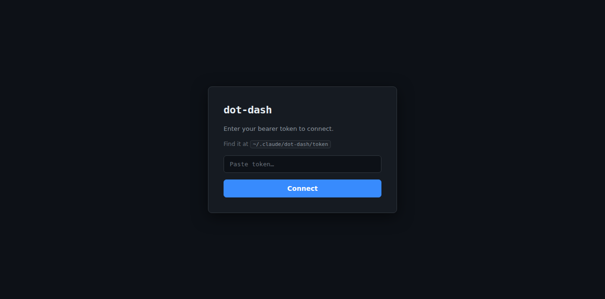
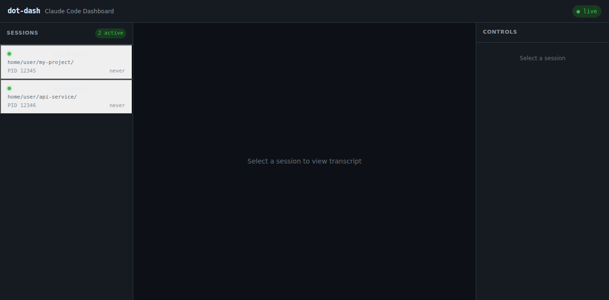
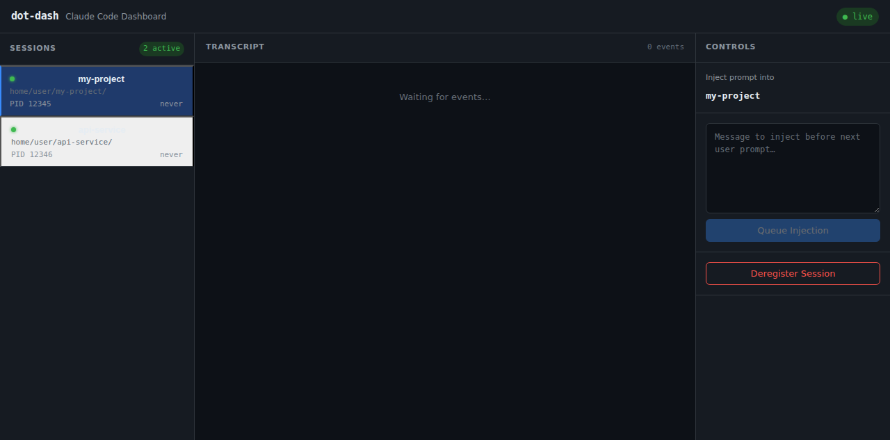

# dot-dash

Real-time multi-session dashboard for Claude Code. Watch all your active Claude sessions from a browser, stream live transcripts, and inject prompts — all from one place.

## Screenshots

### Token Gate



On first open, paste the bearer token from `~/.claude/dot-dash/token` to connect.

### Session Dashboard



All active Claude Code sessions appear in the left panel. The WebSocket connection status shows **● live** in the top-right.

### Session Selected — Transcript and Controls



Selecting a session opens the **Transcript** pane (live events stream) and the **Controls** panel on the right — inject a message into the next user prompt, or deregister the session.

## Features

- **Live session list** — Sessions register automatically via `SessionStart` / `SessionEnd` hooks
- **Transcript streaming** — Tails `~/.claude/projects/*/*.jsonl` and broadcasts events via WebSocket
- **Prompt injection** — Queue a message from the dashboard; the `UserPromptSubmit` hook prepends it to the next user turn
- **Bearer token auth** — Auto-generated token at `~/.claude/dot-dash/token` on first start
- **Dark UI** — No dependencies on external services; runs entirely on localhost

## Quick Start

```bash
# 1. Start the server
bash plugins/dot-dash/scripts/start-server.sh

# 2. Open the dashboard
open http://localhost:7765

# 3. Paste the token from
cat ~/.claude/dot-dash/token
```

The server defaults to port `7765`. Override with `DOT_DASH_PORT`.

## Architecture

```text
Claude Code session
  │
  ├── SessionStart hook → POST /internal/session/register
  ├── SessionEnd hook   → POST /internal/session/deregister
  └── UserPromptSubmit  → GET  /internal/inject/{sessionId}

dot-dash server (Hono + Node.js)
  ├── Watches ~/.claude/projects/**/*.jsonl (chokidar)
  ├── Broadcasts events via WebSocket (/ws)
  └── Serves React frontend (static build)

Browser dashboard (React 18 + Vite)
  └── WsManager — auto-reconnects, dispatches to useReducer
```

## Configuration

| Variable | Default | Description |
|----------|---------|-------------|
| `DOT_DASH_PORT` | `7765` | HTTP + WebSocket port |
| `DOT_DASH_TOKEN` | _(auto-generated)_ | Bearer token (saved to `~/.claude/dot-dash/token`) |
