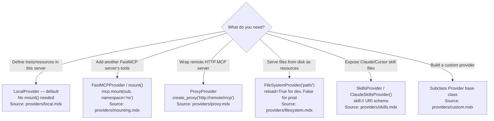
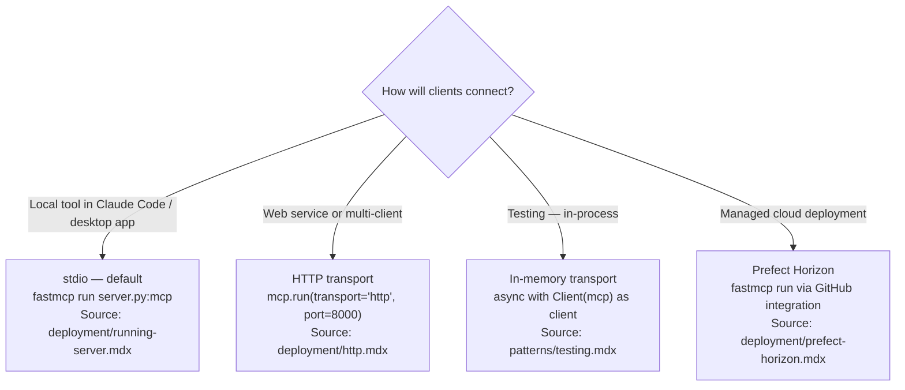
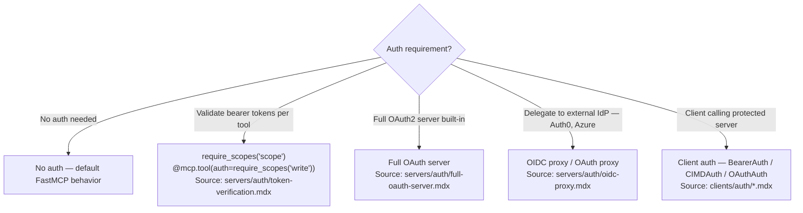

## Current Environment

**Python version:**

!`python3 --version 2>/dev/null || python --version 2>/dev/null || echo "Python not found in PATH"`

**Installed FastMCP version:**

!`uv run python -c "import fastmcp; print(f'FastMCP {fastmcp.__version__}')" 2>/dev/null || echo "FastMCP not installed — run: uv add 'fastmcp>=3.0' before scaffolding"`

---

## Trigger Matrix

When user intent matches, load the reference file listed — do not rely on training data for v3 API facts.

| User intent | v3 feature | Reference file |
|---|---|---|
| Build a new FastMCP server | `FastMCP()`, `@mcp.tool`, `@mcp.resource` | [./references/server-core.md](./references/server-core.md) |
| Compose multiple servers | `mount()`, namespace, providers | [./references/providers.md](./references/providers.md) |
| Bridge remote HTTP server to stdio | `ProxyProvider`, `create_proxy()` | [./references/providers.md](./references/providers.md) |
| Serve files or skills as resources | `FileSystemProvider`, `SkillsProvider` | [./references/providers.md](./references/providers.md) |
| Rename or filter tools from sub-server | `ToolTransform`, `Namespace` | [./references/transforms.md](./references/transforms.md) |
| Expose resources as tools | `ResourcesAsTools` | [./references/transforms.md](./references/transforms.md) |
| Add authentication to a server | `require_scopes`, OAuth variants | [./references/auth.md](./references/auth.md) |
| Write a FastMCP client | `Client`, transports, `BearerAuth` | [./references/client-sdk.md](./references/client-sdk.md) |
| Run long tasks without blocking | `@mcp.tool(task=True)` | [./references/advanced.md](./references/advanced.md) |
| Add multi-turn user input to a tool | Elicitation API | [./references/advanced.md](./references/advanced.md) |
| Deploy to production | Prefect Horizon, HTTP, stdio | [./references/deployment.md](./references/deployment.md) |
| Write tests for a FastMCP server | In-memory Client, pytest patterns | [./references/testing.md](./references/testing.md) |
| Integrate with Anthropic/OpenAI/FastAPI | Integration patterns | [./references/integrations.md](./references/integrations.md) |
| Migrate from FastMCP v2 | Breaking changes, syntax fixes | [./references/migration.md](./references/migration.md) |
| Add web UI to a server | Apps low-level HTML API | [./references/apps.md](./references/apps.md) |
| Find real-world usage patterns | ProxyProvider, mount(), showcase | [./references/real-world-patterns.md](./references/real-world-patterns.md) |

---

## Choose Provider Type



---

## Choose Transport



---

## Choose Auth Approach



---

## Quick-Start Examples

### Minimal server

```python
# SOURCE: servers/server.mdx + servers/tools.mdx (accessed 2026-03-05)
from fastmcp import FastMCP

mcp = FastMCP("my-server")

@mcp.tool  # RULE: no parentheses — v3 canonical syntax
def greet(name: str) -> str:
    """Return a greeting."""
    return f"Hello, {name}!"

if __name__ == "__main__":
    mcp.run()
```

### Server composition

```python
# SOURCE: servers/providers/mounting.mdx (accessed 2026-03-05)
from fastmcp import FastMCP

weather = FastMCP("weather")
main = FastMCP("main")

main.mount(weather, namespace="weather")
# Tools from weather become weather_<tool-name> on main
```

### Background task

```python
# SOURCE: servers/tasks.mdx — requires fastmcp[tasks] extra (accessed 2026-03-05)
from fastmcp import FastMCP

mcp = FastMCP("task-server")

@mcp.tool(task=True)  # RULE: task=True, NOT task=TaskConfig(...)
async def long_running(data: str) -> str:
    """Process data in background."""
    return "done"
```

---

## v3 API Corrections

CONSTRAINT: These v2 patterns are deprecated or removed. Generate only the v3 form.

| v2 / wrong pattern | v3 correct pattern | Source |
|---|---|---|
| `@mcp.tool()` with parentheses | `@mcp.tool` without parentheses | `quickstart.mdx` |
| `task=TaskConfig(mode="required")` | `task=True` | `servers/tasks.mdx` |
| `require_auth` | `require_scopes("scope")` | `servers/authorization.mdx` |
| `.mcpb` packaging | Prefect Horizon or stdio deploy | `deployment/running-server.mdx` |
| `ctx.get_state()` / `ctx.set_state()` | Verify in `context.mdx` — not confirmed v3 | `servers/context.mdx` |

---

## Version Gating

### FastMCP 3.0 — Available Now

All features documented in this skill and its reference files are available in FastMCP 3.0
unless explicitly marked otherwise.

### FastMCP 3.1 — NOT YET RELEASED

The following features appear in local docs but are NOT available in 3.0:

- **Python-native App framework** (`apps/overview.mdx`) — do not generate code for this
- **CodeMode** (dynamic BM25 tool search + Python execution) — do not document as available

SOURCE: `apps/overview.mdx` states 3.1 features are unreleased (accessed 2026-03-05)

---

## Reference Files

All 12 v3 reference files sourced from `.claude/worktrees/fastmcp/docs/`:

- [./references/server-core.md](./references/server-core.md) — `FastMCP()`, tools, resources, prompts, context, lifespan
- [./references/providers.md](./references/providers.md) — LocalProvider, FastMCPProvider, ProxyProvider, FileSystemProvider, SkillsProvider
- [./references/transforms.md](./references/transforms.md) — Namespace, ToolTransform, Enabled, ResourcesAsTools, PromptsAsTools
- [./references/auth.md](./references/auth.md) — `require_scopes`, OAuth variants, token verification
- [./references/client-sdk.md](./references/client-sdk.md) — `Client`, transports, BearerAuth, CIMD, OAuth, sampling, elicitation
- [./references/apps.md](./references/apps.md) — v3.0 low-level HTML API only (v3.1 Python-native framework unreleased)
- [./references/advanced.md](./references/advanced.md) — tasks, elicitation, storage backends, middleware, dependency injection, versioning, visibility
- [./references/deployment.md](./references/deployment.md) — stdio, HTTP, server config, Prefect Horizon
- [./references/testing.md](./references/testing.md) — in-memory Client, pytest patterns
- [./references/integrations.md](./references/integrations.md) — Anthropic, OpenAI, Gemini, FastAPI, GitHub, Auth0, Azure, Claude Code
- [./references/migration.md](./references/migration.md) — v2 → v3 breaking changes, from MCP SDK
- [./references/real-world-patterns.md](./references/real-world-patterns.md) — ProxyProvider, mount(), SkillsProvider, showcase

Preserved references (not overwritten):

- [./references/evaluation-guide.md](./references/evaluation-guide.md) — evaluating server quality
- [./references/typescript-mcp-server.md](./references/typescript-mcp-server.md) — TypeScript MCP SDK (out of v3 overhaul scope)
- [./references/claude-code-mcp-integration.md](./references/claude-code-mcp-integration.md) — `.mcp.json` config, Claude Code deployment

---

## Related Skills

- For pytest patterns and in-memory testing fixtures:
  `Skill(skill: "fastmcp-creator:fastmcp-python-tests")`
- For `fastmcp list` / `fastmcp call` / `fastmcp discover` CLI usage:
  `Skill(skill: "fastmcp-creator:fastmcp-client-cli")`
- For Python project setup (pyproject.toml, uv, src layout):
  `Skill(skill: "python3-development:python3-development")`
- For evaluating MCP server quality: [./references/evaluation-guide.md](./references/evaluation-guide.md)
- For Claude Code MCP config (`.mcp.json`): [./references/claude-code-mcp-integration.md](./references/claude-code-mcp-integration.md)
