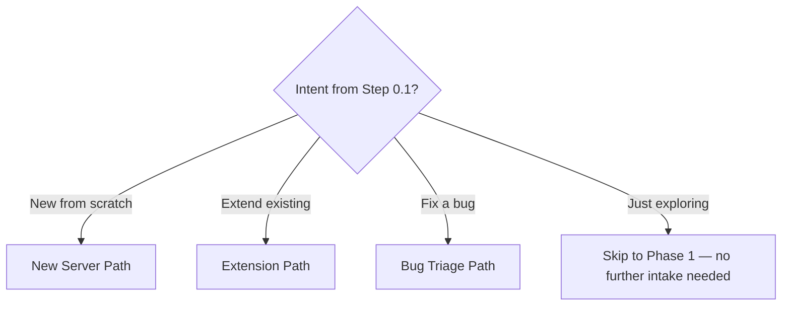

# MCP Server Development

## Current MCP Environment

**Python interpreter:**
!`python3 --version 2>/dev/null || python --version 2>/dev/null || echo "Python not found in PATH"`

**Available MCP servers (if configured):**
!`python3 -c "import os; print('\\n'.join(os.listdir('mcp_servers')) if os.path.exists('mcp_servers') else 'No mcp_servers/ directory found')" 2>/dev/null || echo "No mcp_servers/ directory found"`

**Current directory:**
!`python3 -c "import os; print(os.getcwd())" 2>/dev/null || pwd`

## Scope

TRIGGER: The model must activate when building MCP (Model Context Protocol) servers

SPECIALIZATION: FastMCP 3.x framework (Python, decorator-based, provider/transform architecture) FALLBACK: Generic Python SDK, TypeScript SDK also covered

COVERAGE:

- Generic MCP protocol (all implementations)
- Agent-centric design principles
- FastMCP 3.x framework features:
  - Provider/Transform composable architecture
  - Component versioning (tools, resources, prompts)
  - Session-scoped state management
  - Authorization system (component-level and server-wide)
  - Background tasks (SEP-1686 with Docket integration)
  - OpenTelemetry tracing
  - Visibility system (dynamic enable/disable)
  - Hot reload and automatic threadpool
- TypeScript/Node MCP SDK (Zod validation)
- Evaluation creation for testing server quality
- Production deployment and packaging (.mcpb format)
- Security, performance, and observability patterns

EXCLUSIONS:

- Low-level MCP transport layer details (handled by SDKs/frameworks)
- Client-side MCP implementations
- FastMCP 2.x deprecated features (use FastMCP 3.x patterns instead)

## High-Level Workflow

TRIGGER: The model must follow this 4-phase workflow when building MCP servers

### Phase 0: Requirements Intake

RULE: Before any research or planning, gather requirements from the user using AskUserQuestion. ALL multi-choice questions MUST use the AskUserQuestion tool — never ask them as plain text.

Use the decision tree below to determine which intake path to follow based on the user's intent.

#### Step 0.1 — Intent and Language (AskUserQuestion, both together)

Ask these two questions together in a single AskUserQuestion call:

1. "What would you like to do?"
   - New from scratch — build a brand new MCP server
   - Extend existing — add tools or resources to an existing server
   - Fix a bug — something isn't working as expected
   - Just exploring — want to understand FastMCP capabilities

2. "Which implementation language/framework?"
   - Python (FastMCP 3.x)
   - TypeScript/Node

#### Step 0.2 — Branch on intent



---

#### New Server Path

**Step N1 — Domain (AskUserQuestion)**

Ask: "What service or domain will this MCP server integrate with?"

- REST API with auth
- Local filesystem/data
- CLI tool wrapper
- Custom business logic

**Step N2 — Problem statement (AskUserQuestion, open-ended as plain text question with no options list)**

Ask: "We can do many things with MCP tooling — for example, file search and analysis, data transformation (CSV/JSON/YAML), structured file CRUD, or wrapping CLI tools. What problem do you want to solve?"

**Step N3 — Follow-up clarification (AskUserQuestion)**

Based on the answer to N2, ask clarifying questions to fill gaps. Always include:

- "Are there any existing MCP servers, APIs, codebases, or examples you'd like to use as a reference or template?"

Ask any additional questions needed to understand scope, constraints, and target users before proceeding.

---

#### Extension Path

**Step E1 — What exists (AskUserQuestion)**

Ask: "Which existing MCP server are you extending, and what tools or resources do you want to add?"

Then ask any follow-up questions needed to understand the new capability's scope.

Also ask: "Are there any examples or reference implementations for the new tools you want to add?"

---

#### Bug Triage Path

Ask these three questions together in a single AskUserQuestion call:

1. "What was observed? Describe what actually happened."
2. "What were you doing when it occurred? Walk through the steps that led to it."
3. "What was the expected outcome?" (skip if the user already stated this clearly)

Then ask any follow-up questions to reproduce the issue before proceeding to Phase 1.

---

Only proceed to Phase 1 after intake is complete for the chosen path.

### Phase 1: Deep Research and Planning

#### 1.1 Understand Agent-Centric Design Principles

RULE: The model must design tools for AI agents, not just API wrappers

PRINCIPLES:

**Build for Workflows, Not Just API Endpoints:**

- Don't simply wrap existing API endpoints
- Build thoughtful, high-impact workflow tools
- Consolidate related operations (e.g., `schedule_event` that both checks availability and creates event)
- Focus on tools that enable complete tasks, not just individual API calls
- Consider what workflows agents actually need to accomplish

**Optimize for Limited Context:**

- Agents have constrained context windows - make every token count
- Return high-signal information, not exhaustive data dumps
- Provide "concise" vs "detailed" response format options
- Default to human-readable identifiers over technical codes (names over IDs)
- Consider the agent's context budget as a scarce resource

**Design Actionable Error Messages:**

- Error messages should guide agents toward correct usage patterns
- Suggest specific next steps: "Try using filter='active_only' to reduce results"
- Make errors educational, not just diagnostic
- Help agents learn proper tool usage through clear feedback

**Follow Natural Task Subdivisions:**

- Tool names should reflect how humans think about tasks
- Group related tools with consistent prefixes for discoverability
- Design tools around natural workflows, not just API structure

**Use Evaluation-Driven Development:**

- Create realistic evaluation scenarios early
- Let agent feedback drive tool improvements
- Prototype quickly and iterate based on actual agent performance

#### 1.2 Study MCP Protocol Documentation

RESOURCE: `https://modelcontextprotocol.io/llms-full.txt` PURPOSE: Complete MCP specification and guidelines

RESEARCH TOOL PREFERENCE (in order):

1. **Preferred**: `mcp__Ref__ref_search_documentation(query="Model Context Protocol specification")` - High-fidelity verbatim documentation
2. **Alternative**: `mcp__exa__get_code_context_exa(query="MCP protocol server implementation examples")` - Code context and examples
3. **Fallback**: WebFetch - Use only when MCP tools don't provide needed content

RATIONALE: MCP tools provide higher fidelity (verbatim source) compared to WebFetch (AI summaries)

> [Web resource access, definitive guide for getting accurate data for high quality results](./references/accessing_online_resources.md)

#### 1.3 Study Framework Documentation

DECISION_TREE:

```text
IF implementing in Python THEN
  - Load FastMCP patterns from references/development-guidelines.md
  - Load Python SDK documentation from official source
  - Focus on decorator-based patterns and Pydantic validation

ELSE IF implementing in TypeScript/Node THEN
  - Load TypeScript patterns from references/typescript-mcp-server.md
  - Load TypeScript SDK documentation from official source
  - Focus on registerTool patterns and Zod validation

ELSE
  - Load generic best practices from references/mcp-best-practices.md
  - Adapt to target language/framework
```

REFERENCES_IN_SKILL:

- [MCP Best Practices](./references/mcp-best-practices.md) - Universal MCP guidelines
- [FastMCP Development Guidelines](./references/development-guidelines.md) - Python FastMCP specialization
- [TypeScript MCP Server Guide](./references/typescript-mcp-server.md) - TypeScript/Node implementation
- [FastMCP Community Practices](./references/community-practices.md) - Mid-2025+ patterns
- [Prompts and Templates](./references/prompts-and-templates.md) - Prompt system configuration
- [Example Projects](./references/example-projects.md) - Real-world implementations
- [Evaluation Guide](./references/evaluation-guide.md) - Testing server quality

#### 1.4 Exhaustively Study API Documentation

RULE: The model must read through ALL available API documentation for target service

REQUIREMENTS:

- Official API reference documentation
- Authentication and authorization requirements
- Rate limiting and pagination patterns
- Error responses and status codes
- Available endpoints and their parameters
- Data models and schemas

RESEARCH TOOL HIERARCHY (use in this order):

1. **MCP Ref tool**: `mcp__Ref__ref_search_documentation` for official API documentation (verbatim, high-fidelity)
2. **MCP exa tool**: `mcp__exa__get_code_context_exa` for code examples and SDK usage patterns
3. **MCP exa web search**: `mcp__exa__web_search_exa` for general research with LLM-optimized results
4. **Fallback**: WebFetch only when MCP tools don't work

RATIONALE: MCP tools provide superior accuracy, precision, and fidelity for technical documentation

#### 1.5 Create Comprehensive Implementation Plan

PLAN_COMPONENTS:

**Tool Selection:**

- List the most valuable endpoints/operations to implement
- Prioritize tools that enable the most common and important use cases
- Consider which tools work together to enable complex workflows

**Shared Utilities and Helpers:**

- Identify common API request patterns
- Plan pagination helpers
- Design filtering and formatting utilities
- Plan error handling strategies

**Input/Output Design:**

- Define input validation models (Pydantic for Python, Zod for TypeScript)
- Design consistent response formats (JSON and Markdown)
- Design configurable levels of detail (Detailed or Concise)
- Plan for large-scale usage (thousands of users/resources)
- Implement character limits and truncation strategies (e.g., 25,000 tokens)

**Error Handling Strategy:**

- Plan graceful failure modes
- Design clear, actionable, LLM-friendly, natural language error messages
- Consider rate limiting and timeout scenarios
- Handle authentication and authorization errors

### Phase 2: Implementation

RULE: The model must implement following language-specific best practices

#### For Python (FastMCP)

**Python Project Setup:**

RULE: The model must activate the python3-development skill before setting up Python MCP server projects

CONSTRAINT: The python3-development skill contains:

- Python project layouts (src/ vs flat)
- pyproject.toml structure with uv
- Modern Python 3.11+ patterns
- Package structure best practices
- Build/publishing guides
- Lessons learned for successful Python project design

ACTIVATION:

```claude
Skill(command: "python3-development:python3-development")
```

The model must defer to python3-development for general Python project structure.

**Basic Server Structure:**

```python
from fastmcp import FastMCP
from pydantic import Field
from typing import Annotated

mcp = FastMCP("service_mcp")

@mcp.tool()
def tool_name(
    param: Annotated[str, Field(description="Parameter description")]
) -> dict:
    """Tool description for the AI."""
    return {"result": "value"}

if __name__ == "__main__":
    mcp.run()  # Defaults to STDIO transport
```

**Key Patterns:**

- Use `@mcp.tool()` decorator for tools
- Use `Annotated[type, Field(...)]` for parameter validation
- First line of docstring becomes tool description
- Return dict for structured output
- Use `async def` for I/O-bound operations

**See:** [FastMCP Development Guidelines](./references/development-guidelines.md) for complete Python patterns

#### For TypeScript/Node

**Basic Server Structure:**

```typescript
import { McpServer } from "@modelcontextprotocol/sdk/server/mcp.js";
import { StdioServerTransport } from "@modelcontextprotocol/sdk/server/stdio.js";
import { z } from "zod";

const server = new McpServer({
  name: "service-mcp-server",
  version: "1.0.0",
});

const InputSchema = z
  .object({
    param: z.string().describe("Parameter description"),
  })
  .strict();

server.registerTool(
  "tool_name",
  {
    title: "Tool Title",
    description: "Tool description for the AI",
    inputSchema: InputSchema,
    annotations: { readOnlyHint: true },
  },
  async (params) => {
    return { content: [{ type: "text", text: "result" }] };
  },
);

const transport = new StdioServerTransport();
await server.connect(transport);
```

**Key Patterns:**

- Use `registerTool` with complete configuration
- Use Zod schemas with `.strict()`
- Explicitly provide `title`, `description`, `inputSchema`, `annotations`
- Type all parameters and return values

**See:** [TypeScript MCP Server Guide](./references/typescript-mcp-server.md) for complete TypeScript patterns

### Phase 3: Review and Refine

#### 3.1 Code Quality Review

CHECKLIST:

- [ ] DRY Principle: No duplicated code between tools
- [ ] Composability: Shared logic extracted into functions
- [ ] Consistency: Similar operations return similar formats
- [ ] Error Handling: All external calls have error handling
- [ ] Type Safety: Full type coverage (Python type hints, TypeScript types)
- [ ] Documentation: Every tool has comprehensive docstrings/descriptions

#### 3.2 Test and Build

**Important:** MCP servers are long-running processes. Running them directly causes your process to hang indefinitely.

**Safe Testing:**

- Use evaluation harness (see Phase 4)
- Run server in tmux to keep it outside main process
- Use timeout when testing: `timeout 5s python server.py`

**For Python:**

```bash
python -m py_compile your_server.py  # Verify syntax
```

**For TypeScript:**

```bash
npm run build  # Must complete without errors
```

### Phase 4: Create Evaluations

RULE: The model must create comprehensive evaluations to test server effectiveness

RESOURCE: [Evaluation Guide](./references/evaluation-guide.md)

**Purpose:** Evaluations test whether LLMs can effectively use your MCP server to answer realistic, complex questions.

**Process:**

1. **Tool Inspection** - List available tools and understand capabilities
2. **Content Exploration** - Use READ-ONLY operations to explore available data
3. **Question Generation** - Create 10 complex, realistic questions
4. **Answer Verification** - Solve each question yourself to verify answers

**Requirements:** Each question must be:

- Independent (not dependent on other questions)
- Read-only (only non-destructive operations required)
- Complex (requiring multiple tool calls and deep exploration)
- Realistic (based on real use cases humans would care about)
- Verifiable (single, clear answer that can be verified by string comparison)
- Stable (answer won't change over time)

**Output Format:**

```xml
<evaluation>
  <qa_pair>
    <question>Complex question requiring multiple tool calls</question>
    <answer>Single verifiable answer</answer>
  </qa_pair>
</evaluation>
```

**Evaluation Scripts:**

Located in `./scripts/`:

- `evaluation.py` - Evaluation harness
- `connections.py` - MCP connection utilities
- `requirements.txt` - Python dependencies
- `example_evaluation.xml` - Example evaluation

**Usage:**

```bash
pip install -r scripts/requirements.txt
export ANTHROPIC_API_KEY=your_api_key

python scripts/evaluation.py \
  -t stdio \
  -c python \
  -a my_mcp_server.py \
  evaluation.xml
```

## Quick Reference

### FastMCP 3.x (Python) Quick Start

**IMPORTANT**: FastMCP 3.0 requires explicit installation: `pip install "fastmcp>=3.0.0"` or `uv add "fastmcp>=3.0.0"`

**Basic Server:**

```python
from fastmcp import FastMCP
from pydantic import Field
from typing import Annotated

mcp = FastMCP("my-server")

@mcp.tool()
def search_items(
    query: str,
    limit: Annotated[int, Field(ge=1, le=100)] = 10
) -> dict:
    """Search for items matching the query."""
    results = perform_search(query, limit)
    return {"results": results, "count": len(results)}

@mcp.resource("data://config")
def get_config() -> dict:
    return {"setting": "value"}

@mcp.prompt()
def explain_topic(topic: str) -> str:
    return f"Explain the concept of '{topic}'"

if __name__ == "__main__":
    mcp.run()  # STDIO transport
    # OR: mcp.run(transport="http", port=8000)
```

**FastMCP 3.x Key Changes from 2.x:**

```python
# 1. Decorators now return callable functions (v2 returned objects)
@mcp.tool()
def greet(name: str) -> str:
    return f"Hello, {name}!"

greet("World")  # Now works! Returns "Hello, World!"

# 2. State methods are now async
@mcp.tool()
async def increment(ctx: Context) -> int:
    count = await ctx.get_state("counter") or 0  # async now
    await ctx.set_state("counter", count + 1)     # async now
    return count + 1

# 3. Component versioning support
@mcp.tool(version="1.0")
def add(x: int, y: int) -> int:
    return x + y

@mcp.tool(version="2.0")
def add(x: int, y: int, z: int = 0) -> int:
    return x + y + z  # Highest version exposed by default

# 4. Authorization at component level
from fastmcp.server.auth import require_scopes, restrict_tag

@mcp.tool(auth=require_scopes("write"))
def protected_tool(): ...

@mcp.resource("data://secret", auth=require_scopes("read"))
def secret_data(): ...

# 5. Provider/Transform architecture
from fastmcp.server.providers import FileSystemProvider
from fastmcp.server.transforms import Namespace

# Create server with filesystem provider (hot-reload capable)
mcp = FastMCP("server", providers=[
    FileSystemProvider("mcp/", reload=True)
])

# Mount another server with namespace
sub = FastMCP("Sub")
mcp.mount(sub, prefix="sub")  # greet becomes "sub_greet"

# 6. Background tasks (SEP-1686)
from fastmcp.server.tasks import TaskConfig

@mcp.tool(task=TaskConfig(mode="required"))
async def long_running():
    # Must execute as background task
    ...

# 7. Session-scoped visibility control
@mcp.tool()
async def unlock_premium(ctx: Context) -> str:
    await ctx.enable_components(tags={"premium"})
    return "Premium features unlocked for this session"

# 8. OpenTelemetry tracing (built-in)
# Just configure OTEL, FastMCP auto-traces everything

# 9. Hot reload during development
# fastmcp dev server.py  # Auto-restarts on file changes
```

### TypeScript/Node Quick Start

```typescript
import { McpServer } from "@modelcontextprotocol/sdk/server/mcp.js";
import { StdioServerTransport } from "@modelcontextprotocol/sdk/server/stdio.js";
import { z } from "zod";

const server = new McpServer({
  name: "my-server",
  version: "1.0.0",
});

const SearchSchema = z
  .object({
    query: z.string(),
    limit: z.number().int().min(1).max(100).default(10),
  })
  .strict();

server.registerTool(
  "search_items",
  {
    title: "Search Items",
    description: "Search for items matching the query",
    inputSchema: SearchSchema,
    annotations: { readOnlyHint: true },
  },
  async (params) => {
    const results = await performSearch(params.query, params.limit);
    return {
      content: [
        {
          type: "text",
          text: JSON.stringify({ results, count: results.length }, null, 2),
        },
      ],
    };
  },
);

const transport = new StdioServerTransport();
await server.connect(transport);
```

## Best Practices Summary

MANDATORY_PRACTICES:

**Tool Design:**

- Design workflow-oriented tools, not API endpoint wrappers
- Use descriptive names with service prefix: `{service}_{action}_{resource}`
- Optimize for AI context window efficiency
- Provide actionable error messages

**Input/Output:**

- Support both JSON and Markdown response formats
- Implement pagination for list operations
- Enforce CHARACTER_LIMIT (typically 25,000) with truncation
- Use human-readable identifiers where appropriate

**Validation:**

- Python: Use Pydantic Field() with constraints
- TypeScript: Use Zod schemas with .strict()
- Validate all inputs against schema
- Sanitize file paths and external identifiers

**Error Handling:**

- Don't expose internal errors to clients
- Provide clear, actionable error messages
- Use ToolError (Python) for business logic errors
- Handle timeouts and rate limits gracefully

**Security:**

- Validate file paths against allowed directories
- Use confirmation flags for destructive operations
- Set destructiveHint annotation for state-changing tools
- Rate limit expensive operations
- Store secrets in environment variables

**Performance:**

- Use async for I/O-bound operations
- Cache repeated queries using lru_cache or similar
- Stream large responses in HTTP mode
- Extract common functionality into reusable functions

**Deployment:**

- Package as .mcpb for Claude Desktop distribution
- Provide manifest.json with user_config fields
- Support environment variable configuration
- Test with evaluation harness before release

## Resources

COMPREHENSIVE_REFERENCES:

**[mcp-best-practices.md](./references/mcp-best-practices.md)**

Universal MCP guidelines including naming conventions, response formats, pagination, security, and compliance requirements. Use for all MCP implementations regardless of language.

**[development-guidelines.md](./references/development-guidelines.md)**

Complete FastMCP development guide covering decorators, Pydantic validation, async patterns, error handling, Context parameters, annotations, transport options, and production deployment.

**[typescript-mcp-server.md](./references/typescript-mcp-server.md)**

Complete TypeScript/Node implementation guide covering project structure, registerTool patterns, Zod validation, error handling, and production build process.

**[community-practices.md](./references/community-practices.md)**

Mid-2025+ best practices including .mcpb packaging, security by design patterns, observability and testing approaches, performance tuning, caching, ecosystem compatibility, and agent orchestration patterns.

**[prompts-and-templates.md](./references/prompts-and-templates.md)**

FastMCP prompt and template system covering @mcp.prompt decorator, system instructions for tool use, configuration for AI-native tools, and prompt engineering for MCP servers.

**[example-projects.md](./references/example-projects.md)**

Real-world FastMCP implementations demonstrating best practices and patterns from Ultimate MCP Server (AI Agent OS), Hugging Face MCP server, browser automation servers, data/DevOps integrations, coding assistants, and templates/aggregators.

**[evaluation-guide.md](./references/evaluation-guide.md)**

Complete guide for creating comprehensive evaluations to test whether LLMs can effectively use your MCP server to answer realistic, complex questions. Includes question guidelines, answer requirements, evaluation process, output format, examples, and verification process.

## Standalone Operation

CONSTRAINT: This skill is completely standalone with no external dependencies

VERIFICATION:

- ✅ All generic MCP best practices included
- ✅ All FastMCP Python patterns included
- ✅ All TypeScript/Node patterns included
- ✅ All evaluation creation guidance included
- ✅ All security, performance, and observability patterns included
- ✅ All community practices and .mcpb packaging included
- ✅ All scripts and evaluation harness included
- ✅ All reference files self-contained
- ✅ No references to external skills or resources

USAGE: Load this skill to access complete, comprehensive MCP server development guidance without needing any other skills or external resources.
