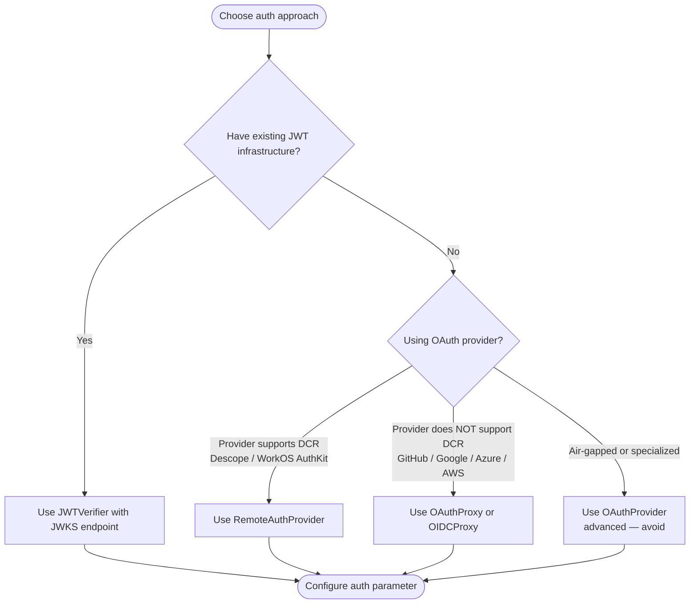

# FastMCP v3 Authentication and Authorization Reference

How to authenticate requests to FastMCP HTTP servers and authorize access at the component level.

SOURCE: `.claude/worktrees/fastmcp/docs/servers/auth/authentication.mdx`, `full-oauth-server.mdx`, `oauth-proxy.mdx`, `oidc-proxy.mdx`, `remote-oauth.mdx`, `token-verification.mdx`, `.claude/worktrees/fastmcp/docs/servers/authorization.mdx` (accessed 2026-03-05)

---

## Auth Scope

CONSTRAINT: Authentication applies only to FastMCP's HTTP-based transports (`http` and `sse`). STDIO transport inherits security from its local execution environment — no auth configuration is needed or possible.

RULE: `require_auth` was removed before FastMCP v3. The correct v3 pattern is `require_scopes` for endpoint-level authorization.

---

## Authentication Providers

Configure an auth provider by passing it to the `FastMCP` constructor's `auth` parameter.

```python
mcp = FastMCP(name="My Server", auth=your_auth_provider)
```

FastMCP provides four authentication classes:

| Class | Use Case |
|-------|----------|
| `JWTVerifier` / `TokenVerifier` | Validate tokens from external issuers (JWT or opaque) |
| `RemoteAuthProvider` | Identity providers WITH Dynamic Client Registration (DCR) |
| `OAuthProxy` / `OIDCProxy` | Identity providers WITHOUT DCR (GitHub, Google, Azure, etc.) |
| `OAuthProvider` | Full self-hosted OAuth 2.1 server (advanced, avoid unless necessary) |

---

## Token Verification

Use `JWTVerifier` when your infrastructure already issues JWT tokens. The MCP server acts as a pure resource server — it validates tokens, it does not issue them.

### JWKS Endpoint (Recommended for Production)

```python
from fastmcp import FastMCP
from fastmcp.server.auth.providers.jwt import JWTVerifier

verifier = JWTVerifier(
    jwks_uri="https://auth.yourcompany.com/.well-known/jwks.json",
    issuer="https://auth.yourcompany.com",
    audience="mcp-production-api",
)

mcp = FastMCP(name="Protected API", auth=verifier)
```

The verifier fetches public keys automatically and supports key rotation without server restarts.

### Symmetric Key (HMAC — Internal Microservices)

```python
from fastmcp.server.auth.providers.jwt import JWTVerifier

verifier = JWTVerifier(
    public_key="your-shared-secret-minimum-32-chars",
    issuer="internal-auth-service",
    audience="mcp-internal-api",
    algorithm="HS256",  # or HS384, HS512
)
```

CONSTRAINT: Despite the parameter name, `public_key` accepts a symmetric secret when using HMAC algorithms. Use asymmetric keys (RSA/ECDSA via JWKS) for external-facing APIs.

### Static Public Key (Development / Controlled Deployments)

```python
public_key_pem = """-----BEGIN PUBLIC KEY-----
MIIBIjANBgkqhkiG9w0BAQEFAAOCAQ8AMIIBCgKCAQEA...
-----END PUBLIC KEY-----"""

verifier = JWTVerifier(
    public_key=public_key_pem,
    issuer="https://auth.yourcompany.com",
    audience="mcp-production-api",
)
```

### Opaque Token Verification (Token Introspection)

For opaque (non-self-contained) tokens, use `IntrospectionTokenVerifier`. It makes a network call to the authorization server for each incoming token.

```python
from fastmcp.server.auth.providers.introspection import IntrospectionTokenVerifier

verifier = IntrospectionTokenVerifier(
    introspection_url="https://auth.yourcompany.com/oauth/introspect",
    client_id="mcp-resource-server",
    client_secret="your-client-secret",
    required_scopes=["api:read", "api:write"],
)

mcp = FastMCP(name="Protected API", auth=verifier)
```

### Development Token Verifiers

```python
from fastmcp.server.auth.providers.jwt import StaticTokenVerifier

# Accept predefined tokens with associated claims
verifier = StaticTokenVerifier(
    tokens={
        "dev-alice-token": {"client_id": "alice", "scopes": ["read:data", "write:data"]},
        "dev-guest-token": {"client_id": "guest", "scopes": ["read:data"]},
    },
    required_scopes=["read:data"],
)
```

```python
from fastmcp.server.auth.providers.debug import DebugTokenVerifier

# Accept any non-empty token (rapid prototyping only)
verifier = DebugTokenVerifier()

# Or custom validation logic
verifier = DebugTokenVerifier(
    validate=lambda token: token.startswith("dev-"),
    scopes=["read", "write"],
)
```

CONSTRAINT: `StaticTokenVerifier` and `DebugTokenVerifier` are for development and testing only. Never use in production.

### Test Token Generation

```python
from fastmcp.server.auth.providers.jwt import JWTVerifier, RSAKeyPair

key_pair = RSAKeyPair.generate()

verifier = JWTVerifier(
    public_key=key_pair.public_key,
    issuer="https://test.yourcompany.com",
    audience="test-mcp-server",
)

test_token = key_pair.create_token(
    subject="test-user-123",
    issuer="https://test.yourcompany.com",
    audience="test-mcp-server",
    scopes=["read", "write", "admin"],
)
```

---

## OAuth Proxy (Providers Without DCR)

Use `OAuthProxy` for providers that do not support Dynamic Client Registration — GitHub, Google, Azure, AWS, Discord, and most traditional enterprise identity systems.

The proxy presents a DCR-compliant interface to MCP clients while using your pre-registered credentials with the upstream provider.

```python
from fastmcp import FastMCP
from fastmcp.server.auth import OAuthProxy
from fastmcp.server.auth.providers.jwt import JWTVerifier

token_verifier = JWTVerifier(
    jwks_uri="https://your-provider.com/.well-known/jwks.json",
    issuer="https://your-provider.com",
    audience="your-app-id",
)

auth = OAuthProxy(
    upstream_authorization_endpoint="https://provider.com/oauth/authorize",
    upstream_token_endpoint="https://provider.com/oauth/token",
    upstream_client_id="your-client-id",
    upstream_client_secret="your-client-secret",
    token_verifier=token_verifier,
    base_url="https://your-server.com",
)

mcp = FastMCP(name="GitHub-Protected Server", auth=auth)
```

PATTERN: Use the built-in `GitHubProvider` which extends `OAuthProxy` with GitHub-specific token validation.

```python
from fastmcp.server.auth.providers.github import GitHubProvider

import os

auth = GitHubProvider(
    client_id=os.environ.get("GITHUB_CLIENT_ID"),
    client_secret=os.environ.get("GITHUB_CLIENT_SECRET"),
    base_url=os.environ.get("BASE_URL", "http://localhost:8000"),
)

mcp = FastMCP(name="GitHub-Protected Server", auth=auth)
```

### OIDC Proxy

For providers that support OIDC discovery (Auth0, Google with OIDC configuration, Azure AD), `OIDCProxy` auto-discovers endpoints from `/.well-known/openid-configuration`.

```python
from fastmcp.server.auth.oidc_proxy import OIDCProxy

auth = OIDCProxy(
    config_url="https://provider.com/.well-known/openid-configuration",
    client_id="your-client-id",
    client_secret="your-client-secret",
    base_url="https://your-server.com",
)

mcp = FastMCP(name="My Server", auth=auth)
```

---

## Remote OAuth (Providers With DCR)

Use `RemoteAuthProvider` for identity providers that support Dynamic Client Registration — Descope, WorkOS AuthKit, and modern OIDC platforms. MCP clients register themselves automatically.

```python
from fastmcp import FastMCP
from fastmcp.server.auth.providers.workos import AuthKitProvider

auth = AuthKitProvider(
    authkit_domain="https://your-project.authkit.app",
    base_url="https://your-fastmcp-server.com",
)

mcp = FastMCP(name="Enterprise Server", auth=auth)
```

PATTERN: `RemoteAuthProvider` extends `JWTVerifier` with OAuth discovery metadata. MCP clients examine `/.well-known/oauth-protected-resource` to discover which identity provider to use, then authenticate directly with that provider via DCR.

---

## Full OAuth Server (Avoid Unless Necessary)

`OAuthProvider` implements a complete self-hosted OAuth 2.1 authorization server. This is an advanced pattern requiring deep OAuth expertise.

CONSTRAINT: Use `RemoteAuthProvider` or `OAuthProxy` instead unless you have air-gapped environments, specialized compliance requirements, or constraints that no external provider can meet.

---

## Authorization: require_scopes

RULE: Use `require_scopes("scope")` as the v3 endpoint-level auth pattern. Pass it to the `auth=` parameter on any decorator.

```python
from fastmcp import FastMCP
from fastmcp.server.auth import require_scopes

mcp = FastMCP("Scoped Server")

@mcp.tool(auth=require_scopes("admin"))
def admin_operation() -> str:
    """Requires the 'admin' scope."""
    return "Admin action completed"

@mcp.tool(auth=require_scopes("read", "write"))
def read_write_operation() -> str:
    """Requires both 'read' AND 'write' scopes."""
    return "Read/write action completed"
```

PATTERN: Apply auth to resources and prompts too.

```python
@mcp.resource("secret://data", auth=require_scopes("read"))
def secret_resource() -> str:
    return "Secret data"

@mcp.prompt(auth=require_scopes("admin"))
def admin_prompt() -> str:
    return "Admin prompt content"
```

RULE: When auth checks fail, the component is hidden from list responses AND direct access returns not-found. The component does not reveal its existence to unauthorized callers.

---

## Tag-Based Global Authorization

PATTERN: Use `restrict_tag` with `AuthMiddleware` to apply scope requirements to all components with a given tag.

```python
from fastmcp import FastMCP
from fastmcp.server.auth import restrict_tag
from fastmcp.server.middleware import AuthMiddleware

mcp = FastMCP(
    "Tag-Based Auth Server",
    middleware=[
        AuthMiddleware(auth=restrict_tag("admin", scopes=["admin"])),
        AuthMiddleware(auth=restrict_tag("write", scopes=["write"])),
    ],
)

@mcp.tool(tags={"admin"})
def delete_all_data() -> str:
    """Requires 'admin' scope."""
    return "Deleted"

@mcp.tool(tags={"write"})
def update_record(id: str, data: str) -> str:
    """Requires 'write' scope."""
    return f"Updated {id}"

@mcp.tool
def read_record(id: str) -> str:
    """No tag restriction — accessible to all authenticated callers."""
    return f"Record {id}"
```

---

## Custom Auth Checks

Any callable that accepts `AuthContext` and returns `bool` is a valid auth check.

```python
from fastmcp.server.auth import AuthContext

def require_premium_user(ctx: AuthContext) -> bool:
    """Check for premium user status in token claims."""
    if ctx.token is None:
        return False
    return ctx.token.claims.get("premium", False) is True

@mcp.tool(auth=require_premium_user)
def premium_feature() -> str:
    return "Premium content"
```

PATTERN: Combine multiple checks with a list — all must pass (AND logic).

```python
@mcp.tool(auth=[require_scopes("admin"), require_scopes("write")])
def secure_admin_action() -> str:
    """Requires both 'admin' AND 'write' scopes."""
    return "Secure admin action"
```

PATTERN: Auth checks can be `async` for database lookups or external service calls.

```python
async def check_user_permissions(ctx: AuthContext) -> bool:
    if ctx.token is None:
        return False
    user_id = ctx.token.claims.get("sub")
    permissions = await fetch_user_permissions(user_id)
    return "admin" in permissions

@mcp.tool(auth=check_user_permissions)
def admin_tool() -> str:
    return "Admin action completed"
```

PATTERN: Raise `AuthorizationError` for explicit denial with a custom message.

```python
from fastmcp.exceptions import AuthorizationError

def require_verified_email(ctx: AuthContext) -> bool:
    if ctx.token is None:
        raise AuthorizationError("Authentication required")
    if not ctx.token.claims.get("email_verified"):
        raise AuthorizationError("Email verification required")
    return True
```

---

## Accessing Tokens Inside Tools

Use `get_access_token()` to read token claims from inside a tool function.

```python
from fastmcp import FastMCP
from fastmcp.server.dependencies import get_access_token

mcp = FastMCP("Token Access Server")

@mcp.tool
def personalized_greeting() -> str:
    """Greet the user based on their token claims."""
    token = get_access_token()
    if token is None:
        return "Hello, guest!"
    name = token.claims.get("name", "user")
    return f"Hello, {name}!"

@mcp.tool
def user_dashboard() -> dict:
    """Return user-specific data based on token."""
    token = get_access_token()
    if token is None:
        return {"error": "Not authenticated"}
    return {
        "client_id": token.client_id,
        "scopes": token.scopes,
        "claims": token.claims,
    }
```

`AccessToken` properties: `token` (raw string), `client_id`, `scopes` (list), `expires_at`, `claims` (dict)

`AuthContext` properties: `token` (`AccessToken | None`), `component` (the Tool/Resource/Prompt being accessed)

---

## Production Configuration

RULE: Load secrets from environment variables — never hardcode credentials.

```python
import os
from fastmcp import FastMCP
from fastmcp.server.auth.providers.jwt import JWTVerifier

scopes_env = os.environ.get("JWT_REQUIRED_SCOPES")
required_scopes = scopes_env.split(",") if scopes_env else None

verifier = JWTVerifier(
    jwks_uri=os.environ.get("JWT_JWKS_URI"),
    issuer=os.environ.get("JWT_ISSUER"),
    audience=os.environ.get("JWT_AUDIENCE"),
    required_scopes=required_scopes,
)

mcp = FastMCP(name="Production API", auth=verifier)
```

### Connection Pooling for Token Verifiers

PATTERN: Provide a shared `httpx.AsyncClient` to verifiers that make HTTP calls, to enable connection pooling.

```python
import httpx
from fastmcp.server.auth.providers.introspection import IntrospectionTokenVerifier

http_client = httpx.AsyncClient(
    timeout=10,
    limits=httpx.Limits(max_connections=20, max_keepalive_connections=10),
)

verifier = IntrospectionTokenVerifier(
    introspection_url="https://auth.yourcompany.com/oauth/introspect",
    client_id="mcp-resource-server",
    client_secret="your-client-secret",
    http_client=http_client,
)
```

CONSTRAINT: When you provide `http_client`, you are responsible for its lifecycle. Use the server's `lifespan` to close it on shutdown.

---

## Choosing an Auth Strategy



---

## Authorization Key Imports

```python
from fastmcp.server.auth import (
    AccessToken,       # .token, .client_id, .scopes, .expires_at, .claims
    AuthContext,       # .token, .component
    AuthCheck,         # Type alias: Callable[[AuthContext], bool]
    require_scopes,    # Built-in: check specific scopes
    restrict_tag,      # Built-in: tag-based scope requirements
    run_auth_checks,   # Utility: run checks with AND logic
)

from fastmcp.server.middleware import AuthMiddleware
```

---

## Cross-Reference

- Server instantiation with `auth=`: [./server-core.md](./server-core.md)
- Tag-based visibility without auth: [./transforms.md](./transforms.md)
- Claude Code MCP transport and auth setup: [./claude-code-mcp-integration.md](./claude-code-mcp-integration.md)
