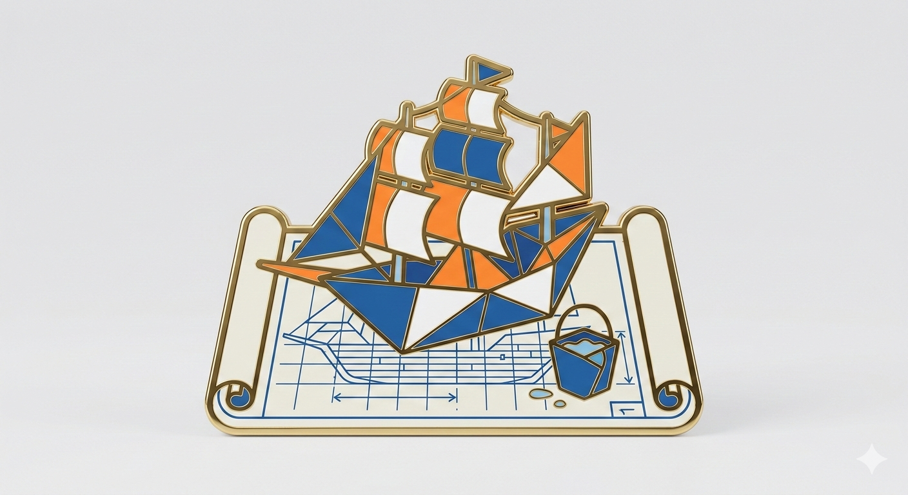

<p align="center">
  
</p>

# GitLab CI/CD and Documentation

Makes Claude better at GitLab work: writing pipelines, creating GLFM documentation, and testing
locally with `gitlab-ci-local` before pushing.

## Problem

When working with GitLab projects, Claude sometimes:

- Writes pipelines that fail validation or miss caching and parallelization opportunities
- Creates README files with Markdown syntax that doesn't render correctly in GitLab (wrong alert format, broken Mermaid)
- Suggests pushing untested pipeline changes instead of running them locally first
- Misses GitLab-specific features like CI Steps, collapsible sections, and coverage report integration

## Installation

First, add the marketplace (one-time setup):

```bash
/plugin marketplace add Jamie-BitFlight/claude_skills
```

Then install the plugin:

```bash
/plugin install gitlab-skill@jamie-bitflight-skills
```

## Quick Start

The skill activates automatically for GitLab tasks. Just describe what you need:

```text
"Add a test stage to the pipeline with proper caching"
"Create a README for this GitLab project"
"Test this pipeline locally before pushing"
"Add a collapsible troubleshooting section to the docs"
"Why is my Docker-in-Docker job failing?"
```

## What Changes

### CI/CD Pipelines

With this skill, Claude:

- Validates `.gitlab-ci.yml` syntax before committing
- Implements dependency-based cache keys to minimize build time
- Uses masked variables for all sensitive data
- Defines timeout limits on every job
- Tests pipeline changes locally with `gitlab-ci-local` before suggesting a push
- Uses the `.gitlab-ci.yml` `include` feature for modular configurations
- Optimizes job dependency graphs to prevent unnecessary execution

### GitLab Flavored Markdown (GLFM)

Claude uses correct GLFM syntax that renders in GitLab:

```markdown
> [!important]
> This requires authentication tokens to be configured.
```

```markdown
<details>
<summary>Troubleshooting</summary>

Full content here — renders as collapsible in GitLab.
</details>
```

Mermaid diagrams, task lists, and footnotes use GitLab-specific rendering rules.

### Local Pipeline Testing (Domain 3)

Instead of push-and-wait, Claude guides local testing with `gitlab-ci-local`:

```bash
# Install
npm install -g gitlab-ci-local

# Test a specific job
gitlab-ci-local <job-name>

# Run all jobs
gitlab-ci-local
```

Covers authentication token setup, project-specific variable files, and debugging job failures locally.

## Example

**Without this plugin:** You ask "add a security note to the README". Claude writes standard
Markdown that displays as a plain blockquote in GitLab.

**With this plugin:** Claude writes GLFM alert syntax that renders with a warning icon:

```markdown
> [!warning]
> Running this in production requires the CI_DEPLOY_TOKEN variable to be set.
```

## Reference

| Domain | Triggers |
|--------|----------|
| CI/CD Pipelines | `.gitlab-ci.yml` files, caching, DinD, CI Steps, job optimization |
| GLFM Documentation | README files, wiki pages, MR descriptions, alert blocks, Mermaid |
| Local Testing | `gitlab-ci-local`, job debugging, artifact validation, variable setup |

## What's Included

- CI/CD configuration patterns and optimization strategies with reference guides
- Complete GLFM syntax documentation (alerts, collapsible sections, diagrams, task lists)
- `gitlab-ci-local` testing setup and usage guide
- GitLab CI Steps composition reference
- Pipeline optimization guide (caching strategies, job parallelization, Docker optimization)

## Requirements

- Claude Code v2.0+
- `gitlab-ci-local` for local testing (`npm install -g gitlab-ci-local`)

---

> **The Ancient Woe**
>
> *The chaotic shipyard where three different foremen are building the same galleon backwards, with no master ledger to unite their labor or test the timber.*

> **The Bard's Decree**
>
> *"Summon the Grand Overseer! We require a master scroll that maps the laying of every plank, testing the hull's strength with buckets of water before the vessel ever dares touch the unforgiving sea!"*
