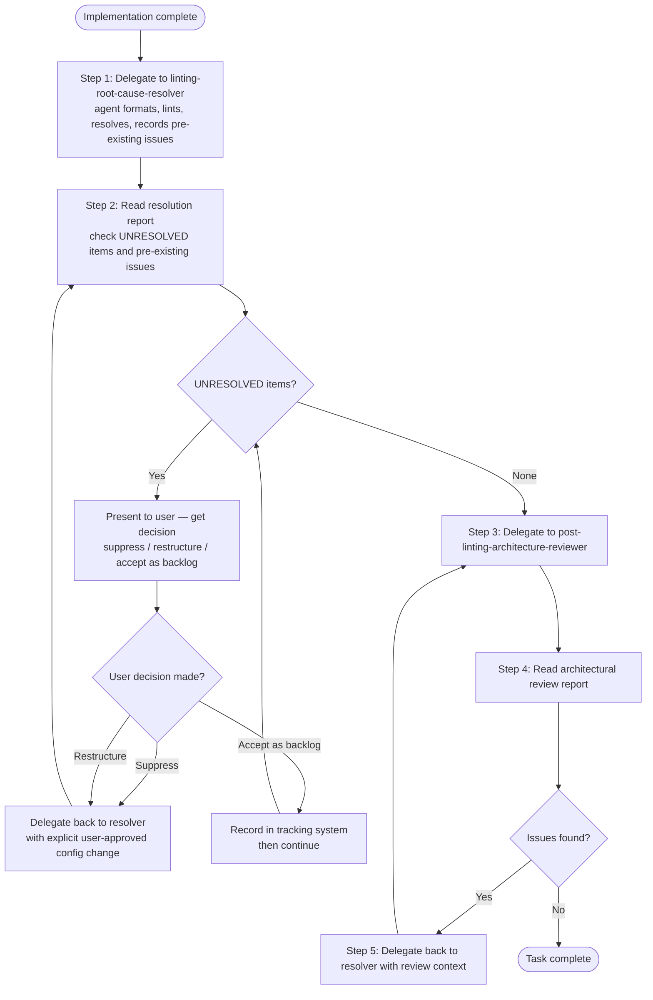

# Holistic Linting: Orchestrator Delegation

This skill provides orchestrator-specific workflows for delegating linting and resolution tasks to specialized agents.

## When to Use This Skill

Use this skill when you are an **orchestrator** (interactive Claude Code CLI) after completing implementation work. This skill guides delegation patterns for linting, quality checks, and architectural review.

**Do NOT use this skill** if you are a sub-agent executing a delegated task. Sub-agents should follow the linter-specific resolution workflows in the holistic-linting-resolver skill.

## Agent Delegation (Orchestrator Only)

### Complete Linting Workflow

**CRITICAL PRINCIPLE**: Orchestrators delegate work to agents. Orchestrators do NOT run formatting commands, linting commands, or quality checks themselves. The agent does ALL work (formatting, linting, resolution). The orchestrator only delegates tasks and reads reports to determine if more work is needed.

**WHY THIS MATTERS**:

- Pre-gathering linting data wastes orchestrator context window
- Running linters duplicates agent work (agent will run them again)
- Violates separation of concerns: "Orchestrators route context, agents do work"
- Creates context rot with linting output that becomes stale
- Prevents agents from gathering their own fresh context

The orchestrator MUST follow this delegation-first workflow:

**Step 1: Delegate to linting-root-cause-resolver immediately**

Delegate linting resolution WITHOUT running any linting commands first:

```text
Agent(
  agent="holistic-linting:linting-root-cause-resolver",
  prompt="Format, lint, and resolve any issues in <file_path>"
)
```

**What to delegate immediately, without pre-gathering data**:

- File path only — the agent discovers linters, runs formatters, and resolves issues autonomously
- The agent also applies the Pre-Existing Issues Protocol: any issue found in files outside the task scope gets classified (blocking vs. non-blocking) and recorded in the repo's tracking system

**Reason**: The agent follows systematic root-cause analysis workflows. It autonomously:

- Discovers project linters by scanning configuration files
- Runs formatters on modified files (ruff format, prettier, etc.)
- Executes linters to identify issues (ruff, mypy, pyright, etc.)
- Records pre-existing issues it finds to the repo's tracking system
- Researches rule documentation
- Traces type flows and architectural context
- Implements elegant fixes following python3-development patterns
- Verifies resolution by re-running linters
- Creates resolution artifacts in `.claude/reports/` and `.claude/artifacts/`

**Multiple Files Modified**:

Launch concurrent agents (one per file) WITHOUT pre-gathering linting data:

```text
Agent(agent="holistic-linting:linting-root-cause-resolver", prompt="Format, lint, and resolve any issues in src/auth.py")
Agent(agent="holistic-linting:linting-root-cause-resolver", prompt="Format, lint, and resolve any issues in src/api.py")
Agent(agent="holistic-linting:linting-root-cause-resolver", prompt="Format, lint, and resolve any issues in tests/test_auth.py")
```

**Reason for concurrency**: Independent file resolutions proceed in parallel, reducing total time.

**Step 2: Read resolution reports — check for UNRESOLVED items before proceeding**

After all linting agents complete, read each resolution report:

```claude
Read(".claude/reports/linting-resolution-[timestamp].md")
```

For each report, check these sections in order:

1. `**UNRESOLVED items:**` — if nonzero, surface each item to the user NOW (see below)
2. `## Pre-Existing Issues Recorded` — acknowledge what was found and where it was recorded
3. `**Issues after resolution:** 0` — confirm all touched files are clean

**If UNRESOLVED items exist**:

Present each UNRESOLVED item to the user with the constraint documented by the resolver. Ask for one of three decisions:

- **Suppress via config**: User approves a specific config change — delegate back to resolver with explicit instruction to apply the approved change
- **Restructure further**: User wants more investigation — delegate back to resolver with additional context
- **Accept as backlog item**: Record the issue in the repo's tracking system and continue

The task is NOT complete while UNRESOLVED items remain without a user decision. This is a hard gate.

**If all issues resolved and zero UNRESOLVED items**: proceed to Step 3.

**Step 3: Delegate to post-linting-architecture-reviewer**

After confirming zero UNRESOLVED items (or user decisions on each), delegate architectural review:

```text
Agent(
  agent="post-linting-architecture-reviewer",
  prompt="Review linting resolution for <file_path>"
)
```

**What the reviewer does**:

- Runs a four-part standards-degradation scan: inline suppression, config file degradation, UNRESOLVED items, before/after counts
- Verifies resolution quality (root cause addressed, no suppression, no deletions)
- Validates architectural implications (design principles, type safety, code organization)
- Identifies systemic improvements applicable across codebase
- Generates architectural review report

**Step 4: Read reviewer report**

The orchestrator reads the review report to determine if additional work is needed:

```bash
ls -la .claude/reports/architectural-review-*.md
```

Read the most recent review report:

```claude
Read(".claude/reports/architectural-review-[timestamp].md")
```

**Orchestrator's role**: Read reports and decide next steps. Do NOT run linting commands to verify agent's work.

**Step 5: If issues found, delegate back to linting agent**

If architectural review identifies problems with resolution:

```text
Agent(
  agent="holistic-linting:linting-root-cause-resolver",
  prompt="Address issues found in architectural review: .claude/reports/architectural-review-[timestamp].md

Issues identified:
- [Summary of finding 1]
- [Summary of finding 2]

Review report contains detailed context and proposed solutions."
)
```

**Step 6: Repeat review if needed**

After re-resolution, delegate to reviewer again:

```text
Agent(
  agent="post-linting-architecture-reviewer",
  prompt="Review updated linting resolution for <file_path>"
)
```

Continue workflow until architectural review reports clean results.

### Workflow Summary



**Key Principle**: Orchestrator delegates immediately and reads reports. Agent does ALL actionable work. Orchestrator does NOT run commands or gather linting data.

### Common Anti-Patterns to Avoid

**Pre-gathering linting data before delegating** — wastes orchestrator context and duplicates agent work:

```text
# Wrong:
Bash("ruff check src/auth.py")
Agent(agent="holistic-linting:linting-root-cause-resolver", prompt="Fix these errors: [pasted errors]")

# Correct:
Agent(agent="holistic-linting:linting-root-cause-resolver", prompt="Format, lint, and resolve any issues in src/auth.py")
```

**Skipping the UNRESOLVED check** — allows incomplete resolutions to reach the architecture reviewer:

```text
# Wrong:
# Agent completes → immediately delegate to reviewer

# Correct:
# Agent completes → read resolution report → check UNRESOLVED items → then delegate to reviewer
```

**Dismissing pre-existing issues** — every detected problem gets recorded:

```text
# Wrong:
# "The resolver found issues in other files — pre-existing, not our concern."

# Correct:
# Read the Pre-Existing Issues Recorded section of the resolution report.
# Confirm each issue was classified and recorded.
# If the tracking system was created fresh, acknowledge it.
```

**Verifying agent's work by running linters** — read reports instead:

```text
# Wrong:
Bash("ruff check src/auth.py")  # After agent completed

# Correct:
Read(".claude/reports/linting-resolution-[timestamp].md")
# Report shows agent already verified with before/after linter output
```

## Related Skills

- [holistic-linting](../holistic-linting/SKILL.md) - Core linting skill with linter detection and resource documentation
- [holistic-linting-resolver](../holistic-linting-resolver/SKILL.md) - Linter-specific resolution workflows for sub-agents
