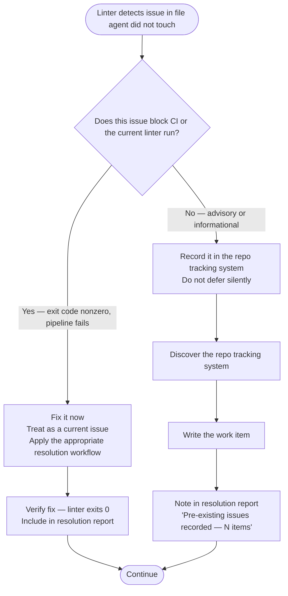
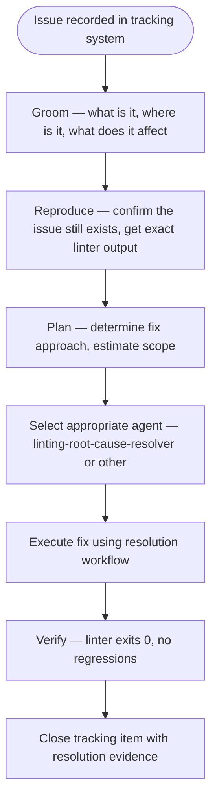

# Pre-Existing Issues Protocol

**Purpose**: Every issue a linter detects gets recorded. No detected problem silently disappears, regardless of whether the agent caused it.

## The Core Rule

When a linter run reveals issues in files the current agent did not modify, the phrase "pre-existing issues not related to my changes" is a trigger to act — not a reason to skip.

Two outcomes are possible. Apply the correct one based on whether the issue blocks the pipeline:



## Step 1 — Discover the Repo's Tracking System

Search for the tracking system in this priority order. Use the first one found:

```bash
# Check common tracking file locations
ls BACKLOG.md 2>/dev/null
ls .claude/tasks/ 2>/dev/null
ls .planning/ 2>/dev/null
ls TODO.md 2>/dev/null
ls TODO 2>/dev/null
ls docs/TODO.md 2>/dev/null
```

Also check:

- Any `*.backlog`, `*.todo`, or `*.tasks` files at repo root
- `.claude/BACKLOG.md`
- A `tasks/` or `planning/` directory at repo root
- GSD planning directories (`.gsd/`, `gsd/`)
- SAM task files (`sam.md`, `.sam/`)

**If no tracking system exists**: Create `BACKLOG.md` at the repo root using the format below. Note in the resolution report that you created it.

## Step 2 — Write the Work Item

Record each pre-existing issue with enough detail for future triage. Use the format appropriate to the tracking system found.

**For BACKLOG.md** (append each item):

```markdown
## [LINTING] <tool>: <rule-code> in <file>:<line>

- **Source**: Pre-existing issue discovered during linting session (YYYY-MM-DD)
- **Tool**: <ruff|mypy|pyright|bandit>
- **Rule**: <rule-code> — <one-line rule description>
- **Location**: `<file>:<line>`
- **Linter message**: `<exact message from linter output>`
- **Impact**: <blocking CI | advisory | informational>
- **Added**: YYYY-MM-DD
```

**For `.claude/tasks/` directories**: Write a file named `linting-<tool>-<rule>-<timestamp>.md` with the same fields.

**For TODO.md / TODO files**: Append a line:

```
- [ ] [LINTING] <tool> <rule-code> in <file>:<line> — <one-line description> (discovered YYYY-MM-DD)
```

## Step 3 — Report in the Resolution Summary

In the resolution report (`.claude/reports/linting-resolution-*.md`), include a section:

```markdown
## Pre-Existing Issues Recorded

Found N pre-existing issues during linting run. Recorded to <tracking-system-path>.

| File | Tool | Rule | Impact | Tracking Entry |
|------|------|------|--------|----------------|
| file.py:42 | ruff | F401 | advisory | BACKLOG.md#section |
```

If zero pre-existing issues were found, include:

```markdown
## Pre-Existing Issues

None detected in files outside the current task scope.
```

## The Triage Pipeline for Recorded Issues

Recording is step one. The full pipeline for a recorded issue, when it is later groomed:



This triage pipeline is outside the scope of the current linting session. The agent's responsibility is steps 1–3 above: detect, classify, record. Grooming and execution happen in a future session when the user prioritizes the item.

## What "Blocking" Means

A pre-existing issue is **blocking** if:

- The linter exits nonzero on a file the current task requires clean
- CI would fail on this issue (it is not in an `allowed-failures` list)
- The current task's verification step cannot pass while this issue exists

A pre-existing issue is **non-blocking** (record only) if:

- It is in a file completely unrelated to the current task
- The linter reports it as a warning, not an error
- It exists in a directory excluded from the current scope

When uncertain: treat as blocking and fix it. The cost of a false positive (fixing something that wasn't strictly required) is lower than the cost of a false negative (leaving a genuine blocker in place).
