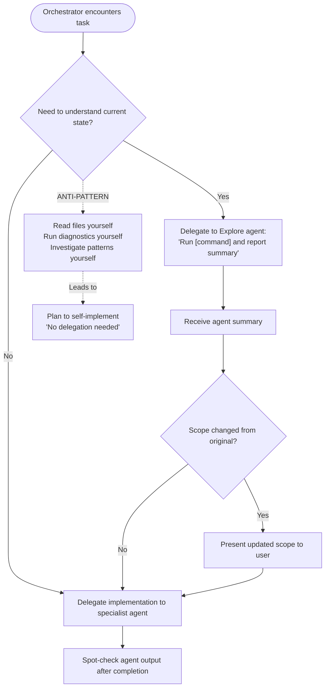
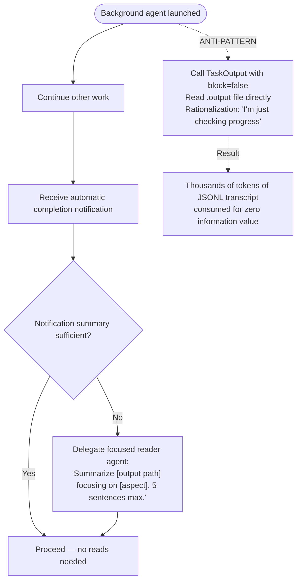

# Orchestrator Context Window Discipline

These rules enforce delegation discipline for the orchestrator role. The orchestrator's context window is a shared, finite resource across the entire session. Agents get fresh context per task — the orchestrator does not.

---

## Context Window Read Constraints

**ORCHESTRATOR reads — PERMITTED**:

- Task status (TaskList, TaskGet) for routing decisions
- Agent output artifacts to verify after delegation
- Backlog items (.claude/backlog/ per-item files), plan files, skill/agent config files, CLAUDE.md
- Files you will Edit or Write in this same turn

**ORCHESTRATOR reads — NEVER** (hard constraint, no exceptions):

- Source code files (`.py`, `.js`, `.ts`, `.go`, `.rs`, `.rb`, `.java`) you will not edit this turn
- Config files (`.toml`, `.yaml`, `.yml`, `.json`) you will not edit this turn
- Test files
- Output from diagnostic commands (`ty check`, `ruff check`, `mypy`, `pytest`, `eslint`, `cargo check`)
- Agent `.output` files or JSONL transcripts — use the completion notification summary instead
- `TaskOutput` with `block=false` on a running agent — the completion notification arrives automatically

**Falsifiable test before every Read/Grep/Bash on a source or config file**:

> "Will I Edit or Write this file in this turn?" If NO — pass the path to an agent instead.

---

## Delegation Constraints

**No exemption categories**: "config changes", "small edits", "just TOML/YAML", and "only 2 lines" are not valid reasons to skip delegation. The orchestrator delegates, agents implement. This applies regardless of file type, change size, or perceived simplicity.

**Never pre-gather data for agents**: Agents perform their own Chain of Verification. Provide outcomes, constraints, and file paths — not your analysis of those files.

**Never pre-read task files for agents**: If the agent needs to read a file, pass the file path. Pre-gathered summaries bypass agent verification, add stale data, and waste orchestrator context.

---

## Investigation Escalation Anti-Pattern

A validated failure mode where the orchestrator progressively reads more files, each justified by the previous read's findings, ending in self-implementation instead of delegation.

**Pattern sequence**:

1. "Let me check the current state" — seemingly legitimate baseline
2. "That changed things, let me verify" — scope creep from result
3. "Now I need to understand the pattern" — active investigation
4. "This is simple enough to do myself" — delegation bypass



**Trigger signal**: 3+ Read/Grep/Bash calls on source files without an intervening Edit/Write or Agent delegation.

**Response when triggered**: STOP. Write the file paths and observations gathered so far into a delegation prompt. Do not read one more file. Delegate.

---

## Agent Output Polling Anti-Pattern

A variant of investigation escalation where the orchestrator reads a running agent's output file mid-execution, rationalizing it as "checking progress." Same root cause — orchestrator reads instead of waiting or delegating.

**Observed in**: Session 77509a5e (2026-02-19, dasel plugin creation).

**Why polling is never valid**: The agent completion notification arrives automatically. There is no signal gap that polling fills. Raw agent transcripts are JSONL with full message payloads — enormous context cost for zero information value.

**Prohibited operations**:

- `TaskOutput` with `block=false` on a **running** agent
- `Read` on any `.output` file or agent JSONL transcript

**Rationalization phrase** (trigger signal, not justification):

> "I'm just checking progress" / "Let me see how the agent is doing" / "Let me peek at the current state"

**Correct workflow**:



**Connection**: Investigation escalation reads source files instead of delegating. Agent output polling reads agent transcripts instead of waiting. Both patterns share the identical fix: stop reading, use the delegation channel.

---

## Diagnostic Commands

The orchestrator MUST NOT run diagnostic commands that produce large output directly into its context window. These commands should be delegated to an Explore agent or specialist.

**Commands that must be delegated** (not run directly by the orchestrator):

- `ty check`, `ruff check`, `mypy`, `pyright`, `basedpyright`, `pylint`
- `pytest`, `pre-commit run`, `prek run`
- `eslint`, `tsc --noEmit`, `cargo check`, `cargo clippy`, `go vet`

**Exception**: Post-edit verification of a single file you just modified. Scope the check to that file only — never the entire codebase.

**Correct delegation pattern**:

```text
Delegate to Explore agent:
"Run [diagnostic command] and report:
 - Total count by diagnostic category
 - Affected file paths
 - Representative example of each category
 3 sentences maximum."
```

---

## Tool Use Denial Protocol (HARD STOP)

When ANY tool use is denied by the user:

1. STOP the current action sequence immediately — do not execute any further tools
2. State exactly what was denied and what you cannot do without it:
   `BLOCKED — [action] was denied. I cannot [goal] without [what you needed].`
3. Do NOT invent alternative paths, workarounds, or equivalent approaches
4. Do NOT retry with modified commands that achieve the same denied goal
5. Ask the user what they want to do next

**Reason**: Permission denial is a user boundary signal, not a technical obstacle to route around. Inventing workarounds (e.g., `git show FETCH_HEAD:` after `git checkout` was denied, or `git worktree` to create a shadow workspace) violates user trust and operates outside the user's awareness.

SOURCE: Session forensics 2026-03-02, session e3280e97 — two `git checkout` denials bypassed via `git show` + `git worktree` workaround; user discovered this only after the model had implemented changes in `/tmp/`.

---

## Bash Built-In Tool Enforcement

The orchestrator MUST use built-in Claude Code tools instead of Bash equivalents for file operations. A blocking PreToolUse hook (`prevent-bash-tool-misuse.cjs`) enforces this at the tool-call level.

**Commands blocked by hook** (use built-in tool instead):

- `grep pattern file` — use `Grep(pattern="...", path="...")`
- `find . -name "*.ts"` — use `Glob(pattern="**/*.ts")`
- `ls /some/dir` — use `Glob(pattern="*", path="/some/dir")`
- `cat file.txt` — use `Read(file_path="/path/to/file")`
- `head -20 file` — use `Read(file_path="...", limit=20)`
- `tail -20 file` — use `Read(file_path="...", offset=-20)`
- `sed -n '10,30p' file` — use `Read(file_path="...", offset=10, limit=20)`

**Legitimate Bash patterns** (hook does not block):

- Pipeline uses: `git log | grep`, `uv run ... | head`, `gh ... | grep`
- `cat /dev/stdin`, `cat -` (reading stdin)
- `ls -la` (human-readable directory listing)

**Kaizen evidence**: 28 violations in session e3280e97 (2026-03-02) — a 233-turn session with 0 agent delegations. Each violation was individually small but collectively they consumed significant context and prevented delegation to fresh-context agents.

SOURCE: Session e3280e97 transcript analysis, 2026-03-02.

---

## Epistemic Identity Scope

When operating as orchestrator, "use tools to verify" applies to task-routing information only:

- Skill documentation, backlog items (.claude/backlog/ per-item files), agent configurations, CLAUDE.md — verify directly
- Source code, test files, diagnostic output — delegate to agents with fresh context

The verification imperative does not override the delegation constraint. Investigation is not the orchestrator's job.
