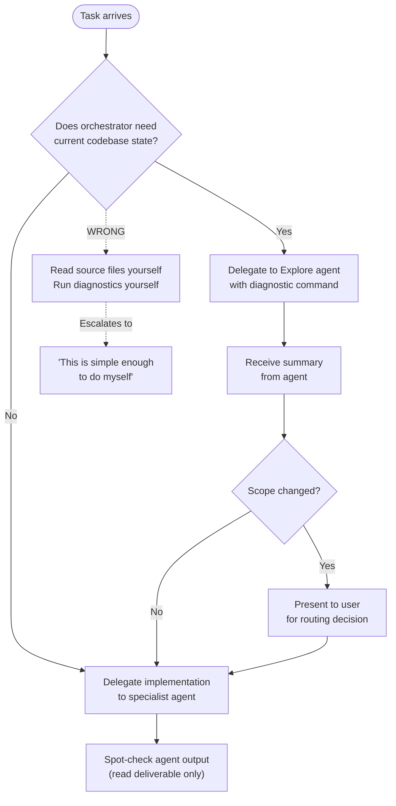

# Orchestrator Discipline

Enforce delegation discipline for the orchestrator role in multi-agent Claude Code workflows. The orchestrator's context window is a shared resource across the entire session — agents get fresh context per task, the orchestrator does not.

## What This Plugin Provides

### 1. PreToolUse Hooks (Structural Enforcement)

Two hooks fire automatically on every tool call:

**Source File Read Warning** — fires on `Read` and `Grep` targeting source/config/test files (`.py`, `.toml`, `.yaml`, `.json`, etc.). Injects a decision-point reminder asking: "Will you Edit/Write this file this turn?"

**Diagnostic Command Gate** — fires on `Bash` calls matching diagnostic commands (`ty check`, `ruff check`, `mypy`, `pytest`, `eslint`, `cargo check`, etc.). Reminds the orchestrator to delegate the command to an Explore agent instead.

**Bash Built-In Tool Enforcement Gate** — fires on `Bash` calls that should use built-in Claude Code tools (`Read`, `Grep`, `Glob`). **Blocking** — exits 2 to prevent the command and redirect to the correct tool. SOURCE: 28 violations in session e3280e97 (2026-03-02).

The Source File Read Warning and Diagnostic Command Gate are **non-blocking** — they inject `additionalContext` to surface the decision, not prevent it. The Bash Built-In Tool Enforcement Gate is **blocking** — it exits 2 to structurally enforce the rule.

### 2. Rules (Behavioral Constraints)

The `rules/CLAUDE.md` file is loaded into every session and provides:

- Read permission/prohibition lists with a falsifiable test
- Delegation constraint definitions (no exemption categories)
- Investigation escalation anti-pattern documentation
- Tool use denial protocol (HARD STOP — no workarounds)
- Bash built-in tool enforcement with kaizen evidence
- Diagnostic command delegation patterns
- Epistemic identity scoping for orchestrator role

### 3. Reference Material

See [Investigation Escalation Anti-Pattern](./references/investigation-escalation.md) for the detailed pattern analysis, root cause diagnosis, and correct workflow alternatives.

## When to Activate

This skill auto-loads via the plugin's hooks and rules. Manual activation is useful when:

- Reviewing whether the orchestrator is following delegation discipline
- Diagnosing context window waste in a session
- Training new orchestrator configurations on delegation patterns

## Correct Orchestrator Workflow

## Hook Behavior Reference

### Source File Read Warning

**Triggers on**: `Read` or `Grep` where target path matches:

- Extensions: `.py`, `.toml`, `.yaml`, `.yml`, `.js`, `.ts`, `.jsx`, `.tsx`, `.json`, `.cfg`, `.ini`, `.env`, `.sh`, `.bash`, `.go`, `.rs`, `.rb`, `.java`, `.c`, `.cpp`, `.h`, `.hpp`
- Test paths: directories named `test/`, `tests/`, `spec/`, `__tests__/`, or files matching `test_*.py`

**Does NOT trigger on**: `.md`, `.txt`, plan files, backlog items, CLAUDE.md, skill definitions

### Bash Built-In Tool Enforcement Gate

**Triggers on**: `Bash` where command matches Bash-equivalent file operations:

- `grep` at start of command (standalone, not pipeline)
- `find ... -name` patterns
- `ls` at start of command (not `ls -la`)
- `cat file.ext` (file reads, not stdin)
- `head -N`, `tail -N file.ext`, `sed -n 'N,Mp'`

**Blocking**: YES — exits with code 2 to prevent the command and provide redirect message.

**Does NOT trigger on**: Pipeline uses (`git log | grep`, `uv run | head`), `cat /dev/stdin`, `cat -`, `ls -la`

SOURCE: 28 violations observed in session e3280e97 (2026-03-02); installed as structural enforcement.

### Diagnostic Command Gate

**Triggers on**: `Bash` where command matches:

- Python: `ty check`, `ruff check`, `mypy`, `pyright`, `basedpyright`, `pylint`, `pytest`
- JavaScript/TypeScript: `eslint`, `tsc --noEmit`
- Rust: `cargo check`, `cargo clippy`
- Go: `go vet`
- Meta: `pre-commit run`, `prek run`

**Does NOT trigger on**: `git status`, `ls`, `wc`, `uv run` (without diagnostic subcommand), or any non-diagnostic bash command
