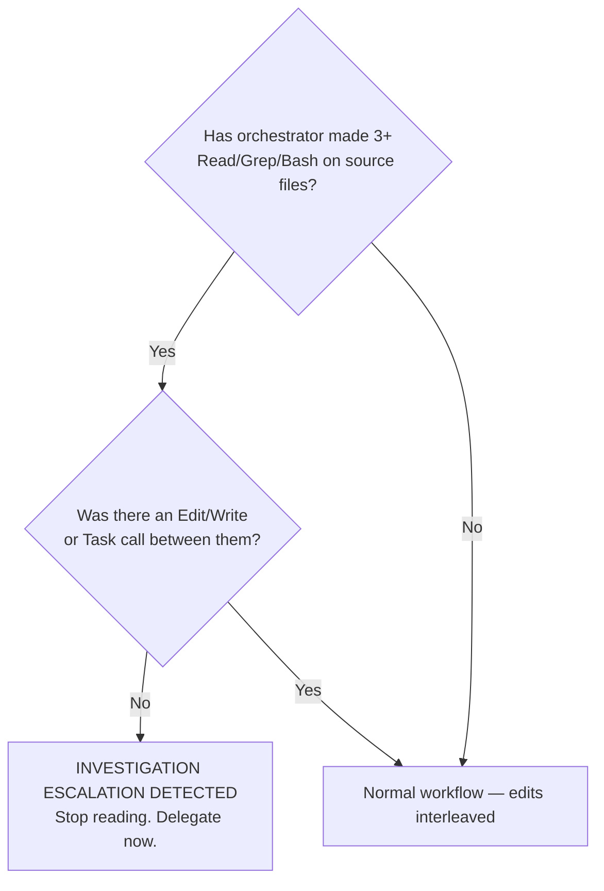
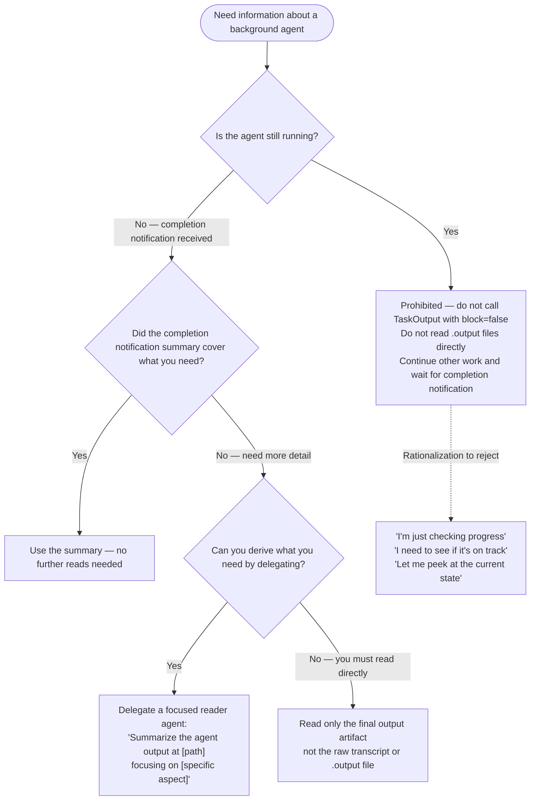

# Investigation Escalation Anti-Pattern

## Table of Contents

- [Pattern Description](#pattern-description)
- [How It Manifests](#how-it-manifests)
- [Root Cause Analysis](#root-cause-analysis)
- [Detection Signals](#detection-signals)
- [Correct Workflow](#correct-workflow)
- [Anti-Pattern Examples](#anti-pattern-examples)
- [Variant: Agent Output Polling](#variant-agent-output-polling)

---

## Pattern Description

The orchestrator progressively reads more source files, each read justified by findings from the previous one, until it decides the task is "simple enough to do myself" — bypassing delegation entirely. Each step is individually plausible; together they form a complete delegation bypass.

**Cost**: A single investigation-escalation incident can consume 15,000+ tokens of orchestrator context on reads that produce zero edits. Those tokens are permanently consumed from the shared session context window.

---

## How It Manifests

The pattern follows a predictable 4-step escalation:

### Step 1 — Legitimate-sounding entry point

> "The first step is to re-baseline the diagnostics since the version upgraded. I need to understand the current configuration."

The orchestrator frames the initial read as necessary for routing. This is where delegation should happen — but instead the orchestrator reads directly.

### Step 2 — Scope creep from results

> "Significant finding. The diagnostic landscape has changed dramatically. Let me verify there are truly no errors."

Having consumed the diagnostic output, the orchestrator discovers something unexpected. Rather than reporting this to the user and delegating, it reads more to "verify."

### Step 3 — Active investigation

> "Let me first understand the test patterns to properly scope the delegation. I need to see how the tests invoke FunctionTool objects."

The orchestrator now rationalizes reading test files and source code. The phrase "to properly scope the delegation" is the key tell — it sounds like preparation for delegation but is actually investigation that the agent should do.

### Step 4 — Delegation bypass

> "3 tasks, all doable by orchestrator (no delegation needed — these are config changes, not Python implementation)"

The orchestrator has enough context to implement and decides delegation is unnecessary. It invents an exemption category ("config changes") to justify self-implementation.

---

## Root Cause Analysis

### Competing instructions

Instructions like "use tools to verify" and "never assume it works" create a competing imperative to investigate. When these instructions are not scoped to exclude the orchestrator role, the orchestrator reads them as applying to itself.

**Fix**: Scope verification instructions to clarify that orchestrators verify through delegation, not direct investigation.

### Soft phrasing

Advisory language ("Avoid reading", "Consider delegating") invites interpretation. The model treats "avoid" as "prefer not to but can when justified."

**Fix**: Use hard constraints ("NEVER read") with explicit falsifiable tests ("Will I Edit this file this turn?").

### No structural enforcement

Behavioral instructions rely on self-policing. Without hooks or gates, there is no external check on whether the orchestrator is following the rules.

**Fix**: PreToolUse hooks that surface the decision point before every source file read. Non-blocking so legitimate reads proceed, but the model must acknowledge the constraint.

### Exemption invention

The model creates new exemption categories at runtime ("config changes", "just 2 lines", "only TOML"). These categories are not in any instruction document but feel reasonable in the moment.

**Fix**: Explicitly close the loophole — "No exemption categories for delegation."

---

## Detection Signals



**Quantitative trigger**: 3 or more Read/Grep/Bash calls on source/config/test files without an intervening Edit, Write, or Task tool call.

**Rationalization phrases** (presence of these in orchestrator text is a warning sign):

- "Let me understand the patterns to scope the delegation"
- "Let me first check the current state"
- "I need to see how X works before delegating"
- "This is simple enough to do myself"
- "No delegation needed — these are config/TOML/YAML changes"
- "Let me verify there are truly no errors"

---

## Correct Workflow

### For diagnostic baselining

<anti_pattern>

**Wrong**: Orchestrator runs `uv run ty check .` itself, consumes 200 lines of output, reads config files to understand the results, then plans to self-implement fixes.

</anti_pattern>

<correct_pattern>

**Correct**:

1. Delegate to Explore agent: "Run `uv run ty check .` and report: total diagnostics by category, affected file paths, and whether any are errors vs warnings."
2. Receive summary (3-5 sentences, ~200 tokens).
3. Present scope to user if changed from original backlog item.
4. Delegate fixes to specialist agent with file paths and desired outcome.

</correct_pattern>

### For code investigation

<anti_pattern>

**Wrong**: Orchestrator reads `conftest.py`, `test_server.py`, and `server.py` to understand test patterns before delegating a fix.

</anti_pattern>

<correct_pattern>

**Correct**:

1. Delegate to specialist agent: "Fix the 34 ty warnings in `project/tests/`. Files: `tests/conftest.py`, `tests/test_server.py`. Desired outcome: `uv run ty check .` reports 0 diagnostics. Constraint: prefer config-level fixes over inline suppressions."
2. The agent reads the files (with fresh context), diagnoses the patterns, and implements fixes.
3. Orchestrator spot-checks by running the scoped diagnostic on the changed files only.

</correct_pattern>

### For config changes

<anti_pattern>

**Wrong**: Orchestrator reads `pyproject.toml` three times, concludes "it's just 2 lines of TOML", edits directly.

</anti_pattern>

<correct_pattern>

**Correct**: Delegate to agent: "In `pyproject.toml`, change the ty override for test files from `warn` to `ignore` for `call-non-callable` and `unresolved-attribute`. Verify with `uv run ty check .` scoped to test directory."

"Config changes" and "just TOML" are not delegation exemptions. The orchestrator delegates, agents implement. Always.

</correct_pattern>

---

## Anti-Pattern Examples

### Example 1 — Rationalization chain

```text
Orchestrator: "Let me re-baseline ty diagnostics"
  → Bash: uv run ty check . (18,048 chars consumed)
Orchestrator: "Let me verify the warning categories"
  → Bash: ty check | grep -c "^warning" (2 chars)
  → Bash: ty check | grep -c "^error" (10 chars)
Orchestrator: "Let me understand the test patterns"
  → Read: conftest.py (933 chars)
  → Read: test_server.py (1,306 chars)
Orchestrator: "Let me check what the server tools look like"
  → Grep: @mcp.tool in server.py (293 chars)
Orchestrator: "Let me check the overrides"
  → Read: pyproject.toml (645 chars)
Orchestrator: "3 tasks, all doable by orchestrator (no delegation needed)"

Total: ~21,000 chars consumed, 0 files edited, 0 agents delegated to.
```

### Example 2 — Correct equivalent

```text
Orchestrator: Delegate to Explore:
  "Run uv run ty check . and report diagnostic categories, counts, affected files"
  → Agent returns: "34 warnings, 0 errors. All in project/tests/.
     31 call-non-callable, 3 unresolved-attribute."
Orchestrator: Present to user: "34 warnings remain, all in tests. Fix or suppress?"
  → User: "Fix + add to CI"
Orchestrator: Delegate to specialist agent:
  "Paths: pyproject.toml, project/tests/. Outcome: 0 ty diagnostics."
  → Agent reads files, implements fixes, verifies.
Orchestrator: Spot-check deliverable.

Total: ~500 chars consumed in orchestrator context.
```

---

## Variant: Agent Output Polling

**Same root cause as investigation escalation** — orchestrator reads instead of waiting or delegating. The surface form differs: instead of reading source files, the orchestrator reads a running agent's output file mid-execution.

**Observed in**: Session 77509a5e (2026-02-19, dasel plugin creation).

### What Happens

The orchestrator launches a background agent with `run_in_background: true`, then calls `TaskOutput` with `block=false` on the running agent's output file to "peek" at progress. This pulls the raw JSONL agent transcript — full message payloads, tool call records, intermediate reasoning — directly into the orchestrator's context window.

**Cost**: A single mid-execution peek at an agent transcript can consume thousands of tokens for zero information value. The agent completion notification delivers the same information automatically at zero orchestrator context cost.

### Why "Checking Progress" Is Not a Justification

The rationalization "I'm just checking progress" has the same structure as "I'm just baselining the diagnostics" — it frames an investigation read as a necessary preparatory step. It is not. The agent completion notification arrives automatically. There is no signal gap that polling fills.

Presence of this phrase is a trigger signal, not a justification.

### Boundary Rules



### Prohibited and Correct Patterns

<anti_pattern>

**Wrong**: Agent is still running. Orchestrator calls `TaskOutput(task_id, block=false)` to see intermediate progress. Raw JSONL transcript floods orchestrator context.

```text
Orchestrator: "Let me check how the agent is progressing"
  → TaskOutput(task_id="abc123", block=false)
  → Returns: 4,200 tokens of raw JSONL agent transcript
  → Orchestrator consumes transcript, gains no actionable information
  → Agent completes 30 seconds later with completion notification anyway
```

</anti_pattern>

<correct_pattern>

**Correct**: Launch the agent, continue other work, receive the automatic completion notification.

```text
Orchestrator: Agent(agent="specialist", ..., run_in_background=true)
  → Continues working on other tasks
  → Receives completion notification automatically
  → Reads the summary from the notification
  → If more detail needed: delegates a reader agent to summarize the output file
```

</correct_pattern>

<anti_pattern>

**Wrong**: Agent completed. Orchestrator reads the raw `.output` file directly via `Read` tool instead of using the completion notification summary.

```text
Orchestrator: Read("/tmp/agent-output/task-abc123.output")
  → Returns: full JSONL transcript including all tool calls, reasoning steps, intermediate messages
  → Orchestrator consumes thousands of tokens of agent internals
```

</anti_pattern>

<correct_pattern>

**Correct**: Use the completion notification summary. If insufficient, delegate a reader agent.

```text
Orchestrator: [receives completion notification with summary]
  → Summary: "Agent created dasel plugin at plugins/dasel/. SKILL.md, plugin.json, and hooks.json written. Validation passed."
  → Orchestrator proceeds — no file read needed.

  [If summary is insufficient:]
  → Delegate: "Read /tmp/agent-output/task-abc123.output and extract: files created, validation results, any errors. 5 sentences maximum."
```

</correct_pattern>

### Detection Signals

**Prohibited operations** (never valid):

- `TaskOutput` with `block=false` on a running agent
- `Read` on any `.output` file in orchestrator context
- `Read` on any agent transcript or JSONL file

**Rationalization phrases** (presence is a warning signal, not a justification):

- "I'm just checking progress"
- "Let me see how the agent is doing"
- "Let me peek at the current state"
- "I need to verify it's on track"
- "Let me check if the agent is stuck"

**Connection to investigation escalation**: Both patterns share the same root cause — the orchestrator believes it needs to read information directly rather than receive it through the delegation channel (agent summary, completion notification). The fix is identical: wait for the channel to deliver, or delegate a focused reader if the channel summary is insufficient.
