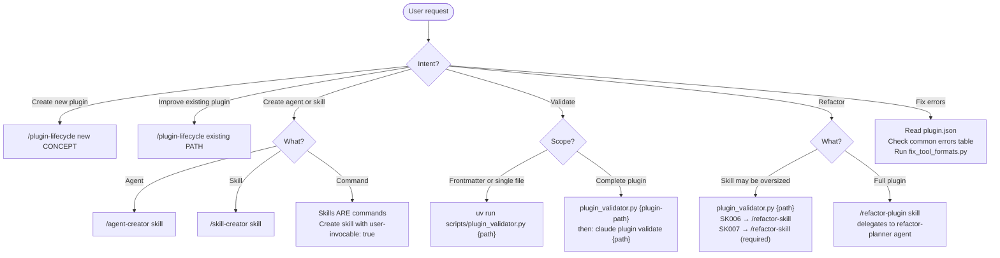

# Plugin-Creator Plugin — AI-Facing Documentation

Complete plugin development toolkit for creating, refactoring, and validating Claude Code plugins, agents, skills, and commands.

---

## When to Use This Plugin

Activate when any condition matches:

- User asks to create a new plugin, agent, skill, or command
- User asks to validate frontmatter, plugin structure, or skill complexity
- User asks to refactor a plugin or split an oversized skill
- User asks to check skill size or complexity
- User needs to fix tool formatting issues in frontmatter
- Editing files in `plugins/`, `.claude/`, `AGENTS.md`, or `CLAUDE.md` within this plugin

---

## Usage Patterns



---

## Plugin Identity

**Name:** `plugin-creator` | **Version:** 2.3.0

**Core Capabilities:**

- Create new plugins (via `create_plugin.py` script)
- Create new agents (via `/agent-creator` skill)
- Create new skills (via `/skill-creator` skill)
- Refactor plugins and skills
- Validate frontmatter, plugins, and structure
- Quality analysis and improvement

---

## Component Inventory

### Skills (13)

| Skill | User-Invocable | Purpose |
|-------|---------------|---------|
| `/plugin-lifecycle` | Yes | Full plugin lifecycle orchestration — assess, research, design, create, debug, optimize, verify |
| `/plugin-creator` | Yes | New-plugin creation workflow — complements `/plugin-lifecycle` for existing plugins |
| `/agent-creator` | Yes | Create agents from scratch or templates; handles scope (project/user/plugin) |
| `/skill-creator` | Yes | Create skills from scratch or templates; handles scope and validation |
| `/claude-skills-overview-2026` | Yes | Complete reference for Claude Code skills system (January 2026) |
| `/claude-plugins-reference-2026` | Yes | Complete reference for Claude Code plugins system (January 2026) |
| `/hooks-guide` | Yes | Cross-platform hooks reference — Claude Code, GitHub Copilot, Cursor, Windsurf, Amp |
| `/add-doc-updater` | Yes | Add doc sync pipeline to skills wrapping external documentation |
| `/assessor` | Yes | Analyze plugin structure and create refactoring task files |
| `/ensure-complete` | Yes | Validate refactoring completeness and create follow-up tasks |
| `/feature-discovery` | No | Research features and identify gaps (delegated) |
| `/implement-refactor` | Yes | Execute refactoring tasks with parallel orchestration |
| `/refactor-plugin` | Yes | Complete plugin refactoring workflow |
| `/refactor-skill` | Yes | Split oversized skills into smaller focused skills |
| `/start-refactor-task` | Yes | Execute individual refactoring tasks |

### Agents (6)

| Agent | Model | Tools | Purpose |
|-------|-------|-------|---------|
| `refactor-planner` | sonnet | Read, Grep, Glob, Write | Analyze plugins and create refactoring plans |
| `refactor-executor` | sonnet | Read, Write, Edit, Grep, Glob, Bash, Task | Execute refactoring tasks from plans |
| `refactor-validator` | sonnet | Read, Grep, Glob, Bash | Validate refactoring completeness and quality |
| `subagent-refactorer` | sonnet | Read, Write, Edit, Grep, Glob, WebFetch, WebSearch, Skill, MCP tools | Refactor Claude agents using Anthropic prompt engineering best practices |
| `contextual-ai-documentation-optimizer` | sonnet | (inherits) | Optimize prompts, SKILL.md, CLAUDE.md for Claude comprehension |
| `plugin-assessor` | sonnet | (inherits) | Analyze plugins for structure, frontmatter, and quality |

### Scripts (6)

| Script | Purpose |
|--------|---------|
| `create_plugin.py` | Interactive plugin scaffolding — creates `.claude-plugin/`, `plugin.json` |
| `plugin_validator.py` | Comprehensive validation with token metrics (frontmatter, links, complexity) |
| `ecosystem_registry.py` | stdlib-only module declaring frontmatter key ownership per ecosystem; used by FM009 auto-fix to skip ecosystem-owned blocks |
| `auto_sync_manifests.py` | Pre-commit hook — syncs plugin.json component arrays, bumps semver |
| `fix_tool_formats.py` | Fix invalid tool format patterns in frontmatter across codebase |
| `validate-task-file.sh` | Validate refactoring task file format |

---

## Workflow Reference

### Create New Plugin

```bash
uv run plugins/plugin-creator/scripts/create_plugin.py
```

Interactive scaffolding — prompts for name, description, author; creates `.claude-plugin/` directory; creates `plugin.json`; self-validates.

---

### Create New Agent

**Skill:** `/agent-creator`

**Trigger phrases:** "Create a new agent", "Add an agent to {plugin}", "I need an agent for {task}"

**Process:**
1. Discovery — reads existing agents in `.claude/agents/`, identifies templates
2. Requirements gathering — uses AskUserQuestion for: purpose, triggers, tools, model, skills
3. Template selection — existing project agents, role archetypes, or from scratch
4. Agent file creation — frontmatter with validated fields, body with workflow
5. Scope determination (AskUserQuestion): project → `.claude/agents/{name}.md` | user → `~/.claude/agents/{name}.md` | plugin → `{plugin}/agents/{name}.md` + updates plugin.json
6. Validation — runs `plugin_validator.py` on agent file; if plugin agent: also runs `claude plugin validate {plugin-path}`

---

### Create New Skill

**Skills:** `/skill-creator` (primary), `/claude-skills-overview-2026` (reference)

**Trigger phrases:** "Create a new skill", "Add a skill to {plugin}", "I need a skill for {task}", "Create a slash command for {workflow}", "Build a skill that does {X}"

**Process:**
1. Load `/plugin-creator:skill-creator` — provides the complete skill creation workflow and init script
2. Load `/plugin-creator:claude-skills-overview-2026` — authoritative reference for frontmatter schema, invocation control, progressive disclosure
3. Follow the 7-step process in `/skill-creator`: understand examples → plan resources → determine location → initialize (init_skill.py) → edit → package (if plugin) → iterate
4. Scope determination: plugin → `plugins/{name}/skills/{skill-name}/` | project → `.claude/skills/{skill-name}/` | user → `~/.claude/skills/{skill-name}/`
5. Validation — runs `plugin_validator.py` on skill directory; if plugin skill: also runs `claude plugin validate {plugin-path}`

---

### Validate Plugin Components

**Script:** `plugin_validator.py`

```bash
# Validate single file
uv run plugins/plugin-creator/scripts/plugin_validator.py {path}

# Validate entire plugin directory
uv run plugins/plugin-creator/scripts/plugin_validator.py plugins/my-plugin

# Auto-fix issues
uv run plugins/plugin-creator/scripts/plugin_validator.py --fix {path}

# Validate only (no fixes)
uv run plugins/plugin-creator/scripts/plugin_validator.py --check {path}
```

**What it validates:**

- Frontmatter schema — YAML syntax, no forbidden multiline indicators (`>-`, `|-`), required fields, field types, tools/skills as comma-separated strings
- Plugin structure — plugin.json schema compliance, component path references, version consistency
- Skill complexity — token-based measurement; thresholds defined as `TOKEN_WARNING_THRESHOLD` (SK006) and `TOKEN_ERROR_THRESHOLD` (SK007) in `plugin_validator.py` — not as line counts
- Internal links — markdown link validity, progressive disclosure structure

**What it auto-fixes:**

- YAML arrays → comma-separated strings
- Multiline descriptions → single-line strings
- Unquoted colons in descriptions — adds quotes to prevent YAML parsing failures
- Missing `name:` fields in plugin skills (auto-adds from directory name; required per agentskills.io spec)

**Error Codes:** See [ERROR_CODES.md](./scripts/ERROR_CODES.md) for complete reference (23 codes across 9 validators)

---

### Validate Complete Plugin Structure

```bash
claude plugin validate {plugin-directory}
```

Validates: plugin.json exists in `.claude-plugin/`; JSON syntax valid; required field `name` present; `name` is kebab-case; all paths start with `./`; `agents` field is array of individual file paths (not directory string); referenced files exist.

---

### Refactor Plugin

**Skill:** `/refactor-plugin`

**Trigger phrases:** "Refactor {plugin-name} plugin", "Analyze plugin for refactoring", "Create refactoring plan for {plugin}"

**Process:**
1. Assessment — delegates to `refactor-planner` agent: analyzes structure, identifies oversized skills (SK006/SK007), checks agent description triggers, detects orphaned files, creates assessment report
2. Design — creates `refactor-design-{slug}.md` with strategy
3. Task planning — creates `tasks-refactor-{slug}.md`, maps dependencies, identifies parallelization
4. Execution — delegates to `refactor-executor` agent; runs parallel where possible; tracks completion
5. Validation — delegates to `refactor-validator` agent; verifies goals achieved; checks regressions

**Task types:**

| Type | Handler |
|------|---------|
| `SKILL_SPLIT` | `/plugin-creator:refactor-skill` skill |
| `AGENT_OPTIMIZE` | `subagent-refactorer` agent |
| `DOC_IMPROVE` | `contextual-ai-documentation-optimizer` agent |
| `DOC_UPDATER_ADD` | `/plugin-creator:add-doc-updater` skill |
| `ORPHAN_RESOLVE` | Manual or context optimizer |
| `STRUCTURE_FIX` | Direct implementation |

`DOC_UPDATER_ADD` applies when: skill wraps external documentation (API specs, CLI refs, frameworks); documentation source updates regularly (weekly, monthly); skill would benefit from automated sync.

---

### Split Oversized Skill

**Skill:** `/refactor-skill` | **Model:** opus (complex reasoning required)

**Trigger phrases:** "Split the {skill-name} skill", "Refactor oversized skill", "This skill exceeds the token limit"

**Process:**
1. Reads existing SKILL.md
2. Identifies logical boundaries and domains
3. Designs split plan
4. Generates new SKILL.md files for each extracted skill
5. Validates 100% content migration (no loss)
6. Creates cross-references between new skills
7. Updates original skill as facade/meta-skill

**Quality requirements:** No content loss, complete fidelity, backwards compatibility, all cross-references valid.

---

### Add Documentation Updater to Skill

**Skill:** `/add-doc-updater`

**Trigger phrases:** "Add doc sync to {skill}", "Automate documentation updates for {skill}", "This skill needs to wrap {external docs}"

**Process:**
1. Phase 0 — Variable Collection: validate target skill path; infer defaults (skill name, cooldown 7 days); collect 6 template variables via AskUserQuestion; confirm before proceeding
2. Phase 1 — Implementation: load `/python3-development`; substitute template variables; delegate to `@python-cli-architect`; creates `scripts/update-{LOCAL_DOC_DIR}-docs.py`
3. Phase 2 — Code Review: delegate to `@python-code-reviewer`; validate ReDoS-safe regex, atomic operations, link transformation; loop back to Phase 1 on failure
4. Phase 3 — Quality Gates: sequential `ruff format → ruff check → mypy → pyright → prek`; all must pass; loop back to Phase 1 on failure
5. Phase 4 — Testing: 7-point checklist (execution, file existence, Hugo shortcode removal, link sampling, SKILL.md integration, cooldown enforcement, force flag); loop back on failure
6. Phase 5 — Integration: update SKILL.md Execution Protocol section; add `.gitignore` entries; integration test via general-purpose agent; loop back if agent cannot discover documentation

**Success criteria:** Script passes all quality gates; all 7 validation tests pass; SKILL.md includes execution protocol; integration test demonstrates autonomous documentation access; cooldown prevents excessive upstream requests; force flag allows manual override.

---

### Fix Tool Formatting Issues

**Script:** `fix_tool_formats.py`

```bash
uv run plugins/plugin-creator/scripts/fix_tool_formats.py
```

Scans `~/.claude/agents/**/*.md`, `~/.claude/commands/**/*.md`, `~/.claude/skills/**/SKILL.md`, `~/repos/**/.claude/**` and fixes:
- YAML list → comma-separated string
- JSON array → comma-separated string

**Reason:** Invalid formats become "evidence" in future Grep searches, creating a feedback loop where the AI learns incorrect patterns from its own mistakes.

---

## Quality Standards

### Skill Size Limits

Run `uv run plugins/plugin-creator/scripts/plugin_validator.py <skill-path>` after writing and follow its guidance. Thresholds defined as `TOKEN_WARNING_THRESHOLD` (SK006) and `TOKEN_ERROR_THRESHOLD` (SK007) in `plugin_validator.py` — not line counts. SK006 triggers `references/` extraction; SK007 requires skill splitting.

- Frontmatter requirements: [`.claude/rules/frontmatter-requirements.md`](./.claude/rules/frontmatter-requirements.md)
- Plugin.json requirements: [`.claude/rules/plugin-json.md`](./.claude/rules/plugin-json.md)

---

## Plugin System Fundamentals

### Plugin Caching

Claude Code copies plugins to a cache directory — not used in-place.

- Plugins with `.claude-plugin/plugin.json`: the directory containing `.claude-plugin/` is copied recursively
- Plugins CANNOT reference files outside their directory (`../shared-utils` will fail after installation)

**Solutions for external dependencies:**
- Use symlinks within plugin directory (followed during copy): `ln -s /path/to/shared-utils ./shared-utils`
- Restructure marketplace: set `source` to the parent directory containing all required files

**SOURCE:** Lines 350-398 of claude-plugins-reference-2026/SKILL.md

### Installation Scopes

| Scope | Settings file | Use case |
|-------|--------------|---------|
| `user` | `~/.claude/settings.json` | Personal plugins across all projects (default) |
| `project` | `.claude/settings.json` | Team plugins shared via version control |
| `local` | `.claude/settings.local.json` | Project-specific plugins, gitignored |
| `managed` | `managed-settings.json` | Managed plugins (read-only, update only) |

**SOURCE:** Lines 401-410 of claude-plugins-reference-2026/SKILL.md

### Environment Variables

| Variable | Value | Usage |
|----------|-------|-------|
| `${CLAUDE_PLUGIN_ROOT}` | Absolute path to plugin directory | Reference scripts from commands |
| `${CLAUDE_PROJECT_DIR}` | Project root (where Claude Code started) | Project-relative paths |
| `$ARGUMENTS` | Command arguments from user | Passed to command's bash execution |

**SOURCE:** Lines 415-434 of claude-plugins-reference-2026/SKILL.md

---

## Script Execution Paths

```bash
# From anywhere in the repository:
uv run plugins/plugin-creator/scripts/plugin_validator.py {path}
uv run plugins/plugin-creator/scripts/create_plugin.py

# Script with path dependency:
./plugins/plugin-creator/scripts/validate-task-file.sh {path}
```

Scripts expect to be run from repository root or use `${CLAUDE_PLUGIN_ROOT}`.

---

## Automated Version Bumping (Implemented 2026-01-29)

The pre-commit hook `auto-sync-manifests` runs automatically on `git commit`:

1. Detects CRUD operations on plugins and components from git staged changes
2. Updates `plugin.json` component arrays (skills, agents, commands) with `./` paths
3. Bumps plugin versions — Major: component deleted; Minor: component added; Patch: component modified
4. Updates `marketplace.json` plugin registry
5. Stages updated manifest files automatically

```
Component Change → Plugin Version     → Marketplace Version
+ New skill      → Minor (0.1.0→0.2.0) → Patch (1.0.0→1.0.1)
- Delete agent   → Major (0.1.0→1.0.0) → Patch (1.0.0→1.0.1)
~ Modify command → Patch (0.1.0→0.1.1) → Patch (1.0.0→1.0.1)
+ New plugin     → N/A                  → Minor (1.0.0→1.1.0)
- Delete plugin  → N/A                  → Major (1.0.0→2.0.0)
```

Manual execution: `uv run -q --no-sync plugins/plugin-creator/scripts/auto_sync_manifests.py`

---

## Skill Name Field (Current Behavior)

Plugin skills **must include** the `name:` field in frontmatter. Value must match the directory name and satisfy `^[a-z][a-z0-9-]*$`.

```yaml
---
name: skill-creator
description: Guide for creating effective skills
user-invocable: true
---
```

`plugin_validator.py` auto-adds `name:` from the directory name when absent. Per [agentskills.io specification](https://agentskills.io/specification), `name:` is required for portability.

**Note on commands:** Skills and slash commands are unified — a skill with `user-invocable: true` creates a slash command. No separate command-creator is needed.

---

## Consolidated Agents (Added v2.6.0)

### subagent-refactorer

Refactors Claude Code subagents using Anthropic prompt engineering best practices. Used for `AGENT_OPTIMIZE` task types. Researches current Anthropic documentation before refactoring; applies strategic XML tagging; optimizes for model selection. Requires `prompt-optimization-claude-45` skill from separate plugin.

### contextual-ai-documentation-optimizer

Optimizes prompts, SKILL.md, and CLAUDE.md files for Claude comprehension. Used for `DOC_IMPROVE` and `ORPHAN_RESOLVE` task types. Applies positive framing; uses concrete examples; front-loads critical instructions. Requires `prompt-optimization-claude-45` skill from separate plugin.

### plugin-assessor

Analyzes plugins for structure, frontmatter, schema compliance, and quality. Comprehensive reference file audit (orphan detection); cross-reference validation; link graph analysis; frontmatter schema validation. Loads skills: `claude-skills-overview-2026`, `claude-plugins-reference-2026`, `hooks-guide`.

---

## CLI Commands Reference

```bash
# Install plugin
claude plugin install <plugin> [--scope user|project|local]

# Uninstall plugin
claude plugin uninstall <plugin> [--scope user|project|local]

# Enable/disable plugin
claude plugin enable <plugin> [--scope user|project|local]
claude plugin disable <plugin> [--scope user|project|local]

# Update plugin
claude plugin update <plugin> [--scope user|project|local|managed]

# Validate plugin
claude plugin validate <plugin-directory>

# Test without installation (session only)
claude --plugin-dir ./my-plugin
```

**SOURCE:** Lines 565-729 of claude-plugins-reference-2026/SKILL.md

---

## LSP Server Integration

Plugins can provide Language Server Protocol servers for real-time code intelligence.

**Configuration format (`.lsp.json` or inline in `plugin.json`):**

```json
{
  "lspServers": {
    "python": {
      "command": "pyright-langserver",
      "args": ["--stdio"],
      "extensionToLanguage": { ".py": "python" }
    }
  }
}
```

Required fields: `command` (LSP binary, must be in PATH), `extensionToLanguage` (maps extensions to language identifiers).

LSP servers require separate binary installation — plugins configure the connection, not the server itself.

**SOURCE:** Lines 271-347 of claude-plugins-reference-2026/SKILL.md

---

## Identified Gaps

### Gap 1: Incomplete Validation Coverage

- Frontmatter schema — validated via `plugin_validator.py`
- Plugin.json syntax — validated via `claude plugin validate`
- Skill complexity — token-based via `plugin_validator.py`
- Agent frontmatter — validated but agent-specific constraints not fully enforced
- Cross-references between components — not validated (e.g., agent references non-existent skill)

**Recommendation:** Extend validation to cover agent-specific checks and cross-reference validation.

---

## Related Plugins

- `prompt-optimization-claude-45` — required by `contextual-ai-documentation-optimizer` and `subagent-refactorer` agents
- `holistic-linting` — code quality and linting
- `python3-development` — Python-specific development patterns

---

## Version History

- **2.6.0** — Consolidated external agents: subagent-refactorer, contextual-ai-documentation-optimizer, plugin-assessor
- **2.5.0** — Added skill-creator and write-frontmatter-description skills
- **2.3.0** — Added claude-plugins-reference-2026 and hooks-guide reference skills
- **2.2.0** — Added claude-skills-overview-2026 reference skill
- **2.1.0** — Added agent-creator skill
- **2.0.0** — Merged plugin-creator and plugin-refactor
- **1.0.0** — Initial release

---

## Sources

- Plugin.json: `plugins/plugin-creator/.claude-plugin/plugin.json`
- Skills verified: All SKILL.md files read
- Agents verified: All 6 agent .md files read
- Scripts verified: All 5 scripts examined
- Official docs: claude-plugins-reference-2026 skill
- Verification date: 2026-01-28
