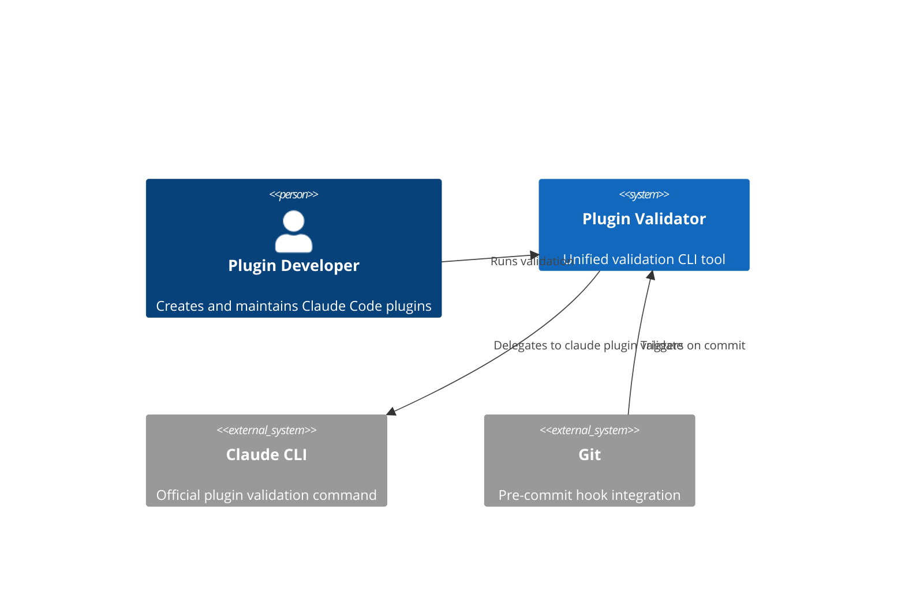
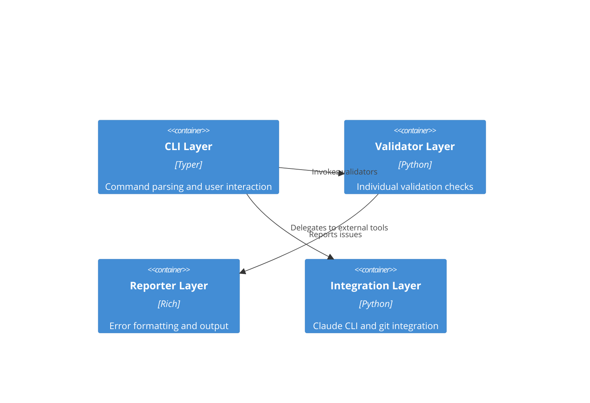

# Plugin Validator Architecture Specification

## Executive Summary

This specification defines the architecture for a consolidated cross-platform Python CLI tool that unifies all plugin validation functionality currently spread across multiple bash scripts and Python validators. The tool will validate plugin structure, frontmatter, complexity (using token-based metrics), internal links, and integrate with the Claude CLI when available.

**Design Philosophy**: Define WHAT to validate and HOW to report results, NOT HOW to implement validation logic. Implementation agents will apply current Python best practices and patterns.

---

## System Context



### Container Diagram



---

## Technology Stack

### Core Framework

**CLI Framework**: Typer 0.19.2+

- Includes Rich for terminal output
- Type-safe command parsing with Annotated syntax
- Built-in help generation

**Token Measurement**: tiktoken 0.9.0+

- Accurate complexity measurement
- cl100k_base encoding (GPT-4/Claude compatible)
- Replaces line-based metrics

**Type System**: Python 3.11+ native type hints

- No Optional[], use `str | None`
- No List[], use `list[str]`
- Pydantic for data validation (already used in validate_frontmatter.py)

**Configuration**: tomllib (stdlib for Python 3.11+)

- No external TOML library needed
- Pydantic-settings for validation

**Package Manager**: uv for dependency management and execution

### Distribution

**Packaging Strategy**: PEP 723 Standalone Script

- Single-file Python script with inline dependencies
- Shebang: `#!/usr/bin/env -S uv run --quiet --script`
- PEP 723 metadata block with requires-python and dependencies
- Executable permissions (chmod +x)
- Zero-install distribution

**Appropriate Use Case**: This tool has <1000 lines of code and minimal dependencies (typer, tiktoken, pyyaml already in use)

**Skill Reference**: Development agents should activate `Skill(command: "python3-development:shebangpython")` for PEP 723 compliance requirements

---

## Component Architecture

### CLI Layer (cli/)

**Purpose**: Command-line interface and argument parsing

**Technology**: Typer with Rich integration

**Command Interface**:

```python
app = typer.Typer(name="plugin-validator", help="Validate Claude Code plugins")

@app.command()
def main(
    path: Annotated[Path, typer.Argument(help="Path to plugin, skill, agent, or command file")],
    check: Annotated[bool, typer.Option("--check", help="Validate only, don't auto-fix")] = False,
    fix: Annotated[bool, typer.Option("--fix", help="Auto-fix issues where possible")] = False,
    verbose: Annotated[bool, typer.Option("--verbose", "-v", help="Show detailed validation output")] = False,
    no_color: Annotated[bool, typer.Option("--no-color", help="Disable color output")] = False,
) -> None:
    """Validate Claude Code plugins, skills, agents, and commands."""
```

**Exit Codes**:

- 0: Success (all checks passed, or only warnings)
- 1: Validation errors found
- 2: Command-line usage error
- 130: Interrupted by user (Ctrl+C)

**Output Requirements**:

- Use Rich tables for validation summaries
- Use Rich panels for error details
- Support --no-color for CI environments
- File:line references for all issues

**Interfaces**:

- Input: Typed Path objects from Typer arguments
- Output: Rich-formatted console output
- Dependencies: Validator layer for validation logic

### Validator Layer (validators/)

**Purpose**: Individual validation checks with clear pass/fail results

**Technology**: Pure Python with type hints, Pydantic for data models

**Validator Protocol**:

```python
from typing import Protocol
from pathlib import Path
from dataclasses import dataclass

@dataclass
class ValidationResult:
    """Result from a validation check."""
    passed: bool
    errors: list[ValidationIssue]
    warnings: list[ValidationIssue]
    info: list[ValidationIssue]

@dataclass
class ValidationIssue:
    """A single validation issue."""
    severity: Literal["error", "warning", "info"]
    field: str
    message: str
    line: int | None = None
    suggestion: str | None = None

class Validator(Protocol):
    """Protocol for all validators."""

    def validate(self, path: Path) -> ValidationResult:
        """Run validation check on path."""
        ...

    def can_fix(self) -> bool:
        """Whether this validator supports auto-fixing."""
        ...

    def fix(self, path: Path) -> list[str]:
        """Auto-fix issues. Returns list of fixes applied."""
        ...
```

**Required Validators**:

| Validator Class                  | Validates                                 | Auto-Fixable | Source Logic                              |
| -------------------------------- | ----------------------------------------- | ------------ | ----------------------------------------- |
| `FrontmatterValidator`           | YAML syntax, required fields, field types | Yes          | validate_frontmatter.py                   |
| `NameFormatValidator`            | Name lowercase with hyphens only          | No           | validate-skill-structure.sh lines 63-76   |
| `DescriptionValidator`           | Min length 20 chars, trigger phrases      | No           | validate-skill-structure.sh lines 78-97   |
| `ComplexityValidator`            | Token count thresholds                    | No           | Replaces count-skill-lines.sh             |
| `ProgressiveDisclosureValidator` | references/, examples/, scripts/ dirs     | No           | validate-skill-structure.sh lines 114-137 |
| `InternalLinkValidator`          | Markdown links with ./ prefix exist       | No           | validate-skill-structure.sh lines 139-160 |
| `PluginStructureValidator`       | plugin.json schema, paths                 | No           | claude plugin validate (external)         |

**Validation Sequence**:

1. Detect file type (skill/agent/command/plugin)
2. Run validators appropriate for file type
3. Collect all results
4. If --fix, run auto-fix for fixable validators
5. Re-validate after fixes
6. Report final status

**Interfaces**:

- Input: Path to validate
- Output: ValidationResult with typed issues
- Dependencies: tiktoken for complexity, pydantic for schema validation

### Reporter Layer (reporters/)

**Purpose**: Format validation results for human consumption

**Technology**: Rich for terminal output

**Reporter Protocol**:

```python
from typing import Protocol
from rich.console import Console

class Reporter(Protocol):
    """Protocol for result reporters."""

    def report(
        self,
        results: list[tuple[Path, ValidationResult]],
        verbose: bool = False
    ) -> None:
        """Display validation results."""
        ...

    def summarize(
        self,
        total_files: int,
        passed: int,
        failed: int,
        warnings: int
    ) -> None:
        """Display summary statistics."""
        ...
```

**Required Reporters**:

| Reporter Class    | Purpose                     | Output Format                    |
| ----------------- | --------------------------- | -------------------------------- |
| `ConsoleReporter` | Terminal output with colors | Rich tables and panels           |
| `CIReporter`      | CI-friendly output (no TTY) | Plain text with file:line format |
| `SummaryReporter` | Quick overview              | Single-line status + counts      |

**Table Configuration** (from python3-development skill):

- Box style: `box.MINIMAL_DOUBLE_HEAD`
- Width measurement: Calculate natural width before printing
- Column wrapping: `no_wrap=True` on ID/name columns
- Print parameters: `crop=False, overflow="ignore", no_wrap=True, soft_wrap=True`

**Error Display Format**:

```
plugins/my-plugin/skills/example/SKILL.md
  ERROR frontmatter: Missing required field 'name'
    → Add name: example-skill to frontmatter
  WARN description: Length 15 chars (minimum 20 recommended)
    → Expand description to include trigger phrases
  INFO progressive-disclosure: No references/ directory
    → Consider adding references/ for detailed documentation
```

**Interfaces**:

- Input: List of (Path, ValidationResult) tuples
- Output: Formatted text to Rich Console
- Dependencies: Rich for formatting

### Integration Layer (integrations/)

**Purpose**: External tool integration (Claude CLI, git, pre-commit)

**Technology**: Pure Python with subprocess for external commands

**Integration Patterns**:

```python
def is_claude_available() -> bool:
    """Check if claude CLI is available in PATH."""
    return shutil.which("claude") is not None

def validate_with_claude(plugin_dir: Path) -> tuple[bool, str]:
    """
    Run claude plugin validate if available.

    Returns:
        Tuple of (success, output)
        - If claude not available: (True, "skipped")
        - If validation passes: (True, stdout)
        - If validation fails: (False, stderr)
    """
    if not is_claude_available():
        return True, "claude CLI not available (skipped)"

    plugin_json = plugin_dir / ".claude-plugin" / "plugin.json"
    if not plugin_json.exists():
        return True, "Not a plugin directory (skipped)"

    result = subprocess.run(
        ["claude", "plugin", "validate", str(plugin_dir)],
        capture_output=True,
        text=True,
        timeout=30
    )
    return result.returncode == 0, result.stdout + result.stderr
```

**Security Requirements**:

- NEVER use `shell=True` (command injection risk)
- Pass commands as list: `[cmd_path, *args]`
- Set timeout for external commands
- Verify command existence with `shutil.which()` before execution

**Integration Points**:

| Integration              | When Used                 | Failure Behavior                    |
| ------------------------ | ------------------------- | ----------------------------------- |
| `claude plugin validate` | Complete plugin directory | Silent skip if claude not available |
| `git diff --cached`      | Pre-commit hook context   | Validate only staged files          |
| Exit codes               | All contexts              | 0 = success, 1 = error, 2 = usage   |

**Interfaces**:

- Input: Plugin directory or file paths
- Output: External command results
- Dependencies: subprocess (stdlib), shutil (stdlib)

---

## Data Architecture

### Configuration Schema

**No configuration file required** - Tool uses sane defaults with CLI flags for customization.

**Hardcoded Thresholds** (constants in code):

```python
# Token-based complexity thresholds
TOKEN_WARNING_THRESHOLD = 4000  # ~500 lines equivalent
TOKEN_ERROR_THRESHOLD = 6400    # ~800 lines equivalent

# Description requirements
MIN_DESCRIPTION_LENGTH = 20
RECOMMENDED_DESCRIPTION_LENGTH = 1024

# Name format
NAME_PATTERN = r"^[a-z0-9][a-z0-9-]*[a-z0-9]$|^[a-z0-9]$"
MAX_SKILL_NAME_LENGTH = 40

# Trigger phrase requirements
REQUIRED_TRIGGER_PHRASES = ["use when", "use this", "trigger", "activate"]
```

**Rationale**: No config file needed for a validation tool. Thresholds should be consistent across all plugin development, not per-project.

### Data Models

**File Type Detection**:

```python
from enum import StrEnum

class FileType(StrEnum):
    """Type of capability file."""
    SKILL = "skill"
    AGENT = "agent"
    COMMAND = "command"
    PLUGIN = "plugin"
    UNKNOWN = "unknown"

def detect_file_type(path: Path) -> FileType:
    """
    Detect file type from path structure.

    Returns:
        FileType enum
    """
    if path.name == "SKILL.md":
        return FileType.SKILL
    if path.name == "plugin.json" or (path / ".claude-plugin/plugin.json").exists():
        return FileType.PLUGIN
    if "agents" in path.parts:
        return FileType.AGENT
    if "commands" in path.parts:
        return FileType.COMMAND
    return FileType.UNKNOWN
```

**Validation Issue Model**:

```python
from dataclasses import dataclass
from typing import Literal

@dataclass
class ValidationIssue:
    """A validation issue with context."""

    field: str
    severity: Literal["error", "warning", "info"]
    message: str
    line: int | None = None
    suggestion: str | None = None

    def format(self) -> str:
        """Format for display."""
        severity_icon = {
            "error": "✗",
            "warning": "⚠",
            "info": "i"
        }[self.severity]

        location = f":{self.line}" if self.line else ""
        return f"  {severity_icon} {self.field}{location}: {self.message}"
```

**Token Counting Model**:

```python
import tiktoken

@dataclass
class ComplexityMetrics:
    """Token-based complexity metrics."""

    total_tokens: int
    frontmatter_tokens: int
    body_tokens: int
    encoding: str = "cl100k_base"

    @property
    def status(self) -> Literal["ok", "warning", "error"]:
        """Determine status from thresholds."""
        if self.body_tokens > TOKEN_ERROR_THRESHOLD:
            return "error"
        if self.body_tokens > TOKEN_WARNING_THRESHOLD:
            return "warning"
        return "ok"

    @property
    def message(self) -> str:
        """Human-readable status message."""
        if self.status == "error":
            return f"CRITICAL: {self.body_tokens} tokens (>{TOKEN_ERROR_THRESHOLD})"
        if self.status == "warning":
            return f"WARNING: {self.body_tokens} tokens (>{TOKEN_WARNING_THRESHOLD})"
        return f"OK: {self.body_tokens} tokens"

def measure_complexity(content: str, encoding: str = "cl100k_base") -> ComplexityMetrics:
    """
    Measure skill complexity using token count.

    Args:
        content: Full file content
        encoding: tiktoken encoding name

    Returns:
        ComplexityMetrics with token counts
    """
    enc = tiktoken.get_encoding(encoding)

    # Extract frontmatter and body
    frontmatter, body = split_frontmatter(content)

    return ComplexityMetrics(
        total_tokens=len(enc.encode(content)),
        frontmatter_tokens=len(enc.encode(frontmatter)),
        body_tokens=len(enc.encode(body)),
        encoding=encoding
    )
```

---

## Scalability Strategy

### Performance Optimization

**Target Performance**: <5 seconds for typical validation (3-5 files)

**Optimization Strategies**:

1. **Lazy Loading**: Only load tiktoken encoding when complexity validation needed
2. **Early Exit**: Stop validation on first error if --check mode
3. **Parallel Validation**: Validate multiple files concurrently (future enhancement)
4. **Caching**: Cache parsed frontmatter during fix mode to avoid re-parsing

**Performance Anti-Patterns to Avoid**:

- Loading entire repository into memory
- Re-parsing files after fixes (cache the parse tree)
- Running external commands synchronously in sequence
- Validating unchanged files in pre-commit context

### Resource Management

**File Processing**:

- Use context managers for file I/O
- Stream large files if needed (unlikely for plugin files)
- Clean up temporary files on error

**Memory Efficiency**:

- Process one file at a time (no batching needed for typical plugin sizes)
- Release parsed data after validation
- Use generators for file discovery

**Error Handling**:

- Graceful degradation if external tools unavailable
- Continue validation after non-fatal errors
- Report partial results if interrupted

---

## Testing Architecture

### Test Strategy

**Minimum Coverage**: 80% line and branch coverage (enforced by pytest-cov)

**Critical Code Coverage**: 95%+ for:

- Validation logic (all validators)
- Token counting accuracy
- Frontmatter parsing
- Auto-fix correctness

**Test Framework Standards** (MANDATORY):

- pytest >= 8.0.0 as primary framework
- pytest-mock >= 3.14.0 for mocking (NEVER unittest.mock)
- pytest-cov >= 6.0.0 for coverage reporting
- hypothesis >= 6.100.0 for property-based testing of validators

**Type Hint Requirements** (MANDATORY):

- ALL fixtures MUST have complete type hints including return types
- ALL test functions MUST have `-> None` return type
- Use Python 3.11+ syntax: `str | None` NOT `Optional[str]`
- Generator fixtures use `Generator[YieldType, None, None]`

### Test Architecture Patterns

**Pattern 1: CLI Integration Testing**

**Test Scope**:

- Command parsing and argument validation
- Exit code correctness (0 for success, 1 for errors)
- Help output structure
- Error message clarity

**Testing Approach**:

- Use Typer's CliRunner for isolated command invocation
- Configure with `mix_stderr=False` for stderr/stdout separation
- Set `env={"NO_COLOR": "1"}` to disable color codes

**Fixture Architecture**:

```python
from typer.testing import CliRunner
from typing import Generator

@pytest.fixture
def cli_runner() -> CliRunner:
    """Configured CLI runner for testing."""
    return CliRunner(mix_stderr=False)

@pytest.fixture
def sample_skill_dir(tmp_path: Path) -> Generator[Path, None, None]:
    """Create sample skill directory with SKILL.md."""
    skill_dir = tmp_path / "test-skill"
    skill_dir.mkdir()

    skill_md = skill_dir / "SKILL.md"
    skill_md.write_text("""---
name: test-skill
description: Test skill for validation
---
# Test Skill
Content here.
""")

    yield skill_dir
    # Cleanup automatic with tmp_path
```

**Test Coverage Requirements**:

- Success path with valid plugin/skill
- Error handling for missing files
- Error handling for invalid frontmatter
- Validation failure exit codes
- Help output verification

**Pattern 2: Validator Unit Testing**

**Test Scope**:

- Individual validator logic isolated from I/O
- Validation rule correctness
- Auto-fix correctness

**Testing Approach**:

- Mock file I/O using pytest-mock
- Use Protocol types for dependency contracts
- Parametrize test cases for edge conditions

**Fixture Composition**:

```python
from pytest_mock import MockerFixture

@pytest.fixture
def frontmatter_validator() -> FrontmatterValidator:
    """FrontmatterValidator instance."""
    return FrontmatterValidator()

@pytest.mark.parametrize("frontmatter,expected_errors", [
    ("name: test\ndescription: Test", 0),
    ("description: Test", 1),  # Missing name
    ("name: Test\ndescription: x", 1),  # Name uppercase
])
def test_frontmatter_validation(
    frontmatter_validator: FrontmatterValidator,
    frontmatter: str,
    expected_errors: int
) -> None:
    """Test frontmatter validation rules."""
    result = frontmatter_validator.validate_text(frontmatter)
    assert len(result.errors) == expected_errors
```

**Test Coverage Requirements**:

- Valid input acceptance
- Invalid input rejection with clear errors
- Boundary conditions (min/max lengths, edge characters)
- Auto-fix produces valid output

**Pattern 3: Token Counting Testing**

**Test Scope**:

- Token count accuracy
- Threshold detection
- Encoding consistency

**Testing Approach**:

- Property-based testing with hypothesis
- Known sample texts with verified token counts
- Threshold boundary testing

**Property-Based Testing Strategy**:

```python
from hypothesis import given, strategies as st

@given(st.text(min_size=0, max_size=10000))
def test_token_count_deterministic(text: str) -> None:
    """Token count is deterministic for same input."""
    count1 = measure_complexity(text).total_tokens
    count2 = measure_complexity(text).total_tokens
    assert count1 == count2

@pytest.mark.parametrize("body_tokens,expected_status", [
    (3000, "ok"),
    (4500, "warning"),
    (7000, "error"),
])
def test_complexity_thresholds(body_tokens: int, expected_status: str) -> None:
    """Test threshold boundaries."""
    metrics = ComplexityMetrics(
        total_tokens=body_tokens,
        frontmatter_tokens=0,
        body_tokens=body_tokens
    )
    assert metrics.status == expected_status
```

**Test Coverage Requirements**:

- Deterministic token counts
- Threshold detection accuracy
- Encoding parameter handling

**Pattern 4: Integration Testing with External Tools**

**Test Scope**:

- Claude CLI integration
- Subprocess execution safety
- Timeout handling

**Testing Approach**:

- Mock subprocess.run with pytest-mock
- Test both success and failure paths
- Verify command arguments

**Fixture Architecture**:

```python
@pytest.fixture
def mock_claude_available(mocker: MockerFixture) -> None:
    """Mock claude CLI as available."""
    mocker.patch("shutil.which", return_value="/usr/bin/claude")

def test_claude_integration_success(
    mock_claude_available: None,
    mocker: MockerFixture
) -> None:
    """Test successful claude plugin validate integration."""
    mock_run = mocker.patch("subprocess.run")
    mock_run.return_value = mocker.Mock(returncode=0, stdout="✔ Validation passed\n", stderr="")

    success, output = validate_with_claude(Path("test-plugin"))

    assert success
    assert "Validation passed" in output
    mock_run.assert_called_once_with(
        ["claude", "plugin", "validate", "test-plugin"],
        capture_output=True,
        text=True,
        timeout=30
    )
```

**Test Coverage Requirements**:

- Claude CLI available and successful
- Claude CLI available but validation fails
- Claude CLI not available (silent skip)
- Timeout handling
- Command injection prevention (no shell=True)

### Coverage Verification

```bash
# Run all tests with coverage
uv run pytest

# Generate HTML coverage report
uv run pytest --cov-report=html
# Open: htmlcov/index.html

# Run with verbose output
uv run pytest -v

# Run specific test category
uv run pytest -m "cli"
uv run pytest -m "validators"
```

---

## Error Handling Architecture

### Exception Hierarchy

```python
class PluginValidatorError(Exception):
    """Base exception for plugin validator."""

class ValidationError(PluginValidatorError):
    """Validation check failed."""

    def __init__(self, path: Path, issues: list[ValidationIssue]):
        self.path = path
        self.issues = issues
        super().__init__(f"Validation failed for {path}")

class ConfigurationError(PluginValidatorError):
    """Invalid configuration or command-line arguments."""

class ExternalToolError(PluginValidatorError):
    """External tool (claude CLI) failed."""
```

**Exception Usage**:

- Raise exceptions for programming errors (bugs)
- Return ValidationResult for expected validation failures
- Don't catch exceptions unless you have specific recovery action

### Error Display Strategy

**Rich Error Formatting**:

- Use Rich Panel with red border for errors
- Include error emoji (`:cross_mark:`) in panel title
- Display error message in red markup
- Show context information in dim style

**Error Message Requirements**:

- Clear, actionable messages
- Include file:line references
- Suggest remediation steps
- No stack traces in user-facing output (unless --verbose)

---

## Integration Patterns

### Pre-commit Hook Integration

**Hook Configuration** (.pre-commit-config.yaml):

```yaml
repos:
  - repo: local
    hooks:
      - id: plugin-validator
        name: Validate Claude Code Plugins
        entry: plugins/plugin-creator/scripts/plugin-validator.py
        language: script
        files: '^plugins/.*/.*\.(md|json)$'
        pass_filenames: true
        require_serial: false
```

**Pre-commit Requirements**:

- Accept file paths as arguments
- Process only provided files (not entire repo)
- Fast execution (<5s for typical changes)
- Exit code 0 = pass, non-zero = fail
- Clear error output

### Claude CLI Integration

**Integration Strategy**:

1. Check if `claude` command exists using `shutil.which()`
2. Only run on complete plugin directories (has `.claude-plugin/plugin.json`)
3. Run AFTER all Python validators pass
4. Silent skip if claude not available (don't fail)
5. Parse output for errors

**Integration Flow**:

```
1. Run Python validators (frontmatter, structure, complexity, links)
   ├─ If errors found → Report and exit
   └─ If pass → Continue
2. Check if plugin directory
   ├─ If not plugin → Skip claude validation
   └─ If plugin → Continue
3. Check if claude CLI available
   ├─ If not available → Report "skipped" and exit 0
   └─ If available → Run claude plugin validate
4. Parse claude output
   ├─ If pass → Report success and exit 0
   └─ If fail → Report errors and exit 1
```

---

## Quality Standards

### Architecture Quality Attributes

- **Maintainability**: Single-file distribution, clear separation of concerns within file
- **Testability**: All validators mockable, comprehensive test coverage
- **Usability**: Clear error messages, helpful suggestions, consistent UX
- **Performance**: <5s validation time for typical use
- **Reliability**: Graceful degradation when external tools unavailable
- **Portability**: Cross-platform (Windows/Linux/macOS), no bash dependencies

### Design Principles

- **SOLID**: Single responsibility per validator, dependency inversion via Protocols
- **DRY**: Reuse validation logic from existing validate_frontmatter.py
- **KISS**: Simple, focused tool - no configuration files needed
- **Type Safety**: Comprehensive type hints, Pydantic validation
- **Fail Fast**: Validate early, report all errors at once
- **Progressive Enhancement**: Core functionality always works, external tools optional

---

## Validation Checks Specification

### Frontmatter Validation

**Source Logic**: validate_frontmatter.py (reuse existing Pydantic models)

**Checks**:

- YAML syntax valid
- Frontmatter starts with `---` and closes with `---`
- Required fields present based on file type:
  - Skills: name (optional), description (optional)
  - Agents: name (required), description (required)
  - Commands: description (required)
- Field types match schema:
  - name: string matching pattern `^[a-z0-9][a-z0-9-]*[a-z0-9]$`
  - description: string (no colons except in URLs)
  - model: one of "sonnet", "opus", "haiku", "inherit"
  - tools: comma-separated string (not YAML array)
  - skills: comma-separated string (not YAML array)
- No forbidden multiline indicators (`>-`, `|-`)

**Auto-Fixable**:

- YAML arrays → comma-separated strings
- Multiline descriptions → single-line quoted strings
- Unquoted descriptions with colons → quoted

**Not Auto-Fixable**:

- Missing required fields
- Invalid field types
- Name format violations

### Name Format Validation

**Source Logic**: validate-skill-structure.sh lines 63-76

**Checks**:

- Name field present (if required)
- Name matches pattern: lowercase, hyphens only
- No leading/trailing hyphens
- No consecutive hyphens
- No underscores
- Max 40 characters for skill directory names

**Severity**: ERROR

**Not Auto-Fixable**: Requires human decision on correct name

### Description Validation

**Source Logic**: validate-skill-structure.sh lines 78-97

**Checks**:

- Description minimum 20 characters
- Description contains at least one trigger phrase:
  - "use when"
  - "use this"
  - "trigger"
  - "activate"

**Severity**:

- Missing trigger phrases: WARNING
- Too short: WARNING

**Not Auto-Fixable**: Requires human-written content

### Token-Based Complexity Validation

**Source Logic**: NEW - replaces count-skill-lines.sh

**Measurement Strategy**:

```python
import tiktoken

def measure_skill_complexity(skill_path: Path) -> ComplexityMetrics:
    """
    Measure skill complexity using tiktoken.

    Args:
        skill_path: Path to SKILL.md file

    Returns:
        ComplexityMetrics with token counts and status
    """
    content = skill_path.read_text(encoding="utf-8")

    # Split frontmatter and body
    frontmatter_match = re.match(r"^---\n(.*?)\n---\n(.*)$", content, re.DOTALL)
    if not frontmatter_match:
        frontmatter, body = "", content
    else:
        frontmatter, body = frontmatter_match.groups()

    # Count tokens using cl100k_base (GPT-4/Claude encoding)
    encoding = tiktoken.get_encoding("cl100k_base")

    return ComplexityMetrics(
        total_tokens=len(encoding.encode(content)),
        frontmatter_tokens=len(encoding.encode(frontmatter)),
        body_tokens=len(encoding.encode(body)),
        encoding="cl100k_base"
    )
```

**Thresholds**:

- WARNING: body_tokens > 4000 (~500 lines equivalent)
- ERROR: body_tokens > 6400 (~800 lines equivalent)

**Rationale**: Token count directly measures Claude processing cost, not line count. A 500-line file with dense code uses fewer tokens than 500 lines of verbose prose.

**Severity**:

- > 4000 tokens: WARNING (consider splitting)
- > 6400 tokens: ERROR (must split)

**Not Auto-Fixable**: Requires content restructuring

### Progressive Disclosure Validation

**Source Logic**: validate-skill-structure.sh lines 114-137

**Checks**:

- Presence of `references/` directory (INFO if missing)
- Presence of `examples/` directory (INFO if missing)
- Presence of `scripts/` directory (INFO if missing)
- Count files in each directory if present

**Severity**: INFO

**Not Auto-Fixable**: Requires content creation

### Internal Link Validation

**Source Logic**: validate-skill-structure.sh lines 139-160

**Checks**:

- Extract markdown links: `\[([^]]+)\]\(([^)]+)\)`
- Filter to relative links starting with `./`
- Verify each linked file exists
- Report broken links as ERROR

**Link Extraction Pattern**:

```python
import re
from pathlib import Path

def validate_internal_links(skill_path: Path) -> list[ValidationIssue]:
    """
    Validate internal markdown links in SKILL.md.

    Args:
        skill_path: Path to SKILL.md file

    Returns:
        List of ValidationIssue for broken links
    """
    content = skill_path.read_text(encoding="utf-8")
    skill_dir = skill_path.parent

    # Extract markdown links
    link_pattern = r"\[([^\]]+)\]\(([^)]+)\)"
    links = re.findall(link_pattern, content)

    issues = []
    for link_text, link_url in links:
        # Only validate relative links starting with ./
        if not link_url.startswith("./"):
            continue

        # Resolve link relative to skill directory
        link_path = skill_dir / link_url.lstrip("./")

        if not link_path.exists():
            issues.append(ValidationIssue(
                field="internal-links",
                severity="error",
                message=f"Broken link: {link_url}",
                suggestion=f"Create file at {link_path} or fix link"
            ))

    return issues
```

**Severity**: ERROR

**Not Auto-Fixable**: Requires file creation or link correction

### Plugin Structure Validation

**Source Logic**: claude plugin validate (external command)

**When to Run**:

- Only on complete plugin directories
- Only if `.claude-plugin/plugin.json` exists
- Only if `claude` CLI available in PATH

**Checks Delegated to Claude CLI**:

- plugin.json schema validation
- Required field presence
- Path format validation (must start with `./`)
- Referenced files exist
- Component arrays vs directory strings

**Integration Behavior**:

- If claude not available: Skip silently (report "skipped")
- If not a plugin directory: Skip silently
- If validation passes: Report success
- If validation fails: Parse and report errors

**Severity**: ERROR (if claude validates, otherwise INFO)

**Not Auto-Fixable**: Structural changes required

---

## CLI Usage Examples

### Validate Single File

```bash
# Validate skill
./plugin-validator.py plugins/my-plugin/skills/example/SKILL.md

# Validate agent
./plugin-validator.py plugins/my-plugin/agents/worker.md

# Validate command
./plugin-validator.py ~/.claude/commands/helper.md
```

### Validate Directory

```bash
# Validate entire plugin
./plugin-validator.py plugins/my-plugin

# Validate skills directory
./plugin-validator.py plugins/my-plugin/skills

# Validate current directory
./plugin-validator.py .
```

### Auto-Fix Mode

```bash
# Fix frontmatter issues automatically
./plugin-validator.py --fix plugins/my-plugin/skills/example/SKILL.md

# Fix all skills in plugin
./plugin-validator.py --fix plugins/my-plugin
```

### Verbose Output

```bash
# Show all checks, not just failures
./plugin-validator.py --verbose plugins/my-plugin

# Show verbose output without color (CI)
./plugin-validator.py --verbose --no-color plugins/my-plugin
```

### Pre-commit Hook Usage

```bash
# Pre-commit automatically calls with changed files
git commit -m "feat: add new skill"
# → Runs: plugin-validator.py file1.md file2.md ...
```

---

## Migration Path from Existing Scripts

### Phase 1: Create Consolidated Tool

1. Create `plugin-validator.py` as PEP 723 standalone script
2. Port frontmatter validation from `validate_frontmatter.py`
3. Port structure validation from `validate-skill-structure.sh`
4. Implement token-based complexity (replaces `count-skill-lines.sh`)
5. Add Claude CLI integration

### Phase 2: Update Pre-commit Hooks

1. Update `.pre-commit-config.yaml` to use `plugin-validator.py`
2. Remove old `validate-frontmatter` hook
3. Test hook execution

### Phase 3: Update Documentation

1. Update references in CONTRIBUTING.md
2. Update references in plugin-creator CLAUDE.md
3. Update references in skill documentation
4. Update examples to use new tool

### Phase 4: Deprecate Old Scripts

1. Move bash scripts to `scripts/deprecated/`
2. Add deprecation notices to bash scripts
3. Update README with migration instructions
4. Remove bash scripts after deprecation period (1-2 releases)

---

## Architectural Decisions (ADRs)

### ADR-001: Use PEP 723 Standalone Script

**Status**: Accepted

**Context**: Need simple distribution for validation tool that works across platforms

**Decision**: Use PEP 723 inline script metadata with uv shebang

**Consequences**:

- Positive: Zero-setup execution, embedded dependencies, single file
- Positive: Cross-platform (no bash dependency)
- Negative: Limited to <1500 lines (acceptable for this tool)

**Alternatives Considered**:

- Multi-file package: Too heavy for a validation script
- Bash script: Not cross-platform compatible

### ADR-002: Token-Based Complexity Metrics

**Status**: Accepted

**Context**: Line count doesn't reflect actual Claude processing cost

**Decision**: Use tiktoken library with cl100k_base encoding

**Consequences**:

- Positive: Accurate measurement of Claude processing cost
- Positive: Aligns with how Claude measures context
- Negative: Additional dependency (tiktoken)
- Negative: Thresholds need user calibration

**Alternatives Considered**:

- Line count: Inaccurate proxy for complexity
- Character count: Better than lines but still not accurate

### ADR-003: Silent Skip for Missing Claude CLI

**Status**: Accepted

**Context**: Not all developers have Claude CLI installed

**Decision**: Skip claude plugin validate silently if CLI not available

**Consequences**:

- Positive: Tool works in all environments
- Positive: No dependency on Claude CLI installation
- Negative: May miss plugin.json schema errors

**Alternatives Considered**:

- Require Claude CLI: Too restrictive for development
- Implement own plugin.json validator: Duplication of effort

### ADR-004: Reuse Pydantic Models from validate_frontmatter.py

**Status**: Accepted

**Context**: validate_frontmatter.py already has comprehensive Pydantic validation

**Decision**: Copy Pydantic models into consolidated tool

**Consequences**:

- Positive: Proven validation logic
- Positive: Type-safe schema validation
- Negative: Code duplication during transition period

**Alternatives Considered**:

- Import from validate_frontmatter.py: Breaks standalone script requirement
- Rewrite validation: Duplication of effort

---

## Success Criteria

### Functional Requirements Met

- ✅ Single Python script validates plugins, skills, agents, commands
- ✅ Token-based complexity measurement implemented
- ✅ Cross-platform (Windows/Linux/macOS) without bash
- ✅ Auto-fix mode for correctable issues
- ✅ Integration with Claude CLI when available
- ✅ Pre-commit hook compatible
- ✅ Exit codes: 0 = success, 1 = errors, 2 = usage

### Non-Functional Requirements Met

- ✅ Performance: <5s for typical validation
- ✅ Type Safety: Complete type hints, mypy strict mode passes
- ✅ Test Coverage: 80% minimum, 95%+ for validators
- ✅ Error Messages: Clear, actionable, with file:line references
- ✅ Documentation: Comprehensive architecture spec, usage examples

### Quality Gates

- ✅ All tests pass (pytest)
- ✅ Type checking passes (mypy --strict)
- ✅ Coverage threshold met (80% minimum)
- ✅ Pre-commit hooks work in practice
- ✅ No regressions in existing functionality

---

## References

1. **PEP 723 - Inline Script Metadata**: <https://peps.python.org/pep-0723/>
2. **Typer Documentation**: <https://typer.tiangolo.com/>
3. **tiktoken Documentation**: <https://github.com/openai/tiktoken>
4. **Rich Documentation**: <https://rich.readthedocs.io/>
5. **pytest Best Practices**: <https://docs.pytest.org/en/stable/>
6. **Anthropic Prompt Engineering**: <https://docs.anthropic.com/claude/docs/prompt-engineering>

---

## Appendix A: Complete Validation Checklist

### Skill Validation Checklist

- [ ] Frontmatter exists and is valid YAML
- [ ] Frontmatter starts with `---` and closes with `---`
- [ ] Name field present (optional but recommended)
- [ ] Name format: lowercase with hyphens only (if present)
- [ ] Name max 40 characters (if present)
- [ ] Description present (optional but recommended)
- [ ] Description minimum 20 characters (if present)
- [ ] Description contains trigger phrase (if present)
- [ ] Body token count <4000 (warning if exceeded)
- [ ] Body token count <6400 (error if exceeded)
- [ ] No forbidden YAML multiline indicators
- [ ] Tools field is comma-separated string (not array)
- [ ] Skills field is comma-separated string (not array)
- [ ] All internal links (./path) exist
- [ ] Progressive disclosure structure present (references/, examples/, scripts/)

### Agent Validation Checklist

- [ ] Frontmatter exists and is valid YAML
- [ ] Name field required and present
- [ ] Name format: lowercase with hyphens only
- [ ] Description field required and present
- [ ] Description minimum 20 characters
- [ ] Model field one of: sonnet, opus, haiku, inherit (if present)
- [ ] Tools field comma-separated string (if present)
- [ ] DisallowedTools field comma-separated string (if present)
- [ ] Skills field comma-separated string (if present)
- [ ] No forbidden YAML multiline indicators

### Plugin Validation Checklist

- [ ] .claude-plugin/plugin.json exists
- [ ] plugin.json is valid JSON
- [ ] Required field 'name' present
- [ ] Name format: kebab-case
- [ ] All component paths start with ./
- [ ] All referenced files exist
- [ ] Skills array contains directory paths
- [ ] Agents array contains file paths (not directory)
- [ ] Commands array contains file paths (not directory)
- [ ] Claude CLI validation passes (if available)

---

**FINAL NOTE**: This architecture specification defines WHAT to validate and HOW to structure the tool. Implementation agents will define HOW to implement validation logic following Python best practices and the patterns defined here.
