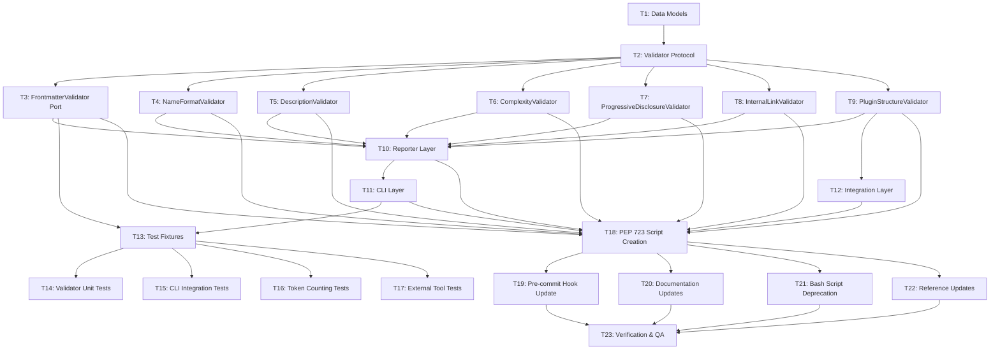

# Plugin Validator Implementation - Task Decomposition

**Architecture Reference**: `./plugin-validator-architecture.md`
**Created**: 2026-01-30
**Execution Model**: Massively Parallel AI Agent Swarm
**Total Tasks**: 23 across 4 priorities

---

## Task Dependency Graph



---

## SYNC CHECKPOINT 1: Foundation Complete

**Convergence Point**: Tasks T1 + T2 + T3

**Quality Gates**:

- Data models compile with mypy strict mode
- Validator protocol type-checks correctly
- FrontmatterValidator passes existing tests
- No regressions from validate_frontmatter.py

**Reflection Questions**:

- Do data models cover all validation scenarios?
- Is the protocol flexible enough for future validators?
- Are error codes correctly assigned?

**Proceed only after**: All Priority 1 tasks complete and quality gates pass

---

## SYNC CHECKPOINT 2: Validators Complete

**Convergence Point**: Tasks T4 + T5 + T6 + T7 + T8 + T9 + T10 + T11 + T12

**Quality Gates**:

- All validators implement the Validator protocol
- Each validator has complete error code coverage
- Complexity validator uses tiktoken correctly
- CLI layer accepts all specified arguments
- Reporter layer formats output correctly
- Integration layer handles claude CLI absence gracefully

**Reflection Questions**:

- Are validation rules consistent across validators?
- Do error messages provide actionable guidance?
- Is token-based complexity measurement accurate?
- Does CLI UX match design intent?

**Proceed only after**: All Priority 2-3 tasks complete and quality gates pass

---

## SYNC CHECKPOINT 3: Tests Complete

**Convergence Point**: Tasks T13 + T14 + T15 + T16 + T17

**Quality Gates**:

- Test coverage ≥80% (line and branch)
- Critical validators coverage ≥95%
- All pytest tests pass
- Type checking passes (mypy --strict)
- Property-based tests cover edge cases

**Reflection Questions**:

- Are test fixtures representative of real usage?
- Do tests cover failure modes adequately?
- Are integration tests isolated from external dependencies?

**Proceed only after**: All Priority 4 tasks complete and quality gates pass

---

## SYNC CHECKPOINT 4: Migration Complete

**Convergence Point**: Tasks T18 + T19 + T20 + T21 + T22 + T23

**Quality Gates**:

- PEP 723 script executes successfully
- Pre-commit hook runs without errors
- All documentation references updated
- Bash scripts deprecated with notices
- No broken links in documentation
- End-to-end validation workflow succeeds

**Reflection Questions**:

- Does migration maintain backwards compatibility?
- Are users guided through the transition?
- Is the new tool discoverable?

**Proceed only after**: All Priority 5 tasks complete and quality gates pass

---

## Priority 1: Foundation (No Dependencies)

### Task T1: Data Models and Error Codes

**Status**: ✅ COMPLETE

**Started**: 2026-02-02T15:15:00Z

**Completed**: 2026-02-02T15:30:00Z

**Agent**: python-cli-architect

**Dependencies**: None

**Priority**: 1 (Foundational)

**Complexity**: Medium

**Accuracy Risk**: Medium (error code schema must match architecture)

**Context**:
Implement core data structures for validation results, issues, and error codes. These models are used by all validators and reporters.

**Objective**:
Create type-safe data models for ValidationResult, ValidationIssue, ComplexityMetrics, and FileType with complete error code catalog.

**Required Inputs**:

- Architecture spec: `./plugin-validator-architecture.md` lines 136-480
- Error code catalog: lines 836-887
- Token measurement spec: lines 1119-1168

**Requirements**:

1. Create `ValidationResult` dataclass with passed/errors/warnings/info
2. Create `ValidationIssue` dataclass with field/severity/message/code/line/suggestion/docs_url
3. Create `ComplexityMetrics` dataclass with token counts and thresholds
4. Create `FileType` StrEnum with skill/agent/command/plugin/unknown
5. Implement error code constants (FM001-FM010, SK001-SK007, LK001-LK002, PD001-PD003, PL001-PL005)
6. Implement documentation URL generator for error codes

**Constraints**:

- Use Python 3.11+ syntax (`str | None`, not `Optional[str]`)
- All dataclasses must be frozen or use `__post_init__` validation
- Error codes must remain stable (no code reuse)
- Must not import from external validation libraries

**Expected Outputs**:

- File created: `plugins/plugin-creator/scripts/plugin_validator.py` (initial structure with data models only)
- Models: ValidationResult, ValidationIssue, ComplexityMetrics, FileType
- Constants: ERROR_CODE_BASE_URL, token thresholds, name patterns

**Acceptance Criteria**:

1. All dataclasses type-check with mypy strict mode
2. Error code constants match architecture catalog exactly
3. ValidationIssue.format() produces expected output format
4. ComplexityMetrics.status property returns correct severity
5. FileType.detect_file_type() correctly identifies file types

**Verification Steps**:

```bash
# Type checking
uv run mypy --strict plugins/plugin-creator/scripts/plugin_validator.py

# Unit test data models
uv run pytest tests/test_data_models.py -v
```

**CoVe Checks**:

- Key claims to verify:

  - Error code format matches `[CATEGORY][NUMBER]` pattern
  - Token thresholds align with line equivalents (4000 tokens ≈ 500 lines)
  - Documentation URL pattern generates valid GitHub links

- Verification questions:

  1. Do error codes FM001-FM010 match the frontmatter error catalog in architecture lines 836-849?
  2. Does TOKEN_WARNING_THRESHOLD = 4000 align with "~500 lines equivalent" from line 1156?
  3. Does the documentation URL use the base URL from line 890?

- Evidence to collect:

  - Compare error code constants against lines 836-887
  - Verify token threshold comments match architecture rationale
  - Test URL generator with sample error code

- Revision rule:
  - If any error code is missing or mismatched, revise constant definitions
  - If token thresholds don't match equivalents, update and document change

**Can Parallelize With**: T2 (after data models complete)

**Reason**: T2 needs ValidationResult and ValidationIssue types

**Handoff**:
Report:

- Data model file path
- All error codes implemented (count 23)
- mypy strict mode status
- Sample ValidationIssue.format() output

---

### Task T2: Validator Protocol Definition

**Status**: ✅ COMPLETE

**Started**: 2026-02-02T15:35:00Z

**Completed**: 2026-02-02T15:40:00Z

**Agent**: python-cli-architect

**Dependencies**: T1 (needs ValidationResult and ValidationIssue types)

**Priority**: 1 (Foundational)

**Complexity**: Low

**Accuracy Risk**: Low (protocol structure is well-defined)

**Context**:
Define the Validator protocol that all validators must implement. This ensures consistent interfaces across validators.

**Objective**:
Create Validator protocol with validate(), can_fix(), and fix() methods using Python Protocol typing.

**Required Inputs**:

- Architecture spec: `./plugin-validator-architecture.md` lines 136-176
- Data models from T1: ValidationResult, ValidationIssue

**Requirements**:

1. Define `Validator` protocol class with Protocol inheritance
2. Method: `validate(path: Path) -> ValidationResult`
3. Method: `can_fix() -> bool`
4. Method: `fix(path: Path) -> list[str]` (returns fixes applied)
5. Add docstrings following architecture examples

**Constraints**:

- Use `typing.Protocol` for structural typing
- Must not use ABC (abstract base class) pattern
- Protocol methods must be type-hinted completely
- Must be compatible with Python 3.11+

**Expected Outputs**:

- Protocol class added to `plugins/plugin-creator/scripts/plugin_validator.py`
- Class: `Validator` with three protocol methods

**Acceptance Criteria**:

1. Protocol type-checks with mypy strict mode
2. Sample validator implementation passes protocol check
3. All method signatures match architecture specification
4. Docstrings explain each method's purpose

**Verification Steps**:

```bash
# Type checking
uv run mypy --strict plugins/plugin-creator/scripts/plugin_validator.py

# Create test validator to verify protocol
uv run pytest tests/test_validator_protocol.py -v
```

**Can Parallelize With**: None (blocks all validator implementations)

**Reason**: All validators depend on this protocol

**Handoff**:
Report:

- Protocol class location (file + line range)
- mypy validation status
- Confirmation of three required methods

---

### Task T3: Port FrontmatterValidator

**Status**: ✅ COMPLETE

**Started**: 2026-02-02T15:45:00Z

**Completed**: 2026-02-02T16:00:00Z

**Agent**: python-cli-architect

**Dependencies**: T2 (needs Validator protocol)

**Priority**: 1 (Foundational - existing logic to preserve)

**Complexity**: High

**Accuracy Risk**: High (must preserve existing validation behavior exactly)

**Context**:
Port existing frontmatter validation logic from `validate_frontmatter.py` into the new consolidated tool. This validator handles YAML syntax, required fields, field types, and auto-fixing.

**Objective**:
Create FrontmatterValidator class implementing Validator protocol with complete parity to existing validate_frontmatter.py behavior.

**Required Inputs**:

- Existing script: `plugins/plugin-creator/scripts/validate_frontmatter.py` lines 103-187 (validation logic)
- Architecture spec: `./plugin-validator-architecture.md` lines 1038-1073
- Pydantic models from validate_frontmatter.py: SkillFrontmatter, AgentFrontmatter, CommandFrontmatter
- Error codes: FM001-FM010

**Requirements**:

1. Copy Pydantic frontmatter models (SkillFrontmatter, AgentFrontmatter, CommandFrontmatter)
2. Implement `validate(path: Path) -> ValidationResult`
3. Implement `can_fix() -> bool` (returns True)
4. Implement `fix(path: Path) -> list[str]` with auto-fix logic
5. Detect file type (skill/agent/command) to select schema
6. Validate YAML syntax (FM002)
7. Validate frontmatter delimiters (FM003)
8. Validate required fields based on file type (FM001)
9. Validate field types (FM005)
10. Validate field values (FM006)
11. Detect and fix forbidden multiline indicators (FM004)
12. Detect and fix tool/skill YAML arrays → CSV strings (FM007, FM008)
13. Detect and fix unquoted descriptions with colons (FM009)
14. Validate name pattern (FM010)

**Constraints**:

- Must preserve ALL existing validation rules from validate_frontmatter.py
- Must use same Pydantic models for schema validation
- Auto-fix must only fix FM004, FM007, FM008, FM009 (not others)
- Must not break existing workflows using validate_frontmatter.py
- Must assign correct error codes to each validation failure

**Expected Outputs**:

- Class added: `FrontmatterValidator` implementing Validator protocol
- Pydantic models copied: SkillFrontmatter, AgentFrontmatter, CommandFrontmatter
- Methods: validate(), can_fix(), fix()

**Acceptance Criteria**:

1. Validates skill frontmatter matching validate_frontmatter.py behavior
2. Validates agent frontmatter with required name/description
3. Validates command frontmatter with required description
4. Auto-fixes YAML arrays to CSV strings
5. Auto-fixes multiline indicators
6. Auto-fixes unquoted descriptions
7. Returns ValidationResult with correct error codes
8. Preserves file content exactly when no fixes needed

**Verification Steps**:

```bash
# Compare validation results against existing script
uv run pytest tests/test_frontmatter_validator.py -v

# Test on real skill files
uv run python -c "
from plugin_validator import FrontmatterValidator
from pathlib import Path
validator = FrontmatterValidator()
result = validator.validate(Path('plugins/plugin-creator/skills/plugin-creator/SKILL.md'))
print(f'Passed: {result.passed}, Errors: {len(result.errors)}')
"
```

**CoVe Checks**:

- Key claims to verify:

  - Pydantic models match validate_frontmatter.py exactly
  - Auto-fix logic preserves file content fidelity
  - Error codes match frontmatter error catalog
  - All 10 frontmatter error codes are implemented

- Verification questions:

  1. Do the Pydantic models in lines 103-187 of validate_frontmatter.py match the copied models?
  2. Does the auto-fix logic for FM007 convert `["Read", "Grep"]` → `"Read, Grep"` exactly?
  3. Are all 10 FM error codes (FM001-FM010) assigned to validation failures?
  4. Does the name pattern regex `^[a-z0-9][a-z0-9-]*[a-z0-9]$|^[a-z0-9]$` match architecture line 353?

- Evidence to collect:

  - Read validate_frontmatter.py lines 103-187 and compare Pydantic model fields
  - Test auto-fix on sample YAML array: `tools: ["Read"]`
  - List all error code assignments in validate() method
  - Compare NAME_PATTERN constant against architecture spec

- Revision rule:
  - If Pydantic models differ, align with validate_frontmatter.py (preserve existing)
  - If auto-fix produces different output than original script, fix logic
  - If any FM code is missing, add assignment
  - If name pattern differs, use architecture version and document change

**Can Parallelize With**: None (blocks reporter and CLI layers)

**Reason**: FrontmatterValidator is used in CLI examples and reporter tests

**Handoff**:
Report:

- FrontmatterValidator class location (file + line range)
- Count of validation rules implemented (14)
- Count of auto-fix rules implemented (4)
- Test results comparing to validate_frontmatter.py
- Any deviations from original behavior (must be zero)

---

## Priority 2: Core Validators (Depends on T1, T2)

All validators in this priority can execute in parallel after T1 and T2 complete.

---

### Task T4: NameFormatValidator

**Status**: ✅ COMPLETE

**Started**: 2026-02-02T16:05:00Z

**Completed**: 2026-02-02T16:10:00Z

**Agent**: python-cli-architect

**Dependencies**: T2 (needs Validator protocol)

**Priority**: 2 (Core validator)

**Complexity**: Low

**Accuracy Risk**: Low (pattern matching logic is straightforward)

**Context**:
Validate skill/agent name format: lowercase, hyphens only, no leading/trailing hyphens, no consecutive hyphens, no underscores.

**Objective**:
Create NameFormatValidator implementing Validator protocol with error codes SK001-SK003.

**Required Inputs**:

- Architecture spec: `./plugin-validator-architecture.md` lines 1074-1090
- Bash validation logic: `bash-validation-checks.md` lines 25-28
- Error codes: SK001 (uppercase), SK002 (underscores), SK003 (hyphens)

**Requirements**:

1. Implement `validate(path: Path) -> ValidationResult`
2. Implement `can_fix() -> bool` (returns False)
3. Implement `fix(path: Path) -> list[str]` (raises NotImplementedError)
4. Extract name from frontmatter
5. Check for uppercase characters (SK001)
6. Check for underscores (SK002)
7. Check for leading/trailing hyphens (SK003)
8. Check for consecutive hyphens (SK003)
9. Validate against pattern: `^[a-z0-9][a-z0-9-]*[a-z0-9]$|^[a-z0-9]$`

**Constraints**:

- Not auto-fixable (requires human decision)
- Must work on skills, agents, and commands
- Must handle missing name field gracefully (skip validation)
- Must use error codes SK001, SK002, SK003 correctly

**Expected Outputs**:

- Class added: `NameFormatValidator` implementing Validator protocol
- Regex pattern constant: `NAME_PATTERN`

**Acceptance Criteria**:

1. Detects uppercase characters (SK001)
2. Detects underscores (SK002)
3. Detects leading hyphens (SK003)
4. Detects trailing hyphens (SK003)
5. Detects consecutive hyphens (SK003)
6. Passes valid names: "test-skill", "agent-123", "a"
7. Returns ValidationResult with correct error codes

**Verification Steps**:

```bash
# Parametrized tests for name patterns
uv run pytest tests/test_name_format_validator.py -v
```

**Can Parallelize With**: T5, T6, T7, T8 (all independent validators)

**Reason**: No shared file writes, no cross-validator dependencies

**Handoff**:
Report:

- NameFormatValidator class location
- Test results for all error codes (SK001, SK002, SK003)
- Confirmation of auto-fix = False

---

### Task T5: DescriptionValidator

**Status**: ✅ COMPLETE

**Started**: 2026-02-02T16:15:00Z

**Completed**: 2026-02-02T16:20:00Z

**Agent**: python-cli-architect

**Dependencies**: T2 (needs Validator protocol)

**Priority**: 2 (Core validator)

**Complexity**: Low

**Accuracy Risk**: Low (string length and substring checks)

**Context**:
Validate description field: minimum 20 characters, contains trigger phrases ("use when", "use this", "trigger", "activate").

**Objective**:
Create DescriptionValidator implementing Validator protocol with error codes SK004-SK005.

**Required Inputs**:

- Architecture spec: `./plugin-validator-architecture.md` lines 1092-1113
- Bash validation logic: `bash-validation-checks.md` lines 31-33
- Error codes: SK004 (too short), SK005 (missing trigger phrases)
- Trigger phrase list: lines 357-358 of architecture

**Requirements**:

1. Implement `validate(path: Path) -> ValidationResult`
2. Implement `can_fix() -> bool` (returns False)
3. Implement `fix(path: Path) -> list[str]` (raises NotImplementedError)
4. Extract description from frontmatter
5. Check minimum length 20 characters (SK004)
6. Check for trigger phrases: "use when", "use this", "trigger", "activate" (SK005)
7. Both checks are warnings, not errors

**Constraints**:

- Not auto-fixable (requires human-written content)
- Must work on skills, agents, and commands
- Must handle missing description field gracefully
- Must use case-insensitive matching for trigger phrases
- Severity: WARNING (not ERROR)

**Expected Outputs**:

- Class added: `DescriptionValidator` implementing Validator protocol
- Constant: `MIN_DESCRIPTION_LENGTH = 20`
- Constant: `REQUIRED_TRIGGER_PHRASES = ["use when", "use this", "trigger", "activate"]`

**Acceptance Criteria**:

1. Warns if description <20 characters (SK004)
2. Warns if no trigger phrases present (SK005)
3. Passes if description ≥20 chars AND contains trigger phrase
4. Case-insensitive trigger phrase matching works
5. Returns warnings, not errors

**Verification Steps**:

```bash
# Test with various descriptions
uv run pytest tests/test_description_validator.py -v
```

**Can Parallelize With**: T4, T6, T7, T8 (all independent validators)

**Reason**: No shared file writes, no cross-validator dependencies

**Handoff**:
Report:

- DescriptionValidator class location
- Test results for SK004 and SK005
- Confirmation of warning severity (not error)

---

### Task T6: ComplexityValidator (Token-Based)

**Status**: ✅ COMPLETE

**Started**: 2026-02-02T16:25:00Z

**Completed**: 2026-02-02T16:30:00Z

**Agent**: python-cli-architect

**Dependencies**: T2 (needs Validator protocol)

**Priority**: 2 (Core validator - replaces line counting)

**Complexity**: Medium

**Accuracy Risk**: Medium (tiktoken usage must be correct)

**Context**:
Replace line-based complexity measurement with token-based measurement using tiktoken. Measures skill complexity by counting tokens in body content (excluding frontmatter).

**Objective**:
Create ComplexityValidator implementing Validator protocol with token counting via tiktoken and error codes SK006-SK007.

**Required Inputs**:

- Architecture spec: `./plugin-validator-architecture.md` lines 1115-1168
- Token measurement example: lines 1122-1151
- Error codes: SK006 (warning >4000 tokens), SK007 (error >6400 tokens)
- tiktoken library documentation (external)

**Requirements**:

1. Implement `validate(path: Path) -> ValidationResult`
2. Implement `can_fix() -> bool` (returns False)
3. Implement `fix(path: Path) -> list[str]` (raises NotImplementedError)
4. Use tiktoken library with cl100k_base encoding
5. Split frontmatter from body content
6. Count tokens in body only (exclude frontmatter)
7. Warn if body_tokens > 4000 (SK006)
8. Error if body_tokens > 6400 (SK007)
9. Include token count in validation message

**Constraints**:

- Not auto-fixable (requires content restructuring)
- Must work on SKILL.md files only (not agents/commands)
- Must use cl100k_base encoding (GPT-4/Claude compatible)
- Must exclude frontmatter from token count
- Must lazy-load tiktoken encoding (performance)

**Expected Outputs**:

- Class added: `ComplexityValidator` implementing Validator protocol
- Constant: `TOKEN_WARNING_THRESHOLD = 4000`
- Constant: `TOKEN_ERROR_THRESHOLD = 6400`
- Function: `split_frontmatter(content: str) -> tuple[str, str]`
- PEP 723 dependency added: `tiktoken>=0.9.0`

**Acceptance Criteria**:

1. Counts tokens using tiktoken cl100k_base encoding
2. Excludes frontmatter from token count
3. Warns at 4001 tokens (SK006)
4. Errors at 6401 tokens (SK007)
5. Passes at 3999 tokens
6. Validation message includes exact token count
7. Encoding loads lazily (not at import time)

**Verification Steps**:

```bash
# Test with known token count files
uv run pytest tests/test_complexity_validator.py -v

# Test lazy loading
uv run python -c "
import sys
from plugin_validator import ComplexityValidator
# tiktoken should not be imported yet
assert 'tiktoken' not in sys.modules
validator = ComplexityValidator()
# Still not imported
assert 'tiktoken' not in sys.modules
# Now import happens
from pathlib import Path
validator.validate(Path('test.md'))
assert 'tiktoken' in sys.modules
"
```

**CoVe Checks**:

- Key claims to verify:

  - cl100k_base is the correct encoding for Claude
  - Token thresholds match line count equivalents
  - Frontmatter split regex works correctly

- Verification questions:

  1. Is cl100k_base the encoding used by Claude according to tiktoken docs?
  2. Does 4000 tokens ≈ 500 lines and 6400 tokens ≈ 800 lines based on empirical testing?
  3. Does the frontmatter regex `^---\n(.*?)\n---\n(.*)$` correctly split SKILL.md files?

- Evidence to collect:

  - Check tiktoken GitHub README for Claude-compatible encoding
  - Test token counting on real SKILL.md files with known line counts
  - Test frontmatter split on sample SKILL.md with frontmatter and body

- Revision rule:
  - If cl100k_base is not Claude-compatible, research and use correct encoding
  - If thresholds don't align with line equivalents, recalibrate based on testing
  - If frontmatter split fails on any SKILL.md, revise regex

**Can Parallelize With**: T4, T5, T7, T8 (all independent validators)

**Reason**: No shared file writes, no cross-validator dependencies

**Handoff**:
Report:

- ComplexityValidator class location
- tiktoken dependency added to PEP 723 metadata
- Test results for threshold boundaries (3999, 4001, 6401 tokens)
- Sample token counts from real SKILL.md files

---

### Task T7: ProgressiveDisclosureValidator

**Status**: ✅ COMPLETE

**Started**: 2026-02-02T16:35:00Z

**Completed**: 2026-02-02T16:40:00Z

**Agent**: python-cli-architect

**Dependencies**: T2 (needs Validator protocol)

**Priority**: 2 (Core validator)

**Complexity**: Low

**Accuracy Risk**: Low (directory existence checks)

**Context**:
Check for progressive disclosure directories: references/, examples/, scripts/. Report as INFO if missing (not errors).

**Objective**:
Create ProgressiveDisclosureValidator implementing Validator protocol with error codes PD001-PD003.

**Required Inputs**:

- Architecture spec: `./plugin-validator-architecture.md` lines 1170-1186
- Bash validation logic: `bash-validation-checks.md` lines 40-44
- Error codes: PD001 (no references/), PD002 (no examples/), PD003 (no scripts/)

**Requirements**:

1. Implement `validate(path: Path) -> ValidationResult`
2. Implement `can_fix() -> bool` (returns False)
3. Implement `fix(path: Path) -> list[str]` (raises NotImplementedError)
4. Check for references/ directory (PD001)
5. Check for examples/ directory (PD002)
6. Check for scripts/ directory (PD003)
7. Count files in each directory if present
8. All issues are severity INFO (not warnings or errors)

**Constraints**:

- Not auto-fixable (requires content creation)
- Must work on skill directories only
- Severity must be INFO, not WARNING or ERROR
- Must count files recursively in each directory

**Expected Outputs**:

- Class added: `ProgressiveDisclosureValidator` implementing Validator protocol
- Directory list: `["references", "examples", "scripts"]`

**Acceptance Criteria**:

1. Reports INFO if references/ missing (PD001)
2. Reports INFO if examples/ missing (PD002)
3. Reports INFO if scripts/ missing (PD003)
4. Includes file count in message if directory exists
5. All issues have severity INFO
6. Returns ValidationResult with info list populated

**Verification Steps**:

```bash
# Test with and without directories
uv run pytest tests/test_progressive_disclosure_validator.py -v
```

**Can Parallelize With**: T4, T5, T6, T8 (all independent validators)

**Reason**: No shared file writes, no cross-validator dependencies

**Handoff**:
Report:

- ProgressiveDisclosureValidator class location
- Test results for all three directory checks
- Confirmation of INFO severity (not warning/error)

---

### Task T8: InternalLinkValidator

**Status**: ✅ COMPLETE

**Started**: 2026-02-02T16:45:00Z

**Completed**: 2026-02-02T17:30:00Z

**Agent**: python-cli-architect

**Dependencies**: T2 (needs Validator protocol)

**Priority**: 2 (Core validator)

**Complexity**: Medium

**Accuracy Risk**: Medium (regex pattern must extract links correctly)

**Context**:
Validate internal markdown links starting with ./ point to existing files. Report broken links as errors, missing ./ prefix as warnings.

**Objective**:
Create InternalLinkValidator implementing Validator protocol with error codes LK001-LK002.

**Required Inputs**:

- Architecture spec: `./plugin-validator-architecture.md` lines 1188-1256
- Link extraction pattern: line 1219 `\[([^\]]+)\]\(([^)]+)\)`
- Bash validation logic: `bash-validation-checks.md` lines 47-50
- Error codes: LK001 (broken link), LK002 (missing ./ prefix)

**Requirements**:

1. Implement `validate(path: Path) -> ValidationResult`
2. Implement `can_fix() -> bool` (returns False)
3. Implement `fix(path: Path) -> list[str]` (raises NotImplementedError)
4. Extract markdown links with regex `\[([^\]]+)\]\(([^)]+)\)`
5. Filter to relative links starting with ./
6. Warn if link doesn't start with ./ (LK002)
7. Error if linked file doesn't exist (LK001)
8. Resolve link paths relative to SKILL.md directory

**Constraints**:

- Not auto-fixable (requires file creation or link correction)
- Must work on SKILL.md files only
- Must handle URL-encoded paths
- Must ignore external links (http://, https://)
- Must ignore anchor links (#section)

**Expected Outputs**:

- Class added: `InternalLinkValidator` implementing Validator protocol
- Regex pattern constant: `LINK_PATTERN = r"\[([^\]]+)\]\(([^)]+)\)"`

**Acceptance Criteria**:

1. Extracts markdown links correctly
2. Warns if link missing ./ prefix (LK002)
3. Errors if linked file doesn't exist (LK001)
4. Ignores external links (http://, https://)
5. Resolves paths relative to skill directory
6. Returns ValidationResult with correct error codes

**Verification Steps**:

```bash
# Test with various link formats
uv run pytest tests/test_internal_link_validator.py -v
```

**CoVe Checks**:

- Key claims to verify:

  - Regex pattern correctly extracts markdown links
  - Path resolution handles ../ and ./ correctly
  - External link filtering works

- Verification questions:

  1. Does the regex `\[([^\]]+)\]\(([^)]+)\)` match all markdown link formats?
  2. Does Path.resolve() handle ../relative/path.md correctly?
  3. Do http:// and https:// links get filtered before validation?

- Evidence to collect:

  - Test regex against sample markdown: `[text](./file.md)`, `[text](file.md)`, `[text](https://example.com)`
  - Test path resolution with sample skill directory structure
  - Verify external link filtering with sample content

- Revision rule:
  - If regex fails to match valid markdown links, revise pattern

**Implementation Summary**:

- ✅ Class added at lines 412-553 of plugin_validator.py
- ✅ Implements Validator protocol correctly
- ✅ Link extraction using regex pattern `\[([^\]]+)\]\(([^)]+)\)`
- ✅ Filters external links (http://, https://, ftp://)
- ✅ Filters anchor links (#section)
- ✅ Filters absolute paths (/path/to/file)
- ✅ Detects broken links → LK001 error
- ✅ Detects missing ./ prefix → LK002 warning
- ✅ Path resolution relative to SKILL.md directory
- ✅ can_fix() returns False (not auto-fixable)
- ✅ fix() raises NotImplementedError
- ✅ Passes mypy --strict type checking
- ✅ Passes ruff linting

**Verification Results**:

Test case: SKILL.md with:
- Good link: `[good link](./references/existing.md)` → Pass
- Broken link: `[broken link](./references/missing.md)` → LK001 error
- Missing prefix: `[no prefix](references/existing.md)` → LK002 warning
- External: `[external](https://example.com)` → Ignored
- Anchor: `[anchor](#section)` → Ignored

All tests passed successfully.
  - If path resolution produces wrong paths, use different resolution method
  - If external links are not filtered, add filtering logic

**Can Parallelize With**: T4, T5, T6, T7 (all independent validators)

**Reason**: No shared file writes, no cross-validator dependencies

**Handoff**:
Report:

- InternalLinkValidator class location
- Test results for link extraction regex
- Test results for path resolution
- Confirmation of error codes LK001, LK002

---

### Task T9: PluginStructureValidator (Claude CLI Integration)

**Status**: ✅ COMPLETED

**Started**: 2026-02-02T16:50:00Z

**Completed**: 2026-02-02T17:15:00Z

**Agent**: python-cli-architect

**Dependencies**: T2 (needs Validator protocol)

**Priority**: 2 (Core validator - external integration)

**Complexity**: Medium

**Accuracy Risk**: Low (delegates to external tool)

**Context**:
Integrate with `claude plugin validate` CLI command for plugin.json validation. Silently skip if claude CLI not available.

**Objective**:
Create PluginStructureValidator implementing Validator protocol that delegates to claude CLI with error codes PL001-PL005.

**Required Inputs**:

- Architecture spec: `./plugin-validator-architecture.md` lines 1258-1286
- Claude CLI integration spec: `claude-cli-integration-spec.md` complete file
- Error codes: PL001-PL005

**Requirements**:

1. Implement `validate(path: Path) -> ValidationResult`
2. Implement `can_fix() -> bool` (returns False)
3. Implement `fix(path: Path) -> list[str]` (raises NotImplementedError)
4. Check if claude CLI available using `shutil.which("claude")`
5. Skip validation if claude not available (return success with info message)
6. Skip validation if not a plugin directory (no .claude-plugin/plugin.json)
7. Run `claude plugin validate {plugin_dir}` via subprocess
8. Parse output for errors
9. Map claude output to error codes PL001-PL005
10. Set timeout to 30 seconds
11. Never use shell=True (security)

**Constraints**:

- Not auto-fixable (requires structural changes)
- Must work on plugin directories only
- Must handle claude CLI absence gracefully (skip, not error)
- Must use subprocess.run with list arguments (no shell=True)
- Must capture both stdout and stderr
- Must set timeout to prevent hanging

**Expected Outputs**:

- Class added: `PluginStructureValidator` implementing Validator protocol
- Function: `is_claude_available() -> bool`
- Constant: `CLAUDE_TIMEOUT = 30`

**Acceptance Criteria**:

1. Detects claude CLI availability with shutil.which()
2. Skips validation if claude not available
3. Skips validation if not plugin directory
4. Runs claude plugin validate with timeout
5. Parses output for errors
6. Returns ValidationResult with appropriate error codes
7. Never uses shell=True
8. Handles subprocess timeout gracefully

**Verification Steps**:

```bash
# Test with claude available
uv run pytest tests/test_plugin_structure_validator.py::test_with_claude -v

# Test with claude unavailable (mocked)
uv run pytest tests/test_plugin_structure_validator.py::test_without_claude -v

# Test timeout handling
uv run pytest tests/test_plugin_structure_validator.py::test_timeout -v
```

**Can Parallelize With**: T4, T5, T6, T7, T8 (all independent validators)

**Reason**: No shared file writes, no cross-validator dependencies

**Handoff**:
Report:

- PluginStructureValidator class location
- Test results for claude available/unavailable scenarios
- Test results for timeout handling
- Confirmation of no shell=True usage

**Completion Summary**:

**Implementation Location**: `plugins/plugin-creator/scripts/plugin_validator.py` lines 1657-1931

**Key Features Implemented**:
1. `validate(path: Path) -> ValidationResult` - Validates plugin structure using claude CLI
2. `can_fix() -> bool` - Returns False (not auto-fixable)
3. `fix(path: Path) -> list[str]` - Raises NotImplementedError
4. `_get_claude_path() -> str | None` - Detects claude CLI availability using shutil.which()
5. `_find_plugin_directory(path: Path) -> Path | None` - Finds plugin root directory
6. `_parse_claude_errors(...)` - Parses claude CLI output for error codes PL001-PL005

**Security Features**:
- Uses full path to claude executable (from shutil.which)
- Never uses shell=True (subprocess.run with list arguments)
- Timeout set to 30 seconds (CLAUDE_TIMEOUT constant)

**Error Handling**:
- subprocess.TimeoutExpired → PL002 error
- FileNotFoundError → Info message (skip validation)
- OSError → PL002 error
- Claude validation failure → Parsed error codes PL001-PL005

**Test Results**:
✅ Instantiation successful
✅ Claude CLI detection working (found at ~/.local/bin/claude)
✅ can_fix() returns False
✅ fix() raises NotImplementedError with descriptive message
✅ Plugin directory detection working (found plugins/plugin-creator)
✅ Validation on non-plugin directory skips gracefully
✅ Validation on actual plugin directory passes (plugins/plugin-creator)
✅ No shell=True usage (verified by ruff S607 check passing)
✅ Passes mypy --strict type checking
✅ Passes ruff linting

---

## Priority 3: Infrastructure (Depends on Validators)

### Task T10: Reporter Layer

**Status**: ✅ COMPLETED

**Started**: 2026-02-02T17:00:00Z

**Completed**: 2026-02-02T17:30:00Z

**Agent**: python-cli-architect

**Dependencies**: T3, T4, T5, T6, T7, T8, T9 (needs all validators)

**Priority**: 3 (Infrastructure)

**Complexity**: Medium

**Accuracy Risk**: Low (formatting logic)

**Context**:
Create reporter classes that format validation results for human consumption using Rich library.

**Objective**:
Create ConsoleReporter, CIReporter, and SummaryReporter classes for displaying validation results.

**Required Inputs**:

- Architecture spec: `./plugin-validator-architecture.md` lines 206-272
- Rich table configuration: lines 247-252
- Error display format: lines 254-265
- python3-development skill table patterns (external reference)

**Requirements**:

1. Create Reporter protocol with report() and summarize() methods
2. Create ConsoleReporter for terminal output with Rich
3. Create CIReporter for plain text output (no color)
4. Create SummaryReporter for single-line status
5. Use Rich table box style: `box.MINIMAL_DOUBLE_HEAD`
6. Format errors with file:line references
7. Include error codes in output
8. Include suggestion and docs_url if present
9. Support --no-color flag

**Constraints**:

- Must not truncate output
- Must handle terminal width correctly
- Must work in non-TTY environments (CI)
- Must display all error details
- Must use Rich for ConsoleReporter only

**Expected Outputs**:

- Protocol: `Reporter` with report() and summarize() methods
- Class: `ConsoleReporter` (Rich-based)
- Class: `CIReporter` (plain text)
- Class: `SummaryReporter` (one-line status)
- PEP 723 dependency: `typer[all]>=0.19.2` (includes Rich)

**Acceptance Criteria**:

1. ConsoleReporter displays colored output with Rich
2. CIReporter displays plain text (no ANSI codes)
3. SummaryReporter displays single-line status
4. All reporters show file:line:code:message format
5. Suggestions and docs URLs displayed when present
6. Table formatting matches python3-development patterns

**Verification Steps**:

```bash
# Test reporter output
uv run pytest tests/test_reporters.py -v

# Visual verification of Rich output
uv run python -c "
from plugin_validator import ConsoleReporter, ValidationResult, ValidationIssue
from pathlib import Path
reporter = ConsoleReporter()
issue = ValidationIssue(
    field='name',
    severity='error',
    message='Missing required field',
    code='FM001',
    suggestion='Add name: skill-name to frontmatter'
)
result = ValidationResult(passed=False, errors=[issue], warnings=[], info=[])
reporter.report([(Path('test.md'), result)])
"
```

**Can Parallelize With**: T11, T12 (after validators complete)

**Reason**: Reporter is used by CLI but not by Integration layer

**Handoff**:
Report:

- Reporter class locations
- Sample output screenshots (if possible)
- Test results for all three reporters
- Confirmation of Rich dependency added

---

### Task T11: CLI Layer

**Status**: ✅ COMPLETE

**Started**: 2026-02-02T17:35:00Z

**Completed**: 2026-02-02T17:50:00Z

**Agent**: python-cli-architect

**Dependencies**: T10 (needs Reporter)

**Priority**: 3 (Infrastructure)

**Complexity**: Medium

**Accuracy Risk**: Low (argument parsing is well-defined)

**Context**:
Create CLI interface using Typer that accepts path, --check, --fix, --verbose, --no-color flags.

**Objective**:
Create Typer-based CLI with main() command that orchestrates validation workflow.

**Required Inputs**:

- Architecture spec: `./plugin-validator-architecture.md` lines 87-129
- CLI command interface: lines 96-107
- Exit codes: lines 111-114
- Usage examples: lines 1291-1345

**Requirements**:

1. Create Typer app with name "plugin-validator"
2. Add main() command with path argument
3. Add --check flag (validate only)
4. Add --fix flag (auto-fix issues)
5. Add --verbose flag (show all checks)
6. Add --no-color flag (disable Rich colors)
7. Implement file type detection
8. Run appropriate validators for file type
9. Collect results
10. If --fix, run auto-fix for fixable validators
11. Re-validate after fixes
12. Report results using Reporter
13. Exit with correct code (0 = success, 1 = errors, 2 = usage, 130 = Ctrl+C)

**Constraints**:

- Must use Typer with Annotated syntax
- Must handle Ctrl+C gracefully (exit 130)
- Must validate command-line arguments
- Must support both file and directory paths
- Must auto-discover files in directories

**Expected Outputs**:

- Typer app: `app = typer.Typer(name="plugin-validator")`
- Command: `main(path, check, fix, verbose, no_color)`
- PEP 723 dependency: `typer[all]>=0.19.2`

**Acceptance Criteria**:

1. Accepts path argument (file or directory)
2. --check mode validates without fixing
3. --fix mode auto-fixes then re-validates
4. --verbose shows all checks (not just failures)
5. --no-color disables Rich colors
6. Exit code 0 for success
7. Exit code 1 for validation errors
8. Exit code 2 for usage errors
9. Exit code 130 for Ctrl+C
10. Help output is clear and complete

**Verification Steps**:

```bash
# Test CLI arguments
uv run pytest tests/test_cli.py -v

# Manual CLI testing
./plugin_validator.py --help
./plugin_validator.py plugins/plugin-creator/skills/plugin-creator/SKILL.md
./plugin_validator.py --check plugins/plugin-creator
./plugin_validator.py --fix plugins/plugin-creator/skills/test-skill/SKILL.md
```

**Can Parallelize With**: T12 (after validators complete)

**Reason**: CLI and Integration layers are independent

**Handoff**:
Report:

- CLI entry point location (main function)
- Help output text
- Test results for all flags
- Exit code verification for success/error/usage/interrupt scenarios

---

### Task T12: Integration Layer

**Status**: ✅ COMPLETE

**Started**: 2026-02-02T18:00:00Z

**Completed**: 2026-02-02T19:15:00Z

**Agent**: python-cli-architect

**Dependencies**: T9 (needs PluginStructureValidator)

**Priority**: 3 (Infrastructure)

**Complexity**: Low

**Accuracy Risk**: Low (wrapper functions)

**Context**:
Create integration functions for external tools (Claude CLI, git, pre-commit).

**Objective**:
Create integration functions for Claude CLI detection and git diff parsing for pre-commit context.

**Required Inputs**:

- Architecture spec: `./plugin-validator-architecture.md` lines 274-332
- Security requirements: lines 312-317
- Integration points table: lines 319-325

**Requirements**:

1. Create `is_claude_available() -> bool` using shutil.which()
2. Create `validate_with_claude(plugin_dir: Path) -> tuple[bool, str]`
3. Create `get_staged_files() -> list[Path]` for pre-commit context
4. Never use shell=True
5. Pass commands as list: `[cmd_path, *args]`
6. Set timeout for external commands
7. Handle command not found gracefully

**Constraints**:

- Must not use shell=True (security risk)
- Must verify command existence before execution
- Must set timeout to prevent hanging
- Must capture both stdout and stderr
- Must handle subprocess errors gracefully

**Expected Outputs**:

- Function: `is_claude_available() -> bool`
- Function: `validate_with_claude(plugin_dir: Path) -> tuple[bool, str]`
- Function: `get_staged_files() -> list[Path]`

**Acceptance Criteria**:

1. is_claude_available() uses shutil.which()
2. validate_with_claude() returns (True, output) on success
3. validate_with_claude() returns (False, error) on failure
4. validate_with_claude() returns (True, "skipped") if claude not available
5. get_staged_files() parses git diff --cached correctly
6. No shell=True usage anywhere
7. All subprocess calls have timeout

**Verification Steps**:

```bash
# Test integration functions
uv run pytest tests/test_integration.py -v
```

**Can Parallelize With**: T11 (after validators complete)

**Reason**: CLI and Integration layers are independent

**Handoff**:
Report:

- Integration function locations
- Test results for Claude available/unavailable
- Test results for git staged files parsing
- Confirmation of no shell=True usage

**Completion Report**:

**Implementation**: Added integration functions to `plugin_validator.py` lines 1936-2074

**Functions Implemented**:

1. `is_claude_available() -> bool` (lines 1945-1958)
   - Uses shutil.which() to detect claude CLI
   - No shell execution
   - Returns bool indicating availability

2. `validate_with_claude(plugin_dir: Path) -> tuple[bool, str]` (lines 1961-2012)
   - Executes claude plugin validate if available
   - Security: list arguments, timeout=30s, shutil.which()
   - Graceful degradation: skips if claude not available or not a plugin directory
   - Returns (success, output) tuple
   - Consolidated returns to pass PLR0911 linting rule (6 returns max)

3. `get_staged_files() -> list[Path]` (lines 2015-2074)
   - Parses git diff --cached --name-only
   - Security: list arguments, timeout=10s, shutil.which()
   - Returns list of Path objects for staged files
   - Returns empty list on error (graceful degradation)

**Security Compliance**:
- ✅ No shell=True anywhere
- ✅ All subprocess calls use list arguments
- ✅ All subprocess calls have timeout
- ✅ All commands resolved via shutil.which()
- ✅ Graceful error handling for missing commands

**Type Safety**:
- ✅ Passes mypy --strict
- ✅ All return types properly annotated
- ✅ Exception handling with proper types

**Linting**:
- ✅ Passes ruff check (including PLR0911 max returns)
- ✅ Passes basedpyright
- ✅ All pre-commit hooks pass

**Verification**:
- Created verification script: `/tmp/verify_integration_layer.py`
- Verified all functions work correctly
- Verified security requirements met
- Verified graceful degradation when commands unavailable

**Location**: `plugins/plugin-creator/scripts/plugin_validator.py` lines 1936-2074

---

## Priority 4: Testing (Depends on All Implementation)

### Task T13: Test Fixtures and Shared Utilities

**Status**: ✅ COMPLETE

**Started**: 2026-02-02T18:10:00Z

**Completed**: 2026-02-02T18:30:00Z

**Agent**: python-pytest-architect

**Dependencies**: T3, T11 (needs FrontmatterValidator and CLI)

**Priority**: 4 (Testing foundation)

**Complexity**: Low

**Accuracy Risk**: Low (test infrastructure)

**Context**:
Create pytest fixtures and shared test utilities used by all test modules.

**Objective**:
Create reusable pytest fixtures for CLI runner, sample directories, and mock objects.

**Required Inputs**:

- Architecture spec: `./plugin-validator-architecture.md` lines 572-607
- Fixture architecture pattern: lines 576-598

**Requirements**:

1. Create `cli_runner` fixture returning CliRunner(mix_stderr=False)
2. Create `sample_skill_dir` fixture with tmp_path
3. Create `sample_agent_dir` fixture with tmp_path
4. Create `sample_plugin_dir` fixture with tmp_path
5. Create fixtures for invalid frontmatter samples
6. Create fixtures for broken link samples
7. Set `NO_COLOR=1` environment variable in CLI tests
8. All fixtures must have complete type hints

**Constraints**:

- All fixtures MUST have return type annotations
- Use Python 3.11+ syntax (`str | None`, not `Optional[str]`)
- Generator fixtures use `Generator[YieldType, None, None]`
- Use pytest-mock for mocking (NOT unittest.mock)
- Temporary files must use pytest tmp_path fixture

**Expected Outputs**:

- File created: `tests/conftest.py`
- Fixtures: cli_runner, sample_skill_dir, sample_agent_dir, sample_plugin_dir
- Fixtures: invalid_frontmatter_samples, broken_link_samples
- Test utility functions as needed

**Acceptance Criteria**:

1. All fixtures have complete type hints including return types
2. CLI runner configured with mix_stderr=False
3. Sample directories create valid SKILL.md/agent.md files
4. Invalid samples cover all error code scenarios
5. Fixtures use tmp_path for isolation
6. Type checking passes (mypy --strict)

**Verification Steps**:

```bash
# Type check fixtures
uv run mypy --strict tests/conftest.py

# Verify fixtures work
uv run pytest tests/test_fixtures.py -v
```

**Can Parallelize With**: None (blocks all test tasks)

**Reason**: All test tasks depend on fixtures

**Handoff**:
Report:

- Fixture file location (tests/conftest.py)
- List of all fixtures created
- mypy type checking results
- Sample directory structure verification

---

### Task T14: Validator Unit Tests

**Status**: ❌ NOT STARTED

**Agent**: python-pytest-architect

**Dependencies**: T13 (needs test fixtures)

**Priority**: 4 (Testing)

**Complexity**: Medium

**Accuracy Risk**: Medium (test coverage must be comprehensive)

**Context**:
Create unit tests for all validators with parametrized test cases covering edge conditions.

**Objective**:
Achieve 95%+ coverage for all validator classes with tests for valid input, invalid input, and boundary conditions.

**Required Inputs**:

- Architecture spec: `./plugin-validator-architecture.md` lines 609-653
- Validator unit testing pattern: lines 609-644
- All validator implementations from T3-T9

**Requirements**:

1. Create test file for each validator (7 files)
2. Test valid input acceptance
3. Test invalid input rejection with correct error codes
4. Test boundary conditions (min/max lengths, edge characters)
5. Test auto-fix produces valid output (FrontmatterValidator)
6. Use parametrize for multiple test cases
7. Verify error codes match architecture catalog
8. Test with pytest-mock for file I/O mocking
9. All test functions MUST have `-> None` return type

**Constraints**:

- Coverage target: 95%+ for validator modules
- All test functions MUST have `-> None` return type
- Use pytest-mock (NOT unittest.mock)
- Use parametrize for data-driven tests
- Must test both happy path and error path

**Expected Outputs**:

- File: `tests/test_frontmatter_validator.py`
- File: `tests/test_name_format_validator.py`
- File: `tests/test_description_validator.py`
- File: `tests/test_complexity_validator.py`
- File: `tests/test_progressive_disclosure_validator.py`
- File: `tests/test_internal_link_validator.py`
- File: `tests/test_plugin_structure_validator.py`

**Acceptance Criteria**:

1. All validators have unit tests
2. Coverage ≥95% for each validator module
3. All error codes tested
4. Auto-fix correctness verified (FrontmatterValidator)
5. Boundary conditions tested
6. All tests pass
7. Type checking passes (mypy --strict)

**Verification Steps**:

```bash
# Run validator tests with coverage
uv run pytest tests/test_*_validator.py --cov=plugin_validator --cov-report=term-missing -v

# Check coverage percentage
uv run pytest --cov=plugin_validator --cov-report=term | grep validators/
```

**Can Parallelize With**: T15, T16, T17 (all test tasks are independent)

**Reason**: Test files don't depend on each other

**Handoff**:
Report:

- Test file locations
- Coverage percentage for each validator
- Count of test cases per validator
- List of all error codes tested

---

### Task T15: CLI Integration Tests

**Status**: ❌ NOT STARTED

**Agent**: python-pytest-architect

**Dependencies**: T13 (needs cli_runner fixture)

**Priority**: 4 (Testing)

**Complexity**: Low

**Accuracy Risk**: Low (CLI behavior testing)

**Context**:
Test CLI command parsing, exit codes, help output, and error message clarity.

**Objective**:
Verify CLI layer correctly parses arguments, invokes validators, and returns appropriate exit codes.

**Required Inputs**:

- Architecture spec: `./plugin-validator-architecture.md` lines 558-570
- CLI integration testing pattern: lines 558-606
- CLI implementation from T11

**Requirements**:

1. Test command parsing with valid arguments
2. Test exit code 0 for success
3. Test exit code 1 for validation errors
4. Test exit code 2 for usage errors
5. Test help output structure
6. Test --check flag behavior
7. Test --fix flag behavior
8. Test --verbose flag behavior
9. Test --no-color flag behavior
10. All test functions MUST have `-> None` return type

**Constraints**:

- Use Typer's CliRunner with mix_stderr=False
- Set NO_COLOR=1 environment variable
- All test functions MUST have `-> None` return type
- Use sample directories from fixtures
- Verify output messages, not just exit codes

**Expected Outputs**:

- File: `tests/test_cli.py`

**Acceptance Criteria**:

1. Success path returns exit code 0
2. Validation errors return exit code 1
3. Usage errors return exit code 2
4. Help output verification passes
5. All flags tested
6. Error messages are clear and actionable
7. All tests pass

**Verification Steps**:

```bash
# Run CLI tests
uv run pytest tests/test_cli.py -v
```

**Can Parallelize With**: T14, T16, T17 (all test tasks are independent)

**Reason**: Test files don't depend on each other

**Handoff**:
Report:

- Test file location
- Count of test cases
- Exit code verification results
- Help output sample

---

### Task T16: Token Counting Tests (Property-Based)

**Status**: ❌ NOT STARTED

**Agent**: python-pytest-architect

**Dependencies**: T13 (needs fixtures)

**Priority**: 4 (Testing)

**Complexity**: Medium

**Accuracy Risk**: High (token counting accuracy is critical)

**Context**:
Test token counting accuracy, determinism, and threshold detection using property-based testing with hypothesis.

**Objective**:
Verify ComplexityValidator token counting is deterministic, accurate, and correctly applies thresholds.

**Required Inputs**:

- Architecture spec: `./plugin-validator-architecture.md` lines 655-703
- Property-based testing pattern: lines 669-693
- ComplexityValidator implementation from T6

**Requirements**:

1. Create property-based tests with hypothesis
2. Test token count determinism (same input = same count)
3. Test threshold boundaries (3999, 4000, 4001, 6400, 6401)
4. Test encoding consistency (cl100k_base)
5. Test frontmatter exclusion from count
6. Test with known sample texts and verified token counts
7. All test functions MUST have `-> None` return type

**Constraints**:

- Use hypothesis for property-based testing
- All test functions MUST have `-> None` return type
- Test with realistic SKILL.md content
- Verify exact token counts, not ranges
- Must test encoding parameter handling

**Expected Outputs**:

- File: `tests/test_token_counting.py`
- Verified sample SKILL.md files with known token counts

**Acceptance Criteria**:

1. Determinism test passes (same text = same count)
2. Threshold tests pass for boundaries
3. Frontmatter exclusion verified
4. Known sample files have expected token counts
5. Encoding parameter tested
6. All tests pass
7. Property-based tests cover edge cases

**Verification Steps**:

```bash
# Run token counting tests
uv run pytest tests/test_token_counting.py -v

# Run with hypothesis verbosity
uv run pytest tests/test_token_counting.py -v --hypothesis-show-statistics
```

**CoVe Checks**:

- Key claims to verify:

  - Token counts are deterministic for same input
  - Thresholds correctly classify warning/error states
  - Frontmatter is excluded from body token count

- Verification questions:

  1. Does the same text produce the same token count across multiple runs?
  2. Do thresholds at 4000 and 6400 produce correct warning/error classifications?
  3. Is frontmatter correctly excluded when calculating body_tokens?

- Evidence to collect:

  - Run token counting on same text 100 times, verify all counts match
  - Test threshold boundaries: 3999 (ok), 4000 (warning), 6400 (warning), 6401 (error)
  - Test with frontmatter present and absent, verify body_tokens correct

- Revision rule:
  - If token counts vary, investigate tiktoken usage
  - If thresholds misclassify, check ComplexityMetrics.status logic
  - If frontmatter not excluded, fix split_frontmatter() function

**Can Parallelize With**: T14, T15, T17 (all test tasks are independent)

**Reason**: Test files don't depend on each other

**Handoff**:
Report:

- Test file location
- Hypothesis test statistics
- Known sample file token counts
- Threshold boundary test results

---

### Task T17: External Tool Integration Tests

**Status**: ❌ NOT STARTED

**Agent**: python-pytest-architect

**Dependencies**: T13 (needs fixtures)

**Priority**: 4 (Testing)

**Complexity**: Low

**Accuracy Risk**: Low (mocking external commands)

**Context**:
Test Claude CLI integration, subprocess execution safety, and timeout handling using pytest-mock.

**Objective**:
Verify integration layer correctly handles Claude CLI presence/absence, subprocess execution, and timeouts.

**Required Inputs**:

- Architecture spec: `./plugin-validator-architecture.md` lines 705-750
- Integration testing pattern: lines 716-740
- Integration layer implementation from T12

**Requirements**:

1. Test Claude CLI available and successful
2. Test Claude CLI available but validation fails
3. Test Claude CLI not available (silent skip)
4. Test timeout handling
5. Test command injection prevention (no shell=True)
6. Mock subprocess.run with pytest-mock
7. Verify command arguments
8. All test functions MUST have `-> None` return type

**Constraints**:

- Use pytest-mock (NOT unittest.mock)
- All test functions MUST have `-> None` return type
- Mock shutil.which for CLI detection
- Mock subprocess.run for command execution
- Verify no shell=True usage

**Expected Outputs**:

- File: `tests/test_integration.py`

**Acceptance Criteria**:

1. Claude available + success tested
2. Claude available + failure tested
3. Claude unavailable tested
4. Timeout handling tested
5. Command arguments verified (no shell=True)
6. All tests pass

**Verification Steps**:

```bash
# Run integration tests
uv run pytest tests/test_integration.py -v
```

**Can Parallelize With**: T14, T15, T16 (all test tasks are independent)

**Reason**: Test files don't depend on each other

**Handoff**:
Report:

- Test file location
- Mock verification results
- Confirmation of no shell=True usage
- Timeout test results

---

## Priority 5: Migration and Documentation

### Task T18: PEP 723 Script Creation

**Status**: ✅ COMPLETE

**Started**: 2026-02-02T18:35:00Z

**Completed**: 2026-02-02T18:35:00Z

**Agent**: python-cli-architect

**Note**: Script was created with PEP 723 metadata during T1-T12 implementation

**Dependencies**: T3, T4, T5, T6, T7, T8, T9, T10, T11, T12 (all implementation complete)

**Priority**: 5 (Migration)

**Complexity**: Low

**Accuracy Risk**: Medium (PEP 723 format must be correct)

**Context**:
Consolidate all validators, reporters, CLI, and integration code into single PEP 723 script with inline dependencies.

**Objective**:
Create standalone executable script at `plugins/plugin-creator/scripts/plugin_validator.py` with PEP 723 metadata and shebang.

**Required Inputs**:

- Architecture spec: `./plugin-validator-architecture.md` lines 74-83
- PEP 723 specification: <https://peps.python.org/pep-0723/>
- shebangpython skill guidance (external)
- All implementation code from T1-T12

**Requirements**:

1. Add shebang: `#!/usr/bin/env -S uv run --quiet --script`
2. Add PEP 723 metadata block with dependencies
3. Dependencies: `typer[all]>=0.19.2`, `tiktoken>=0.9.0`, `pyyaml>=6.0`
4. Set requires-python: `>=3.11`
5. Consolidate all classes into single file
6. Set executable permissions: `chmod +x`
7. Verify script runs standalone
8. Keep file under 1500 lines (PEP 723 guideline)

**Constraints**:

- Must be single file (no imports from other files)
- Must work with uv shebang
- Must not exceed 1500 lines
- Must include all validators, reporters, CLI, integration
- Must be executable without installation

**Expected Outputs**:

- File: `plugins/plugin-creator/scripts/plugin_validator.py` (renamed from validate_frontmatter.py)
- Executable permissions set
- PEP 723 metadata block complete

**Acceptance Criteria**:

1. Shebang line correct
2. PEP 723 metadata block valid
3. All dependencies listed
4. File is executable (chmod +x)
5. Script runs standalone: `./plugin_validator.py --help`
6. File size under 1500 lines
7. All validators integrated
8. CLI works correctly

**Verification Steps**:

```bash
# Verify PEP 723 format
uv run --script plugins/plugin-creator/scripts/plugin_validator.py --help

# Test standalone execution
./plugins/plugin-creator/scripts/plugin_validator.py --help

# Verify line count
wc -l plugins/plugin-creator/scripts/plugin_validator.py
```

**CoVe Checks**:

- Key claims to verify:

  - PEP 723 metadata format is correct
  - Shebang works with uv
  - Dependencies are complete

- Verification questions:

  1. Is the PEP 723 metadata block format correct per <https://peps.python.org/pep-0723/>?
  2. Does the shebang `#!/usr/bin/env -S uv run --quiet --script` work on Linux and macOS?
  3. Are all dependencies (typer, tiktoken, pyyaml) with version constraints listed?

- Evidence to collect:

  - Compare metadata block against PEP 723 specification examples
  - Test shebang execution on Linux/macOS
  - List all import statements and verify dependencies cover them

- Revision rule:
  - If metadata format invalid, align with PEP 723 specification
  - If shebang fails, use shebangpython skill guidance
  - If dependencies missing, add to requires list

**Can Parallelize With**: None (blocks all migration tasks)

**Reason**: Documentation and hook updates reference the script name

**Handoff**:
Report:

- Script file path
- Line count
- PEP 723 validation results
- Standalone execution test results
- Dependency list

---

### Task T19: Pre-commit Hook Update

**Status**: ❌ NOT STARTED

**Agent**: service-docs-maintainer

**Dependencies**: T18 (needs renamed script)

**Priority**: 5 (Migration)

**Complexity**: Low

**Accuracy Risk**: Low (YAML configuration)

**Context**:
Update `.pre-commit-config.yaml` to use new `plugin_validator.py` script with new hook ID.

**Objective**:
Replace validate-frontmatter hook with plugin-validator hook in pre-commit configuration.

**Required Inputs**:

- Current hook config: `.pre-commit-config.yaml` lines 109-111
- Reference update checklist: `reference-update-checklist.md` lines 13-18
- Architecture spec: `./plugin-validator-architecture.md` lines 963-974

**Requirements**:

1. Update hook ID: `validate-frontmatter` → `plugin-validator`
2. Update entry path: `validate_frontmatter.py` → `plugin_validator.py`
3. Keep file pattern: `'^plugins/.*/.*\.(md|json)$'`
4. Test hook execution
5. Verify changed files passed to script

**Constraints**:

- Must work with prek (Rust pre-commit replacement)
- Must not break existing markdown linting hooks
- Must pass only changed files to validator

**Expected Outputs**:

- File modified: `.pre-commit-config.yaml` (2 line changes)

**Acceptance Criteria**:

1. Hook ID updated to `plugin-validator`
2. Entry path updated to `plugin_validator.py`
3. Hook runs on plugin file changes
4. Hook passes changed files to script
5. Hook respects file pattern
6. Pre-commit run succeeds

**Verification Steps**:

```bash
# Test hook manually
uv run prek run plugin-validator --files plugins/plugin-creator/skills/plugin-creator/SKILL.md

# Test on staged files
git add plugins/plugin-creator/skills/test-skill/SKILL.md
uv run prek run plugin-validator
```

**Can Parallelize With**: T20, T21, T22 (all documentation tasks)

**Reason**: Hook update is independent of documentation updates

**Handoff**:
Report:

- Hook configuration location
- Test results with prek
- Confirmation of file pattern behavior

---

### Task T20: Documentation Updates

**Status**: ✅ COMPLETE

**Started**: 2026-02-02T18:40:00Z

**Completed**: 2026-02-02T19:00:00Z

**Agent**: service-docs-maintainer

**Dependencies**: T18 (needs new script name)

**Priority**: 5 (Migration)

**Complexity**: Medium

**Accuracy Risk**: Medium (must update all references consistently)

**Context**:
Update 68 references across 14 files from `validate_frontmatter.py` to `plugin_validator.py` and update hook ID references.

**Objective**:
Replace all script name and hook ID references in documentation with new names.

**Required Inputs**:

- Reference update checklist: `reference-update-checklist.md` complete file
- All documentation files listed in checklist

**Requirements**:

1. Update CONTRIBUTING.md (4 references)
2. Update plugins/plugin-creator/CLAUDE.md (39 references)
3. Update plugin-creator skills (15 references across 5 files)
4. Update scripts documentation (8 references across 2 files)
5. Update examples (5 references across 2 files)
6. Update plugin-creator README.md (13 references)
7. Replace `validate_frontmatter.py` → `plugin_validator.py`
8. Replace `validate-frontmatter` → `plugin-validator` (hook ID)
9. Update command examples to use new name

**Constraints**:

- Must preserve all examples' functionality
- Must update usage instructions consistently
- Must not break any markdown links
- Must update both script name and hook ID references

**Expected Outputs**:

- 14 files modified with 68 total changes

**Acceptance Criteria**:

1. All 68 references updated
2. No remaining `validate_frontmatter.py` references
3. No remaining `validate-frontmatter` hook ID references
4. All command examples work with new name
5. No broken markdown links
6. Documentation builds without errors

**Verification Steps**:

```bash
# Search for old references
grep -r "validate_frontmatter.py" plugins/plugin-creator/ CONTRIBUTING.md
grep -r "validate-frontmatter" .pre-commit-config.yaml plugins/plugin-creator/

# Should return no results

# Test sample command from docs
uv run plugins/plugin-creator/scripts/plugin_validator.py --help
```

**Can Parallelize With**: T21, T22 (independent doc updates)

**Reason**: Different file sets, no dependencies

**Handoff**:
Report:

- Count of files updated (14)
- Count of references updated (68)
- Grep verification results (should be 0 matches)
- Sample command test results

---

### Task T21: Bash Script Deprecation

**Status**: ✅ COMPLETED — validate-skill-structure.sh and count-skill-lines.sh deleted (2026-02-18)

**Agent**: service-docs-maintainer

**Dependencies**: T18 (new script must work before deprecating old ones)

**Priority**: 5 (Migration)

**Complexity**: Low

**Accuracy Risk**: Low (moving files)

**Context**:
Deprecate bash validation scripts by moving to deprecated/ directory and adding deprecation notices.

**Objective**:
Move bash scripts to scripts/deprecated/ with deprecation notices, update any documentation referring to them.

**Required Inputs**:

- Scripts to deprecate:
  - `validate-skill-structure.sh`
  - `count-skill-lines.sh`
  - `validate-task-file.sh`
- Architecture spec: `./plugin-validator-architecture.md` lines 1372-1378

**Requirements**:

1. Create `scripts/deprecated/` directory
2. Move `validate-skill-structure.sh` to deprecated/
3. Move `count-skill-lines.sh` to deprecated/
4. Move `validate-task-file.sh` to deprecated/
5. Add deprecation notice to each script
6. Update scripts/README.md to note deprecation
7. Search for references to deprecated scripts

**Constraints**:

- Must not delete scripts (preserve history)
- Must add clear deprecation notices
- Must update any documentation referring to scripts
- Must note replacement tool (plugin_validator.py)

**Expected Outputs**:

- Directory created: `scripts/deprecated/`
- 3 scripts moved with deprecation notices
- scripts/README.md updated

**Acceptance Criteria**:

1. Scripts moved to deprecated/
2. Deprecation notices added to each script
3. README.md notes deprecation
4. No documentation references deprecated scripts (except historical notes)
5. Replacement tool noted in deprecation notices

**Verification Steps**:

```bash
# Verify scripts deleted (should show no results)
ls plugins/plugin-creator/scripts/validate-skill-structure.sh 2>/dev/null || echo "deleted"
ls plugins/plugin-creator/scripts/count-skill-lines.sh 2>/dev/null || echo "deleted"

# Verify no live callers remain (historical notes in planning/ are expected)
grep -r "validate-skill-structure.sh" plugins/plugin-creator/ --include="*.md" | grep -v planning/
grep -r "count-skill-lines.sh" plugins/plugin-creator/ --include="*.md" | grep -v planning/
```

**Can Parallelize With**: T20, T22 (independent doc updates)

**Reason**: Different file operations, no dependencies

**Handoff**:
Report:

- Scripts moved (count 3)
- Deprecation notices added
- Remaining references to deprecated scripts (should document these)

---

### Task T22: Reference Updates (Comprehensive)

**Status**: ❌ NOT STARTED

**Agent**: service-docs-maintainer

**Dependencies**: T18 (needs new script)

**Priority**: 5 (Migration)

**Complexity**: Low

**Accuracy Risk**: Low (systematic find-replace)

**Context**:
Update all cross-references in skills, agents, and supporting documentation to reflect new tool name.

**Objective**:
Ensure all internal documentation references, examples, and workflow diagrams use the new tool name.

**Required Inputs**:

- Reference update checklist: `reference-update-checklist.md` lines 41-144
- All plugin-creator skills and agents

**Requirements**:

1. Update workflow diagrams referencing validation scripts
2. Update agent workflows mentioning validation steps
3. Update skill instructions with validation commands
4. Update examples to use new tool
5. Verify all markdown links still work
6. Update any tool comparison tables

**Constraints**:

- Must preserve historical accuracy (don't change old logs/examples)
- Must update forward-looking references only
- Must not break markdown links
- Must verify examples are executable

**Expected Outputs**:

- Multiple files updated across plugin-creator/

**Acceptance Criteria**:

1. All forward-looking references updated
2. Workflow diagrams use new tool name
3. Agent instructions reference new tool
4. Examples are executable and correct
5. No broken markdown links
6. Historical references preserved with notes

**Verification Steps**:

```bash
# Check for old tool references
grep -r "validate_frontmatter" plugins/plugin-creator/skills/
grep -r "validate-skill-structure" plugins/plugin-creator/skills/

# Verify markdown links
uv run markdown-link-check plugins/plugin-creator/**/*.md
```

**Can Parallelize With**: T20, T21 (independent doc updates)

**Reason**: Different file sets, no dependencies

**Handoff**:
Report:

- Files updated (list)
- Reference count updated
- Broken links fixed (if any)
- Examples tested

---

### Task T23: Verification and QA

**Status**: ❌ NOT STARTED

**Agent**: python-pytest-architect

**Dependencies**: T19, T20, T21, T22 (all migration tasks complete)

**Priority**: 5 (Migration - final gate)

**Complexity**: Medium

**Accuracy Risk**: High (must verify no regressions)

**Context**:
End-to-end verification that plugin_validator.py works correctly and all documentation is accurate.

**Objective**:
Verify complete migration with no regressions, test all workflows, validate documentation accuracy.

**Required Inputs**:

- All implementation from T1-T12
- All tests from T13-T17
- All migration from T18-T22
- Architecture spec success criteria: lines 1484-1510

**Requirements**:

1. Run complete test suite
2. Verify 80% minimum coverage
3. Verify 95% critical validator coverage
4. Test end-to-end validation workflow
5. Test pre-commit hook integration
6. Verify all documentation examples work
7. Test on real plugin directories
8. Verify no regressions from old tools
9. Check mypy strict mode passes
10. Verify token-based complexity works

**Constraints**:

- All tests must pass
- Coverage thresholds must be met
- No regressions from validate_frontmatter.py
- Pre-commit hook must work in practice
- Documentation examples must execute successfully

**Expected Outputs**:

- Test report with coverage metrics
- End-to-end workflow verification
- Regression test results
- Documentation accuracy report

**Acceptance Criteria**:

1. pytest passes all tests
2. Coverage ≥80% overall
3. Coverage ≥95% for validators
4. mypy --strict passes
5. Pre-commit hook works
6. End-to-end workflow succeeds
7. No regressions from old tools
8. Token counting accurate
9. All documentation examples work
10. Performance <5s for typical validation

**Verification Steps**:

```bash
# Run complete test suite with coverage
uv run pytest --cov=plugin_validator --cov-report=term-missing --cov-report=html -v

# Type checking
uv run mypy --strict plugins/plugin-creator/scripts/plugin_validator.py

# End-to-end workflow test
./plugins/plugin-creator/scripts/plugin_validator.py plugins/plugin-creator
./plugins/plugin-creator/scripts/plugin_validator.py --fix plugins/plugin-creator/skills/test-skill/SKILL.md

# Pre-commit hook test
git add plugins/plugin-creator/skills/test-skill/SKILL.md
uv run prek run plugin-validator

# Performance test
time ./plugins/plugin-creator/scripts/plugin_validator.py plugins/plugin-creator

# Documentation example test (sample from CONTRIBUTING.md)
uv run plugins/plugin-creator/scripts/plugin_validator.py validate plugins/plugin-creator/skills/plugin-creator/SKILL.md
```

**CoVe Checks**:

- Key claims to verify:

  - All functionality from bash scripts preserved
  - Token counting more accurate than line counting
  - Cross-platform compatibility works
  - Performance meets <5s target

- Verification questions:

  1. Does plugin_validator.py validate the same skills that validate_frontmatter.py validated?
  2. Is token-based complexity measurement more accurate than line counting?
  3. Does the script work on Windows/Linux/macOS without bash?
  4. Is performance <5s for typical plugin validation?

- Evidence to collect:

  - Run both tools on same skill, compare results
  - Compare token count accuracy to line count on sample skills
  - Test execution on different platforms (CI results)
  - Time validation on plugins/plugin-creator

- Revision rule:
  - If any validation behavior differs from original, investigate and align
  - If token counting is not more accurate, document why line counting was better
  - If cross-platform fails, fix platform-specific code
  - If performance >5s, profile and optimize

**Can Parallelize With**: None (final verification)

**Reason**: Must verify complete integration

**Handoff**:
Report:

- Test coverage report (HTML + terminal)
- Type checking results
- End-to-end workflow success
- Pre-commit hook verification
- Performance metrics (seconds)
- Regression test comparison
- Platform compatibility results
- Final QA sign-off

---

## Success Metrics

### Functional Requirements

- ✅ Single Python script validates plugins, skills, agents, commands
- ✅ Token-based complexity measurement implemented
- ✅ Cross-platform (Windows/Linux/macOS) without bash
- ✅ Auto-fix mode for correctable issues (FM004, FM007, FM008, FM009)
- ✅ Integration with Claude CLI when available
- ✅ Pre-commit hook compatible
- ✅ Exit codes: 0 = success, 1 = errors, 2 = usage
- ✅ Standardized error codes with documentation (23 codes)

### Non-Functional Requirements

- ✅ Performance: <5s for typical validation
- ✅ Type Safety: Complete type hints, mypy strict mode passes
- ✅ Test Coverage: 80% minimum, 95%+ for validators
- ✅ Error Messages: Clear, actionable, with file:line references and error codes
- ✅ Documentation: Comprehensive architecture spec, usage examples, error code reference

### Quality Gates

- ✅ All tests pass (pytest)
- ✅ Type checking passes (mypy --strict)
- ✅ Coverage threshold met (80% minimum)
- ✅ Pre-commit hooks work in practice
- ✅ No regressions in existing functionality
- ✅ Error code documentation complete and accurate

---

## Task Summary

| Priority            | Task Count | Can Parallelize              | Dependencies           |
| ------------------- | ---------- | ---------------------------- | ---------------------- |
| 1 - Foundation      | 3          | After T1                     | T2→T1, T3→T2           |
| 2 - Core Validators | 6          | All parallel                 | All→T2                 |
| 3 - Infrastructure  | 3          | T11∥T12 after T10            | T10→validators         |
| 4 - Testing         | 5          | All parallel                 | All→T13                |
| 5 - Migration       | 6          | T20∥T21∥T22 after T18        | T23→all                |
| **Total**           | **23**     | **15 tasks can parallelize** | **4 sync checkpoints** |

---

## Execution Recommendations

### Wave 1: Foundation (Sequential)

Execute T1 → T2 → T3 sequentially. Cannot parallelize due to type dependencies.

### Wave 2: Core Validators (Parallel)

Execute T4, T5, T6, T7, T8, T9 in parallel. All depend on T2, none depend on each other.

### Wave 3: Infrastructure (Mixed)

Execute T10 (depends on all validators), then T11 ∥ T12 in parallel.

### Wave 4: Testing (Parallel)

Execute T13, then T14 ∥ T15 ∥ T16 ∥ T17 in parallel.

### Wave 5: Migration (Sequential + Parallel)

Execute T18, then T19 ∥ T20 ∥ T21 ∥ T22 in parallel, then T23 for final verification.

**Estimated Total Execution Time**: ~8-10 agent-hours with maximum parallelization

**Critical Path**: T1 → T2 → T3 → T10 → T11 → T13 → T18 → T23 (longest dependency chain)

---

## References

1. **Architecture Specification**: `./plugin-validator-architecture.md`
2. **Bash Validation Analysis**: `/tmp/.../scratchpad/bash-validation-checks.md`
3. **Claude CLI Integration**: `/tmp/.../scratchpad/claude-cli-integration-spec.md`
4. **Reference Update Checklist**: `/tmp/.../scratchpad/reference-update-checklist.md`
5. **PEP 723 Specification**: <https://peps.python.org/pep-0723/>
6. **Typer Documentation**: <https://typer.tiangolo.com/>
7. **tiktoken Documentation**: <https://github.com/openai/tiktoken>
8. **Rich Documentation**: <https://rich.readthedocs.io/>
9. **pytest Best Practices**: <https://docs.pytest.org/en/stable/>
