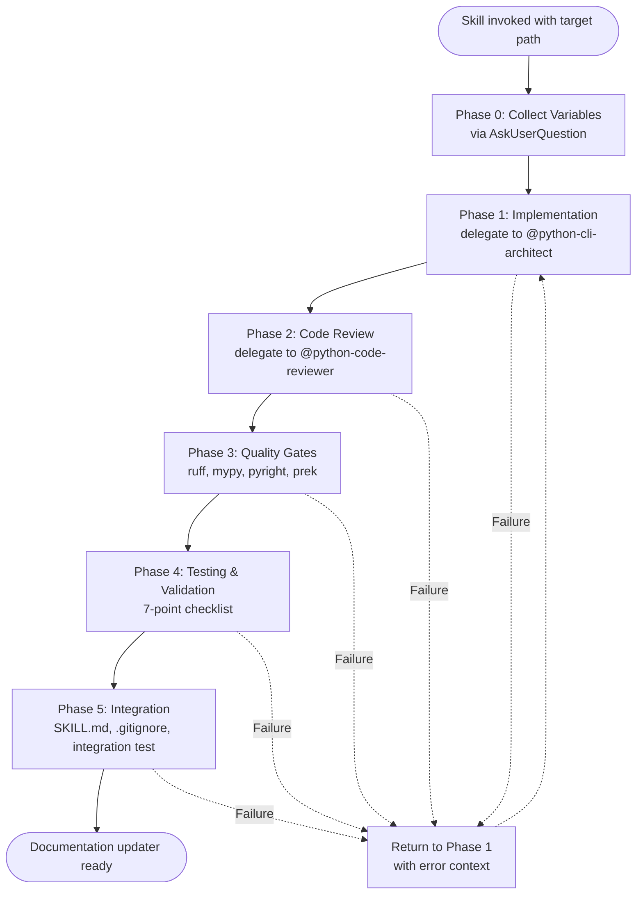

<skill_path>$ARGUMENTS</skill_path>

# Add Documentation Updater

Orchestrate adding automated documentation updater to target Claude skills. Follow the proven pattern from gitlab-skill's sync_gitlab_docs.py.

**Purpose**: Create a self-maintaining documentation pipeline that downloads upstream docs, processes markdown for AI consumption, transforms links for local navigation, and enforces cooldown periods between updates.

**Template**: `references/doc-updater-template.md`

**Process**: Collect 6 template variables from the user, substitute into template, delegate implementation through 5-phase workflow with quality gates at each stage.

## Orchestration Workflow



## Phase 0 — Collect Variables

<phase_0>

**Step 1: Validate target path**

Read the path from `<skill_path/>`:
- Verify directory exists and contains SKILL.md
- If path missing or invalid, use AskUserQuestion to request correct path

**Step 2: Infer defaults**

Extract reasonable defaults to reduce user input:
- SKILL_NAME: Extract from target directory name
- COOLDOWN_DAYS: Default to 7

**Step 3: Collect all 6 template variables**

Use AskUserQuestion for each variable. Present defaults where available.

<variables_to_collect>

**1. SKILL_NAME** — Skill identifier
- Default: inferred from target directory name
- Example: `gitlab-skill`
- Used for: script naming, gitignore comments

**2. DOC_SOURCE_URL** — Documentation archive URL
- Must be downloadable tar.gz or zip containing markdown files
- Example: `https://gitlab.com/gitlab-org/cli/-/archive/main/cli-main.tar.gz?path=docs`
- Supports: GitHub, GitLab, direct archive links

**3. DOC_PATH_IN_ARCHIVE** — Path to extract from archive
- Relative path within the downloaded archive
- Example: `docs` or `doc/ci`
- Leave empty to extract entire archive

**4. LOCAL_DOC_DIR** — Local directory name for downloaded docs
- Stored under `{target-path}/references/{LOCAL_DOC_DIR}/`
- Example: `ci` or `glab-cli`
- Keep short, descriptive, filesystem-safe

**5. DOC_DESCRIPTION** — Brief description
- Used in: execution protocol comments, gitignore annotations
- Example: `GitLab CI/CD pipeline documentation`
- Keep under 80 characters

**6. COOLDOWN_DAYS** — Days between automatic updates
- Typical range: 3-7
- Default: 7
- Prevents excessive upstream requests

</variables_to_collect>

**Step 4: Confirm before proceeding**

Display all collected values in structured format. Ask user to confirm before entering Phase 1.

</phase_0>

## Phase 1 — Implementation

<phase_1>

**Activate Python development workflow**

Invoke `/python3-development` skill to load Python development orchestration standards.

**Prepare substituted template**

1. Read `references/doc-updater-template.md`
2. Extract content from `## Full Prompt Template` section (between 5-backtick code fence delimiters)
3. Substitute all 6 `{VARIABLE}` placeholders with collected values:
   - `{SKILL_NAME}` → collected SKILL_NAME
   - `{DOC_SOURCE_URL}` → collected DOC_SOURCE_URL
   - `{DOC_PATH_IN_ARCHIVE}` → collected DOC_PATH_IN_ARCHIVE
   - `{LOCAL_DOC_DIR}` → collected LOCAL_DOC_DIR
   - `{DOC_DESCRIPTION}` → collected DOC_DESCRIPTION
   - `{COOLDOWN_DAYS}` → collected COOLDOWN_DAYS

**Delegate to Python CLI architect**

Use Agent tool to delegate to `@python-cli-architect` agent:
- Prompt: The complete substituted template
- Context: Target script path is `{target-path}/scripts/update-{LOCAL_DOC_DIR}-docs.py`
- Requirements: All technical specifications from template (PEP 723, atomic operations, link transformation, cooldown logic)

Wait for implementation completion before proceeding to Phase 2.

</phase_1>

## Phase 2 — Code Review

<phase_2>

**Delegate to code reviewer**

Use Agent tool to delegate to `@python-code-reviewer` agent:
- Target: Script created in Phase 1
- Review criteria:
  - Correctness: Logic matches requirements
  - Performance: Efficient file operations, appropriate caching
  - Security: ReDoS-safe regex patterns, safe path operations
  - Atomicity: Lock file writes use atomic operations
  - Link transformation: Path-aware relative link handling

**Critical review points**

1. Regex patterns: Check for catastrophic backtracking vulnerabilities
2. Path operations: Verify use of `pathlib.Path`, no string concatenation for paths
3. Lock file handling: Confirm atomic write-then-rename pattern
4. Error handling: Appropriate exceptions, no silent failures
5. Link transformation: Correct handling of `./`, `../`, absolute paths

**On failure**: Loop back to Phase 1 with specific review feedback. Pass reviewer comments to `@python-cli-architect` along with original template.

</phase_2>

## Phase 3 — Quality Gates

<phase_3>

Execute sequentially. Each step gates the next. All must pass before proceeding to Phase 4.

**Step 1: Format**

```bash
ruff format {script-path}
```

Rationale: Format first to prevent lint errors on whitespace and style issues.

**Step 2: Lint**

```bash
ruff check {script-path}
```

Rationale: Catch code smells, style violations, common bugs after formatting.

**Step 3: Type checking**

```bash
mypy {script-path}
pyright {script-path}
```

Rationale: Validate type annotations and inference after style compliance.

**Step 4: Pre-commit hooks**

```bash
uv run prek run --files {script-path}
```

Rationale: Final validation against all repository standards (YAML, markdown, executables, shebangs).

**On failure**: Loop back to Phase 1. Pass specific error output to `@python-cli-architect` along with original template and instruction to fix the identified issue.

</phase_3>

## Phase 4 — Testing & Validation

<phase_4>

Execute 7-point validation checklist. All must pass.

**1. Initial execution**

```bash
uv run {script-path} --working-dir {target-path}
```

Expected: Script completes successfully, exit code 0.

**2. File existence verification**

```bash
ls -la {target-path}/references/{LOCAL_DOC_DIR}/
```

Expected: Downloaded markdown files present in target directory.

**3. Hugo shortcode removal**

```bash
grep -r "{{< details" {target-path}/references/{LOCAL_DOC_DIR}/ | wc -l
```

Expected: 0 matches. All Hugo-specific syntax removed.

**4. Link transformation sampling**

Read 3-5 random markdown files from downloaded docs. Verify:
- Internal links use `./` relative paths
- External links use raw repository URLs (not web UI URLs)
- No broken link references

**5. SKILL.md integration**

Verify Documentation Index section created or updated in target SKILL.md with correct file references.

**6. Cooldown enforcement**

```bash
uv run {script-path} --working-dir {target-path}
```

Expected: Script exits with code 0 and message indicating update blocked by cooldown.

**7. Force flag bypass**

```bash
uv run {script-path} --working-dir {target-path} --force
```

Expected: Script re-downloads and processes documentation despite cooldown.

**On failure**: Loop back to Phase 1 with specific failure details. Include: which validation step failed, observed behavior, expected behavior.

</phase_4>

## Phase 5 — Integration

<phase_5>

**5a. Update target SKILL.md**

Add or update `## Execution Protocol` section in target skill's SKILL.md:

```markdown
## Execution Protocol

1. Update documentation (enforces {COOLDOWN_DAYS}-day cooldown):
   ```bash
   uv run scripts/update-{LOCAL_DOC_DIR}-docs.py --working-dir .
   ```
   Use `--force` flag to bypass cooldown and force immediate update.

2. [Rest of existing execution protocol steps...]
```

Position documentation update as first step in execution protocol. Include cooldown information and force flag usage.

**5b. Update .gitignore**

Add entries for lock files and downloaded documentation:

```text
# {SKILL_NAME} documentation sync
*/.update-{LOCAL_DOC_DIR}-docs.lock
{target-path}/references/{LOCAL_DOC_DIR}/
```

Ensure paths are relative to repository root. Add section header comment for clarity.

**5c. Integration test**

Use Agent tool to spawn `general-purpose` agent with minimal WHAT-only prompt:

```text
Use the {SKILL_NAME} skill to [accomplish task requiring documentation access].
```

Do NOT tell the agent:
- WHERE the documentation is located
- HOW to access it
- THAT an updater exists

Verify agent:
1. Discovers skill naturally
2. Follows execution protocol automatically
3. Accesses downloaded documentation without guidance
4. Completes task successfully

**On failure**: Loop back to Phase 1 if integration test reveals missing execution protocol steps, incorrect documentation paths, or inaccessible references.

</phase_5>

## Error Handling

<error_handling>

**Phase 0 failures** (invalid path, missing variables):
- Resolve interactively with user via AskUserQuestion
- Do not proceed to Phase 1 until all variables collected and confirmed

**Phase 1-5 failures** (implementation, review, quality, testing, integration):
- All loop back to Phase 1 with error context
- Pass to `@python-cli-architect` agent:
  - Original substituted template (full requirements)
  - Specific error context from failing phase
  - Instruction to fix identified issue
- Restart workflow from Phase 1 with updated implementation

**Maximum iterations**:
- No hard limit on loop-back iterations
- Each iteration includes progressively more context about previous failure modes
- If 3+ iterations fail at same phase, escalate to user with detailed failure analysis

</error_handling>

## Success Criteria

Documentation updater integration complete when:

1. Script passes all quality gates (ruff, mypy, pyright, prek)
2. All 7 validation tests pass
3. Target SKILL.md includes execution protocol with documentation update step
4. .gitignore entries prevent committing lock files and downloaded docs
5. Integration test demonstrates autonomous skill discovery and documentation access
6. Cooldown mechanism prevents excessive upstream requests
7. Force flag allows manual override when needed

Report completion with summary of created/modified files and next steps for user.
