# Add Documentation Updater Feature to Skill

Add automated documentation updater to Claude skills. Downloads documentation from upstream repository, processes for AI consumption, maintains local cache with configurable refresh intervals.

**Use when**: Adding local, auto-updating documentation to skills (GitLab CI docs, glab CLI docs, etc.)

---

## Workflow Overview

```mermaid
graph TD
    Start([User Request]) --> LoadSkills[Phase 1: Load Skills<br/>python3-development<br/>skill-creator]
    LoadSkills --> Architect[Delegate to<br/>python-cli-architect]

    Architect --> ScriptCreated{Script Created?}
    ScriptCreated -->|Yes| Review[Phase 2: Code Review<br/>Delegate to<br/>python-code-reviewer]
    ScriptCreated -->|No| Architect

    Review --> ReviewPass{Review Pass?}
    ReviewPass -->|Yes| QualityGates[Phase 3: Quality Gates]
    ReviewPass -->|No| Architect

    QualityGates --> PreCommit[uv run pre-commit]
    PreCommit --> Ruff[ruff format + ruff check]
    Ruff --> TypeCheck[mypy + pyright]

    TypeCheck --> AllPass{All Gates Pass?}
    AllPass -->|Yes| Testing[Phase 4: Testing]
    AllPass -->|No| Architect

    Testing --> RunScript[Run sync-gitlab-docs.py]
    RunScript --> VerifyFiles[Verify files downloaded]
    VerifyFiles --> CheckShortcodes[Verify Hugo shortcodes removed]
    CheckShortcodes --> CheckLinks[Verify link transformation]
    CheckLinks --> CheckIndex[Verify Documentation Index]
    CheckIndex --> TestCooldown[Test cooldown mechanism]
    TestCooldown --> TestForce[Test --force flag]

    TestForce --> TestsPass{All Tests Pass?}
    TestsPass -->|Yes| Integration[Phase 5: Integration Test]
    TestsPass -->|No| Architect

    Integration --> SubAgent[Spawn general-purpose agent<br/>with minimal WHAT prompt]
    SubAgent --> AgentDiscovers{Agent discovers<br/>and uses skill?}
    AgentDiscovers -->|Yes| Complete([✅ Complete])
    AgentDiscovers -->|No| Architect

    style Start fill:#e1f5ff
    style Complete fill:#d4edda
    style Architect fill:#fff3cd
    style Review fill:#fff3cd
    style QualityGates fill:#f8d7da
    style Testing fill:#f8d7da
    style Integration fill:#d1ecf1
```



**Workflow characteristics**: Iterative (all phases loop back on failure), sequential quality gates (format → lint → type check), comprehensive testing before production claim, integration verification confirms AI agent discoverability with minimal context.

---

## Template Variables

<variables>
Replace before use:

- `{SKILL_NAME}` - Skill identifier (e.g., "gitlab-skill")
- `{DOC_SOURCE_URL}` - Documentation archive URL
- `{DOC_PATH_IN_ARCHIVE}` - Extraction path within archive (e.g., "doc/ci")
- `{LOCAL_DOC_DIR}` - Local directory name (e.g., "ci", "glab-cli")
- `{DOC_DESCRIPTION}` - Brief context (e.g., "GitLab CI/CD pipeline documentation")
- `{COOLDOWN_DAYS}` - Update interval in days (typically 3-7)
</variables>

---

## Full Prompt Template

`````markdown
Add automated documentation updater to {SKILL_NAME} skill.

**Goal**: Maintain local, auto-updating copy of {DOC_DESCRIPTION} from upstream repository.

## Requirements

### 1. Documentation Update Script

Create `{SKILL_NAME}/scripts/update-{LOCAL_DOC_DIR}-docs.py`

<technical_requirements>
**Python**: 3.11+ with PEP 723 inline metadata
**Shebang**: `#!/usr/bin/env -S uv --quiet run --active --script`
**Dependencies**: `httpx>=0.28.1`, `typer>=0.19.2`, `pyyaml>=6.0.0`, `types-pyyaml>=6.0.0`
</technical_requirements>

#### Download & Extract

- Download from: `{DOC_SOURCE_URL}`
- Extract to temporary directory
- Validate extraction (verify markdown files present)
- Target path: `{DOC_PATH_IN_ARCHIVE}`

**Rationale**: Local cache eliminates network dependency during skill activation.

#### Post-Processing (Markdown Grooming)

<link_transformation>
**Internal links** (within extracted docs): Convert to relative paths with `./` prefix
**External links** (outside extracted docs): Convert to raw repository URLs
**Preserve**: Absolute URLs (http://, https://), anchor links (#), mailto links

**Rationale**: Relative links enable Claude Code click-through navigation. Raw URLs provide fallback for external references.

**Implementation**: Pass current file path and docs root to transformer. Use `Path.resolve()` and `Path.relative_to()` for accurate resolution. Handle arbitrary nesting depths. Compile regex patterns at module level (not inside functions).
</link_transformation>

<hugo_shortcode_removal>
Remove these blocks:
- `...`
- `...`

Support both `` and `{}` syntax variants.
Use regex with `re.DOTALL` for multiline matching.

**Critical pattern**: Hugo closing tags use `` (slash inside angle brackets).
Compile as `{{\s*<\s*/` not `{{\s*</`

**Rationale**: Hugo shortcodes are rendering directives, not content. They create noise in AI context windows.
</hugo_shortcode_removal>

#### File Tree Generation

Scan documentation directory and extract frontmatter:

- Parse `title:` field for link text
- Parse `description:` field for context
- Fallback to filename when frontmatter missing
- Generate markdown tree:

```text
├── [Title from frontmatter](./path/to/file.md)
    Description from frontmatter
```

- Use relative paths with `./` prefix
- Return formatted markdown in code fence

**Rationale**: Frontmatter titles/descriptions provide semantic context. Tree structure enables quick navigation to relevant sections.

#### SKILL.md Integration

- Locate or create `## Documentation Index` section
- Replace section content with generated file tree
- Preserve all other sections
- Use regex with `re.MULTILINE | re.DOTALL` for section matching

**Rationale**: Documentation Index appears in skill context, enabling agent discovery of relevant references without reading all files.

#### Lock File Mechanism

<lock_file_spec>
**Location**: `{SKILL_NAME}/.update-{LOCAL_DOC_DIR}-docs.lock`
**Format**: JSON with `last_run`, `last_status`, `files_processed`
**Cooldown**: {COOLDOWN_DAYS} days for successful runs only
**Failed runs**: Allow immediate retry
**Force flag**: `--force` bypasses cooldown
**Atomic writes**: Use temp file + rename (prevents corruption)
**Exit code**: 0 when blocked by cooldown (not an error)

**Rationale**: Cooldown prevents unnecessary network traffic. Atomic writes prevent corruption. Failed run retry enables quick recovery from transient errors.
</lock_file_spec>

#### User Feedback

- Use Rich for progress (download, extract, groom, index)
- Async download with progress bars
- Comprehensive error handling with specific exception types (not bare `except Exception`)

**Rationale**: Progress feedback provides observability. Specific exceptions enable targeted error recovery.

### 2. Update SKILL.md

Add to `## Execution Protocol` section (create if missing):

````markdown
## Execution Protocol

Follow this sequence when {SKILL_NAME} applies:

1. **Update documentation reference** (first step on skill activation):
   ```bash
   uv run scripts/sync-gitlab-docs.py --working-dir .
   ```
````

```markdown
- Updates {DOC_DESCRIPTION} from official repository
- Respects {COOLDOWN_DAYS}-day cooldown (successful runs only)
- Use `--force` to bypass cooldown when needed
- Creates/updates Documentation Index in SKILL.md
- Lock file: `.sync-gitlab-docs.lock` (gitignored)

2. [Rest of existing protocol steps...]
```

Update frontmatter description:

```yaml
description: [Existing description]. Use this skill before working with {DOC_DESCRIPTION}.
```

### 3. Update .gitignore

Add to repository root:

```text
# {SKILL_NAME} documentation sync lock files and generated docs
*/.sync-gitlab-docs.lock
{SKILL_NAME}/references/{LOCAL_DOC_DIR}/
```

**Rationale**: Lock files and downloaded docs are ephemeral. Version control would create merge conflicts across documentation updates.

### 4. Implementation Workflow

<orchestration>

**Phase 1: Implementation**

1. Load skills: `python3-development`, `skill-creator`
2. Delegate to `python-cli-architect`:
   - Provide all requirements above
   - Specify path: `{SKILL_NAME}/scripts/sync-gitlab-docs.py`
   - Request comprehensive error handling and progress feedback

**Phase 2: Code Review**

Delegate to `python-code-reviewer`:
- Review correctness, performance, security
- Check regex patterns for ReDoS vulnerabilities
- Verify path-aware link transformation
- Ensure atomic operations for lock file

**Phase 3: Quality Gates**

Execute sequentially (each gates the next):

1. Format: `ruff format`
2. Lint: `ruff check`
3. Type check: `mypy`, `pyright`
4. Pre-commit: `uv run pre-commit run --files scripts/sync-gitlab-docs.py`

**Rationale for ordering**: Format first prevents lint errors on whitespace. Type checking validates after style compliance.

**Phase 4: Testing & Validation**

<validation_checklist>
1. Run script: `uv run scripts/sync-gitlab-docs.py --working-dir .`
2. Verify downloaded files exist
3. Validate Hugo shortcode removal:
   ```bash
   grep -r "{{< details" references/{LOCAL_DOC_DIR}/ | wc -l
   ```
   Expect: 0
4. Sample link transformations:
   - Internal: Verify `./` relative paths
   - External: Verify raw repository URLs
5. Verify Documentation Index created in SKILL.md
6. Test cooldown: Run without `--force` (expect: blocked, exit 0)
7. Test force flag: Run with `--force` (expect: success)
</validation_checklist>

**Phase 5: Integration Test**

Validate AI agent discoverability:

1. Spawn `general-purpose` agent via Task tool
2. Provide minimal prompt (WHAT only, no WHERE/HOW)
3. Verify agent discovers and uses skill
4. Verify agent accesses documentation successfully

**Rationale**: Integration test confirms skill usability in production conditions (minimal context, self-discovery required).

</orchestration>

## Success Criteria

All criteria must pass before claiming production-ready:

- ✅ Script downloads and processes documentation successfully
- ✅ Hugo shortcodes removed (0 grep matches)
- ✅ Links transformed (internal=relative `./`, external=raw URLs)
- ✅ Documentation Index created with frontmatter titles
- ✅ Descriptions indented below file entries
- ✅ Graceful fallback to filename when frontmatter missing
- ✅ Lock file prevents runs within {COOLDOWN_DAYS} days
- ✅ `--force` bypasses cooldown
- ✅ All quality gates pass
- ✅ Integration test successful
- ✅ `.gitignore` excludes lock file and downloaded docs

## Implementation Patterns

<correct_patterns>
**Hugo shortcode regex**: `{{\s*<\s*/` (slash inside angle brackets)
**Compiled patterns**: Module-level, not inside functions
**Link resolution**: Path-aware (pass current file context)
**Lock file writes**: Atomic (temp file + rename)
**Quality gate order**: Format → lint → type check
**Production ready**: Only claim after integration test passes
</correct_patterns>

<incorrect_patterns>
**Hugo regex**: `{{\s*</` (missing space before slash)
**Pattern compilation**: Local `re.compile()` in functions
**Link resolution**: Hardcoded depth assumptions
**Lock file writes**: Direct write without atomicity
**Quality gates**: Running lint before format
**Production claims**: Before end-to-end validation
</incorrect_patterns>

---

## Example: Adding glab CLI Documentation

<example>
**Variable substitution**:

- `{SKILL_NAME}` → `gitlab-skill`
- `{DOC_SOURCE_URL}` → `https://gitlab.com/gitlab-org/cli/-/archive/main/cli-main.tar.gz?path=docs`
- `{DOC_PATH_IN_ARCHIVE}` → `docs`
- `{LOCAL_DOC_DIR}` → `glab-cli`
- `{DOC_DESCRIPTION}` → `glab CLI command reference and usage documentation`
- `{COOLDOWN_DAYS}` → `7`

**Usage**: Substitute variables, use filled template as orchestrator prompt. Orchestrator follows workflow to implement feature.
</example>

---

## Pattern Extensions

Adapt for:

- GitLab Runner documentation (extract `doc/` from gitlab-runner repository)
- Terraform provider docs
- API documentation (download OpenAPI specs, generate markdown)
- Library documentation (clone and extract docs/)
- Framework guides

Core pattern: download → process → index → lock file mechanism.

---

## Template Maintenance

**Location**: `plugins/plugin-creator/skills/add-doc-updater/references/`
**Updates**: Modify when pattern evolves (new post-processing steps)
**Versioning**: Include date for breaking changes (e.g., `doc-updater-template-v2-2025-11-19.md`)
