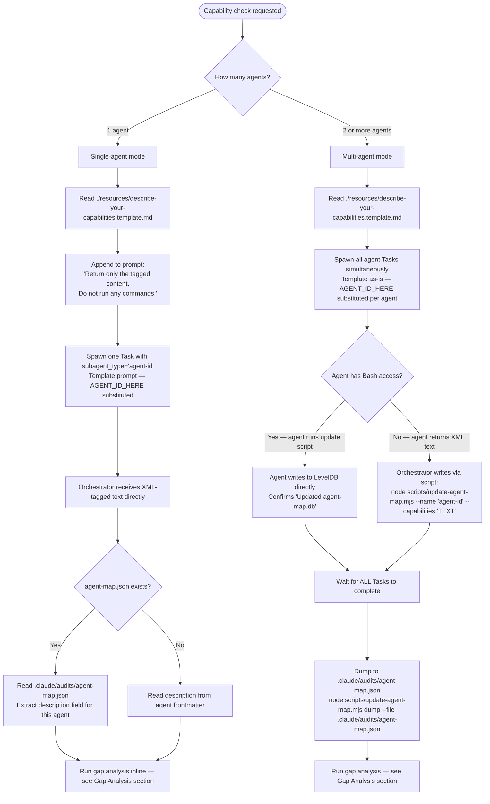

# Agent Capability Analyzer

## Overview

Description drift occurs when an agent's frontmatter `description` no longer matches what the agent actually does. Orchestrators use descriptions for routing decisions — stale descriptions cause misrouting. This skill collects self-reported capabilities from agents and compares them against their static frontmatter descriptions to quantify the gap.

The dataset lives in a LevelDB store (`agent-map.db/` relative to `$CLAUDE_PROJECT_DIR`) with two fields per agent: `description` (from frontmatter) and `capabilities` (self-reported). The `dump` command exports both fields to JSON for analysis.

The canonical dataset location is `.claude/audits/agent-map.json`.

## Invocation Mode

Choose invocation mode before spawning any Tasks. The routing decision is based on how many agents are being checked.



**Single-agent mode** — the orchestrator receives the XML-tagged response directly in the Task reply. Gap analysis runs inline: compare the `capabilities` text against the agent's `description` field, reading from `.claude/audits/agent-map.json` if it exists, otherwise from the agent's frontmatter. No script execution is required in this mode.

**Multi-agent mode** — uses LevelDB via the scripts. The orchestrator waits for all Tasks to complete before dumping. Agents that lack Bash access return their XML text and the orchestrator writes it via `update-agent-map.mjs` directly. The final dump produces `.claude/audits/agent-map.json` as the analysis input.

**Template usage** — `./resources/describe-your-capabilities.template.md` is used in both modes. In single-agent mode, append the instruction `Return only the tagged content. Do not run any commands.` to the end of the prompt. In multi-agent mode, use the template as-is with `AGENT_ID_HERE` substituted for each agent's id.

## Setup (First Time Only)

The scripts require the `level` npm package. Verify `package.json` contains:

```json
"level": "^10.0.0"
```

Then install from repo root:

```bash
pnpm install
```

## Full Experiment Workflow

Run this to collect self-reported capabilities from all agents simultaneously.

1. Seed `description` fields from agent frontmatter:

```bash
node $CLAUDE_PLUGIN_ROOT/scripts/populate-agent-descriptions.mjs
```

Output: `Populated N agents, skipped M`

2. Read the capabilities prompt template:

Read `$CLAUDE_PLUGIN_ROOT/resources/describe-your-capabilities.template.md` — this is the exact prompt each agent receives.

3. Spawn all known agents simultaneously via the Agent tool. For each agent, use the template as the prompt (replacing `AGENT_ID_HERE` with the agent's id). Each agent runs the update script itself.

   Agents that lack Bash access return their capabilities as text. Collect those responses and write them directly from the orchestrator:

   ```bash
   node $CLAUDE_PLUGIN_ROOT/scripts/update-agent-map.mjs --name "agent-id" --capabilities 'CAPABILITIES_TEXT'
   ```

4. After all Tasks complete, export the dataset:

```bash
node $CLAUDE_PLUGIN_ROOT/scripts/update-agent-map.mjs dump --file .claude/audits/agent-map.json
```

5. Perform gap analysis — see **Gap Analysis** section below.

## Single-Agent Analysis

When you only want to check one agent:

1. Read `$CLAUDE_PLUGIN_ROOT/resources/describe-your-capabilities.template.md`
2. Spawn one Task with `subagent_type="<agent-id>"`, using the template as the prompt (replace `AGENT_ID_HERE`)
3. The agent writes its own result to the DB
4. Dump and inspect:

```bash
node $CLAUDE_PLUGIN_ROOT/scripts/update-agent-map.mjs dump --file .claude/audits/agent-map.json
```

5. Perform gap analysis on the agent — see **Gap Analysis** section below.

## Looking Up Agent Data by Name

To retrieve a specific agent's data from the dataset, read the JSON file and extract the entry:

```bash
node -e "const d=JSON.parse(require('fs').readFileSync('.claude/audits/agent-map.json','utf8')); const k='AGENT_NAME'; console.log(JSON.stringify(d[k],null,2));"
```

Replace `AGENT_NAME` with the agent id (e.g. `plugin-creator:subagent-refactorer`).

Alternatively, use the Read tool on `.claude/audits/agent-map.json` and locate the entry by key.

## Gap Analysis

For each agent (or a target agent), compare `description` against `capabilities` and identify entries in three categories:

**Category 1 — In description but absent from capabilities**

These are things the frontmatter says the agent does, but the agent did not self-identify. Possible causes: description is aspirational, the agent's training doesn't surface that behavior unless prompted, or the agent's scope has narrowed since the description was written. Flag these as **underclaimed capabilities**.

**Category 2 — In capabilities but absent from description**

These are things the agent self-reports doing that are not in the frontmatter description. These cause misrouting: the orchestrator does not know the agent can do them. Flag these as **undocumented capabilities**.

**Category 3 — Out-of-lane claims**

These are capabilities the agent self-reports that fall outside the domain implied by its name and plugin context. For example, a `documentation-engineer` agent claiming to perform security audits, or a `performance-monitor` claiming to write production code. These indicate either description drift in the other direction (the agent has been trained too broadly) or self-report inflation. Flag these as **scope violations**.

### Gap Analysis Output Format

For each agent analyzed, produce a structured report:

```text
Agent: <agent-id>
Description: <description field>
Capabilities: <capabilities field>

Underclaimed (in description, not in capabilities):
- <item>

Undocumented (in capabilities, not in description):
- <item>

Scope violations (outside expected domain):
- <item>

Verdict: ALIGNED | MINOR_DRIFT | SIGNIFICANT_DRIFT | SCOPE_VIOLATION
```

Use `ALIGNED` when all three lists are empty or contain only minor phrasing differences. Use `SIGNIFICANT_DRIFT` when Category 1 or 2 lists contain substantive functional differences. Use `SCOPE_VIOLATION` when Category 3 is non-empty.

## Resources

- `./resources/describe-your-capabilities.template.md` — standardized prompt template for capability collection. Read this file before spawning agents.
- `./scripts/update-agent-map.mjs` — LevelDB-backed metadata store (write, dump, and load modes)
- `./scripts/populate-agent-descriptions.mjs` — batch-seeds `description` fields from frontmatter
