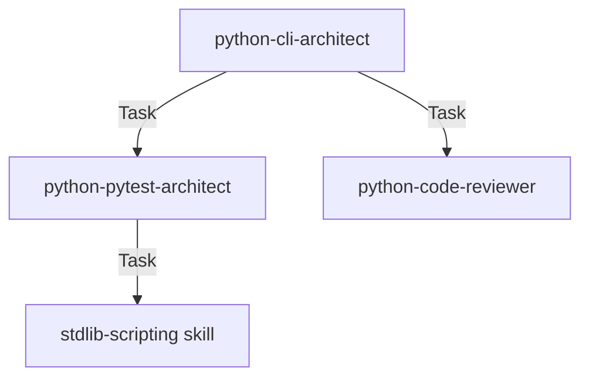
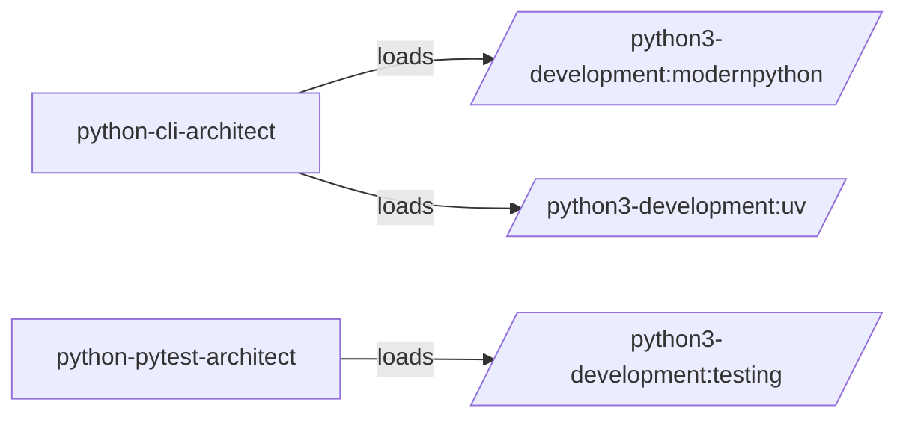

# Audit Agent Lifecycle

## Purpose

Validates that agents can actually accomplish what they claim to do by examining the alignment between agent descriptions, prompt instructions, tool access, skill dependencies, and delegation patterns. This audit answers: given that all agents exist and their references resolve, can these agents execute their documented workflows correctly?

This is execution capability validation, not workflow coherence analysis.

## When to Use

The model MUST activate this skill when:

- User requests agent capability validation
- User asks "can these agents do what they claim?"
- User wants to find dead agents or missing tool access
- User needs to validate agent-to-agent delegation contracts
- User wants to identify agents with contradictory instructions
- User needs to detect scriptable agent patterns (deterministic workflows)
- Post-refactoring validation of agent configurations
- Pre-marketplace review of agent quality

## Relationship to Skill Lifecycle Audit

These two audits are complementary:

| Aspect | skill-lifecycle-audit | agent-lifecycle-audit |
|--------|----------------------|----------------------|
| Primary target | SKILL.md files | Agent .md files |
| Focus | Workflow coherence | Execution capability |
| Call graph direction | Skill → Skill, Skill → Agent | Agent → Agent, Agent → Skill |
| Contradiction scope | Cross-skill instructions | Cross-agent and agent-vs-skill |

Run `/audit-skill-lifecycle` first to map workflow graphs, then this audit validates agents can execute those workflows. Both share the same `patterns.md` file in `.claude/audits/`.

## Workflow

### Step 1: Discovery

Scan plugin structure to identify:

- All agent files in `agents/` directory
- Agent frontmatter configuration (tools, skills, model, disallowedTools, permissionMode)
- Skill references in agent prompts (Skill(), /skill-name patterns)
- Agent delegation patterns (Task(agent=), @agent-name references)
- Tool usage keywords in prompt body

Build dependency graph:
- Agent → Agent (delegation via Task())
- Agent → Skill (loading via Skill() or skills field)
- Agent → Tool (usage via tool keywords in prompt)

### Step 2: Analysis — Run Audit Dimensions

Execute 8 semantic audits across 3 depth tiers. See [Agent Lifecycle Audit Specifications](./references/agent-lifecycle-audit.md) for detailed dimension definitions.

| Dimension | Tier | Detection Strategy | Output |
|-----------|------|-------------------|--------|
| 1. Capability vs Configuration Alignment | 2 | Compare claimed purpose (description) against instructions (prompt) against available resources (tools/skills) | Per-agent capability matrix with misalignment flags |
| 2. Skill Loading Correctness | 2 | Validate loaded skills provide expected capabilities and agent consumes outputs correctly | Per-agent skill load evaluation |
| 3. Inter-Agent Contract Alignment | 3 | Verify delegating agents provide inputs/outputs matching target agent expectations | Contract alignment matrix between agent pairs |
| 4. Prompt Instruction Contradictions | 2 | Detect internal, cross-agent, and agent-vs-skill contradictions | Contradiction pairs with file:line references |
| 5. Tool Access Sufficiency | 1 | Map prompt instructions to required tools, check availability | Per-agent tool sufficiency report |
| 6. Dead Agent Detection | 1 | Find agents never referenced by skills, commands, or other agents | List of potentially dead agents with evidence |
| 7. Scriptable Agent Patterns | 2 | Identify deterministic workflows replaceable by scripts | List of scriptable patterns with steps |
| 8. Self-Referential Pattern Learning | 2 | Classify issues by pattern, re-scan with new patterns until convergence | Append to shared patterns.md |

### Step 3: Report Generation

Write audit artifacts to `.claude/audits/`:

1. `agent-audit-report-{slug}.md` — Full findings organized by dimension
2. `agent-dependency-graph-{slug}.md` — Visual graph of agent-to-agent and agent-to-skill delegation
3. `patterns.md` — Shared pattern catalog (appended to, shared with skill-lifecycle-audit)
4. `agent-recommendations.md` — Prioritized actionable fixes with severity levels

## Audit Dimensions

### Tier Strategy

**Tier 1: Configuration Scan** (fast, automated)
- Parse frontmatter for tools, skills, model, disallowedTools
- Extract Skill/Task/@ references from prompt
- Build agent dependency graph
- Check tool sufficiency against instruction keywords

**Tier 2: Semantic Analysis** (AI reasoning required)
- Read agent description and full prompt to understand claimed purpose
- Compare claimed purpose against actual instructions
- Evaluate whether skill loads make semantic sense
- Detect instruction contradictions with context awareness

**Tier 3: Specialist Delegation** (for specific issue types)
- Tool access ambiguity → delegate to agent that reads Claude Code tool inheritance docs
- Cross-agent contract mismatch → delegate to agent that evaluates input/output compatibility
- Prompt quality issues → delegate to `@plugin-creator:subagent-refactorer` for optimization

### 1. Capability vs Configuration Alignment

Compare what the agent claims (description) against what it's instructed to do (prompt) against what resources it has (tools/skills).

**Misalignment examples:**
- Agent description says "runs tests" but no Bash tool access
- Agent prompt says "load the uv skill" but skills field doesn't include uv
- Agent prompt says "use WebFetch to check docs" but tool list doesn't include WebFetch

**Output:** Per-agent capability matrix showing CLAIMED, INSTRUCTED, AVAILABLE with flags where misaligned.

### 2. Skill Loading Correctness

For each skill reference in agent prompts:
- Is the skill reference namespace-qualified? (defer structural check to NamespaceReferenceValidator)
- Does the loaded skill actually provide the capability the agent expects?
- Does the agent pass appropriate inputs to the skill?
- Does the agent consume the skill's output format correctly?

**Example issue:** Agent loads `/python3-development:modernpython` and instructs "run modernpython to fix legacy patterns" but modernpython is a reference guide, not an automated fixer. The agent misrepresents what the skill does.

**Output:** Per-agent list of skill loads with semantic correctness evaluation.

### 3. Inter-Agent Contract Alignment

When agents delegate to other agents via Task():
- Does the delegating agent's prompt describe inputs matching what the target agent expects?
- Does the delegating agent expect outputs in a format the target agent produces?
- Are there assumptions about shared state (files, directories, environment variables) not explicitly communicated?

**Example issue:** `python-cli-architect` delegates to `python-pytest-architect` with "create tests for this implementation." Does the target agent expect file paths? Architecture docs? Both? Does the delegating agent provide what's expected?

**Output:** Contract alignment matrix between agent pairs with delegation relationships.

### 4. Prompt Instruction Contradictions

Compare instructions within single agent prompt and across related agents:

**Internal contradictions:** Same agent says "always use Typer" in one section and "use argparse for CLI" in another, without conditional guards.

**Cross-agent contradictions:** Agent A says "format with ruff before linting" and Agent B says "lint first, then format" when both operate in the same workflow.

**Skill-agent contradictions:** Agent prompt gives instructions conflicting with the skill it loads (e.g., agent says "use unittest.mock" but loaded skill says "use pytest-mock exclusively").

**Output:** Contradiction pairs with file:line references, classification (internal/cross-agent/skill-agent), and whether guarded by conditions.

### 5. Tool Access Sufficiency

For each action the agent prompt describes:
- What tool is required to perform this action?
- Is that tool in the agent's tools field (or inherited)?
- If the tool is restricted via disallowedTools, is the agent trying to use it anyway?

**Tool categories:**
- Bash needed for: running commands, executing scripts, git operations
- Read/Write/Edit needed for: file operations
- Grep/Glob needed for: search operations
- Task needed for: delegating to other agents
- WebFetch/WebSearch needed for: documentation lookup
- MCP tools needed for: specific integrations

**Output:** Per-agent tool sufficiency report. Flag instructions requiring tools the agent doesn't have.

### 6. Dead Agent Detection

Identify agents that:
- Are registered in plugin.json but never referenced by any skill, command, or other agent
- Are referenced in skill documentation but not in any executable context (Skill(), Task(), @agent)
- Have descriptions with trigger phrases that no workflow ever activates

**Output:** List of potentially dead agents with evidence (no inbound references found).

### 7. Scriptable Agent Patterns

Identify agents whose entire workflow could be replaced by a script:
- Agent prompt is a fixed sequence of tool calls with no conditional logic
- Agent doesn't need AI reasoning — just runs commands in order
- Agent's "decisions" are deterministic based on file existence or command output

These are candidates for conversion to Python scripts or commands, which execute faster, cost nothing, and are deterministic.

**Output:** List of scriptable agent patterns with the deterministic steps identified.

### 8. Self-Referential Pattern Learning

Same approach as skill-lifecycle-audit dimension 7:

1. Classify each discovered issue by detection pattern
2. Record the pattern with description, heuristic, and example
3. Re-scan all already-audited agents using the newly discovered pattern
4. Repeat until convergence

**Output:** Append to the shared `patterns.md` file (same file as skill-lifecycle-audit).

## Output Format

### agent-audit-report-{slug}.md

```markdown
# Agent Lifecycle Audit Report: {plugin-name}

**Audit Date:** {ISO timestamp}
**Plugin Path:** {absolute path}
**Agents Audited:** {count}

---

## Summary

| Dimension | Issues Found | Severity Breakdown |
|-----------|-------------|--------------------|
| Capability vs Configuration Alignment | {count} | Error: {n}, Warning: {n}, Info: {n} |
| Skill Loading Correctness | {count} | Error: {n}, Warning: {n}, Info: {n} |
| Inter-Agent Contract Alignment | {count} | Error: {n}, Warning: {n}, Info: {n} |
| Prompt Instruction Contradictions | {count} | Error: {n}, Warning: {n}, Info: {n} |
| Tool Access Sufficiency | {count} | Error: {n}, Warning: {n}, Info: {n} |
| Dead Agent Detection | {count} | Info: {n} |
| Scriptable Agent Patterns | {count} | Info: {n} |

---

## Dimension 1: Capability vs Configuration Alignment

### Agent: {name}

**Claimed capability (description):**
{excerpt from description field}

**Instructed actions (prompt):**
{excerpt from prompt body}

**Available resources:**
- Tools: {tools field value}
- Skills: {skills field value}

**Finding:**
❌ **ERROR** Agent claims to "run tests" but has no Bash tool access
{file}:{line}

**Severity:** error (agent cannot accomplish its purpose)

---

{repeat for each dimension}

---

## Recommendations

See `agent-recommendations.md` for prioritized actionable fixes.
```

### agent-dependency-graph-{slug}.md

```markdown
# Agent Dependency Graph: {plugin-name}

## Agent → Agent Delegation



## Agent → Skill Loading



## Tool Usage Matrix

| Agent | Bash | Read | Write | Edit | Grep | Glob | Task | WebFetch |
|-------|------|------|-------|------|------|------|------|----------|
| python-cli-architect | ✅ | ✅ | ✅ | ✅ | ✅ | ✅ | ✅ | ❌ |
| python-pytest-architect | ✅ | ✅ | ✅ | ✅ | ❌ | ❌ | ❌ | ❌ |

## Isolation Analysis

**Agents with no inbound references (potentially dead):**
- {agent-name} — no skills, commands, or agents reference this agent

**Agents with no outbound references (terminal nodes):**
- {agent-name} — does not delegate to other agents or load skills
```

### patterns.md (shared with skill-lifecycle-audit)

```markdown
# Shared Pattern Catalog

**Last Updated:** {ISO timestamp}
**Total Patterns:** {count}

---

## Pattern: Missing Tool Access for Workflow Step

**Detection Heuristic:**
1. Search prompt for action keywords: "run", "execute", "install", "test", "validate"
2. Map each keyword to required tool (Bash for command execution)
3. Check if tool is in tools field or inherited
4. Flag if tool missing

**Example Finding:**
Agent `test-runner` has instruction "Run pytest tests" but tools field is `["Read", "Write"]` — missing Bash.

**Source Audit:** agent-lifecycle-audit dimension 5 (Tool Access Sufficiency)

**Found In:**
- plugin-creator:refactor-executor (line 42)
- python3-development:python-pytest-architect (line 67)

---

{repeat for each pattern}
```

## Additional Resources

- [Agent Lifecycle Audit Specifications](./references/agent-lifecycle-audit.md) — detailed audit dimension definitions, detection strategies, and severity criteria
- [Skill Lifecycle Audit](../audit-skill-lifecycle/SKILL.md) — complementary audit for workflow coherence
