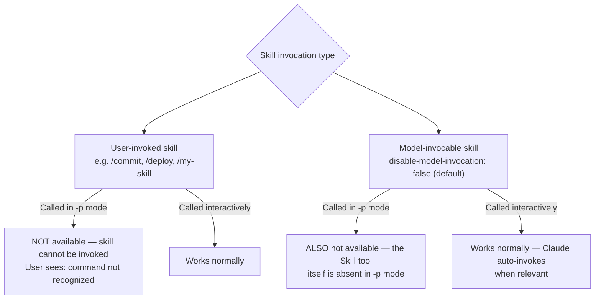

# Headless Mode and Agent SDK — Claude Code

AI-facing reference for plugin and skill authors designing automation, CI/CD integration,
and programmatic usage patterns.

SOURCE: <https://code.claude.com/docs/en/headless.md> (accessed 2026-03-17)
SOURCE: <https://code.claude.com/docs/en/scheduled-tasks.md> (accessed 2026-03-17)

---

## What Is the Agent SDK CLI

The Agent SDK gives you the same tools, agent loop, and context management that power
Claude Code. It is available as a CLI for scripts and CI/CD, or as Python and TypeScript
packages for full programmatic control.

> The CLI was previously called "headless mode." The `-p` flag and all CLI options work
> the same way.

To run Claude Code programmatically from the CLI, pass `-p` with your prompt and any CLI
options:

```bash
claude -p "Find and fix the bug in auth.py" --allowedTools "Read,Edit,Bash"
```

---

## CRITICAL CONSTRAINT: Skills Are Unavailable in `-p` Mode

> User-invoked skills like `/commit` and built-in commands are only available in interactive
> mode. In `-p` mode, describe the task you want to accomplish instead.

SOURCE: <https://code.claude.com/docs/en/headless.md> (exact quote, accessed 2026-03-17)

### What this means for plugin authors



**Design implication:** Skills designed for automation use cases (CI/CD, cron jobs, scripts)
must embed their full workflow in the `-p` prompt. You cannot rely on `/my-skill` being
available. Instead, instruct the user to pass the task description as a prompt:

```bash
# WRONG — skill invocation does not work in -p mode
claude -p "/my-deploy-skill production"

# CORRECT — describe the task directly
claude -p "Deploy to production: run ./scripts/deploy.sh production and verify health check"
```

This constraint applies to ALL skills, regardless of `disable-model-invocation` or
`user-invocable` settings.

---

## Key CLI Flags

All [CLI options](https://code.claude.com/docs/en/cli-reference) work with `-p`:

| Flag | Description |
|------|-------------|
| `-p` / `--print` | Run non-interactively; print response and exit |
| `--output-format text\|json\|stream-json` | Control response format |
| `--json-schema '<schema>'` | Return structured output conforming to a JSON Schema |
| `--continue` | Continue the most recent conversation |
| `--resume <session-id>` | Continue a specific conversation by session ID |
| `--append-system-prompt '<text>'` | Add instructions while keeping Claude Code's defaults |
| `--system-prompt '<text>'` | Fully replace the default system prompt |
| `--allowedTools '<tools>'` | Auto-approve specific tools without prompting |
| `--verbose` | Enable verbose output |
| `--include-partial-messages` | Include partial messages in stream-json output |
| `--append-system-prompt-file '<path>'` | Append content from a file to the system prompt |
| `--bare` | Skip auto-discovery of skills, agents, plugins, MCP servers, auto memory, and CLAUDE.md; reduces startup time; required for deterministic CI pipelines |

---

## Output Formats

### Text (default)

```bash
claude -p "What does the auth module do?"
```

### JSON

Returns a structured object with `result`, `session_id`, and metadata fields:

```bash
claude -p "Summarize this project" --output-format json
```

Use `jq` to extract specific fields:

```bash
claude -p "Summarize this project" --output-format json | jq -r '.result'
```

### JSON with Schema

Returns a JSON response with `structured_output` field (not `result`) conforming to the schema,
plus session metadata. Pass `--json-schema` together with `--output-format json`.

SOURCE: <https://code.claude.com/docs/en/headless.md> (accessed 2026-04-23)

```bash
claude -p "Extract the main function names from auth.py" \
  --output-format json \
  --json-schema '{"type":"object","properties":{"functions":{"type":"array","items":{"type":"string"}}},"required":["functions"]}' \
  | jq '.structured_output'
```

### stream-json

Newline-delimited JSON for real-time streaming. Combine with `--verbose` and
`--include-partial-messages`:

```bash
claude -p "Write a poem" \
  --output-format stream-json \
  --verbose \
  --include-partial-messages | \
  jq -rj 'select(.type == "stream_event" and .event.delta.type? == "text_delta") | .event.delta.text'
```

#### Stream Event Schema

SOURCE: <https://code.claude.com/docs/en/headless.md> (accessed 2026-04-23)

**`system/init`** — First event in the stream (unless `CLAUDE_CODE_SYNC_PLUGIN_INSTALL` is set,
in which case `system/plugin_install` events precede it). Contains session metadata including
the model, tools, MCP servers, and loaded plugins. Use the plugin fields to fail CI when a
plugin did not load:

| Field | Type | Description |
|-------|------|-------------|
| `plugins` | array | Plugins that loaded successfully, each with `name` and `path` |
| `plugin_errors` | array | Plugin load-time errors (absent when no errors occurred) |

**`system/plugin_install`** — Emitted when `CLAUDE_CODE_SYNC_PLUGIN_INSTALL` is set; one event
per plugin install lifecycle step. Allows automation pipelines to detect plugin loading failures
before the session starts:

| Field | Type | Description |
|-------|------|-------------|
| `type` | `"system"` | Message type |
| `subtype` | `"plugin_install"` | Identifies this as a plugin install event |
| `status` | `"started"`, `"installed"`, `"failed"`, or `"completed"` | Status bracket and individual results |
| `name` | string, optional | Marketplace name; present on `installed` and `failed` |
| `error` | string, optional | Failure message; present on `failed` |
| `uuid` | string | Unique event identifier |
| `session_id` | string | Session the event belongs to |

**`system/api_retry`** — Emitted before each retry attempt when an API request fails with a
retryable error. Allows consumers to distinguish transient failures from terminal errors:

| Field | Type | Description |
|-------|------|-------------|
| `attempt` | integer | Current attempt number |
| `max_retries` | integer | Maximum retry count |
| `retry_delay_ms` | integer | Delay before next attempt in milliseconds |
| `error_status` | integer | HTTP status code of the failed request |
| `error` | string | Error description |
| `uuid` | string | Unique event identifier |
| `session_id` | string | Session the event belongs to |

---

## Bare Mode (`--bare`)

The `--bare` flag skips auto-discovery of hooks, skills, plugins, MCP servers, auto memory,
and CLAUDE.md on startup. Use it in CI pipelines and scripts where deterministic startup
behavior is required and user-local configuration must not bleed in.

SOURCE: <https://code.claude.com/docs/en/headless.md> (accessed 2026-04-23)

```bash
claude -p "Run the test suite and report failures" \
  --bare \
  --append-system-prompt "You are a CI agent. Be concise." \
  --settings ci-settings.json \
  --allowedTools "Bash,Read"
```

`--bare` also skips OAuth and keychain reads — an explicit `ANTHROPIC_API_KEY` environment
variable or an `apiKeyHelper` in the settings file is required.

Use `--bare` together with these flags to load only what the script needs:

| Flag | Purpose |
|------|---------|
| `--append-system-prompt` / `--append-system-prompt-file` | Add instructions without loading CLAUDE.md |
| `--settings <file-or-json>` | Load a controlled settings file |
| `--mcp-config <file-or-json>` | Load specific MCP servers |
| `--agents <json>` | Load specific agents |
| `--plugin-dir <path>` | Load a specific plugin |

---

## Environment Variables

### `CLAUDE_CODE_SYNC_PLUGIN_INSTALL`

When `CLAUDE_CODE_SYNC_PLUGIN_INSTALL` is set, Claude Code installs marketplace plugins
synchronously before the first turn and emits `system/plugin_install` stream events during
installation. Without this variable, plugin installation is asynchronous and no
`system/plugin_install` events are emitted.

SOURCE: <https://code.claude.com/docs/en/headless.md> (accessed 2026-04-23)

Use this variable in automation pipelines that need to detect plugin load failures before
processing begins — check `plugin_errors` in the `system/init` event after all
`system/plugin_install` events complete.

---

## Common Automation Patterns

### Auto-approve specific tools

```bash
claude -p "Run the test suite and fix any failures" \
  --allowedTools "Bash,Read,Edit"
```

### Git commit from staged changes

```bash
claude -p "Look at my staged changes and create an appropriate commit" \
  --allowedTools "Bash(git diff *),Bash(git log *),Bash(git status *),Bash(git commit *)"
```

The trailing `*` enables prefix matching. A space before `*` is required — `Bash(git diff*)`
would also match `git diff-index`.

### Security review via pipe

```bash
gh pr diff "$1" | claude -p \
  --append-system-prompt "You are a security engineer. Review for vulnerabilities." \
  --output-format json
```

### Multi-turn conversations

```bash
# First request
claude -p "Review this codebase for performance issues"

# Continue most recent conversation
claude -p "Now focus on the database queries" --continue

# Resume a specific session by ID
session_id=$(claude -p "Start a review" --output-format json | jq -r '.session_id')
claude -p "Continue that review" --resume "$session_id"
```

---

## Python and TypeScript SDK Packages

For full programmatic control with structured outputs, tool approval callbacks, and native
message objects, use the Python or TypeScript SDK packages instead of the CLI:

- Python SDK: <https://platform.claude.com/docs/en/agent-sdk/python>
- TypeScript SDK: <https://platform.claude.com/docs/en/agent-sdk/typescript>
- Streaming: <https://platform.claude.com/docs/en/agent-sdk/streaming-output>
- Agent SDK overview: <https://platform.claude.com/docs/en/agent-sdk/overview>

---

## Scheduled Tasks and `/loop`

The `/loop` bundled skill and `CronCreate` / `CronList` / `CronDelete` tools work only in
interactive mode — they are not available in `-p` mode.

For recurring automation that runs without an active terminal session, use:

- **GitHub Actions** with a `schedule` trigger
- **Desktop scheduled tasks** (graphical setup via Claude Code desktop app)

For session-scoped polling and reminders (interactive use only), see
[Scheduled Tasks Reference](./scheduled-tasks.md).

---

## Disabling Skills vs Headless Constraints

These are two separate and independent mechanisms:

| Mechanism | What it controls |
|-----------|-----------------|
| `disable-model-invocation: true` | Prevents Claude from auto-loading the skill; user must type `/skill-name` |
| `user-invocable: false` | Hides skill from `/` menu; Claude still auto-invokes when relevant |
| `-p` mode | Neither setting matters — ALL skill invocations are unavailable |

A skill with `disable-model-invocation: false` (the default) is no more available in `-p`
mode than one with `disable-model-invocation: true`. The constraint is the mode itself.

---

## Design Checklist for Plugin Authors

Before shipping a skill intended for use in automation or CI/CD:

- [ ] The skill's workflow can be fully expressed as a `-p` prompt (no `/skill-name` invocations)
- [ ] Any polling behavior uses GitHub Actions or an external cron (not `/loop` or `CronCreate`)
- [ ] `--allowedTools` is documented for any tools the workflow needs
- [ ] Multi-turn dependencies use `--continue` or `--resume` with captured session IDs
- [ ] The skill description notes whether interactive-only features are used
