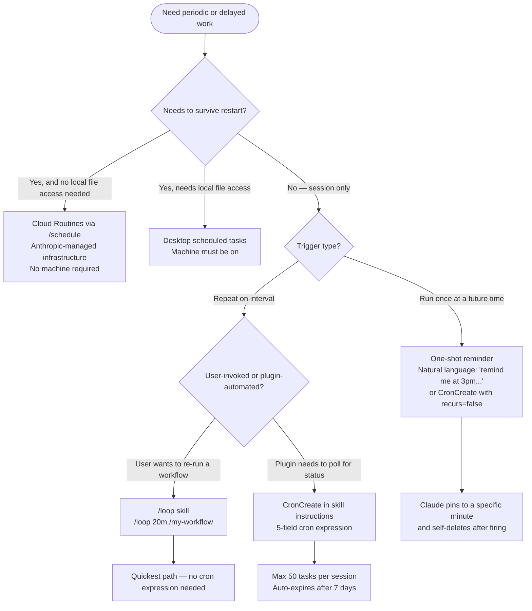

# Scheduled Tasks — Claude Code

AI-facing reference for designing plugins or skills that use scheduled tasks.

SOURCE: <https://code.claude.com/docs/en/scheduled-tasks.md> (accessed 2026-04-23)

---

## Scope and Durability

Session-scoped tasks (`CronCreate`, `/loop`) are gone when Claude Code exits. For durable scheduling that survives restarts, choose Cloud Routines or Desktop scheduled tasks instead.

---

## Scheduling Options Comparison

Three distinct scheduling methods exist. Choose based on durability, machine requirements, and file access needs.

| Feature | Cloud (Routines) | Desktop Tasks | `/loop` |
|---------|-----------------|---------------|---------|
| Where it runs | Anthropic infrastructure | Local machine | Local machine |
| Machine must be on | No | Yes | Yes |
| Session required | No | No | Yes |
| Persists across restarts | Yes | Yes | No |
| Local file access | No (fresh clone) | Yes | Yes |
| MCP servers | Configurable per task | Configurable per task | Session MCP servers |
| Permission prompts | None (autonomous) | Configured per task | Session permissions |
| Customizable schedule | Yes | Yes | Yes |
| Minimum interval | 1 hour | 1 minute | 1 minute |

SOURCE: <https://code.claude.com/docs/en/scheduled-tasks.md> (accessed 2026-04-23)

---

## When to Use What



---

## Cloud Routines via `/schedule`

Cloud Routines run on Anthropic-managed infrastructure — no local machine required.

- Created with the `/schedule` slash command
- Run autonomously with no permission prompts
- No local file access (each run starts from a fresh clone)
- Minimum interval: 1 hour
- MCP connectors are configurable per task
- Persist across restarts — survive Claude Code session endings

Use Cloud Routines when scheduling must survive machine shutdowns or when a task needs no local file system access.

SOURCE: <https://code.claude.com/docs/en/scheduled-tasks.md> (accessed 2026-04-23)

---

## /loop Bundled Skill

The fastest way to schedule a recurring prompt. No cron expression required.

**Interval syntax:**

| Form | Example | Interval |
|------|---------|----------|
| Leading token | `/loop 30m check the build` | Every 30 minutes |
| Trailing clause | `/loop check the build every 2 hours` | Every 2 hours |
| No interval (standard Claude Code) | `/loop check the build` | Dynamic — Claude picks 1m–1h |
| No interval (Bedrock/Vertex AI/Foundry) | `/loop check the build` | Fixed 10-minute schedule |

**Units:** `s` (seconds), `m` (minutes), `h` (hours), `d` (days). Seconds round up to the nearest minute. Intervals that don't divide evenly round to the nearest clean interval.

**Loop over another command:** `/loop 20m /review-pr 1234`

SOURCE: <https://code.claude.com/docs/en/scheduled-tasks.md> (accessed 2026-04-23)

---

## Dynamic Interval Selection

When you omit the interval from `/loop` on standard Claude Code, Claude picks a delay between 1 minute and 1 hour based on what it observes — rather than running on a fixed cron schedule. This avoids unnecessary polling when nothing has changed.

- Range: 1 minute to 1 hour
- Claude chooses after each iteration based on observed state
- May invoke the Monitor tool directly to watch for events instead of re-running repeatedly
- Platform exception: Bedrock, Vertex AI, and Microsoft Foundry use a fixed 10-minute schedule when no interval is specified

**Monitor tool integration:** When using dynamic `/loop`, Claude may invoke the `Monitor` tool to run a background script and stream each output line back. This is often more token-efficient and responsive than polling with re-runs on a fixed interval.

SOURCE: <https://code.claude.com/docs/en/scheduled-tasks.md> (accessed 2026-04-23)

---

## Customizing the Default Prompt with loop.md

When `/loop` runs with no prompt (bare `/loop`), it uses a built-in maintenance prompt that:

1. Continues any unfinished work
2. Tends to the current branch's PR (review comments, failed CI, merge conflicts)
3. Runs cleanup passes (bug hunts, simplification)

It does not start new initiatives outside that scope. Irreversible actions only proceed when the transcript authorizes them.

You can replace this built-in prompt with a `loop.md` file:

| Location | Precedence |
|----------|------------|
| `.claude/loop.md` (project-level) | Takes precedence over user-level |
| `~/.claude/loop.md` (user-level) | Fallback when no project-level file exists |

**Behavior:**

- Replaces the built-in maintenance prompt entirely
- Can be edited while the loop is running — takes effect on the next iteration
- Content beyond 25,000 bytes is truncated

SOURCE: <https://code.claude.com/docs/en/scheduled-tasks.md> (accessed 2026-04-23)

---

## Stopping a Loop

While `/loop` is waiting for its next iteration, press `Esc` to clear the pending wakeup and stop the loop.

- `Esc` stops loops created via `/loop`
- `Esc` does NOT affect tasks scheduled via `CronCreate`
- To cancel `CronCreate` tasks, use `CronDelete` with the task ID

SOURCE: <https://code.claude.com/docs/en/scheduled-tasks.md> (accessed 2026-04-23)

---

## Task Resumption via --resume and --continue

Session-scoped scheduled tasks can be restored when restarting Claude Code with `--resume` or `--continue`:

| Task type | Restored if... |
|-----------|---------------|
| Recurring (CronCreate) | Within 7 days of creation |
| One-shot (CronCreate) | Scheduled time has not yet passed |
| Background Bash | Never restored on resume |
| Monitor tasks | Never restored on resume |

SOURCE: <https://code.claude.com/docs/en/scheduled-tasks.md> (accessed 2026-04-23)

---

## One-Time Reminders

Natural language — no `/loop` needed:

- `remind me at 3pm to push the release branch`
- `in 45 minutes, check whether the integration tests passed`

Claude creates a cron expression pinned to a specific minute and self-deletes after firing.

---

## Tools

| Tool | Purpose |
|------|---------|
| `CronCreate` | Schedule a new task. Accepts 5-field cron expression, prompt to run, whether it recurs or fires once. |
| `CronList` | List all scheduled tasks with IDs, schedules, and prompts. |
| `CronDelete` | Cancel a task by ID. |

**Limit:** 50 scheduled tasks per session. Each task has an 8-character ID.

---

## Execution Model

- Scheduler checks every second for due tasks; enqueues at low priority
- Fires between user turns — never mid-response
- If Claude is busy, the prompt waits until the current turn ends
- All times in local timezone

---

## Jitter

| Task type | Jitter behavior |
|-----------|----------------|
| Recurring | Fires up to 10% of period late, capped at 15 minutes. Example: hourly job fires between :00 and :06. |
| One-shot at :00 or :30 | Fires up to 90 seconds early. |

Offset is deterministic from task ID. If exact timing matters, avoid scheduling at `:00` or `:30`.

SOURCE: <https://code.claude.com/docs/en/scheduled-tasks.md> (accessed 2026-04-23)

---

## Seven-Day Expiry

Recurring tasks auto-expire 7 days after creation. The task fires one final time then self-deletes.

SOURCE: <https://code.claude.com/docs/en/scheduled-tasks.md> (accessed 2026-04-23)

---

## Platform-Specific Behavior

Behavior differences on managed cloud platforms:

| Platform | Bare `/loop` (no prompt) | `/loop prompt` (no interval) |
|----------|--------------------------|------------------------------|
| Standard Claude Code | Runs built-in maintenance prompt | Dynamic interval (1m–1h) |
| Bedrock | Prints usage message instead | Fixed 10-minute schedule |
| Vertex AI | Prints usage message instead | Fixed 10-minute schedule |
| Microsoft Foundry | Prints usage message instead | Fixed 10-minute schedule |

SOURCE: <https://code.claude.com/docs/en/scheduled-tasks.md> (accessed 2026-04-23)

---

## Cron Expression Reference (5-Field Standard)

```text
minute  hour  day-of-month  month  day-of-week
```

**Examples:**

| Expression | Meaning |
|------------|---------|
| `*/5 * * * *` | Every 5 minutes |
| `0 * * * *` | Every hour on the hour |
| `7 * * * *` | Every hour at 7 minutes past |
| `0 9 * * *` | Every day at 9am local |
| `0 9 * * 1-5` | Weekdays at 9am local |
| `30 14 15 3 *` | March 15 at 2:30pm local |

**Supported syntax:** wildcards (`*`), single values (`5`), steps (`*/15`), ranges (`1-5`), comma-separated lists (`1,15,30`).

**Day-of-week:** 0 or 7 = Sunday, 6 = Saturday.

**Both day-of-month and day-of-week constrained:** matches if EITHER field matches (vixie-cron semantics).

**Not supported:** `L`, `W`, `?`, name aliases (`MON`, `JAN`).

---

## Disabling the Scheduler

Set `CLAUDE_CODE_DISABLE_CRON=1` to disable entirely. `CronCreate`, `CronList`, `CronDelete`, and `/loop` become unavailable.

---

## Limitations

- Tasks only fire while Claude Code is running and idle
- No catch-up for missed fires — fires once when Claude becomes idle
- No persistence across restarts (unless using Cloud Routines)

---

## Plugin Integration Guidance

- Use `CronCreate` in skill instructions when a skill needs to poll for status (e.g., waiting for a deployment or build).
- Recommend `/loop` when users want to re-run a workflow on an interval — it requires no cron syntax knowledge.
- For scheduling that must survive restarts with local file access, recommend Desktop scheduled tasks; document this constraint explicitly in the skill.
- For scheduling that must survive restarts without local file access, recommend Cloud Routines via `/schedule`.
- Prefer one-shot tasks (natural language or `CronCreate` with `recurs=false`) for "remind me" patterns.
- Recurring tasks auto-expire after 7 days — do not design skills that assume indefinite recurrence.
- When designing skills for Bedrock, Vertex AI, or Microsoft Foundry: bare `/loop` prints usage instead of starting the maintenance loop; prompts without intervals run on fixed 10-minute schedules.

SOURCE: <https://code.claude.com/docs/en/scheduled-tasks.md> (accessed 2026-04-23)
