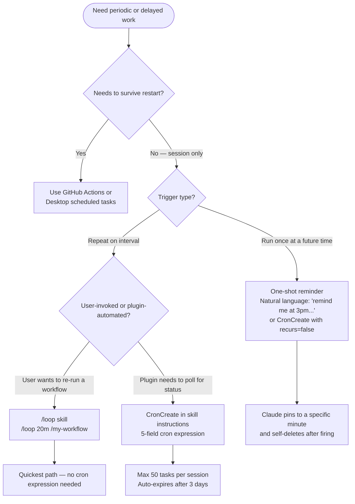

# Scheduled Tasks — Claude Code

AI-facing reference for designing plugins or skills that use scheduled tasks.

SOURCE: <https://code.claude.com/docs/en/scheduled-tasks.md> (accessed 2026-03-07)

---

## Scope and Durability

Session-scoped — tasks are gone when Claude Code exits. For durable scheduling, use Desktop scheduled tasks or GitHub Actions instead.

---

## When to Use What



---

## /loop Bundled Skill

The fastest way to schedule a recurring prompt. No cron expression required.

**Interval syntax:**

| Form | Example | Interval |
|------|---------|----------|
| Leading token | `/loop 30m check the build` | Every 30 minutes |
| Trailing clause | `/loop check the build every 2 hours` | Every 2 hours |
| No interval | `/loop check the build` | Every 10 minutes (default) |

**Units:** `s` (seconds), `m` (minutes), `h` (hours), `d` (days). Seconds round up to the nearest minute. Intervals that don't divide evenly round to the nearest clean interval.

**Loop over another command:** `/loop 20m /review-pr 1234`

---

## One-Time Reminders

Natural language — no `/loop` needed:

- `remind me at 3pm to push the release branch`
- `in 45 minutes, check whether the integration tests passed`

Claude creates a cron expression pinned to a specific minute and self-deletes after firing.

---

## Tools

| Tool | Purpose |
|------|---------|
| `CronCreate` | Schedule a new task. Accepts 5-field cron expression, prompt to run, whether it recurs or fires once. |
| `CronList` | List all scheduled tasks with IDs, schedules, and prompts. |
| `CronDelete` | Cancel a task by ID. |

**Limit:** 50 scheduled tasks per session. Each task has an 8-character ID.

---

## Execution Model

- Scheduler checks every second for due tasks; enqueues at low priority
- Fires between user turns — never mid-response
- If Claude is busy, the prompt waits until the current turn ends
- All times in local timezone

---

## Jitter

| Task type | Jitter behavior |
|-----------|----------------|
| Recurring | Fires up to 10% of period late, capped at 15 minutes. Example: hourly job fires between :00 and :06. |
| One-shot at :00 or :30 | Fires up to 90 seconds early. |

Offset is deterministic from task ID.

---

## Three-Day Expiry

Recurring tasks auto-expire 3 days after creation. The task fires one final time then self-deletes.

---

## Cron Expression Reference (5-Field Standard)

```text
minute  hour  day-of-month  month  day-of-week
```

**Examples:**

| Expression | Meaning |
|------------|---------|
| `*/5 * * * *` | Every 5 minutes |
| `0 * * * *` | Every hour on the hour |
| `7 * * * *` | Every hour at 7 minutes past |
| `0 9 * * *` | Every day at 9am local |
| `0 9 * * 1-5` | Weekdays at 9am local |
| `30 14 15 3 *` | March 15 at 2:30pm local |

**Supported syntax:** wildcards (`*`), single values (`5`), steps (`*/15`), ranges (`1-5`), comma-separated lists (`1,15,30`).

**Day-of-week:** 0 or 7 = Sunday, 6 = Saturday.

**Both day-of-month and day-of-week constrained:** matches if EITHER field matches (vixie-cron semantics).

**Not supported:** `L`, `W`, `?`, name aliases (`MON`, `JAN`).

---

## Disabling the Scheduler

Set `CLAUDE_CODE_DISABLE_CRON=1` to disable entirely. `CronCreate`, `CronList`, `CronDelete`, and `/loop` become unavailable.

---

## Limitations

- Tasks only fire while Claude Code is running and idle
- No catch-up for missed fires — fires once when Claude becomes idle
- No persistence across restarts

---

## Plugin Integration Guidance

- Use `CronCreate` in skill instructions when a skill needs to poll for status (e.g., waiting for a deployment or build).
- Recommend `/loop` when users want to re-run a workflow on an interval — it requires no cron syntax knowledge.
- For scheduling that must survive restarts, recommend GitHub Actions or Desktop scheduled tasks; document this constraint explicitly in the skill.
- Prefer one-shot tasks (natural language or `CronCreate` with `recurs=false`) for "remind me" patterns.
- Recurring tasks auto-expire after 3 days — do not design skills that assume indefinite recurrence.
