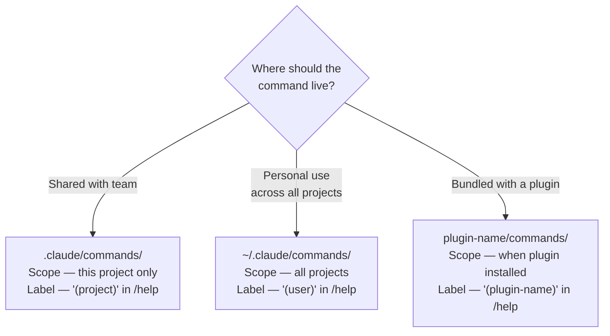
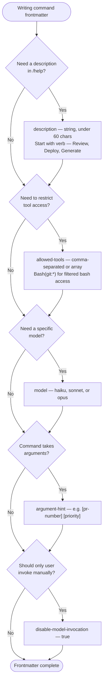
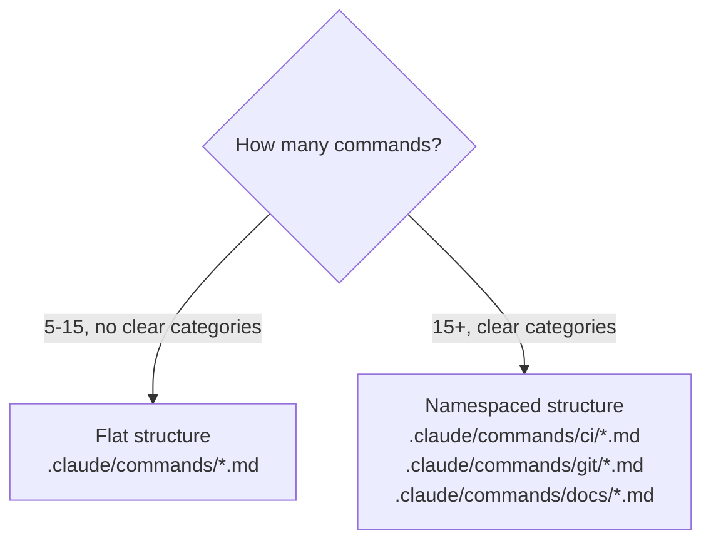
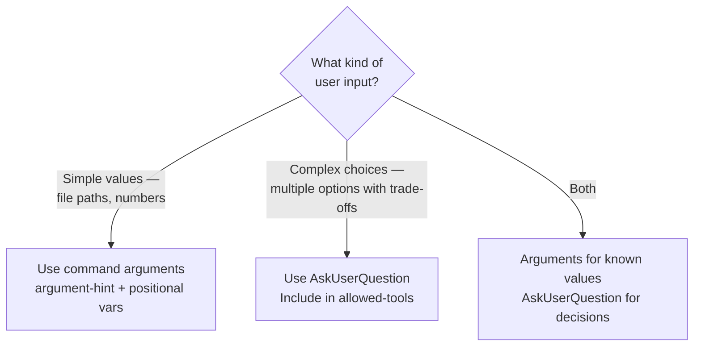
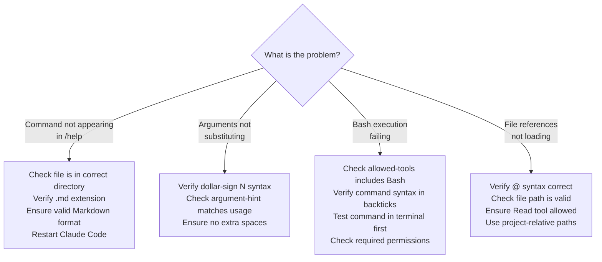

# Command Development for Claude Code

> **Legacy Format Notice.** The `.claude/commands/` directory is a legacy format.
> For new development, use `.claude/skills/<name>/SKILL.md` instead.
> Both formats are loaded identically — the only difference is file layout.
> Use `/plugin-creator:skill-creator` for the preferred skills format.
>
> Commands remain fully supported for backward compatibility and are still
> appropriate when maintaining existing command sets or contributing to
> projects that use the commands/ convention.

## What Commands Are

Slash commands are Markdown files containing prompts that Claude executes when
invoked via `/command-name`. They provide reusable, consistent, shareable
workflows with quick access to complex prompts.

**Commands are instructions FOR Claude, not messages TO users.** When a user
invokes `/command-name`, the command content becomes Claude's instructions.
Write commands as directives to Claude about what to do.

```markdown
<!-- Correct: instructions for Claude -->
Review this code for security vulnerabilities including:
- SQL injection
- XSS attacks
- Authentication issues

Provide specific line numbers and severity ratings.
```

```markdown
<!-- Wrong: message to user — Claude receives this but has no directive -->
This command will review your code for security issues.
You'll receive a report with vulnerability details.
```

## Command Locations



## File Format

Commands are `.md` files. No frontmatter is required for basic commands.

```text
.claude/commands/
├── review.md           # /review
├── test.md             # /test
└── deploy.md           # /deploy
```

Add YAML frontmatter for configuration:

```markdown
---
description: Review code for security issues
allowed-tools: Read, Grep, Bash(git:*)
model: sonnet
---

Review this code for security vulnerabilities...
```

## Frontmatter Fields (Summary)

All fields are optional. Commands work without any frontmatter.



For the complete field specification with examples, validation rules, and edge
cases, see [./references/frontmatter-fields.md](./references/frontmatter-fields.md).

## Dynamic Arguments

### Positional Arguments

Capture individual arguments with `$1`, `$2`, `$3`:

```markdown
---
description: Review PR with priority and assignee
argument-hint: [pr-number] [priority] [assignee]
---

Review pull request #$1 with priority level $2.
After review, assign to $3 for follow-up.
```

Running `/review-pr 123 high alice` expands to:
`Review pull request #123 with priority level high. After review, assign to alice for follow-up.`

### $ARGUMENTS

Capture all arguments as a single string:

```markdown
---
argument-hint: [issue-number]
---

Fix issue #$ARGUMENTS following our coding standards.
```

### File References with @

Include file contents using `@` syntax:

```markdown
Review @$1 for code quality and potential bugs.
```

Running `/review-file src/api/users.ts` causes Claude to read `src/api/users.ts`
before processing the command.

Static references also work: `Review @package.json and @tsconfig.json for consistency.`

## Bash Execution

Execute shell commands inline with `` !`command` `` syntax to gather dynamic context:

```markdown
---
allowed-tools: Bash(git:*)
---

Files changed: !`git diff --name-only`

Review each file for code quality and potential bugs.
```

The command output replaces the placeholder before Claude processes the prompt.
Ensure `allowed-tools` includes the appropriate Bash filter.

## Command Organization



Subdirectory names become namespaces shown in `/help`. For example,
`.claude/commands/ci/build.md` appears as `/build (project:ci)`.

## Common Patterns

### Review Pattern

```markdown
---
description: Review code changes
allowed-tools: Read, Bash(git:*)
---

Files changed: !`git diff --name-only`

Review each file for:
1. Code quality and style
2. Potential bugs or issues
3. Test coverage
4. Documentation needs
```

### Testing Pattern

```markdown
---
description: Run tests for specific file
argument-hint: [test-file]
allowed-tools: Bash(npm:*)
---

Run tests: !`npm test $1`

Analyze results and suggest fixes for failures.
```

### Workflow Pattern

```markdown
---
description: Complete PR workflow
argument-hint: [pr-number]
allowed-tools: Bash(gh:*), Read
---

PR #$1 Workflow:

1. Fetch PR: !`gh pr view $1`
2. Review changes
3. Run checks
4. Approve or request changes
```

## Best Practices

1. **Single responsibility** — one command, one task
2. **Clear descriptions** — self-explanatory in `/help`, under 60 chars
3. **Document arguments** — always provide `argument-hint`
4. **Restrict tools** — use most restrictive `allowed-tools` that works; prefer `Bash(git:*)` over `Bash(*)`
5. **Consistent naming** — use verb-noun pattern (review-pr, fix-issue)
6. **Validate inputs** — check for required arguments early in the prompt
7. **Handle errors** — consider missing or invalid arguments

## Interactive Commands (AskUserQuestion)

For commands that need complex user input beyond simple arguments, use the
`AskUserQuestion` tool. This enables multi-choice decisions, multi-select
scenarios, and conditional workflows.



For complete AskUserQuestion patterns including multi-stage workflows,
conditional flows, multi-select, and validation loops, see
[./references/interactive-commands.md](./references/interactive-commands.md).

## Advanced Workflows

Commands can implement multi-step sequences, maintain state across invocations
using `.local.md` files, coordinate with other commands, and compose into
pipeline workflows.

For state management, command composition, workflow recovery, and error handling
patterns, see [./references/advanced-workflows.md](./references/advanced-workflows.md).

## Plugin Command Features

Plugin commands have access to `${CLAUDE_PLUGIN_ROOT}` for portable paths to
plugin resources, auto-discovery from the `commands/` directory, and can
integrate with plugin agents, skills, and hooks.

For CLAUDE_PLUGIN_ROOT patterns, plugin component integration, validation
patterns, and marketplace distribution guidance, see
[./references/plugin-command-patterns.md](./references/plugin-command-patterns.md).

## Troubleshooting



## Related Skills

- For the preferred skills format: `/plugin-creator:skill-creator`
- For hook development: `/plugin-creator:hooks-guide`
- For agent creation: `/plugin-creator:agent-creator`
- For plugin lifecycle: `/plugin-creator:plugin-lifecycle`
- For plugin structure and component selection: `/plugin-creator:component-patterns`
- For command documentation and testing strategies: see [./references/frontmatter-fields.md](./references/frontmatter-fields.md) validation section

Source: Adapted from Anthropic's `plugin-dev:command-development` skill
(../claude-plugins-official/plugins/plugin-dev/skills/command-development/, 11 files).
