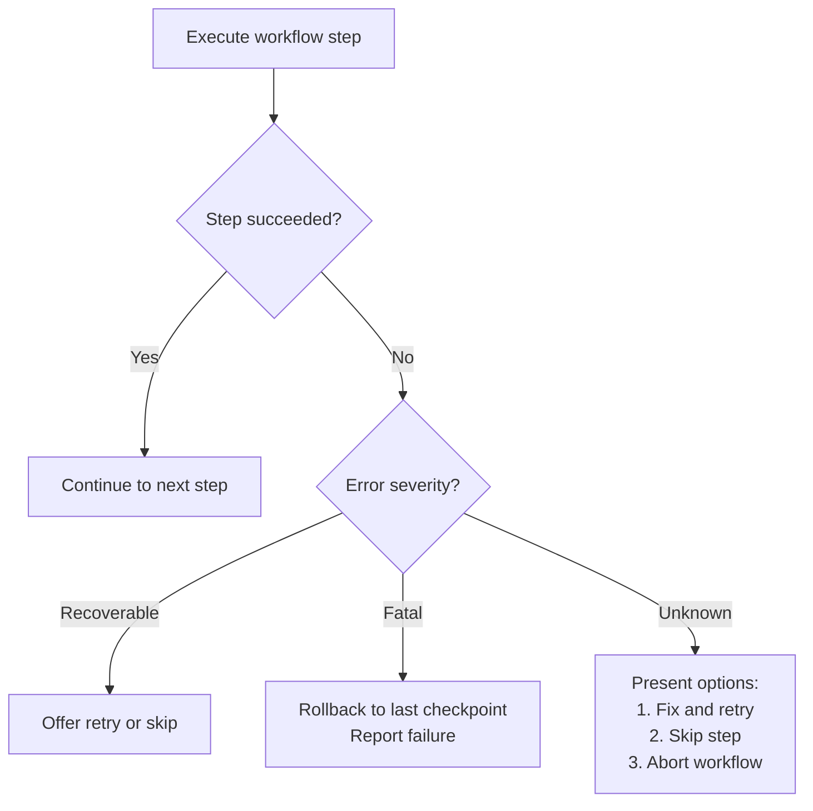

# Advanced Workflow Patterns

Multi-step command sequences, state management, and composition patterns for
complex workflows.

## Sequential Workflow Command

Guide users through multi-step processes:

```markdown
---
description: Complete PR review workflow
argument-hint: [pr-number]
allowed-tools: Bash(gh:*), Read, Grep
---

## Step 1 — Fetch PR Details
!`gh pr view $1 --json title,body,author,files`

## Step 2 — Review Files
Files changed: !`gh pr diff $1 --name-only`

For each file: check quality, verify tests, review docs.

## Step 3 — Run Checks
Test status: !`gh pr checks $1`

## Step 4 — Provide Feedback
Summarize issues, suggestions, and approval recommendation.
```

## State Management with .local.md Files

Store workflow state in plugin-specific files for multi-command sequences:

```markdown
---
description: Initialize deployment workflow
allowed-tools: Write, Bash(git:*)
---

Creating deployment tracking file...

Current branch: !`git branch --show-current`
Latest commit: !`git log -1 --format=%H`

Write to .claude/deployment-state.local.md:
- workflow: deployment
- branch: [current branch]
- commit: [latest commit]
- stage: initialized
- timestamp: [current time]

State saved. Run /deploy-test to continue.
```

Subsequent commands read the state file and advance the workflow:

```markdown
---
description: Run deployment tests
allowed-tools: Read, Bash(npm:*)
---

Reading deployment state from .claude/deployment-state.local.md...

Running tests: !`npm test`

Update state to 'tested'. Run /deploy-build to continue.
```

## Conditional Workflow Branching

Adapt behavior based on detected conditions:

```markdown
---
description: Smart deployment workflow
argument-hint: [environment]
allowed-tools: Bash(git:*), Bash(npm:*), Read
---

## Pre-flight Checks

Branch: !`git branch --show-current`
Status: !`git status --short`

Branch check:
- If main/master: require approval
- If feature branch: warn about target
- If hotfix: fast-track process

Tests: !`npm test`
- If fail: STOP — fix tests first
- If pass: continue

Environment:
- If production: extra validation
- If staging: standard process
- If dev: minimal checks
```

## Command Composition

Commands designed to work together:

```markdown
---
description: Prepare for code review
---

Running preparation sequence:
1. Format code: /format-code
2. Run linter: /lint-code
3. Run tests: /test-all
4. Generate coverage: /coverage-report

Compile results and prepare review materials.
```

Individual commands are simple and single-purpose. The composition command
orchestrates them.

## Workflow Recovery

Handle interrupted workflows:

```markdown
---
description: Resume deployment workflow
allowed-tools: Read
---

Checking for interrupted workflow...

State file: @.claude/deployment-state.local.md

Recovery options:
1. Resume from last completed step
2. Restart from beginning
3. Abort and clean up
```

## Cross-Command Communication

Commands that signal each other via flag files:

```markdown
---
description: Mark feature complete
allowed-tools: Write
---

Writing completion marker to .claude/feature-complete.flag

This signals other commands that the feature is ready for:
- Integration testing (/integration-test auto-detects)
- Documentation generation (/docs-generate includes)
- Release notes (/release-notes adds)
```

## Workflow Locking

Prevent concurrent workflow execution:

```markdown
---
description: Start deployment
allowed-tools: Read, Write, Bash
---

Check for active deployments...

if .claude/deployment.lock exists:
  ERROR: Deployment already in progress.
  Wait for completion or run /deployment-abort.
  Exit.

Create deployment lock.
Proceed with deployment.
```

## Error Handling in Workflows



Use checkpoint files to support recovery:

```markdown
echo "checkpoint:validation" >> .claude/deployment-checkpoints.log
```

If any step fails, resume with `/deployment-resume [last-successful-checkpoint]`.

## Best Practices

1. **Clear progression** — number steps, show current position
2. **Explicit state** — use `.local.md` files, never rely on implicit state
3. **User control** — provide decision points at critical junctures
4. **Error recovery** — handle failures gracefully with rollback options
5. **Single responsibility** — each command in a chain does one thing well
6. **Loose coupling** — commands share state via files, not internal dependencies
7. **Atomic updates** — write complete state files, not partial updates
8. **Cleanup** — remove stale state and lock files after workflow completion

Source: Adapted from Anthropic's plugin-dev command-development
references/advanced-workflows.md.
