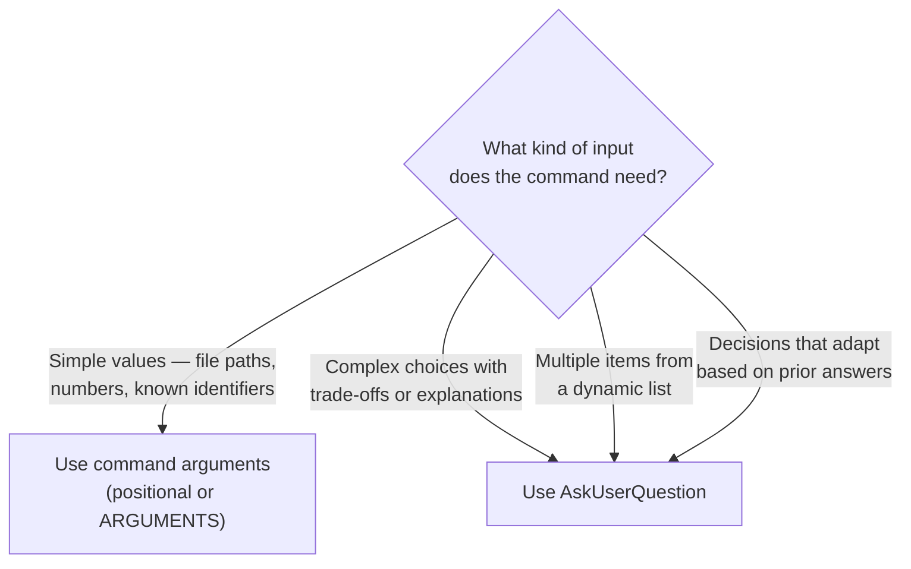

# Interactive Command Patterns (AskUserQuestion)

Guide to creating commands that gather user feedback and make decisions through
the AskUserQuestion tool.

## When to Use



## AskUserQuestion Tool Parameters

```typescript
{
  questions: [
    {
      question: "Which authentication method should we use?",
      header: "Auth method",  // Short label (max 12 chars)
      multiSelect: false,     // true for multiple selection
      options: [
        {
          label: "OAuth 2.0",
          description: "Industry standard, supports multiple providers"
        },
        {
          label: "JWT",
          description: "Stateless, good for APIs"
        }
      ]
    }
  ]
}
```

Key constraints:

- Users can always choose "Other" to provide custom input (automatic)
- `multiSelect: true` allows selecting multiple options
- 2-4 options per question
- 1-4 questions per tool call

## Pattern 1 — Basic Interactive Setup

```markdown
---
description: Interactive plugin setup
allowed-tools: AskUserQuestion, Write
---

Use the AskUserQuestion tool to ask:

Question 1 — Deployment target:
- header: "Deploy to"
- question: "Which deployment platform will you use?"
- options:
  - AWS (Amazon Web Services with ECS/EKS)
  - GCP (Google Cloud with GKE)
  - Azure (Microsoft Azure with AKS)

Question 2 — Features to enable:
- header: "Features"
- question: "Which features do you want to enable?"
- multiSelect: true
- options:
  - Auto-scaling (Automatic resource scaling)
  - Monitoring (Health checks and metrics)
  - CI/CD (Automated deployment pipeline)

Based on answers, generate configuration files.
```

## Pattern 2 — Conditional Question Flow

Ask different follow-up questions based on previous answers:

```markdown
---
description: Adaptive configuration
allowed-tools: AskUserQuestion, Read, Write
---

## Question 1 — Complexity

Use AskUserQuestion:
- header: "Complexity"
- question: "How complex is your deployment?"
- options:
  - Simple (Single server, straightforward)
  - Standard (Multiple servers, load balancing)
  - Complex (Microservices, orchestration)

If answer is "Simple": no additional questions, use minimal config.

If answer is "Standard": ask about load balancing and scaling.

If answer is "Complex": ask about orchestration platform, service mesh,
monitoring, and logging aggregation.

Generate configuration appropriate for selected complexity level.
```

## Pattern 3 — Multi-Stage Workflow

Progressive configuration with review steps:

```markdown
---
description: Multi-stage deployment setup
allowed-tools: AskUserQuestion, Read, Write
---

## Stage 1 — Basic Configuration

Use AskUserQuestion for deployment basics.

## Stage 2 — Advanced Options (conditional)

If user selected "Advanced" in Stage 1:
- Ask about load balancing, caching, security hardening

If user selected "Simple":
- Skip advanced questions, use defaults

## Stage 3 — Confirmation

Show summary of all selections.

Use AskUserQuestion:
- header: "Confirm"
- question: "Does this configuration look correct?"
- options:
  - Yes (Proceed with setup)
  - No (Start over)
  - Modify (Adjust specific settings)

If "Modify", ask which setting to change.

## Stage 4 — Execute

Based on confirmed configuration, execute setup.
```

## Pattern 4 — Validation Loop

Re-ask on validation failure:

```markdown
---
description: Setup with validation
allowed-tools: AskUserQuestion, Bash
---

Gather configuration via AskUserQuestion.

Validate configuration:
- Dependencies available?
- Settings compatible?
- No conflicts?

If validation fails:
  Show errors.
  Use AskUserQuestion:
  - header: "Next step"
  - question: "Configuration has issues. What would you like to do?"
  - options:
    - Fix (Adjust settings to resolve)
    - Override (Proceed despite warnings)
    - Cancel (Abort setup)

  Retry, proceed, or exit based on answer.
```

## Combining Arguments and AskUserQuestion

Use arguments for known values, AskUserQuestion for complex choices:

```markdown
---
argument-hint: [project-name]
allowed-tools: AskUserQuestion, Write
---

Project name from argument: $1

Use AskUserQuestion for:
- Architecture pattern (requires explanation of trade-offs)
- Technology stack (multiple valid options)
- Deployment strategy (depends on infrastructure context)

These require explanation, so questions work better than arguments.
```

## Question Design Guidelines

1. **Be specific** — "Which database engine?" not "Choose option?"
2. **Explain trade-offs** — describe pros/cons in option descriptions
3. **Concise headers** — max 12 characters for clean display
4. **2-4 options** — not too few, not too many
5. **Logical flow** — later questions build on earlier answers
6. **multiSelect only for non-exclusive choices** — use single-select for mutually exclusive options (database engine, auth method)
7. **Always allow escape** — let user cancel or restart

## Troubleshooting

- **Questions not appearing** — verify AskUserQuestion in allowed-tools
- **User can't make selection** — check option labels are clear, verify descriptions are helpful
- **Flow feels confusing** — reduce number of questions, group related questions, add explanation between stages

Source: Adapted from Anthropic's plugin-dev command-development
references/interactive-commands.md.
